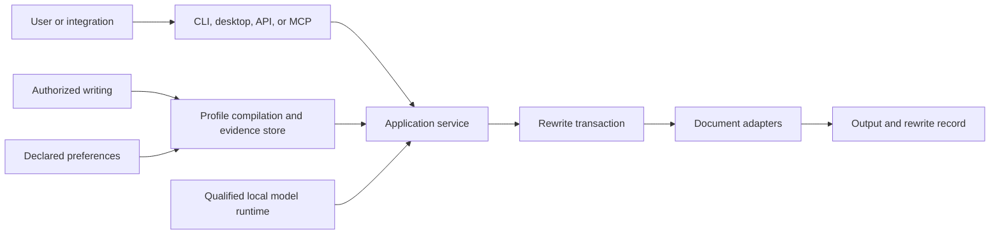
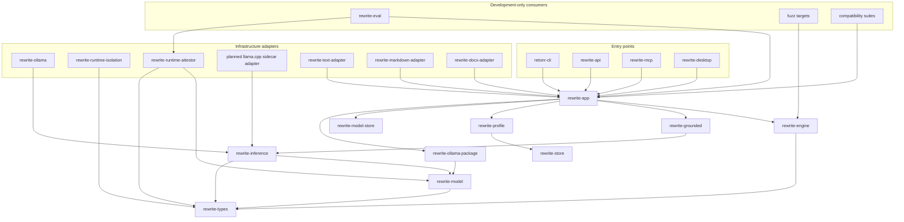
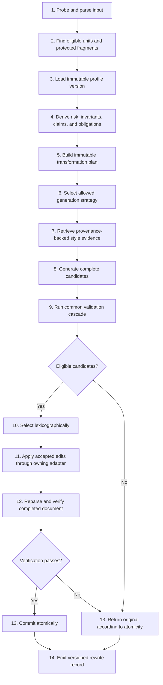

# Architecture

## Status

This architecture defines boundaries for a benchmarked vertical prototype. It is not
an interface freeze. Public APIs, stored schemas, and adapter contracts freeze only
after they have survived evaluation, cross-platform tests, and at least one real
consumer at each boundary.

## Quality attributes

The design is ordered by these priorities:

1. Fidelity risk control
2. User ownership and privacy
3. Explicit failure and abstention
4. Structural and format preservation
5. Cross-platform correctness
6. Inspectability and stable automation
7. Personal style quality
8. Latency and resource efficiency

Style quality cannot compensate for a fidelity failure.

Latency and core use are last because a faster path that races a trust boundary is
not an improvement. Hosts with 6 to 16 or more cores are the expected development
and laptop class. Retonr already uses those cores for compilation, most tests, and
the model runtime's own thread pool or accelerator. It does not automatically
saturate every core inside a rewrite, inspect, import, or attestation transaction.

Independent CPU-bound work may later run in a bounded worker pool: hashing distinct
frozen files, validating independent deterministic evaluation cases, and assessing
independent candidates or units whose results join by stable identifier. The worker
cap is explicit, finite, and no larger than the independent work items. Results are
merged in identifier order so parallel execution cannot change lexicographic
selection, rewrite records, or suite reports.

These surfaces stay single-threaded or single-session on purpose:

- One retained HTTP/1 inference connection, with no pool, retry, or reconnect
- Linux managed isolation, process attestation, and native-load observation
- Exclusive artifact lifecycle locks and SQLite mutations
- Document-atomic engine short-circuit until unit independence is proven
- Native attestor and isolation tests that share process or namespace state

A local model runtime may already occupy many CPU threads or a GPU. Retonr must not
default to oversubscribing the same cores while that runtime is generating. Bounded
parallelism is a later 0.x envelope, not a reason to add an unbounded thread pool or
to jump the runtime-package and managed-execution work.

## System context



Every entry point calls the same application service. CLI, desktop, HTTP, MCP, and
agent skill packages do not reimplement profile, rewrite, validation, or persistence
logic.

## Dependency direction

Dependencies point inward toward domain types and policies.



Infrastructure inference adapters depend on `rewrite-inference`. Contract layers
never depend on Ollama, HTTP, a model store, or a platform runtime.

The exact crate split may be consolidated during the first slice if a boundary has
no independent behavior. The dependency rules remain even if two modules initially
share a crate.

Generation strategy, runtime backend, installed model artifact, and qualified
artifact-runtime combination are separate identities. A strategy ID cannot stand in
for mutable backend, artifact, prompt, tokenizer, or parameter provenance.

## Rewrite transaction



The selected generation strategy can increase validation requirements. It cannot
remove a shared validation step.

## Generation strategies

The first generative milestone implements only `Grounded`. The current CLI checks
caller-supplied candidates and administers exact local artifact files, while the
application layer has a provisional grounded strategy exercised through a fake
backend and bounded Ollama adapter. It is not a qualified user-facing model path yet.
Other strategies are introduced only
after the evaluation harness demonstrates a need.

| Strategy | Contract | Intended use |
| --- | --- | --- |
| `Literal` | Deterministic edits only, no generative model | Exact punctuation and declared mechanical rules |
| `Constrained` | Local sentence or paragraph rewrite with protected sentinels | Low-risk short prose |
| `Grounded` | Typed invariants, claims, context, candidates, and full validation | Default generative path |
| `Render` | Whole-unit reconstruction with the strictest validation | Experimental strong-mode work |

Routing inputs include entity and quantity density, negation, modality, conditions,
comparatives, citations, identifiers, coreference, tables, and cross-unit references.
Uncertain routing selects the stricter strategy.

A strategy emits a neutral bounded inference request. A backend returns an untrusted
response plus generation provenance. The strategy parses complete masked candidates,
and the engine alone restores protected values, validates candidates, and applies an
accepted edit. The application maps completed generation provenance into the
versioned rewrite record before returning the transaction. Production grounded
requests do not expose protected raw surfaces to the backend.

Discovery lists sorted, unique digests for the exact structured-output contracts
an adapter currently admits at its transport boundary. This is not model
qualification. Consumers require a digest match before inference; generic JSON mode
is not capability evidence. The provider-neutral structured completion operation
returns one byte-bounded, syntactically complete JSON value with transport-derived
terminal status, observed runtime identity, rechecked artifact identity, and a digest
binding the complete request. Adapters and orchestrators compare the observed runtime
with discovery. Its debug representation retains only identities, limits, usage, and
byte counts. It does not parse a domain envelope or grant semantic authority.

The inference layer also defines one provider-neutral local-judge attempt contract.
Its strict JSON schema admits a blinded-order choice, a sorted nonempty set of rubric
clause identifiers, and sorted non-overlapping half-open byte spans into the separately
presented source and candidates. The neutral parser enforces shape and structural
bounds. The evaluation layer additionally checks case identity, admitted clauses,
input lengths, and UTF-8 boundaries. Neither layer evaluates whether the choice,
citations, or meaning are correct.

The retained Ollama session owns one already-connected loopback HTTP/1 stream. It runs
one preflight, then bounded structured completions with monotonically increasing
response ordinals and an observer callback around each response. Every completion
returns a nonserializable, content-free receipt binding the preflight, complete
request, complete structured response, and ordinal span. The session has no connector,
pool, retry, reconnect, or fallback path and is permanently invalidated on failure.

The legacy completion uses seven ordered responses and remains unchanged. A separate
opt-in resident-completion profile is admitted only for Ollama v0.32.15 at reviewed
source revision `b7871fc0d1d82fe109536efa3e0e8e411c766c75`, after an idle preflight.
It requests `keep_alive: 5m` and requires the exact nine-response order `version`,
`tags`, `show`, `generate`, `ps`, `version`, `tags`, `show`, `ps`. Both singleton
post-generation `/api/ps` reports must match the exact reference, manifest digest,
requested context, and each other, with valid runtime memory fields. Its separate
nonserializable receipt proves only stable runtime-reported residency on the retained
transport. The reported memory size is not package inventory size. Application
handler, model use, resident-page identity, effective runtime identity, and
qualification remain false.

The model domain defines a distinct claim-extraction artifact role without activating
or invoking it. Qualification schema v1 rejects that role because its runtime identity
is observational rather than a complete runtime-build and effective-state identity.
The ordinary Ollama backend still admits only generation and the candidate-output
contract. The separate retained session additionally admits the exact neutral judge
output contract for the development executor. A future claim extractor receives its
own schema, effective manifest, application orchestrator, and stronger qualification
identity. It will not be hidden behind the synchronous semantic port or silently
reuse a generation or judge binding.

The model layer defines inert content identities before granting any new authority.
An artifact-set manifest contains a strictly ordered, bounded list of immutable file
digests, byte lengths, and portable logical paths. It rejects ambiguous case aliases,
platform device names, traversal, path-prefix collisions, and unbounded membership.
A separate runtime-build record binds a managed or locally attested package,
entrypoint, dependency manifest, build configuration, and exact native target. An
effective-state record binds that build to a provider snapshot, loaded components,
resolved configuration, platform evidence, execution class, isolation policy, and
effective context. All three use domain-separated, versioned canonical identity
material and byte-bounded validated JSON decoding. None is proof that the supplied
evidence is true or complete.

The additive runtime-package and model-package manifests make static package meaning
explicit. Each is a complete ordered semantic overlay of one canonical artifact set.
Runtime packages identify one entrypoint, executable-code roles, helpers, native
dependencies, static load policy, source, transformations, target, and exact build
configuration. Model packages identify weights, tokenizer, prompt templates,
parameters, license, source, transformations, weight layout, and embedded
components. Evidence-only members remain distinct from output-affecting members.
Neither manifest claims that a process loaded or used its bytes.

A native-load observation binds a retained process evidence digest, an exact
runtime-package manifest, and one bounded complete view of admitted file-backed
executable mappings. Linux resolves `/proc/PID/map_files` entries and compares each
mapping to retained package-member file objects or a frozen list of admitted external
platform components. Windows returns unsupported because the selected public APIs
expose mapped paths but not section-bound file identities. macOS returns unsupported.
Typed builders can derive runtime-build and effective-state fields from package and
load records, but those derived identities remain inert until the complete operation
joins every required trust boundary.

An effective-package evidence record then joins the exact artifact set, runtime build,
and effective state. It requires canonical purpose coverage for every member and binds
retained evidence for artifact-set completeness, acquisition, license review,
transformation disposition, runtime load closure, and exclusion and isolation. Its
managed or attached-attested mode must match the runtime-build mode. Decoding reloads
the referenced records and rechecks the complete relationship rather than admitting
three unrelated identifiers. The record is still evidence vocabulary, not authority.
The implemented qualification v2 record binds that four-part subject for exactly the
claim-extraction role. It also binds source and context ceilings, prompt, claim-output
and claim-operation contracts, request and threshold policies, language policy,
hardware envelope, qualification suite, result evidence, license decision, and
qualification outcome. Its identifier and type are distinct from qualification v1; it
has no authorization operation and cannot enter the v1 activation path. The
application can statically attest complete runtime and model packages over live
managed-set leases. Runtime attestation retains exact code-member file objects and
can clone the entrypoint for handle-based launch and all native members for Linux
load observation. An older application service can also hash one caller-selected
managed entrypoint and persist caller-supplied runtime facts. Neither service
authorizes a role. Complete operation composition, pre-call checks, post-call checks,
and generation receipts remain separate.
Attached observed-only Ollama metadata cannot construct a runtime-build identity.

The development-only attached Ollama preflight now composes the Ollama observation
with `rewrite-runtime-attestor`. The attestor is a quarantined infrastructure crate
with a safe bounded facade. On Windows it uses the public owner-PID table, a retained
process handle and creation time, and a retained executable file handle. On Linux it
uses a bounded `NETLINK_SOCK_DIAG` listener dump and exact connection queries, a
retained kernel socket cookie, unique visible same-UID descriptor ownership, a
retained pidfd and process start time, same-network-namespace evidence, and a
retained `/proc/PID/exe` file. macOS returns a stable unsupported result rather than
using private `libproc` interfaces.

The Linux process-holder scanner opens and retains one `/proc` root directory for
each bounded scan. For each numeric entry it opens a pidfd before opening the process
directory relative to that root, then confirms liveness. It reads `status` relative
to the held directory under a 64 KiB ceiling and admits exactly one `Uid:` row with
four unsigned decimal fields; the second field is the effective UID. Descriptor
enumeration and `readlink` stay relative to the held process directory and continue
through the admitted view after a socket match. Once a pidfd exists, a missing entry
is classified as process exit only when that pidfd proves the process is dead.
Permission denial is `ProcessAccessDenied`, descriptor or memory exhaustion is
`ResourceLimit`, and malformed or otherwise incomplete state is
`ListenerSnapshotIncomplete`. None is converted into weaker evidence.

For an admitted holder, descriptor traversal is bracketed by two bounded status
reads through the retained process directory, each with exactly one strict four-field
`Uid:` row. The effective UID must match exactly
across both observations or the snapshot is incomplete.

The observer attaches before the first HTTP request and rechecks after the existing
preflight. It fails on process exit, ownership drift, process-incarnation drift,
executable-object or byte drift, incomplete visibility, permission loss, cancellation,
deadline, or a configured resource ceiling. The serialized witness omits paths,
arguments, environments, user names, and raw native errors. It is point-in-time
listener evidence only. Independent HTTP calls are not bound to an accepted
server-side socket, Windows does not expose a socket object identity through the
selected table, and executable-file evidence does not prove loaded components. The
report therefore sets `response_bound: false` and `qualified: false` and creates no
runtime-build, effective-state, package, qualification, activation, or role record.

A separate development-only bound preflight leaves that attached report unchanged.
The Ollama adapter opens one IP-literal loopback TCP stream directly, performs one
HTTP/1 handshake, and sends the complete ordered read-only preflight through the one
retained sender. The transport has no DNS, ambient proxy, redirect, connector pool,
retry, or reconnect path. Each response must be fully drained before the next request
and both individual and aggregate body ceilings apply. An observation callback runs
before application traffic and after every drained response.

The runtime attestor consumes the exact client and server endpoints without
serializing them. Windows requires the exact reverse established row's documented
context-binding PID to match the retained process incarnation. Linux issues an exact
reverse-tuple SOCK_DIAG query before and after the visible-holder scan and requires
stable state, UID, inode, interface, and retained socket cookie plus exactly one
visible same-UID descriptor holder matching the retained process. The Linux check
cannot exclude holders hidden by UID, ptrace, proc mount, PID namespace, or other
security policy.
macOS returns unsupported before HTTP because the admitted public unprivileged APIs
cannot map an arbitrary established tuple to a process.

The bound report joins the redacted API observation, process witness, ordered
connection-attribution evidence, and a domain-separated binding digest. It states
that all accepted response bytes used one retained client transport and that native
attribution matched at every checkpoint. It does not claim exclusive socket
ownership, absence of invisible holders, or application-handler execution. It stays
`qualified: false` and creates no runtime-build, effective-state, package,
qualification, activation, or role record. Complete package, provider configuration,
and OS isolation evidence remain prerequisites for effective runtime identity and
generation.

The separate managed Linux boundary owns process creation rather than attaching to
an ambient service. A retained helper establishes user, network, and PID namespaces,
maps the caller identity, enables loopback as the only network interface, sets
no-new-privileges, removes capabilities, seals every ambient descriptor as
close-on-exec, verifies the descriptor postcondition, applies process and
file-descriptor limits, and launches an already-open executable object. Stage two
exec closes the sealed descriptors before target launch.
Before launch, namespace init installs a target-inherited seccomp socket allowlist.
The target's `socket()` calls admit only `AF_INET` and `AF_INET6`; every other socket
family and `io_uring_setup` are denied. The retained lease captures bounded startup
streams, reobserves target and namespace identity, requires seccomp mode 2 on target
reobservation, owns teardown of the process tree, and can request exactly one
loopback TCP connection and namespace-local SOCK_DIAG descriptor. The guardian owns
that diagnostic capability outside the target filter. Host policy that denies the
required namespace operation or socket policy returns a typed failure; the operation
never falls back to the host network.

The managed Linux process observer consumes exact target, executable, namespace,
UID, endpoint, and diagnostics facts from that lease. It rechecks the managed process
and exact retained connection and can bracket the Linux native-load observation.
These infrastructure records are stronger than attached observation because the
launch and network namespace are retained, but they remain inert and Linux-only.
Windows managed isolation and exact native-load binding are unsupported. macOS
managed isolation, attached observation, and native-load binding are unsupported.

The CI architecture distinguishes an uncontrolled host limitation from native proof.
Ordinary hosted tests may treat only the exact `ProcessAccessDenied` result as an
environment compatibility outcome when proc visibility is blocked. They cannot turn
that outcome into evidence. A separate mandatory networkless container runs the
managed attestor tests as the caller UID with all capabilities dropped and
no-new-privileges set, and requires the native success path. The coverage job runs
the same controlled gate with the workspace LLVM profile before applying the line
floor, so the proof path is included in coverage rather than hidden behind a host
skip.

Ollama provider evidence is a separate trust boundary. It accepts only an exact
stable version and runtime-package identity admitted by a source-controlled review
policy, exactly one `OLLAMA_NO_CLOUD=1` declaration in the cleared managed
environment, and exactly one bounded cloud-disabled startup marker across captured
standard output and standard error. The production reviewed-runtime allowlist is
empty. Provider evidence always states that it does not enforce network isolation or
qualify the runtime; Linux namespace evidence must be joined separately.

The development-only `rewrite-eval` managed preflight performs that Linux join for
read-only observation. It binds a retained runtime-package lease, prepared isolation
and retained launch, namespace-local process and exact connection evidence, the
provider declaration and startup marker, read-only Ollama observation, and exact
native-load evidence in one redacted report and requires the production backend
identity `ollama_native`. It reobserves the process, isolation, connection, and
package boundaries and owns process-tree cleanup. The report is not a CLI surface or
authority record. With the reviewed-runtime allowlist empty, its provider disposition
is unreviewed. It also records false for application-handler proof, exclusive socket
ownership, model load or use, effective-runtime identity, and qualification.

An opt-in managed-preflight entry point returns that unchanged version 1 report with a
separate redacted, inert `LocalOllamaManagedBuildBinding`. After the exact package,
managed process, and native-load relationships pass, it constructs one typed
`RuntimeBuildIdentity` in managed-process mode from package declarations. The exact
package entrypoint is joined to managed process and native-load evidence, but target,
revision, and other package semantics are not independently observed from the live
process. Mandatory process-tree cleanup then completes before the outcome returns, so
`process_retained_after_return` is false. The binding cannot construct
`EffectiveRuntimeState`. Its closed missing set is a generation-bound provider
snapshot, effective output configuration, direct platform, framework, and driver
evidence, compute backend and device placement, effective context capacity, and a
retained live runtime. Model load or use, application handler, effective state, and
qualification remain false. Existing version 1 report and identity bytes are
unchanged.

A separate version-gated evaluation binding relates one inert installed-Ollama import
to one exact verified idle v0.32.15 inventory entry and details observation. It checks
the reviewed manifest-size rule for that exact runtime revision, raw manifest and GGUF
identity and size, license, `gguf` format, and a unique explicit-layer or embedded-GGUF
template match. The serialized evidence binds the exact model package, artifact set,
installation generation, package source, runtime reference, and observation digests.
The join consumes the opaque, nonserializable, single-use execution receipt issued by
the preflight runner for the exact plan and report. It proves only that static
import-to-inventory relationship. Model loaded, model used, application handler,
effective identity, and qualification remain false.

The typed local-judge executor is another separate evaluation boundary. It validates
the exact scorecard plan, rubric, model reference and digest, deadlines, input limits,
prompt contract, and neutral output contract. Deterministic hard-gate failure causes
no judge request. Otherwise it executes each admitted case once in both blinded
orders over one already-preflighted retained session, validates every cited span, and
invalidates the stream after the run. Every retained-session completion enforces an
absolute 4 MiB UTF-8 input ceiling before wire serialization or completion traffic.
The executor returns the serializable version 1 scorecard, which still labels
observations caller-declared and triage-only, plus a distinct nonserializable receipt
binding the plan, rubric, observation batch, retained-session preflight, ordered
request and response receipts, and ordinal range. That receipt does not prove managed
isolation, handler execution, model load or use, candidate generation, effective
identity, semantic correctness, or qualification. Its evidence class is
`RetainedTransportBindingOnly`. The static model binding, managed runtime-build
binding, resident-completion receipt, and judge receipt are implemented but not yet
joined in one retained managed execution.

The model store persists these inert records under SQLite schema 6 in separate,
immutable tables. Schema 4 added a separate artifact-set installation record with a
unique portable set-root key and a distinct positive generation. Schema 5 added a
crash-recoverable artifact-set removal journal. Schema 6 adds runtime-package,
model-package, and native-load tables with relationship foreign keys. Migration
creates additive tables empty and does not infer package, load, installation, or
authority evidence from legacy state. Higher-level writes begin an immediate transaction, reload every
referenced lower-level record, require canonical serialized bytes and matching indexed
identity columns, and rerun the domain relationship checks before commit. Reads repeat
the recursive validation. The migration adds evidence tables without rewriting the v1
manifest, qualification, invalidation, decision, binding, installation, or removal
records. The set installation record is structural state only: it does not prove that
member bytes exist, grant a lease, or authorize a role. No v2 evidence table or set
installation is consulted by v1 activation or recovery.

## Document representation

The semantic document and adapter reconstruction state are separate. Core code can
refer to opaque source anchors but cannot inspect format-specific data.

```rust
struct DocumentIr {
    schema_version: u32,
    document_id: DocumentId,
    media_type: MediaType,
    source_digest: Digest,
    roots: Vec<NodeId>,
    nodes: BTreeMap<NodeId, Node>,
    rewrite_units: Vec<RewriteUnit>,
    capabilities: AdapterCapabilities,
}

struct Node {
    id: NodeId,
    parent: Option<NodeId>,
    children: Vec<NodeId>,
    role: StructuralRole,
    policy: RewritePolicy,
    source_anchor: SourceAnchorRef,
}

struct RewriteUnit {
    id: RewriteUnitId,
    node_id: NodeId,
    text: String,
    fragments: Vec<SourceFragment>,
    protected_spans: Vec<ProtectedSpan>,
    context: RewriteContext,
}

struct ParsedDocument {
    ir: DocumentIr,
    adapter_id: AdapterId,
    adapter_schema_version: u32,
    adapter_state: Vec<u8>,
    diagnostics: Vec<AdapterDiagnostic>,
}
```

Source ranges are half-open UTF-8 byte ranges after explicit decoding. Adapters also
retain enough state to preserve a byte order mark, original newline style, final
newline state, and format-specific fragments. Non-UTF-8 paths remain `OsString` or
`PathBuf`; they are never forced through a lossy string conversion.

IDs identify an ingest instance. A source anchor identifies the original location.
Neither is derived only from mutable prose.

Every adapter declares a capability matrix. Unsupported features are not silently
treated as supported.

Input acquisition has three distinct contracts. File input supplies bounded original
bytes and an explicit or probed media type to a qualified adapter; only this path may
claim byte and document-format preservation. Typed and clipboard input creates a
logical plain-text document and preserves user-visible line and whitespace intent,
but not rich clipboard representations or source bytes. API and MCP input supplies
inline bounded text or a separately staged bounded document; it never grants an
arbitrary local filesystem path.

Each rewrite unit carries a user-declared or detected BCP 47 language, detection
confidence, script and direction observations, and the exact qualified language
policy. Low-confidence or unsupported units remain unchanged or cause abstention
according to atomicity. Cross-language profile transfer is off by default.

## Adapter contract

```rust
trait DocumentAdapter {
    fn probe(&self, input: &[u8]) -> ProbeResult;

    fn parse(
        &self,
        input: &[u8],
        policy: &ParsePolicy,
    ) -> Result<ParsedDocument, AdapterError>;

    fn apply(
        &self,
        parsed: &ParsedDocument,
        edits: &[AcceptedEdit],
    ) -> Result<Vec<u8>, AdapterError>;

    fn verify(
        &self,
        before: &ParsedDocument,
        output: &[u8],
        edits: &[AcceptedEdit],
    ) -> VerificationReport;
}
```

The application never assembles Markdown or OOXML directly. Only the owning adapter
can apply and verify an edit.

## Claims and invariants

A full unrestricted Meaning IR is deferred. Early versions use typed evidence that
is honest about extraction confidence.

```rust
struct Invariant {
    kind: InvariantKind,
    canonical_value: String,
    original_surface: String,
    evidence: Vec<TextSpan>,
    enforcement: Enforcement,
}

struct Claim {
    subject: Argument,
    predicate: Predicate,
    object: Option<Argument>,
    polarity: Polarity,
    modality: Option<Modality>,
    temporal: Vec<TemporalQualifier>,
    quantities: Vec<QuantityRef>,
    conditions: Vec<Condition>,
    attribution: Option<Attribution>,
    evidence: Vec<TextSpan>,
    confidence: f32,
}
```

The same learned extractor cannot certify its own result. Exact gates, independent
extraction, clause alignment, bidirectional entailment, contradiction checks, and
document-level checks provide complementary evidence.

The implemented preview contract retains only content-redacted identities and counts.
Each claim set records completion state, exact text identity, an effective extractor
manifest digest, confidence policy, and a canonical evidence-set digest. Deterministic
comparison requires complete compatible sets, binds its aggregate to both evidence
sets, and preserves extraction uncertainty. Raw text, spans, and claim identities do
not enter the retained comparison aggregate. These digests are evidence bindings, not
anonymization or proof that an extraction is correct.

Runtime-backed extraction will not use the current synchronous semantic port. It needs
an application-level operation with cancellation, deadline, explicit operational
errors, and exact runtime, artifact, prompt, and configuration identity. The common
engine remains responsible for deterministic comparison and fail-closed policy.

## Protected sentinel flow

URLs, paths, identifiers, quantities, dates, protected terms, and code-like spans are
replaced with typed sentinels before generation when the mapping is unambiguous.

```text
Payment is due on <DATE_1> for <MONEY_1>.
```

A candidate must contain each required sentinel exactly once in an allowed location.
The original surface value is restored, then the entire validation cascade runs.
Restoring a value is not semantic repair. If relationships changed or mapping is
ambiguous, the candidate fails.

Protection processing is a bounded trust boundary. One rewrite unit accepts at most
4,096 protected occurrences and 16 MiB before or after masking. Candidate match
selection is streaming and leftmost-longest. Masking, sentinel validation, and
restoration use single forward passes so dense valid input cannot amplify into
quadratic replacement or validation work. Limit exhaustion fails closed before
generation.

## Validation cascade

1. Output schema and encoding validity
2. Sentinel count, type, and integrity
3. Protected terms and typed literals
4. Structural fingerprint
5. Novel entity and novel quantity rejection
6. Claim and relationship comparison
7. Sentence or clause alignment
8. Bidirectional entailment and contradiction assessment
9. Cross-sentence and cross-unit obligations
10. Declared constraints
11. Style, channel, and fluency scoring

Negation and modality are not described as purely deterministic checks. Surface
markers can contribute evidence, but scope and implied meaning require learned
assessment and conservative uncertainty handling.

```rust
struct GateResult {
    gate_id: String,
    gate_version: String,
    status: GateStatus,
    severity: Severity,
    evidence: Vec<GateEvidence>,
    confidence: Option<f32>,
}

enum GateStatus {
    Pass,
    Fail,
    Uncertain,
    NotApplicable,
}
```

Strict policies treat `Uncertain` as ineligible. Semantic evaluators are versioned
independently from generators and calibrated on project-specific data.

## Candidate selection

Selection is lexicographic:

1. Reject a hard failure.
2. Reject disallowed uncertainty.
3. Require the calibrated semantic floor.
4. Require declared constraints.
5. Rank eligible candidates by personal style, channel fit, and fluency.
6. Use edit cost and a mode-specific divergence band as tie breakers.

No weighted score may allow a style improvement to offset lost meaning. Surface
divergence is not maximized and never enters the live system as a provenance-evasion
objective.

## Abstention and atomicity

```rust
enum RewriteStatus {
    Rewritten,
    UnchangedNoEligibleContent,
    Abstained,
    Failed,
}

enum Atomicity {
    Document,
    Unit,
    Region,
}
```

Document atomicity is the default for connected prose. If any required unit fails,
the original document is returned byte-for-byte. Unit and region modes are explicit
because partial rewriting can create inconsistent voice or references.

Unit atomicity is allowed only when the adapter and planner establish that a unit is
independent of failed neighbors. Region atomicity groups units connected by
coreference, list structure, table relationships, or discourse dependencies. Both
partial modes run cross-reference, reassembly, and completed-document validation
after edits are applied. Uncertain independence promotes the decision to document
abstention.

Abstention includes stable reason codes, failed gate IDs, affected source anchors,
and retry count. Retry applies only to retryable generation failures. Parser
ambiguity, unsupported format features, or invalid constraints do not trigger a
model retry.

## Profile architecture

Profiles are immutable versions compiled from explicit evidence.

```rust
enum EvidenceUseState {
    Active,
    RetrievalIneligible,
    InfluenceExcluded,
    ConsentRevoked,
    Deleted,
}

struct EvidenceRecord {
    id: EvidenceId,
    source_kind: EvidenceSource,
    source_digest: Digest,
    owner_confirmed: bool,
    channel: Option<Channel>,
    created_at: Option<Timestamp>,
    derived_from: Option<RewriteRecordId>,
    authorization: AuthorizationRecordId,
    use_state: EvidenceUseState,
    text_ref: Option<CorpusTextRef>,
    byte_len: u64,
}

struct DerivedStyleArtifact {
    id: DerivedArtifactId,
    source_evidence_ids: Vec<EvidenceId>,
    producer_identity: ProducerIdentity,
    embedding_space_id: Option<EmbeddingSpaceId>,
    payload_ref: DerivedPayloadRef,
    output_digest: Digest,
}
```

Evidence records contain intrinsic source facts and lifecycle state. Extracted style
features, token counts, vectors, topic assignments, and reliability estimates are
immutable derived artifacts with complete producer provenance. Influence exclusion,
consent revocation, and deletion invalidate the complete transitive derivation
closure. Retrieval ineligibility invalidates retrieval indexes and snapshots without
silently erasing separately approved aggregate observations.

Effective contribution combines ownership confidence, reliability, channel
relevance, recency, sample quality, diversity, and per-source caps. Fixed universal
weights are not frozen before empirical calibration.

Rules:

- Raw generated candidates never become evidence.
- Accepting output updates a preference signal, not the writing corpus.
- User-edited output is derivative and requires explicit confirmation before limited
  use.
- One file, session, or topic cannot dominate the profile.
- Sparse channel profiles shrink toward the general profile.
- Conflicting declared rules fail profile compilation with actionable diagnostics.
- Fidelity and document obligations outrank every style preference.

Retrieval prioritizes channel, communicative act, register, length, and style. Pure
topic similarity is avoided because it can copy names, facts, and phrases from the
corpus. Retrieved evidence is capped per source, traceable, and checked for leakage.

## Storage

SQLite is the initial local store for profiles, evidence metadata, migrations, model
manifests, installed-artifact state, append-only qualification and invalidation
records, activation decisions, active role pointers, and rewrite metadata. Artifact
activation is one transaction that verifies an installed digest and currently valid
qualification, appends the decision, and changes the active pointer. Startup and
recovery revalidate the complete binding before a runtime may use it. Corpus text and
sensitive trace content need an encryption design that works on desktop and headless
systems. That design must pass a dedicated cross-platform spike before its interface
freezes.

The application artifact service accepts an explicit manifest and one regular-file
source for its first offline-import slice. It pins the storage root, lifecycle lock,
staging directory, and artifact directory before invoking caller progress. Managed
child creation, open, inspection, and synchronization remain relative to those held
boundaries on Unix. Windows child opens and metadata checks are handle-relative;
hard-link commit and cleanup are path-backed within the pinned root and qualified on
the continuous-integration NTFS configuration. The source is opened without
following the final symlink or reparse entry and verified for exact size and SHA-256 through a
fixed-size buffer under an explicit caller-owned byte ceiling. A new artifact is
copied to a create-new staging file whose reserved name contains 128 random bits,
synchronized, and committed under its content-derived storage key without replacing
an existing entry. Managed artifact directory scans use a caller-owned entry ceiling
and honor cancellation; staging recovery has a separate fixed ceiling and reserves
capacity before creating an import file. The staging and artifact directories are
synchronized before the manifest and installed state are registered in one database
transaction. A repeated import hashes the source without another staging copy and
idempotently checks state.
Staging and final canonical bytes must each have exactly one filesystem name before
state registration, preventing an external hard-link alias from retaining mutation
authority. Import never changes the source or activates the artifact. Typed progress
contains only lifecycle stage and byte counts. After the last callback and
cancellation check, the service silently reverifies the final canonical bytes and
every held storage boundary before committing state. Successful return is
completion. A state failure can retain a verified orphan, while an observed
cancellation before final registration never creates durable state.

The application also accepts one exact canonical artifact-set manifest with a local
source directory. It requires exactly the declared regular files and their implied
directories, streams and checks every member digest and size, and copies only those
members into a random application-owned staging tree. Source hard links are readable
input, but every managed member must have exactly one link. Staging files and
directories are synchronized bottom-up, rehashed, and published as one no-replace
tree under `sets/set-v1-<artifact-set-id>`. The service retains and rechecks the
repository parent, exact managed-storage name, storage root, lifecycle lock, staging
root, and destination root before structural installation state commits.
Cancellation before publication removes only entries proven to belong to the current
operation. Pre-existing staging roots are counted but not descended into. Unexpected
entries within the current operation cause failure and retention rather than recursive
deletion. A state failure after publication leaves an inert exact orphan that a later
identical import can verify and register. The operation does not inspect
package-completeness evidence, grant a set lease, qualify a runtime, activate a role,
execute code, or use the network. Import itself grants no lease; a lease is a
separate verified operation. Offline CLI exposure is `model import-set`.
Runtime-native pulls, downloads, stale-root recovery, and repair remain later
operations. Selected set reconciliation and crash-recoverable set removal are
implemented without granting set authority.

The installed-Ollama import is a separate offline application boundary over that
set importer. The caller supplies only one pinned models root and validated logical
registry, namespace, model, and tag components. The service derives every manifest
and content-addressed blob path, opens source boundaries without following links,
requires the strict admitted manifest-v2 layer shape, streams bounded GGUF-v3
structure, and reconstructs a canonical six-member set in application-owned staging.
After managed publication it writes and reads back the semantic model-package
manifest under schema 6. Config `rootfs.diff_ids` comparison is informational only.
The result is inert structural evidence and has no CLI exposure, network access,
qualification, activation, lease, load, or execution authority.

A separate reviewed-runtime import reconstructs one admitted Linux x86_64 GNU libc
Ollama runtime package from a caller-supplied layout JSON file and a member tree.
The layout is unique JSON, family `ollama` only, untransformed, and path-sorted. The
observed regular-file set must equal the declared members; extra tree files fail
closed. Reconstruction hashes each member once, builds the canonical artifact set and
runtime-package manifest, publishes the set through the existing importer, and persists
and reads back the semantic package under schema 6. The admitted layout requires
exactly one isolation helper: a `HelperExecutable` member with `MustNotBeCodeLoaded`.
The operation does not execute members, grant a lease, qualify a runtime, or add an
identity to the empty production cloud-disable allowlist.

The evaluation-only v0.32.15 binding described above can compare the installed-Ollama
model import with one verified idle Ollama inventory and model-details observation.
It does not change either import's authority, activate a package, or prove residency
or use.

A separate read-only artifact inventory uses the same pinned storage boundary,
acquires the lifecycle lock in shared mode, and opens only existing storage. It
loads manifests, optional installations, and active bindings in a bounded database
snapshot, freezes exact raw directory
entries, and verifies eligible direct files with bounded streaming SHA-256. It
reports registered-file status, manifest-only state, independently verified orphan
candidates, content-address conflicts, oversized files, and aggregate unexpected
entry counts. Externally hard-linked files are not accepted as registered or orphan
bytes. Exact lowercase names, application-owned storage keys, no-follow
opens, stable metadata checks, and a second directory snapshot prevent a report from
silently accepting an observed replacement. The operation never creates, cleans,
repairs, or deletes storage. An orphan report is point-in-time evidence only; a
future mutation must reacquire the exclusive lock and reverify the exact entry.
Before returning, it requires a matching second bounded state snapshot and matching
filesystem entry and boundary fingerprints. A successful return is the completion
signal; no caller progress callback runs after these final coherence checks.
On Windows, child opens and metadata queries use target-only capability filesystem
dependencies so they remain relative to held directory handles, reject final reparse
entries, and retain explicit sharing policy. The dependency's enumeration path is
path-backed on Windows, so held root and artifact-directory handles deny deletion or
rename throughout the scan. This behavior is tested on the continuous-integration
NTFS configuration; other Windows filesystem drivers are not yet qualified. The
dependency cost is accepted for the managed-storage trust boundary and remains
subject to source, duplicate-version, and supply-chain review.

A separate read-only artifact-set inventory uses the same shared lifecycle lock and
opens only existing storage. It loads bounded set manifests and optional
installation generations, freezes exact `sets` directory names, and verifies
registered or manifest-associated canonical set roots by enumerating the planned
tree and hashing eligible members. It reports registered tree status, manifest-only
set state, independently verified orphan set roots, tree conflicts, oversized
planned trees, and aggregate unexpected set-root counts. Canonical names without a
matching durable manifest are counted and not descended into. The operation never
creates, cleans, repairs, or deletes storage, and the report grants no lease,
qualification, activation, or role authority. Single-file inventory does not
inspect set roots, and set inventory does not inspect single-file artifacts.

Selected set-root reconciliation is a separate existing-only mutation. It accepts
one complete set manifest, derives only its content-derived set-root name, and
reacquires the lifecycle lock exclusively. It ignores prior inventory evidence as
authority, requires the current managed set root, and applies caller-owned member,
tree, and byte ceilings. It enumerates the planned tree, verifies member sizes,
single links, and SHA-256, rechecks the held storage boundary, and then atomically
inserts any missing exact set-manifest and installation records or confirms that
both existing records match. It never copies, replaces, deletes, qualifies,
activates, or accesses the network. A state failure leaves the same managed tree.
The result does not grant a lease, qualify a package, or authorize a role.

Selected orphan reconciliation is a separate existing-only mutation. It accepts one
complete manifest, derives only its canonical content-addressed name, and reacquires
the lifecycle lock exclusively. It ignores prior inventory evidence as authority,
requires exact lowercase direct regular bytes with one filesystem name, and applies
caller-owned entry and byte ceilings. After its final byte-progress callback, it
silently checks the hashed file's stable identity and single-name status,
synchronizes the file, reopens and rechecks the exact entry, synchronizes the
artifact directory, and revalidates the held storage layout. It then atomically inserts
any missing exact manifest and installation records or confirms that both existing
records match while retaining the verified file handle. It never copies, replaces,
deletes, qualifies, activates, or accesses the network. A state failure leaves the
same orphan bytes, and successful
return is the completion signal. This establishes only that one canonical file
matched one manifest during the exclusive operation; it does not establish model
safety, licensing approval, runtime qualification, or future byte integrity.

Inactive managed-byte removal is a separate existing-only mutation under the
exclusive lifecycle lock. It accepts only a current store-issued installation
generation, verifies the canonical direct regular file by exact size and SHA-256,
requires one filesystem name, and rejects any active binding. One immediate SQLite
transaction writes a prepared removal journal and revokes installed-state authority
before the canonical entry is deleted. The service then confirms absence,
synchronizes the artifact directory, revalidates the held layout, and marks the
journal completed. A prepared operation resumes without callbacks or cancellation,
including after a process stops between state preparation, deletion, directory
synchronization, and completion. Installation generations prevent an old completed
retry from deleting a deliberate reinstall. On Unix, deletion is relative to the
pinned artifact-directory descriptor. The lifecycle lock serializes cooperating
Retonr processes, but the current Unix unlink does not claim identity-bound
protection against a non-cooperating same-user process that swaps the final
directory entry. On Windows, the verified file is opened with delete authority and
removed through a safe delete-by-handle operation after all identity comparison
handles are released. The target-only Apache-2.0 `fs_at` 0.2.1 dependency is
retained for that reviewed safe wrapper and adds no authority outside this
boundary. Its internal Windows disposition implementation, read-only handling, and
transitive `windows-sys` 0.52 tree are explicit supply-chain review items. The
alternatives are repository-owned unsafe code, which policy forbids, or a weaker
pathname deletion.

Runtime consumer groundwork now includes a shared artifact lease boundary for later
reading or mapping of managed bytes. The lease checks exact current durable state
before and after byte verification, retains the pinned boundary and verified file
handle, and holds the shared lifecycle lock until the lease ends. No real runtime
consumer uses it yet.
Removal requires the exclusive lock and cannot begin while such a lease exists.
Removal is not secure erasure and does not affect external copies, caches, backups,
runtime memory, or provider records.

A repository-owned artifact-set lease extends that boundary to a complete managed
tree. The repository pins its data directory in shared mode, pins the exact state
database, and opens managed storage under the shared lifecycle lock. It recomputes
the content-derived set-root name from the registered canonical manifest instead of
resolving a persisted storage key as a path, requires the exact registered
installation record to match that recomputed plan, and then reverifies the complete
tree: exact shape, exact member sizes, one filesystem link per member, streaming
SHA-256 per member, and an identical directory snapshot before and after. Durable
manifest and installation state is read again after verification. The lease then
retains the repository guard, the storage root, the set root, and the shared
lifecycle lock for its complete lifetime, so import, reconciliation, removal, and
migration all fail with an in-use classification while it lives. Read-only
inventory and pending-operation inspection continue to succeed, and shared leases
coexist.

Unlike the single-file lease, the artifact-set lease holds both the repository and
the storage lifecycle lock, in that order. It is point-in-time byte evidence. It
does not qualify a set, attest a live runtime, authorize a role, prove that the
manifest lists every file that can affect runtime output, or protect managed bytes
from a non-cooperating same-user process outside the pinned boundary. Managed-set
removal is generation-bound and crash recoverable. A later exact reimport advances
the generation so an old retry cannot delete a deliberate reinstall.

The unpublished SQLite adapter requires a live
`ExclusiveArtifactLifecycleLock` reference for both journal transitions. This
non-cloneable capability owns the exclusively locked file handle until it is
dropped, so a durable transition cannot be called with only a state-store handle.
The application creates the capability from a clone of the lifecycle-lock handle it
opened through the pinned storage root. It retains the original handle for exact
path fingerprint checks before and after storage work. The capability proves the OS
lock is held; the application boundary proves that handle is the selected
repository's exact pinned lock entry. Store-owned inventory records remain internal.
Read-only inventory projects each registered or pending installation into an
application-owned `ArtifactInstallationKey` containing only the content identity and
positive installation generation. Persistence records, serialized rows, and storage
keys do not cross the repository facade or CLI boundary.

The first administrative repository facade derives managed storage, exact-schema
SQLite state, and an outer lifecycle lock from one explicit application data
directory. It pins the direct single-link state file before opening SQLite, rechecks
its identity around each service operation, and suppresses external progress
callbacks while the database is open. On Unix, the adapter resolves a
canonicalizable existing parent before SQLite opens it, preserves the original final
filename, and retains SQLite's no-follow flag. If parent resolution fails, it retains
the original path and no-follow behavior so SQLite fails closed. This accepts macOS
system directory aliases without allowing an indirect final database entry. First
import may reserve and synchronize an
empty state file and initialize the current schema; ordinary commands never create an
ambient default or migrate older state. One explicit repository migration operation
opens only existing state, takes the outer repository and inner storage lifecycle
locks exclusively, creates a unique backup through the pinned data directory, and
retains one SQLite write reservation across source validation, a bounded logical copy
into a rollback-mode snapshot, serialization into the exact held backup handle,
same-handle verification, synchronization, and the supported forward migration commit.
A current repository is an exact no-op and creates no
backup. Read-only inventory uses shared authority; import, migration,
reconciliation, removal, and recovery use exclusive authority. First import
creates exactly one missing private leaf below an existing pinned parent
or accepts an empty existing directory. It refuses a nonempty uninitialized root and
does not change permissions on a pre-existing caller directory. The facade remains
a provisional 0.x API while the wider artifact lifecycle and rewrite transaction
contracts evolve. Its inventory result is application-owned and
persistence-neutral. The qualified boundary is a local, application-owned
filesystem used only by cooperating Retonr processes.

Small personal corpora use filtered brute-force vector scoring in Rust with vectors
stored as versioned blobs. SQLite FTS5 supports lexical retrieval. A vector extension
is not a required dependency until scale benchmarks justify it.

## Trace model

A rewrite record includes:

- Trace schema version
- Source and output content identifiers
- Adapter and schema versions
- Immutable profile version
- Model artifact digest, quantization, backend, and backend version
- Installed model identity and qualification-record identity
- Strategy, tokenizer, prompt template, parameters, output schema, and seed
- Planner and validator versions
- Retrieved evidence IDs
- Candidate lineage and gate results
- Final decision and abstention reason
- Timings and resource measurements
- Binary and configuration digests
- Locale and timezone when parsing depends on them

The implemented rewrite-record v2 slice now nests one optional versioned generation
record containing stable strategy ID, exact runtime backend and version, optional
runtime digest, content-derived artifact ID, artifact digest, prompt-template digest,
complete backend-input digest, output-schema digest, candidate count, and optional
runtime-reported token and duration observations. Model-free transactions omit the
field. A v1 record without the field remains deserializable. Qualification identity,
installed generation, sampling parameters, seed, adapter versions, profile version,
validator versions, and binary or configuration digests remain planned rather than
inferred.

Default traces exclude raw input, output, candidates, profile samples, prompts, and
model reasoning. Short plain hashes are vulnerable to guessing, so local equality
tracking should use an installation-keyed identifier or remain opt-in.

Generation provenance proves only what the selected adapter reported and what the
strategy rechecked for that completed call. It does not prove semantic correctness,
human authorship, ownership, compliance, model safety, or reproducibility.

Invariant-bearing assessment vectors reject excess elements during deserialization,
not only after constructing the complete vector. These domain types still do not
define an untrusted byte-stream reader. Any future external rewrite-record import must
bound the complete byte input before calling a serializer, then validate the nested
record contract. The current product emits records and has no external record-import
command.

Replay is best effort unless model artifact, backend, quantization, prompt, runtime,
and hardware behavior are all controlled.

## Markdown architecture

Markdown support declares an exact dialect. The first subset rewrites non-overlapping
plain text in paragraphs and headings.

The adapter:

1. Uses parser source offsets to identify eligible spans.
2. Protects code, raw HTML, destinations, autolinks, and unsupported constructs.
3. Applies edits from the highest byte offset to the lowest.
4. Escapes output for its exact inline context.
5. Requires byte identity outside approved spans.
6. Reparses the completed output.
7. Compares a structural fingerprint.
8. Abstains on overlap, parse changes, or unsupported syntax.

Nested event ranges are not treated as a lossless mutable syntax tree.

## DOCX architecture

DOCX support is package-preserving within a declared subset, not universally
lossless. The first subset is unencrypted `.docx`, main document paragraphs and
table cells, homogeneous run formatting, and no ambiguous active features.

The adapter:

- Copies untouched package parts without semantic modification.
- Changes only approved WordprocessingML text nodes.
- Preserves unknown parts, relationships, namespaces, and content types.
- Protects hyperlink targets.
- Rejects macros, encryption, signed documents, fields, tracked changes, content
  controls, drawings, equations, and embedded objects in an eligible unit.
- Limits entry count, expanded size, compression ratio, XML depth, and processing
  time.
- Disables DTD and external entity resolution.
- Never follows external relationships.
- Validates XML, hashes untouched parts, and opens compatibility fixtures in office
  software during qualification.

Run-level formatting alignment is ambiguous when word order changes. The first
subset therefore requires homogeneous formatting within a rewrite unit.

## Application ports

```rust
type PortFuture<'a, T> =
    Pin<Box<dyn Future<Output = T> + Send + 'a>>;

trait Generator: Send + Sync {
    fn capabilities(&self) -> GeneratorCapabilities;

    fn generate<'a>(
        &'a self,
        request: GenerationRequest,
        operation: &'a OperationContext,
    ) -> PortFuture<'a, Result<Vec<GeneratedCandidate>, GenerationError>>;
}

trait Embedder: Send + Sync {
    fn capabilities(&self) -> EmbeddingCapabilities;

    fn embed<'a>(
        &'a self,
        request: EmbeddingRequest,
        operation: &'a OperationContext,
    ) -> PortFuture<'a, Result<EmbeddingBatch, EmbeddingError>>;
}

trait SemanticEvaluator: Send + Sync {
    fn evaluate<'a>(
        &'a self,
        source: &'a str,
        candidate: &'a str,
        context: &'a EvaluationContext,
        operation: &'a OperationContext,
    ) -> PortFuture<'a, Result<SemanticReport, EvaluationError>>;
}
```

Generation, embeddings, retrieval, semantic evaluation, and validation remain
separate responsibilities. These ports are object-safe for runtime-selected local
backends, own request payloads across await points, require `Send` futures, and carry
cancellation and deadlines through `OperationContext`. A future static generic or
closed-enum implementation must preserve the same ownership and cancellation
contract.

## Services and integrations

The application service is the automation boundary. The stable CLI machine contract
is its first external adapter, followed by MCP standard input, Agent Skills, and a
portable Agent Plugin package. Local HTTP follows only for consumers that cannot
launch a subprocess.

During `0.x`, the local API `/v0` surface is explicitly preview and can change with
release notes and migrations. The 0.9 compatibility gate promotes the reviewed
contract to `/v1` for 1.0. It has versioned wire schemas, capability discovery,
successful domain outcomes, RFC 9457 transport errors, cancellation, conditional
mutation semantics, explicit authority, and loopback-only binding for 1.0.

Synchronous requests return no content until complete validation and reassembly.
Long work uses principal-scoped operation resources with authenticated polling and
cancellation. Optional progress contains bounded phase and sequence metadata only,
never candidates or unvalidated output fragments.

MCP implements standard input first, then POST-only Streamable HTTP. MCP 2026-07-28
has no initialize exchange or protocol session. Requests carry required protocol
version and client capabilities plus optional `clientInfo` in request metadata, and
the server implements `server/discover`. Multi-step learning uses explicit opaque
handles that are scoped, expiring, revocable, principal-bound, and tamper-resistant.
MCP handlers reconstruct state from explicit identifiers rather than hidden protocol
sessions. Older protocol support is limited to named clients with conformance
fixtures.

Baseline MCP rewrite and check tools accept complete bounded plain text and supported
Markdown and return one schema-validated structured result. They accept no arbitrary
paths, clipboard authority, raw audio, DOCX base64, or partial candidate streaming.

Streamable HTTP uses a documented custom loopback bearer profile rather than standard
MCP OAuth authorization. Its server-side scopes, challenge, rotation, and revocation
behavior are explicit, and standard input remains preferred when a named client
cannot inject the token.

Agent Skills use the filesystem `SKILL.md` format and contain instructions, schemas,
examples, and explanatory authority requirements only. A routine Agent Plugins
1.0.0 working-draft package combines one routine skill with root `plugin.json` and
`mcp.json` metadata for the standard-input server. It never contains a second rewrite
implementation, credentials, profiles, models, or user data.

Agent Plugins defines portable packaging, not distribution, signatures, updates,
permissions, or sandboxing. The release layer owns those concerns and validates
package-root containment across symlinks, junctions, reparse points, commands,
working directories, references, and assets without executing package code. Server
authorization remains authoritative, and experimental `allowed-tools` metadata is
not trusted for security. Skills over MCP remains isolated until its proposal is
stable and qualified.

The 1.0 compatibility adapter is an offline local post-processor. A caller submits a
completed, supported response payload and receives the same supported shape after
rewriting. The adapter makes no upstream request and stores no upstream credentials.
It does not rewrite tool calls, structured JSON, reasoning, refusals, citations, or
other event types. It uses byte-range JSON string splicing, verifies non-target bytes,
and returns local status and provenance through an explicit sidecar or envelope. A
final verification failure is an abstention that returns exact original bytes. A
true outbound reverse proxy or remote generation backend is a separate post-1.0
feature with its own network and credential design.

Transport streaming and rewrite atomicity are independent. Standard input, framed
agent messages, and long-operation progress can stream under bounded parsing,
backpressure, cancellation, and ordering rules. Eligible text is released only at a
declared message or document boundary after the owning adapter and complete
validation cascade pass. A later event-stream compatibility adapter must preserve
non-text events and cannot mutate bytes already forwarded to a consumer.

Optional provider-mark diagnostics sit after the accepted artifact is frozen. A
diagnostic adapter may inspect the frozen source and final accepted text only through
a separate explicit operation. Its result has no edge into prompts, generation,
candidate schedules, retries, ranking, acceptance, profiles, or style learning. A
hosted detector requires per-operation network authority and disclosure that the
selected content leaves the device. Detector identity, version, declared coverage,
result vocabulary, terms, and retention policy are part of the record.

Desktop presentation has no independent product authority. It is an installed native
Rust application with no embedded browser, HTML or JavaScript frontend, hosted
application, or ordinary-operation local HTTP dependency. The toolkit is selected
only after comparable cross-platform accessibility, text, visual, packaging,
licensing, and maintenance spikes.

Long-running desktop work uses typed commands and bounded sequenced state. Each
operation has an opaque ID, owner, deadline, resource budget, and contiguous
monotonic sequence. A gap requires an authoritative snapshot query. Window close
requests cancellation, while durable staging is resumed only through a new explicit
command. The presentation never receives model tokens, prompts, profile evidence, or
arbitrary executable markup.

## Cross-platform constraints

The runtime trust primitives have a narrower current matrix than the intended
cross-platform product. Linux supports managed namespace isolation, managed process
attestation, SOCK_DIAG connection attribution, and retained-object native-load
binding when host policy permits. Windows supports attached observation and retained
connection attribution, but managed isolation and exact native-load binding are
unsupported. macOS supports none of those runtime trust primitives. Attached
evidence is observation-only on every platform and never substitutes for a managed
qualification boundary.

- Paths remain `PathBuf` and `OsString` through core and process boundaries.
- Application directories come from platform APIs rather than hard-coded paths.
- Source line endings and final newline state are preserved.
- Output is written to a temporary file in the destination directory, flushed, and
  replaced through a platform-tested atomic operation.
- Source overwrite is opt-in and includes a recoverable backup policy.
- Processes use argv arrays, never constructed shell commands.
- Cancellation reaches HTTP, database, model, and child-process work.
- Windows locking, long paths, reserved names, and case folding have dedicated tests.
- macOS universal packaging and signing are tested on macOS.
- Linux system dependencies and package formats are tested on supported runners.

## Architecture decisions still open

- Final product and crate name
- Encryption and key-recovery design for desktop and headless use
- Exact semantic evaluator ensemble and calibration policy
- Exact production runtime-package review, platform isolation breadth, and
  qualification invalidation policy
- Initial supported Markdown extension set
- DOCX validation and office-compatibility tooling
- Native Rust desktop toolkit, renderer, accessible component system, packaging,
  updater, and operation-state contracts
- Post-1.0 local speech runtime and distributable model licenses
- Exact API compatibility subset
- Local API authentication, MCP custom bearer profile, and compatibility-adapter
  status side channel

Each decision receives a checked-in decision record before implementation depends
on it.

## References

- [CommonMark 0.31.2](https://spec.commonmark.org/0.31.2/)
- [pulldown-cmark source offsets](https://docs.rs/pulldown-cmark/latest/pulldown_cmark/struct.Parser.html)
- [ECMA-376 OOXML](https://ecma-international.org/publications-and-standards/standards/ecma-376/)
- [WordprocessingML document structure](https://learn.microsoft.com/en-us/office/open-xml/word/structure-of-a-wordprocessingml-document)
- [MCP 2026-07-28](https://modelcontextprotocol.io/specification/2026-07-28)
- [Agent Skills specification](https://agentskills.io/specification)
- [Agent Plugins specification](https://agent-plugins.org/specification)
- [Style transfer evaluation](https://aclanthology.org/N19-1049/)
- [Negation and sentence representations](https://aclanthology.org/2022.blackboxnlp-1.20/)
- [Factual consistency methods](https://aclanthology.org/2022.naacl-main.287/)
- [AlignScore](https://aclanthology.org/2023.acl-long.634/)
- [StyleDistance](https://aclanthology.org/2025.naacl-long.436/)
