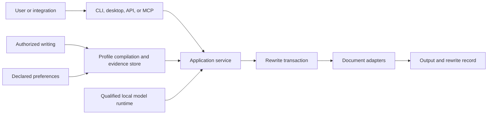
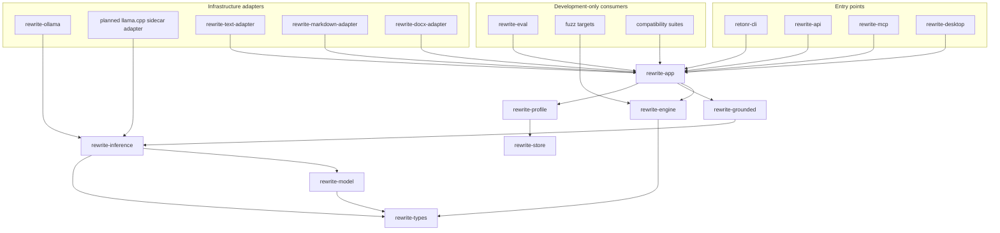
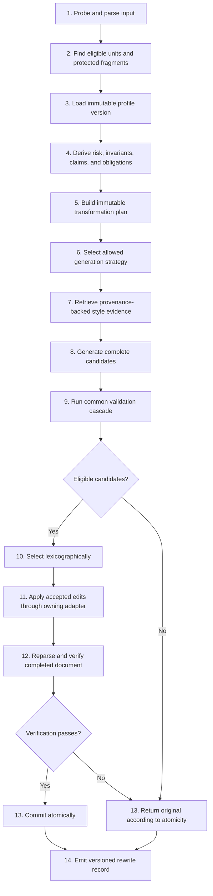

# Architecture

## Status

This architecture defines boundaries for a benchmarked vertical prototype. It is not
an interface freeze. Public APIs, stored schemas, and adapter contracts freeze only
after they have survived evaluation, cross-platform tests, and at least one real
consumer at each boundary.

## Quality attributes

The design is ordered by these priorities:

1. Fidelity risk control
2. User ownership and privacy
3. Explicit failure and abstention
4. Structural and format preservation
5. Cross-platform correctness
6. Inspectability and stable automation
7. Personal style quality
8. Latency and resource efficiency

Style quality cannot compensate for a fidelity failure.

## System context



Every entry point calls the same application service. CLI, desktop, HTTP, MCP, and
agent skill packages do not reimplement profile, rewrite, validation, or persistence
logic.

## Dependency direction

Dependencies point inward toward domain types and policies.



Infrastructure inference adapters depend on `rewrite-inference`. Contract layers
never depend on Ollama, HTTP, a model store, or a platform runtime.

The exact crate split may be consolidated during the first slice if a boundary has
no independent behavior. The dependency rules remain even if two modules initially
share a crate.

Generation strategy, runtime backend, installed model artifact, and qualified
artifact-runtime combination are separate identities. A strategy ID cannot stand in
for mutable backend, artifact, prompt, tokenizer, or parameter provenance.

## Rewrite transaction



The selected generation strategy can increase validation requirements. It cannot
remove a shared validation step.

## Generation strategies

The first generative milestone implements only `Grounded`. The current CLI checks
caller-supplied candidates and administers exact local artifact files, while the
application layer has a provisional grounded strategy exercised through a fake
backend and bounded Ollama adapter. It is not a qualified user-facing model path yet.
Other strategies are introduced only
after the evaluation harness demonstrates a need.

| Strategy | Contract | Intended use |
| --- | --- | --- |
| `Literal` | Deterministic edits only, no generative model | Exact punctuation and declared mechanical rules |
| `Constrained` | Local sentence or paragraph rewrite with protected sentinels | Low-risk short prose |
| `Grounded` | Typed invariants, claims, context, candidates, and full validation | Default generative path |
| `Render` | Whole-unit reconstruction with the strictest validation | Experimental strong-mode work |

Routing inputs include entity and quantity density, negation, modality, conditions,
comparatives, citations, identifiers, coreference, tables, and cross-unit references.
Uncertain routing selects the stricter strategy.

A strategy emits a neutral bounded inference request. A backend returns an untrusted
response plus generation provenance. The strategy parses complete masked candidates,
and the engine alone restores protected values, validates candidates, and applies an
accepted edit. The application maps completed generation provenance into the
versioned rewrite record before returning the transaction. Production grounded
requests do not expose protected raw surfaces to the backend.

## Document representation

The semantic document and adapter reconstruction state are separate. Core code can
refer to opaque source anchors but cannot inspect format-specific data.

```rust
struct DocumentIr {
    schema_version: u32,
    document_id: DocumentId,
    media_type: MediaType,
    source_digest: Digest,
    roots: Vec<NodeId>,
    nodes: BTreeMap<NodeId, Node>,
    rewrite_units: Vec<RewriteUnit>,
    capabilities: AdapterCapabilities,
}

struct Node {
    id: NodeId,
    parent: Option<NodeId>,
    children: Vec<NodeId>,
    role: StructuralRole,
    policy: RewritePolicy,
    source_anchor: SourceAnchorRef,
}

struct RewriteUnit {
    id: RewriteUnitId,
    node_id: NodeId,
    text: String,
    fragments: Vec<SourceFragment>,
    protected_spans: Vec<ProtectedSpan>,
    context: RewriteContext,
}

struct ParsedDocument {
    ir: DocumentIr,
    adapter_id: AdapterId,
    adapter_schema_version: u32,
    adapter_state: Vec<u8>,
    diagnostics: Vec<AdapterDiagnostic>,
}
```

Source ranges are half-open UTF-8 byte ranges after explicit decoding. Adapters also
retain enough state to preserve a byte order mark, original newline style, final
newline state, and format-specific fragments. Non-UTF-8 paths remain `OsString` or
`PathBuf`; they are never forced through a lossy string conversion.

IDs identify an ingest instance. A source anchor identifies the original location.
Neither is derived only from mutable prose.

Every adapter declares a capability matrix. Unsupported features are not silently
treated as supported.

Input acquisition has three distinct contracts. File input supplies bounded original
bytes and an explicit or probed media type to a qualified adapter; only this path may
claim byte and document-format preservation. Typed and clipboard input creates a
logical plain-text document and preserves user-visible line and whitespace intent,
but not rich clipboard representations or source bytes. API and MCP input supplies
inline bounded text or a separately staged bounded document; it never grants an
arbitrary local filesystem path.

Each rewrite unit carries a user-declared or detected BCP 47 language, detection
confidence, script and direction observations, and the exact qualified language
policy. Low-confidence or unsupported units remain unchanged or cause abstention
according to atomicity. Cross-language profile transfer is off by default.

## Adapter contract

```rust
trait DocumentAdapter {
    fn probe(&self, input: &[u8]) -> ProbeResult;

    fn parse(
        &self,
        input: &[u8],
        policy: &ParsePolicy,
    ) -> Result<ParsedDocument, AdapterError>;

    fn apply(
        &self,
        parsed: &ParsedDocument,
        edits: &[AcceptedEdit],
    ) -> Result<Vec<u8>, AdapterError>;

    fn verify(
        &self,
        before: &ParsedDocument,
        output: &[u8],
        edits: &[AcceptedEdit],
    ) -> VerificationReport;
}
```

The application never assembles Markdown or OOXML directly. Only the owning adapter
can apply and verify an edit.

## Claims and invariants

A full unrestricted Meaning IR is deferred. Early versions use typed evidence that
is honest about extraction confidence.

```rust
struct Invariant {
    kind: InvariantKind,
    canonical_value: String,
    original_surface: String,
    evidence: Vec<TextSpan>,
    enforcement: Enforcement,
}

struct Claim {
    subject: Argument,
    predicate: Predicate,
    object: Option<Argument>,
    polarity: Polarity,
    modality: Option<Modality>,
    temporal: Vec<TemporalQualifier>,
    quantities: Vec<QuantityRef>,
    conditions: Vec<Condition>,
    attribution: Option<Attribution>,
    evidence: Vec<TextSpan>,
    confidence: f32,
}
```

The same learned extractor cannot certify its own result. Exact gates, independent
extraction, clause alignment, bidirectional entailment, contradiction checks, and
document-level checks provide complementary evidence.

## Protected sentinel flow

URLs, paths, identifiers, quantities, dates, protected terms, and code-like spans are
replaced with typed sentinels before generation when the mapping is unambiguous.

```text
Payment is due on <DATE_1> for <MONEY_1>.
```

A candidate must contain each required sentinel exactly once in an allowed location.
The original surface value is restored, then the entire validation cascade runs.
Restoring a value is not semantic repair. If relationships changed or mapping is
ambiguous, the candidate fails.

Protection processing is a bounded trust boundary. One rewrite unit accepts at most
4,096 protected occurrences and 16 MiB before or after masking. Candidate match
selection is streaming and leftmost-longest. Masking, sentinel validation, and
restoration use single forward passes so dense valid input cannot amplify into
quadratic replacement or validation work. Limit exhaustion fails closed before
generation.

## Validation cascade

1. Output schema and encoding validity
2. Sentinel count, type, and integrity
3. Protected terms and typed literals
4. Structural fingerprint
5. Novel entity and novel quantity rejection
6. Claim and relationship comparison
7. Sentence or clause alignment
8. Bidirectional entailment and contradiction assessment
9. Cross-sentence and cross-unit obligations
10. Declared constraints
11. Style, channel, and fluency scoring

Negation and modality are not described as purely deterministic checks. Surface
markers can contribute evidence, but scope and implied meaning require learned
assessment and conservative uncertainty handling.

```rust
struct GateResult {
    gate_id: String,
    gate_version: String,
    status: GateStatus,
    severity: Severity,
    evidence: Vec<GateEvidence>,
    confidence: Option<f32>,
}

enum GateStatus {
    Pass,
    Fail,
    Uncertain,
    NotApplicable,
}
```

Strict policies treat `Uncertain` as ineligible. Semantic evaluators are versioned
independently from generators and calibrated on project-specific data.

## Candidate selection

Selection is lexicographic:

1. Reject a hard failure.
2. Reject disallowed uncertainty.
3. Require the calibrated semantic floor.
4. Require declared constraints.
5. Rank eligible candidates by personal style, channel fit, and fluency.
6. Use edit cost and a mode-specific divergence band as tie breakers.

No weighted score may allow a style improvement to offset lost meaning. Surface
divergence is not maximized and never enters the live system as a provenance-evasion
objective.

## Abstention and atomicity

```rust
enum RewriteStatus {
    Rewritten,
    UnchangedNoEligibleContent,
    Abstained,
    Failed,
}

enum Atomicity {
    Document,
    Unit,
    Region,
}
```

Document atomicity is the default for connected prose. If any required unit fails,
the original document is returned byte-for-byte. Unit and region modes are explicit
because partial rewriting can create inconsistent voice or references.

Unit atomicity is allowed only when the adapter and planner establish that a unit is
independent of failed neighbors. Region atomicity groups units connected by
coreference, list structure, table relationships, or discourse dependencies. Both
partial modes run cross-reference, reassembly, and completed-document validation
after edits are applied. Uncertain independence promotes the decision to document
abstention.

Abstention includes stable reason codes, failed gate IDs, affected source anchors,
and retry count. Retry applies only to retryable generation failures. Parser
ambiguity, unsupported format features, or invalid constraints do not trigger a
model retry.

## Profile architecture

Profiles are immutable versions compiled from explicit evidence.

```rust
enum EvidenceUseState {
    Active,
    RetrievalIneligible,
    InfluenceExcluded,
    ConsentRevoked,
    Deleted,
}

struct EvidenceRecord {
    id: EvidenceId,
    source_kind: EvidenceSource,
    source_digest: Digest,
    owner_confirmed: bool,
    channel: Option<Channel>,
    created_at: Option<Timestamp>,
    derived_from: Option<RewriteRecordId>,
    authorization: AuthorizationRecordId,
    use_state: EvidenceUseState,
    text_ref: Option<CorpusTextRef>,
    byte_len: u64,
}

struct DerivedStyleArtifact {
    id: DerivedArtifactId,
    source_evidence_ids: Vec<EvidenceId>,
    producer_identity: ProducerIdentity,
    embedding_space_id: Option<EmbeddingSpaceId>,
    payload_ref: DerivedPayloadRef,
    output_digest: Digest,
}
```

Evidence records contain intrinsic source facts and lifecycle state. Extracted style
features, token counts, vectors, topic assignments, and reliability estimates are
immutable derived artifacts with complete producer provenance. Influence exclusion,
consent revocation, and deletion invalidate the complete transitive derivation
closure. Retrieval ineligibility invalidates retrieval indexes and snapshots without
silently erasing separately approved aggregate observations.

Effective contribution combines ownership confidence, reliability, channel
relevance, recency, sample quality, diversity, and per-source caps. Fixed universal
weights are not frozen before empirical calibration.

Rules:

- Raw generated candidates never become evidence.
- Accepting output updates a preference signal, not the writing corpus.
- User-edited output is derivative and requires explicit confirmation before limited
  use.
- One file, session, or topic cannot dominate the profile.
- Sparse channel profiles shrink toward the general profile.
- Conflicting declared rules fail profile compilation with actionable diagnostics.
- Fidelity and document obligations outrank every style preference.

Retrieval prioritizes channel, communicative act, register, length, and style. Pure
topic similarity is avoided because it can copy names, facts, and phrases from the
corpus. Retrieved evidence is capped per source, traceable, and checked for leakage.

## Storage

SQLite is the initial local store for profiles, evidence metadata, migrations, model
manifests, installed-artifact state, append-only qualification and invalidation
records, activation decisions, active role pointers, and rewrite metadata. Artifact
activation is one transaction that verifies an installed digest and currently valid
qualification, appends the decision, and changes the active pointer. Startup and
recovery revalidate the complete binding before a runtime may use it. Corpus text and
sensitive trace content need an encryption design that works on desktop and headless
systems. That design must pass a dedicated cross-platform spike before its interface
freezes.

The application artifact service accepts an explicit manifest and one regular-file
source for its first offline-import slice. It pins the storage root, lifecycle lock,
staging directory, and artifact directory before invoking caller progress. Managed
child creation, open, inspection, and synchronization remain relative to those held
boundaries on Unix. Windows child opens and metadata checks are handle-relative;
hard-link commit and cleanup are path-backed within the pinned root and qualified on
the continuous-integration NTFS configuration. The source is opened without
following the final symlink or reparse entry and verified for exact size and SHA-256 through a
fixed-size buffer under an explicit caller-owned byte ceiling. A new artifact is
copied to a create-new staging file whose reserved name contains 128 random bits,
synchronized, and committed under its content-derived storage key without replacing
an existing entry. Managed artifact directory scans use a caller-owned entry ceiling
and honor cancellation; staging recovery has a separate fixed ceiling and reserves
capacity before creating an import file. The staging and artifact directories are
synchronized before the manifest and installed state are registered in one database
transaction. A repeated import hashes the source without another staging copy and
idempotently checks state.
Staging and final canonical bytes must each have exactly one filesystem name before
state registration, preventing an external hard-link alias from retaining mutation
authority. Import never changes the source or activates the artifact. Typed progress
contains only lifecycle stage and byte counts. After the last callback and
cancellation check, the service silently reverifies the final canonical bytes and
every held storage boundary before committing state. Successful return is
completion. A state failure can retain a verified orphan, while an observed
cancellation before final registration never creates durable state. Artifact-set
manifests, folder import, runtime-native pulls, downloads, and repair remain later
operations.

A separate read-only artifact inventory uses the same pinned storage boundary,
acquires the lifecycle lock in shared mode, and opens only existing storage. It
loads manifests, optional installations, and active bindings in a bounded database
snapshot, freezes exact raw directory
entries, and verifies eligible direct files with bounded streaming SHA-256. It
reports registered-file status, manifest-only state, independently verified orphan
candidates, content-address conflicts, oversized files, and aggregate unexpected
entry counts. Externally hard-linked files are not accepted as registered or orphan
bytes. Exact lowercase names, application-owned storage keys, no-follow
opens, stable metadata checks, and a second directory snapshot prevent a report from
silently accepting an observed replacement. The operation never creates, cleans,
repairs, or deletes storage. An orphan report is point-in-time evidence only; a
future mutation must reacquire the exclusive lock and reverify the exact entry.
Before returning, it requires a matching second bounded state snapshot and matching
filesystem entry and boundary fingerprints. A successful return is the completion
signal; no caller progress callback runs after these final coherence checks.
On Windows, child opens and metadata queries use target-only capability filesystem
dependencies so they remain relative to held directory handles, reject final reparse
entries, and retain explicit sharing policy. The dependency's enumeration path is
path-backed on Windows, so held root and artifact-directory handles deny deletion or
rename throughout the scan. This behavior is tested on the continuous-integration
NTFS configuration; other Windows filesystem drivers are not yet qualified. The
dependency cost is accepted for the managed-storage trust boundary and remains
subject to source, duplicate-version, and supply-chain review.

Selected orphan reconciliation is a separate existing-only mutation. It accepts one
complete manifest, derives only its canonical content-addressed name, and reacquires
the lifecycle lock exclusively. It ignores prior inventory evidence as authority,
requires exact lowercase direct regular bytes with one filesystem name, and applies
caller-owned entry and byte ceilings. After its final byte-progress callback, it
silently checks the hashed file's stable identity and single-name status,
synchronizes the file, reopens and rechecks the exact entry, synchronizes the
artifact directory, and revalidates the held storage layout. It then atomically inserts
any missing exact manifest and installation records or confirms that both existing
records match while retaining the verified file handle. It never copies, replaces,
deletes, qualifies, activates, or accesses the network. A state failure leaves the
same orphan bytes, and successful
return is the completion signal. This establishes only that one canonical file
matched one manifest during the exclusive operation; it does not establish model
safety, licensing approval, runtime qualification, or future byte integrity.

Inactive managed-byte removal is a separate existing-only mutation under the
exclusive lifecycle lock. It accepts only a current store-issued installation
generation, verifies the canonical direct regular file by exact size and SHA-256,
requires one filesystem name, and rejects any active binding. One immediate SQLite
transaction writes a prepared removal journal and revokes installed-state authority
before the canonical entry is deleted. The service then confirms absence,
synchronizes the artifact directory, revalidates the held layout, and marks the
journal completed. A prepared operation resumes without callbacks or cancellation,
including after a process stops between state preparation, deletion, directory
synchronization, and completion. Installation generations prevent an old completed
retry from deleting a deliberate reinstall. On Unix, deletion is relative to the
pinned artifact-directory descriptor. The lifecycle lock serializes cooperating
Retonr processes, but the current Unix unlink does not claim identity-bound
protection against a non-cooperating same-user process that swaps the final
directory entry. On Windows, the verified file is opened with delete authority and
removed through a safe delete-by-handle operation after all identity comparison
handles are released. The target-only Apache-2.0 `fs_at` 0.2.1 dependency is
retained for that reviewed safe wrapper and adds no authority outside this
boundary. Its internal Windows disposition implementation, read-only handling, and
transitive `windows-sys` 0.52 tree are explicit supply-chain review items. The
alternatives are repository-owned unsafe code, which policy forbids, or a weaker
pathname deletion.

Runtime consumer groundwork now includes a shared artifact lease boundary for later
reading or mapping of managed bytes. The lease checks exact current durable state
before and after byte verification, retains the pinned boundary and verified file
handle, and holds the shared lifecycle lock until the lease ends. No real runtime
consumer uses it yet.
Removal requires the exclusive lock and cannot begin while such a lease exists.
Removal is not secure erasure and does not affect external copies, caches, backups,
runtime memory, or provider records.

The unpublished SQLite adapter requires a live
`ExclusiveArtifactLifecycleLock` reference for both journal transitions. This
non-cloneable capability owns the exclusively locked file handle until it is
dropped, so a durable transition cannot be called with only a state-store handle.
The application creates the capability from a clone of the lifecycle-lock handle it
opened through the pinned storage root. It retains the original handle for exact
path fingerprint checks before and after storage work. The capability proves the OS
lock is held; the application boundary proves that handle is the selected
repository's exact pinned lock entry. Store-owned inventory records remain internal.
Read-only inventory projects each registered or pending installation into an
application-owned `ArtifactInstallationKey` containing only the content identity and
positive installation generation. Persistence records, serialized rows, and storage
keys do not cross the repository facade or CLI boundary.

The first administrative repository facade derives managed storage, exact-schema
SQLite state, and an outer lifecycle lock from one explicit application data
directory. It pins the direct single-link state file before opening SQLite, rechecks
its identity around each service operation, and suppresses external progress
callbacks while the database is open. On Unix, the adapter resolves a
canonicalizable existing parent before SQLite opens it, preserves the original final
filename, and retains SQLite's no-follow flag. If parent resolution fails, it retains
the original path and no-follow behavior so SQLite fails closed. This accepts macOS
system directory aliases without allowing an indirect final database entry. First
import may reserve and synchronize an
empty state file and initialize the current schema; ordinary commands never create an
ambient default or migrate older state. Read-only inventory uses shared authority;
import, reconciliation, removal, and recovery use exclusive authority. First import
creates exactly one missing private leaf below an existing pinned parent
or accepts an empty existing directory. It refuses a nonempty uninitialized root and
does not change permissions on a pre-existing caller directory. The facade remains
a provisional 0.x API while the wider artifact lifecycle and rewrite transaction
contracts evolve. Its inventory result is application-owned and
persistence-neutral. The qualified boundary is a local, application-owned
filesystem used only by cooperating Retonr processes.

Small personal corpora use filtered brute-force vector scoring in Rust with vectors
stored as versioned blobs. SQLite FTS5 supports lexical retrieval. A vector extension
is not a required dependency until scale benchmarks justify it.

## Trace model

A rewrite record includes:

- Trace schema version
- Source and output content identifiers
- Adapter and schema versions
- Immutable profile version
- Model artifact digest, quantization, backend, and backend version
- Installed model identity and qualification-record identity
- Strategy, tokenizer, prompt template, parameters, output schema, and seed
- Planner and validator versions
- Retrieved evidence IDs
- Candidate lineage and gate results
- Final decision and abstention reason
- Timings and resource measurements
- Binary and configuration digests
- Locale and timezone when parsing depends on them

The implemented rewrite-record v2 slice now nests one optional versioned generation
record containing stable strategy ID, exact runtime backend and version, optional
runtime digest, content-derived artifact ID, artifact digest, prompt-template digest,
complete backend-input digest, output-schema digest, candidate count, and optional
runtime-reported token and duration observations. Model-free transactions omit the
field. A v1 record without the field remains deserializable. Qualification identity,
installed generation, sampling parameters, seed, adapter versions, profile version,
validator versions, and binary or configuration digests remain planned rather than
inferred.

Default traces exclude raw input, output, candidates, profile samples, prompts, and
model reasoning. Short plain hashes are vulnerable to guessing, so local equality
tracking should use an installation-keyed identifier or remain opt-in.

Generation provenance proves only what the selected adapter reported and what the
strategy rechecked for that completed call. It does not prove semantic correctness,
human authorship, ownership, compliance, model safety, or reproducibility.

Replay is best effort unless model artifact, backend, quantization, prompt, runtime,
and hardware behavior are all controlled.

## Markdown architecture

Markdown support declares an exact dialect. The first subset rewrites non-overlapping
plain text in paragraphs and headings.

The adapter:

1. Uses parser source offsets to identify eligible spans.
2. Protects code, raw HTML, destinations, autolinks, and unsupported constructs.
3. Applies edits from the highest byte offset to the lowest.
4. Escapes output for its exact inline context.
5. Requires byte identity outside approved spans.
6. Reparses the completed output.
7. Compares a structural fingerprint.
8. Abstains on overlap, parse changes, or unsupported syntax.

Nested event ranges are not treated as a lossless mutable syntax tree.

## DOCX architecture

DOCX support is package-preserving within a declared subset, not universally
lossless. The first subset is unencrypted `.docx`, main document paragraphs and
table cells, homogeneous run formatting, and no ambiguous active features.

The adapter:

- Copies untouched package parts without semantic modification.
- Changes only approved WordprocessingML text nodes.
- Preserves unknown parts, relationships, namespaces, and content types.
- Protects hyperlink targets.
- Rejects macros, encryption, signed documents, fields, tracked changes, content
  controls, drawings, equations, and embedded objects in an eligible unit.
- Limits entry count, expanded size, compression ratio, XML depth, and processing
  time.
- Disables DTD and external entity resolution.
- Never follows external relationships.
- Validates XML, hashes untouched parts, and opens compatibility fixtures in office
  software during qualification.

Run-level formatting alignment is ambiguous when word order changes. The first
subset therefore requires homogeneous formatting within a rewrite unit.

## Application ports

```rust
type PortFuture<'a, T> =
    Pin<Box<dyn Future<Output = T> + Send + 'a>>;

trait Generator: Send + Sync {
    fn capabilities(&self) -> GeneratorCapabilities;

    fn generate<'a>(
        &'a self,
        request: GenerationRequest,
        operation: &'a OperationContext,
    ) -> PortFuture<'a, Result<Vec<GeneratedCandidate>, GenerationError>>;
}

trait Embedder: Send + Sync {
    fn capabilities(&self) -> EmbeddingCapabilities;

    fn embed<'a>(
        &'a self,
        request: EmbeddingRequest,
        operation: &'a OperationContext,
    ) -> PortFuture<'a, Result<EmbeddingBatch, EmbeddingError>>;
}

trait SemanticEvaluator: Send + Sync {
    fn evaluate<'a>(
        &'a self,
        source: &'a str,
        candidate: &'a str,
        context: &'a EvaluationContext,
        operation: &'a OperationContext,
    ) -> PortFuture<'a, Result<SemanticReport, EvaluationError>>;
}
```

Generation, embeddings, retrieval, semantic evaluation, and validation remain
separate responsibilities. These ports are object-safe for runtime-selected local
backends, own request payloads across await points, require `Send` futures, and carry
cancellation and deadlines through `OperationContext`. A future static generic or
closed-enum implementation must preserve the same ownership and cancellation
contract.

## Services and integrations

The application service is the automation boundary. The stable CLI machine contract
is its first external adapter, followed by MCP standard input, Agent Skills, and a
portable Agent Plugin package. Local HTTP follows only for consumers that cannot
launch a subprocess.

During `0.x`, the local API `/v0` surface is explicitly preview and can change with
release notes and migrations. The 0.9 compatibility gate promotes the reviewed
contract to `/v1` for 1.0. It has versioned wire schemas, capability discovery,
successful domain outcomes, RFC 9457 transport errors, cancellation, conditional
mutation semantics, explicit authority, and loopback-only binding for 1.0.

Synchronous requests return no content until complete validation and reassembly.
Long work uses principal-scoped operation resources with authenticated polling and
cancellation. Optional progress contains bounded phase and sequence metadata only,
never candidates or unvalidated output fragments.

MCP implements standard input first, then POST-only Streamable HTTP. MCP 2026-07-28
has no initialize exchange or protocol session. Requests carry required protocol
version and client capabilities plus optional `clientInfo` in request metadata, and
the server implements `server/discover`. Multi-step learning uses explicit opaque
handles that are scoped, expiring, revocable, principal-bound, and tamper-resistant.
MCP handlers reconstruct state from explicit identifiers rather than hidden protocol
sessions. Older protocol support is limited to named clients with conformance
fixtures.

Baseline MCP rewrite and check tools accept complete bounded plain text and supported
Markdown and return one schema-validated structured result. They accept no arbitrary
paths, clipboard authority, raw audio, DOCX base64, or partial candidate streaming.

Streamable HTTP uses a documented custom loopback bearer profile rather than standard
MCP OAuth authorization. Its server-side scopes, challenge, rotation, and revocation
behavior are explicit, and standard input remains preferred when a named client
cannot inject the token.

Agent Skills use the filesystem `SKILL.md` format and contain instructions, schemas,
examples, and explanatory authority requirements only. A routine Agent Plugins
1.0.0 working-draft package combines one routine skill with root `plugin.json` and
`mcp.json` metadata for the standard-input server. It never contains a second rewrite
implementation, credentials, profiles, models, or user data.

Agent Plugins defines portable packaging, not distribution, signatures, updates,
permissions, or sandboxing. The release layer owns those concerns and validates
package-root containment across symlinks, junctions, reparse points, commands,
working directories, references, and assets without executing package code. Server
authorization remains authoritative, and experimental `allowed-tools` metadata is
not trusted for security. Skills over MCP remains isolated until its proposal is
stable and qualified.

The 1.0 compatibility adapter is an offline local post-processor. A caller submits a
completed, supported response payload and receives the same supported shape after
rewriting. The adapter makes no upstream request and stores no upstream credentials.
It does not rewrite tool calls, structured JSON, reasoning, refusals, citations, or
other event types. It uses byte-range JSON string splicing, verifies non-target bytes,
and returns local status and provenance through an explicit sidecar or envelope. A
final verification failure is an abstention that returns exact original bytes. A
true outbound reverse proxy or remote generation backend is a separate post-1.0
feature with its own network and credential design.

Transport streaming and rewrite atomicity are independent. Standard input, framed
agent messages, and long-operation progress can stream under bounded parsing,
backpressure, cancellation, and ordering rules. Eligible text is released only at a
declared message or document boundary after the owning adapter and complete
validation cascade pass. A later event-stream compatibility adapter must preserve
non-text events and cannot mutate bytes already forwarded to a consumer.

Optional provider-mark diagnostics sit after the accepted artifact is frozen. A
diagnostic adapter may inspect the frozen source and final accepted text only through
a separate explicit operation. Its result has no edge into prompts, generation,
candidate schedules, retries, ranking, acceptance, profiles, or style learning. A
hosted detector requires per-operation network authority and disclosure that the
selected content leaves the device. Detector identity, version, declared coverage,
result vocabulary, terms, and retention policy are part of the record.

Desktop presentation has no independent product authority. It is an installed native
Rust application with no embedded browser, HTML or JavaScript frontend, hosted
application, or ordinary-operation local HTTP dependency. The toolkit is selected
only after comparable cross-platform accessibility, text, visual, packaging,
licensing, and maintenance spikes.

Long-running desktop work uses typed commands and bounded sequenced state. Each
operation has an opaque ID, owner, deadline, resource budget, and contiguous
monotonic sequence. A gap requires an authoritative snapshot query. Window close
requests cancellation, while durable staging is resumed only through a new explicit
command. The presentation never receives model tokens, prompts, profile evidence, or
arbitrary executable markup.

## Cross-platform constraints

- Paths remain `PathBuf` and `OsString` through core and process boundaries.
- Application directories come from platform APIs rather than hard-coded paths.
- Source line endings and final newline state are preserved.
- Output is written to a temporary file in the destination directory, flushed, and
  replaced through a platform-tested atomic operation.
- Source overwrite is opt-in and includes a recoverable backup policy.
- Processes use argv arrays, never constructed shell commands.
- Cancellation reaches HTTP, database, model, and child-process work.
- Windows locking, long paths, reserved names, and case folding have dedicated tests.
- macOS universal packaging and signing are tested on macOS.
- Linux system dependencies and package formats are tested on supported runners.

## Architecture decisions still open

- Final product and crate name
- Encryption and key-recovery design for desktop and headless use
- Exact semantic evaluator ensemble and calibration policy
- Model manifest, artifact drift, and qualification invalidation policy
- Initial supported Markdown extension set
- DOCX validation and office-compatibility tooling
- Native Rust desktop toolkit, renderer, accessible component system, packaging,
  updater, and operation-state contracts
- Post-1.0 local speech runtime and distributable model licenses
- Exact API compatibility subset
- Local API authentication, MCP custom bearer profile, and compatibility-adapter
  status side channel

Each decision receives a checked-in decision record before implementation depends
on it.

## References

- [CommonMark 0.31.2](https://spec.commonmark.org/0.31.2/)
- [pulldown-cmark source offsets](https://docs.rs/pulldown-cmark/latest/pulldown_cmark/struct.Parser.html)
- [ECMA-376 OOXML](https://ecma-international.org/publications-and-standards/standards/ecma-376/)
- [WordprocessingML document structure](https://learn.microsoft.com/en-us/office/open-xml/word/structure-of-a-wordprocessingml-document)
- [MCP 2026-07-28](https://modelcontextprotocol.io/specification/2026-07-28)
- [Agent Skills specification](https://agentskills.io/specification)
- [Agent Plugins specification](https://agent-plugins.org/specification)
- [Style transfer evaluation](https://aclanthology.org/N19-1049/)
- [Negation and sentence representations](https://aclanthology.org/2022.blackboxnlp-1.20/)
- [Factual consistency methods](https://aclanthology.org/2022.naacl-main.287/)
- [AlignScore](https://aclanthology.org/2023.acl-long.634/)
- [StyleDistance](https://aclanthology.org/2025.naacl-long.436/)
