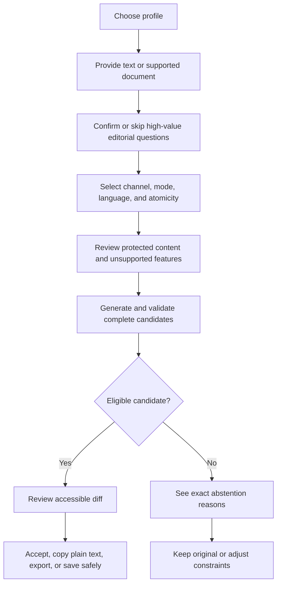

# Product and interface design

## Experience principles

1. The user remains the editor and final authority.
2. Fidelity failures are visible and actionable.
3. The original is always recoverable.
4. Local and networked actions are visually and behaviorally distinct.
5. Every important desktop workflow is complete in the CLI first.
6. Typed clarification is complete before optional voice input is considered.
7. Accessibility and cross-platform behavior are release criteria.

## Core workflow



The default workflow does not overwrite source files. In-place replacement is an
explicit action with a recoverable backup policy.

## Profile onboarding

Onboarding is progressive. A user can begin with declared preferences and a small
authorized sample set, then add evidence as needed.

Steps:

1. Create a local profile.
2. Explain that writing style can identify a person and may contain sensitive data.
3. Confirm ownership or authorization for imported samples.
4. Select channels represented by each source.
5. Extract interpretable features and show uncertainty.
6. Let the user correct or disable inferred tendencies.
7. Add declared requirements and forbidden patterns.
8. Run a held-out preview that compares the profile with a simple baseline.
9. Save an immutable profile version.

The user can inspect which evidence influenced a rewrite. Sensitive samples can
contribute aggregated features without being retrieved into a generation prompt.

## Typed style interview

The interview uses short scenarios and natural follow-up questions. It does not ask
the user to choose between artificial sentences indefinitely.

It captures:

- Greeting and sign-off habits
- Directness and hedging
- Sentence and paragraph rhythm
- Contractions and punctuation
- Preferred vocabulary and banned phrases
- How requests, disagreement, uncertainty, and bad news are expressed
- Channel-specific differences
- Protected names, products, and technical terms

The interview produces proposed evidence and declared rules. The user approves both
before a new profile version is created.

## Guided editorial brief

Retonr can inspect a document and ask a small number of questions whose answers could
materially change the rewrite or prevent an editorial mistake. Typical questions
cover audience, main point, requested action, stance, non-negotiable language, and
allowed edit level.

The user may answer, edit, skip, or use safe defaults. Each question explains why it
matters and shows the relevant source context. Answers belong to the document brief
and do not become durable profile preferences without a separate preview and
activation decision.

The typed brief contract is available in the CLI and native desktop. Agents can
present proposed questions and submit explicit answers through a bounded handle, but
cannot answer on the user's behalf or infer consent from conversation state.

The complete question, precedence, preference-ledger, evaluation, and later voice
rules are defined in [Guided editorial brief](editorial-brief.md).

## Post-1.0 local voice input

Voice may later transcribe profile and document-brief answers into the same typed
fields. The user reviews and confirms the transcript before it becomes an answer or
evidence event. Voice adds no new authority and never becomes required for a complete
workflow.

## CLI design

The CLI is a primary product, not a debug wrapper around the desktop application.

The command families below are the planned 1.0 surface. They are not implemented
until [the current-state document](current-state.md) records them. The current
binary exposes `check` plus the offline model commands listed in the
[README](../readme.md), including exact single-file `import` and exact folder
`import-set`.

### Command families

```console
retonr profile create <name>
retonr profile ingest <path>... --profile <name>
retonr profile interview --profile <name>
retonr profile show --profile <name> [--format text|json]
retonr profile edit --profile <name>
retonr profile export --profile <name> --output <path>
retonr profile import <path>
retonr profile delete --profile <name>

retonr brief <path> --profile <name> --interactive
retonr plan <path|directory> --profile <name> --manifest <path>
retonr lint <path|directory|-> --profile <name>
retonr lint rules --profile <name>
retonr lint explain <finding-id>
retonr rewrite [path|directory|-] --profile <name>
retonr check <path|-> --profile <name>
retonr apply --manifest <path> --output-dir <directory>
retonr report <path>

retonr model list
retonr model recommend --language auto --mode balanced --format text
retonr model inspect <model>
retonr model download <model>
retonr model verify <model>
retonr model qualify <model>
retonr model eval <model> --suite device
retonr model import <path>
retonr model import-set <source-root>
retonr model activate <model>
retonr model deactivate <model>
retonr model remove <model>

retonr serve
retonr mcp serve --transport stdio|http
retonr doctor
retonr version --format text|json
```

The final grammar is tested before it freezes. Common operations stay short while
advanced policy remains explicit.

Editorial lint returns named, explainable quality findings and never an AI-authorship
verdict. Its full finding, ranking, report, and agent boundaries are defined in
[Editorial lint and the anti-slop quality loop](editorial-lint.md).

### Rewrite controls

```text
--mode literal|pure|balanced|strong
--channel auto|im|work-chat|email|longform|doc
--atomicity document|unit|region
--diff
--dry-run
--trace <path>
--format text|json
--output <path>
--output-dir <directory>
--recursive
--brief <path>
--in-place
--backup
--fail-on-abstain
--no-network
--quiet
--verbose
```

Modes bound how much change is allowed. They do not lower the fidelity floor or map
directly to one generation strategy.

| Mode | Change contract | Eligible strategies | Uncertainty policy |
| --- | --- | --- | --- |
| `literal` | Declared deterministic edits only | `Literal` | No learned semantic uncertainty |
| `pure` | Minimal local phrasing changes; no sentence reordering | `Literal`, `Constrained` | Strictest generative threshold |
| `balanced` | Sentence split or merge and moderate restructuring | `Literal`, `Constrained`, `Grounded` | Strict calibrated threshold |
| `strong` | Broader restructuring within the same claims and format | All, with `Render` explicitly experimental before qualification | Same fidelity floor with stricter document checks |

The router chooses among strategies allowed by the mode based on input risk. It may
choose a more conservative strategy or abstain. It may not use a riskier strategy
than the selected mode allows. Strong mode permits more surface change, not more
semantic error.

`--in-place` is incompatible with stdin. It never silently follows a symlink or
overwrites an ambiguous target. A source with hard-link aliases is refused because
an in-place write could otherwise mutate another path. The flag retains a sibling
backup of the original before replacement.

### Streams and interaction

- Standard output contains requested data only.
- Diagnostics, warnings, progress, and explanations use standard error.
- Interactive terminal rendering escapes ANSI CSI, OSC, C0, C1, title, hyperlink,
  and clipboard control sequences from untrusted content.
- Raw content is emitted only to a non-terminal data stream or a file by default. If
  terminal output remains necessary after usability testing, it requires the
  specific double opt-in `--raw-terminal --yes` with a warning.
- Progress is disabled when standard error is not a terminal.
- Color follows terminal capability, explicit flags, and `NO_COLOR`.
- Prompts never appear in non-interactive mode.
- JSON output uses versioned schemas and stable enums.
- Cancellation returns control quickly and cleans up child work.
- Help includes examples and links to local documentation.
- Shell completion and manual pages ship with releases.

`rewrite -` reads multiline standard input to end of file without trimming. Path,
standard-input, direct-text, and explicit clipboard sources are mutually exclusive.
An interactive paste buffer treats bracketed paste as data and requires an explicit
submit action. `--clipboard` reads plain text only after user action, and
`--copy-output` writes only a completely validated result. Neither operation polls
clipboard history or turns pasted text into profile evidence.

An abstention can still produce a valid original document. Machine callers inspect
the structured `status`. `--fail-on-abstain` converts it to a dedicated nonzero exit
status for pipelines that require a rewrite.

### Exit status design

The exact values freeze with the CLI contract. The categories are:

| Category | Meaning |
| --- | --- |
| Success | Requested operation completed; structured status distinguishes rewritten and unchanged |
| Usage | Invalid command, option, or configuration |
| Operational | Filesystem, model, storage, or internal failure |
| Policy | Check violations or explicitly fatal abstention |
| Compatibility | Unsupported format, capability, protocol, or model |

Every nonzero category has a stable machine-readable error code in JSON mode.

## Desktop information architecture

### Onboarding

- Local-first explanation and network state
- Model selection with disk, memory, license, and language details
- Profile creation and corpus authorization
- Typed profile interview and document brief
- First held-out preview

### Rewrite workbench

- Source editor or document picker
- Reviewed file or folder manifest with explicit destination and collision policy
- Profile, channel, mode, and atomicity controls
- Protected-content summary
- Side-by-side and accessible linear diff
- Validation result grouped by exact, structural, semantic, and style evidence
- Clear rewritten, unchanged, abstained, and failed states
- Copy, export, safe replace, undo, and trace export
- Staged batch progress, recovery, and exact change report
- Multiline plain-text paste that retains blank lines, tabs, and final-newline intent
- Explicit plain-text clipboard read and write permissions scoped to this window

Rich HTML or RTF clipboard data is never rendered. When a plain representation is
available, the workbench labels it as plain-text import. Document formatting is kept
through Save or Export using the owning Markdown or DOCX adapter, not through Copy.
Editing after a completed rewrite invalidates its displayed validation result until
the document is checked again.

### Profile lab

- Declared rules
- Observed features with confidence and sample counts
- Channel overlays
- Evidence browser with provenance and exclusion controls
- Conflicting rule resolution
- Version history, compare, restore, export, and delete

### Model manager

- Installed and available models
- Artifact source, digest, license, size, runtime, and tested status
- Download, offline import, verify, qualify, and remove
- Clear local-runtime, offline, and model-installation state

### History

History is opt-in. Default rewrite records avoid raw text. The user can inspect,
export, and purge stored metadata. Sensitive debugging has a prominent warning and
an automatic retention limit.

### Settings

- Storage and encryption
- Network permissions
- Accessibility and motion
- Keyboard shortcuts
- Default atomicity and strictness
- Model and resource limits
- Update behavior
- Diagnostics export

## Desktop interaction states

Every asynchronous surface implements:

- Initial
- Empty
- Ready
- Running with progress and cancellation
- Success
- Unchanged
- Abstained with reasons
- Unsupported with remediation
- Recoverable error
- Fatal error

Long-running desktop operations have stable operation IDs. Events include the
operation ID and a monotonic sequence number so duplicate, late, or out-of-order
events cannot replace a completed or cancelled state.

No state is conveyed only through color. Focus moves intentionally after dialogs,
errors, and completed operations. Status changes use appropriate assistive-technology
announcements without excessive repetition.

## Accessibility

Version 1.0 targets WCAG 2.2 AA for the native desktop application where the
criteria apply, plus platform-native accessibility semantics.

Required checks:

- Complete keyboard operation
- Visible and high-contrast focus indicators
- Semantic headings, landmarks, controls, names, and descriptions
- Logical focus order
- Text resize and zoom without loss of function
- High-contrast mode
- Reduced-motion support
- Minimum target sizes
- No color-only or motion-only information
- Screen-reader-friendly linear diff alternative
- Accessible error summaries linked to affected controls
- Toolkit and platform accessibility checks plus manual keyboard and screen-reader
  passes

The CLI uses plain-language diagnostics, stable ordering, a no-color mode, and output
that remains understandable without terminal styling.

## Cross-platform UX

Platform conventions are respected where they affect trust and usability:

- Native file and folder dialogs
- Platform-standard keyboard shortcuts with visible alternatives
- Correct menu placement on macOS
- Windows installer, file-lock, and long-path behavior
- Linux desktop entry, permissions, and distribution dependency reporting
- Native credential storage where available
- No assumption that a default shell, browser, secret service, or model runtime exists

Feature parity is required, but pixel identity is not. Platform-specific differences
are documented and tested.

## API design

The first-party API is preferred over compatibility emulation. During `0.x`, the
preview route is `/v0` and may change with release notes and migrations. The 0.9
compatibility freeze promotes the reviewed contract to `/v1` for 1.0. Version 1.0 is
loopback-only, authenticated, and started only by an explicit service command.

Initial resource groups:

```text
GET  /v0/capabilities
GET  /v0/health
POST /v0/rewrites
POST /v0/checks
GET  /v0/profiles
POST /v0/profiles
GET  /v0/profiles/{id}
POST /v0/profiles/{id}/evidence
POST /v0/profiles/{id}/versions
POST /v0/learning
POST /v0/learning/{id}/responses
DELETE /v0/learning/{id}
POST /v0/operations
GET  /v0/operations/{id}
DELETE /v0/operations/{id}
```

Mutation endpoints use conditional writes and client operation IDs. Long-running work
supports cancellation and deadlines. Profile mutation requires stronger authority
than rewriting. Rewritten, unchanged, abstained, and unsupported are successful
domain outcomes; malformed, authorization, resource, and operational failures use
redacted RFC 9457 problems. Cancelled is a successful domain outcome only when a live
request or later operation lookup can return it. A disconnected client receives no
later body. Failed never uses a successful HTTP envelope.

Synchronous calls return only a complete validated outcome. Longer work returns an
opaque principal-scoped operation ID, supports authenticated polling and explicit
cancellation, and exposes only bounded phase and progress metadata before the final
result. Candidate tokens, output fragments, prompts, and trace content are never
streamed. API and MCP callers cannot supply an arbitrary local filesystem path.
Inline JSON strings have logical text semantics; structured documents use a separate
bounded byte-transfer or staged-document contract before `/v1` freezes.

## MCP design

The routine MCP surface maps to the application service:

```text
rewrite
check
```

Baseline MCP tools accept complete bounded TXT and supported Markdown content and
return one schema-validated structured result. They do not accept arbitrary paths,
clipboard authority, arbitrary paths, profile mutation, model lifecycle, or partial
candidate streaming. Privileged profile tools require a separate package and
server-enforced authority after their contracts stabilize.

Names remain provisional until schemas are tested with clients. Learning handles are
explicit because protocol sessions are not application state. MCP 2026-07-28 has no
initialize exchange or protocol session. Requests carry required version and client
capabilities plus optional `clientInfo` in metadata, and the server implements
`server/discover`. Standard input precedes POST-only Streamable HTTP. Older revisions
are supported only for named clients with compatibility fixtures.

Streamable HTTP uses a documented custom loopback bearer profile, not standard MCP
OAuth authorization. Standard input remains preferred when a named client cannot
inject the token.

One first-party Agent Skill and standard-input MCP entry ship together in a pinned
Agent Plugins 1.0.0 working-draft package. Agent Plugins format validity does not
establish distribution trust, signatures, updates, permissions, sandboxing, or named
client compatibility. Those are separate release gates. Skills over MCP remains
experimental and does not gate 1.0.

## Screenshot policy

Screenshots document actual released behavior. They are captured from deterministic
fixtures after the corresponding acceptance suite passes.

Required README images by 1.0:

1. CLI rewrite with a readable diff
2. CLI abstention with concise reasons
3. CLI JSON or trace inspection
4. Desktop rewrite workbench
5. Desktop profile lab
6. Desktop file or folder transaction report with exact change metrics

Every image has concise alt text and a nearby textual explanation. Sensitive data is
never used. When Windows, macOS, and Linux differ materially, the documentation shows
the difference instead of selecting one platform as canonical.
