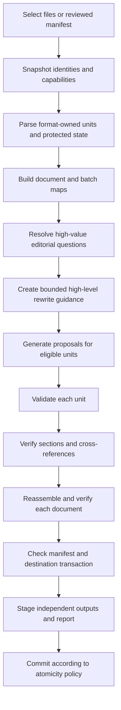

# Non-destructive document and folder transactions

## Product contract

Retonr accepts explicit files, directories, standard input, or a previously reviewed
manifest. It discovers eligible content, proposes bounded prose edits, validates the
complete result, and writes to a separate destination by default. The source remains
unchanged unless the user selects a separately qualified recoverable in-place mode.

A 100-page document is not one prompt. A directory is not one mutation. Both are
hierarchical transactions with explicit discovery, planning, unit edits,
verification, staging, commit, and reporting.

The governing invariants are
[INV-P02, INV-P03, INV-E04, INV-E05, INV-E06, and INV-E07](invariants.md).

## Selection and discovery

The CLI grows toward these forms as the corresponding adapters qualify:

```console
retonr rewrite report.docx --output-dir rewritten
retonr rewrite docs/ --recursive --output-dir rewritten --dry-run
retonr plan docs/ --recursive --manifest rewrite-plan.json
retonr apply --manifest rewrite-plan.json --output-dir rewritten
retonr report rewritten/retonr-report.json
```

Discovery is model-free and produces a reviewable manifest before generation. The
manifest records:

- Explicit source roots and source digests
- Relative paths and detected media types
- Adapter and capability versions
- File, unit, byte, archive, XML, and processing bounds
- Eligible, protected, unsupported, rejected, and skipped counts
- Destination mapping and collision policy
- Symlink, junction, reparse-point, hidden-file, ignore-file, and recursion policy
- Atomicity mode and failure policy

Directory traversal does not follow links outside an approved root. An output root
cannot be the input root, its ancestor, or an unresolved alias of either. Generated
output, temporary files, version-control metadata, and ignored paths are excluded by
default. A dry run performs discovery and capability reporting without model work or
output mutation.

## Hierarchical rewrite pipeline



### Pass 1: deterministic inventory

The adapter parses source bytes before a model sees content. It identifies eligible
prose units, protected values, format state, structural relationships, headings,
tables, formulas, code, links, references, fields, and unsupported constructs. It
stores source anchors and digests in adapter-owned state.

The same preflight inventories supported signatures, Content Credentials, metadata,
invisible controls, external references, and unknown carriers. A recognized binding
that cannot survive the requested edit blocks until an explicit qualified
derivative decision. Unknown preservation-critical state remains opaque or causes
abstention. The source is never normalized merely to make inventory easier. See
[Provenance, marking, and derivative handling](provenance.md).

The inventory is the authority for what may change. A later model plan cannot create
new eligible spans.

### Pass 2: document map and style context

For long inputs, Retonr constructs a bounded map containing section roles, declared
audience, terminology, protected claims, defined abbreviations, cross-references,
style rules, and unit relationships. Deterministically preserved source values remain
linked to source anchors.

A qualified local model may propose high-level guidance such as tone consistency,
repetition to reduce, or transitions to smooth. That guidance is untrusted. It
cannot introduce claims or replace the source as the fidelity reference.

When a document exceeds a model context window, the map is built hierarchically from
bounded regions. Retonr records what source each summary covers and its digest. It
does not claim that a larger advertised context window provides accurate recall or
global consistency without separate qualification.

### Pass 3: guided editorial brief

Retonr may propose a small set of questions about audience, main point, requested
action, stance, non-negotiable language, and permitted edit level. It asks only when
an answer can affect eligible work or prevent an editorial mistake and cannot be
resolved from an explicit rule or protected source.

Answers become a versioned document brief. They do not become permanent profile
preferences without separate preview and activation. Skipped questions remain
unknown. The complete selection, precedence, agent, time-aware preference, and
evaluation rules are in [Guided editorial brief](editorial-brief.md).

### Pass 4: bounded unit proposals

Each generation request receives only the material needed for one eligible unit or a
small related region:

- Exact source text for the target unit
- Protected literals and typed invariants
- Nearby source context that cannot be edited by that request
- Approved profile rules and retrieved authorized examples
- Bounded document guidance and terminology
- Required output schema, edit budget, and stop conditions

Overlapping context does not grant overlapping edit authority. Every proposal names
the source digest, unit ID, eligible range, plan version, profile version, strategy,
runtime identity, and artifact identity it used.

### Pass 5: unit and region validation

Each proposal passes the common literal, invariant, structure, semantic, style, and
edit-cost gates. Independent unit validation may later run in a bounded worker pool
whose results join by stable unit ID; document consistency remains a serial final
gate. Parallel rewriting is allowed only within the qualified concurrency envelope
and must not oversubscribe cores already used by a generating local runtime. A
region pass then checks relationships that one unit cannot prove,
including terminology, abbreviations, numbering, references, list parallelism,
heading intent, and repeated claims.

The region pass may reject a candidate set or request new independent proposals. It
does not patch text directly and cannot accept a unit that failed its own fidelity
gate.

### Pass 6: document verification

The format adapter reassembles the complete document and verifies its own contract.
Checks include source-anchor freshness, approved edit ranges, protected inventories,
structural fingerprints, package relationships, untouched bytes or parts, output
reparse, resource bounds, and reopen behavior where applicable.

Document-level semantic and consistency checks run against the original source, not
only against summaries. Under document-atomic mode, any failure returns the complete
original. Region-atomic mode is available only after its cross-reference and
reassembly fixtures pass for that format.

### Pass 7: staged batch commit

Every output is first written to a private staging location under the destination
filesystem, verified, flushed as required by the selected durability contract, and
then moved to its final destination. Existing destination files are not overwritten
without an explicit collision policy.

Batch atomicity has explicit modes:

- `document`: independently commit each verified document and report all failures
- `selection`: commit nothing unless every selected document verifies
- `region`: commit verified regions inside a document only for formats and
  cross-reference classes that have earned that capability

An interruption leaves source files intact. Recovery reads the staged manifest and
reports exact committed, staged, rejected, and untouched paths before doing more
work.

## Change report

The report is generated from source and output artifacts, never from model
self-report. It includes:

- Source, output, profile, strategy, runtime, model, adapter, and validator identities
- Status and stable reasons for every file and unit
- Exact changed ranges or package parts and proof that other owned state was
  preserved
- Accepted, unchanged, protected, unsupported, rejected, and retried unit counts
- Added, removed, and replaced bytes, Unicode scalar values, words, sentences, and
  paragraphs under named counting algorithms
- Token-level diff ratio and eligible-text change ratio
- Changes in declared style features, with before and after counts
- Protected literal, formula, relationship, field, and metadata verification results
- Fidelity, consistency, structure, and format gate summaries
- Approximate resource use, latency, cancellation, and abstention data

A statement such as "3 percent of eligible words changed" must name its denominator
and diff algorithm. It is not phrased as "3 percent more human" or as proof that a
detector was defeated.

Page count is evidence from a named, versioned renderer, operating system, fonts,
locale, page settings, and export path. The report can show that a DOCX remained 105
pages under that exact qualified environment or stayed within an approved drift
bound. It cannot guarantee identical pagination in every version of Word,
LibreOffice, printer driver, or font environment.

## Format preservation matrix

| Format | Initial eligible content | Protected or unchanged state | Qualification rule |
| --- | --- | --- | --- |
| Plain text | Complete bounded text | Newline kind, final newline, byte-order policy, protected literals | Exact reassembly contract |
| Markdown | Declared paragraph and heading prose spans | Syntax, code, HTML, links, destinations, references, unsupported constructs, non-target bytes | Reparse, structural fingerprint, and byte identity |
| JSON | Schema-declared or explicitly selected prose string values | Keys, structural strings, numbers, booleans, nulls, ordering, whitespace, escapes outside accepted ranges, and non-target bytes | Context escaping, full reparse, masked-tree comparison, and byte identity |
| HTML | Qualified prose text nodes | Markup, attributes, URLs, scripts, styles, templates, code, forms, embedded content, comments, unsupported nodes, and non-target bytes | Context escaping, pinned-parser reparse, structural fingerprint, and byte identity |
| DOCX | Declared main-story paragraphs and table cells with supported run formatting | Unsupported runs and parts, relationships, styles, numbering, fields, drawings, macros, metadata by policy | Package checks, untouched-part verification, reopen, and qualified render comparison |
| XLSX | Post-1.0 opt-in prose cells in a declared workbook subset | Formulas, cached values, cell types, references, names, validation, tables, styles, conditional formatting, charts, macros, external links, workbook and sheet structure | Formula and structure fingerprints, shared-string isolation, package checks, recalculation policy, and reopen fixtures |

Spreadsheet support cannot be implemented as a generic XML text replacement.
SpreadsheetML formulas reside in formula elements, and text may be shared by many
cells through one shared-string table entry. Editing one shared entry can therefore
change cells outside the user's selection. A qualified adapter must create isolated
replacement entries when required and prove that formula text, cached-value policy,
types, references, names, calculation settings, and all unsupported parts retain
their declared state.

Macro-enabled workbooks remain unsupported until a separate signed-package and macro
preservation threat model exists. Retonr never edits formula text as prose.

## Failure and recovery rules

- A parse, capability, bound, generation, validation, reassembly, reopen, or commit
  failure never changes a source file.
- A stale source digest invalidates its plan and proposals.
- Cancellation discards incomplete candidates and stops scheduling new units.
- Temporary and staged content follows the same privacy and deletion policy as the
  source.
- Default logs contain paths only under the configured path-redaction policy and no
  document text.
- Retrying a deterministic completed unit with the same identities does not create a
  second conflicting output.
- A report never labels unsupported checks as passed.

## Primary references

- [ECMA-376 Office Open XML](https://ecma-international.org/publications-and-standards/standards/ecma-376/)
- [Microsoft guidance for SpreadsheetML formulas](https://learn.microsoft.com/en-us/office/open-xml/spreadsheet/working-with-formulas)
- [Microsoft guidance for SpreadsheetML cell values](https://learn.microsoft.com/en-us/office/open-xml/spreadsheet/how-to-retrieve-the-values-of-cells-in-a-spreadsheet)
- [CommonMark specification](https://spec.commonmark.org/)
