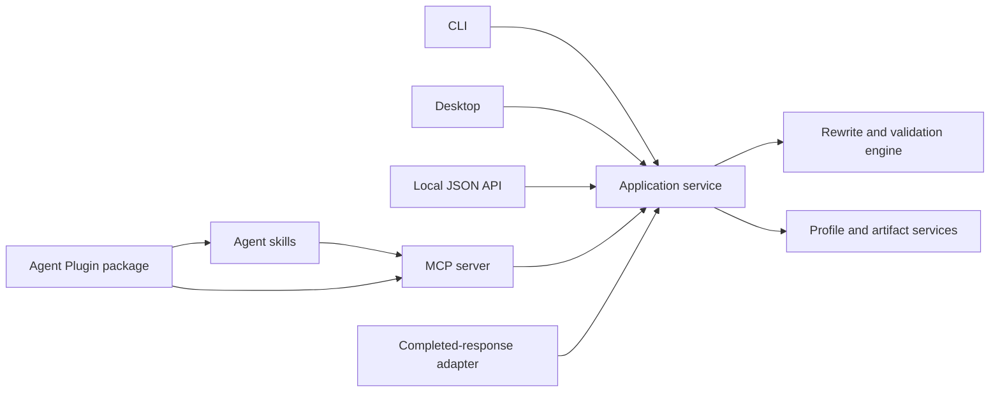

# Input and integration surfaces

## One application contract

CLI, desktop, local API, MCP, Agent Skills, Agent Plugins, and compatibility adapters
call the same application service. They share document adapters, qualification
checks, profile authority, rewrite outcomes, reason codes, resource limits,
cancellation, and rewrite records. No interface owns an alternative rewrite
implementation.



## CLI text entry

The primary non-interactive forms are:

```console
retonr rewrite draft.txt --profile personal
retonr rewrite - --profile personal < draft.txt
Get-Content -Raw draft.txt | retonr rewrite - --profile personal
retonr rewrite --clipboard --profile personal --copy-output
```

Path input, standard input, direct text, and clipboard input are mutually exclusive.
The CLI detects input, output, and diagnostic terminals independently. Standard input
is read until end of file without trimming, so pasted or piped text can contain many
lines, blank lines, and an absent final newline.

When `rewrite` is started on an interactive terminal without a path, a planned paste
buffer accepts bracketed paste as one operation and uses an explicit submit action.
It displays the byte and line count, does not execute pasted control sequences, and
offers a keyboard-accessible `:submit` fallback for terminals that cannot represent
the preferred shortcut. Escape cancels without learning or saving content.

`--clipboard` is an explicit plain-text operation. `--copy-output` writes only after
the final candidate and completed document pass validation. Clipboard contents never
enter default logs, traces, history, or profile evidence. Rich HTML and RTF clipboard
support require separate format adapters and are outside the initial contract.
Clipboard text has logical text semantics. At acquisition, Retonr maps CRLF and lone
CR to LF and records whether the logical text ends with a newline. Internal rewrite,
API, MCP, and conformance fixtures use that exact LF representation. Copy writes the
same LF logical text through the platform clipboard API; an operating system may
encode it in its native clipboard representation, and a subsequent Retonr read must
normalize back to the same LF text. Blank lines, tabs, and final-newline intent are
preserved, but clipboard content has no source-byte or rich-format claim.

## Files and output safety

The default writes rewritten content to standard output or a new requested path. It
does not overwrite an input file. `--in-place` requires a regular unambiguous file,
an explicit backup or recoverable replacement policy, same-directory staging, flush,
verification, and atomic replacement where the platform supports it.

Text output and diagnostics remain separate. Structured JSON is versioned and stable
for its declared range. Raw untrusted text is not rendered to a terminal unless the
safe rendering policy or documented double opt-in applies.

Directory input is a manifest transaction, not an implicit recursive mutation. A
dry run records canonical source identities, relative paths, formats, capabilities,
bounds, links, ignores, destination mapping, collisions, and atomicity before model
work. Output uses a separate root by default and cannot recursively include itself.

Long documents use source-linked high-level guidance and bounded unit requests.
Generated summaries never replace original source as the fidelity reference.
Document and folder reports are computed from source and output artifacts under
[the document transaction contract](document-transactions.md).

## Agent and MCP use

`retonr mcp serve --transport stdio` is the first agent path. The routine surface
provides only bounded rewrite and check tools. It accepts no arbitrary paths,
clipboard authority, profile mutation, model lifecycle, or administration. Complete
DOCX bytes join only after the byte-transfer and format contracts qualify.

One thin filesystem Agent Skill and the standard-input MCP entry ship in a pinned
Agent Plugins 1.0.0 working-draft package. The package contains root `plugin.json`,
`skills/`, and `mcp.json`; it contains no credentials, user data, model data,
absolute user paths, scripts, or duplicate product logic.

Format conformance does not establish installation trust, signatures, updates,
sandboxing, permissions, executable compatibility, or named-client behavior. Those
are separately versioned and tested. Routine installation never grants profile or
administration authority.

MCP returns one checked structured result with schema version, domain status, stable
reason, complete output where applicable, digests, and rewrite-record reference.
Candidate tokens and unvalidated fragments are never streamed.

## Local JSON API

`retonr serve` starts an authenticated loopback-only service after the CLI and MCP
standard-input contracts are proven. Its resources serve consumers that cannot
launch a local subprocess:

```text
GET  /v0/capabilities
GET  /v0/health
POST /v0/rewrites
POST /v0/checks
GET  /v0/profiles
POST /v0/profiles
GET  /v0/profiles/{id}
POST /v0/profiles/{id}/evidence
POST /v0/profiles/{id}/versions
POST /v0/learning
POST /v0/learning/{id}/responses
DELETE /v0/learning/{id}
POST /v0/operations
GET  /v0/operations/{id}
DELETE /v0/operations/{id}
```

Requests provide inline text or a bounded staged-document handle, media type,
language policy, profile version, mode, atomicity, deadline, and client operation ID
where required. API and MCP clients cannot supply an arbitrary local filesystem path.
Binary structured documents use an explicit bounded transfer form and are never
silently decoded as text.

Rewritten, unchanged, abstained, and unsupported are successful domain outcomes.
Malformed, unauthorized, oversized, and operational requests use distinct transport
errors. The service has no content logging by default and does not bind beyond
loopback in 1.0.

Synchronous calls return only a complete validated result. Long work uses an opaque
principal-scoped operation ID, authenticated status polling, and explicit
cancellation. Optional progress contains bounded phase, sequence, and completion
metadata only. Candidate tokens and unvalidated output fragments are never streamed.

## Optional HTTP agent transport

Qualified Streamable HTTP follows the explicit local service and standard-input MCP.
It uses the same loopback authority and application contract. A separately installed
privileged package may later expose profile operations through server-enforced scopes
and explicit handles. Prompt text, skill instructions, package metadata, and client
UI never authorize mutation.

## Compatibility adapter and gateway boundary

Retonr can sit after an LLM call as a local verified post-processor. Version 1.0 does
not act as a transparent provider gateway and does not store provider credentials or
make an upstream inference request.

The compatibility adapter accepts one complete, bounded, text-only assistant
response that matches a pinned schema. It rewrites only declared final text fields
and uses byte-range JSON string splicing so all other bytes can be verified. A
separate envelope records the local outcome and provenance.

The following are unsupported in the 1.0 adapter:

- Streaming deltas or incomplete responses
- Tool or function calls and arguments
- Structured model output or arbitrary JSON content
- Reasoning, refusal, citation, usage, logprob, or fingerprint events as rewrite targets
- Images, audio, video, files, embeddings, and multimodal blocks
- Unknown schema versions or oversized payloads

Malformed or oversized input returns no transformed payload. Unsupported valid
input, abstention, and verification failure return the exact original bytes with
different machine statuses. Final verification failure is an abstention with a stable
compatibility reason, not a successful `Failed` domain outcome. Operational failure
returns no transformed payload. No interface emits partly rewritten content.

A future outbound proxy would have to buffer the complete eligible response before
release. It could not preserve upstream token timing, token boundaries, logprobs,
usage accounting, IDs, or fingerprints, and therefore requires a separate product,
security, and compatibility decision.

## Framed streaming

Streaming input is first-class when the transport supplies a pinned frame schema and
an unambiguous completed text-unit boundary. Retonr parses incrementally with byte,
frame, queue, time, and spool limits; applies backpressure; preserves frame order;
and cancels on disconnect. Non-text frames are never interpreted as prose.

Rewriting remains atomic at the completed unit. The adapter buffers eligible text,
runs the owning format adapter and full validation cascade, then emits a validated
replacement transaction or the exact original unit. It never emits candidate tokens
or revises bytes already forwarded. A provider-specific event stream graduates only
after complete-response conformance and its own malformed, missing-final, duplicate,
reordered, slow-consumer, cancellation, drift, and non-target event fixtures pass.

## Conformance

One fixture corpus runs through CLI, API, MCP, skills, Agent Plugin launch, desktop
commands, and the compatibility adapter. For the same request and authorities, every
surface must agree on outcome, reason codes, output bytes, protected values, profile
version, model and validator identities, and redacted rewrite record.

Interface-specific presentation may differ. Product decisions may not.
