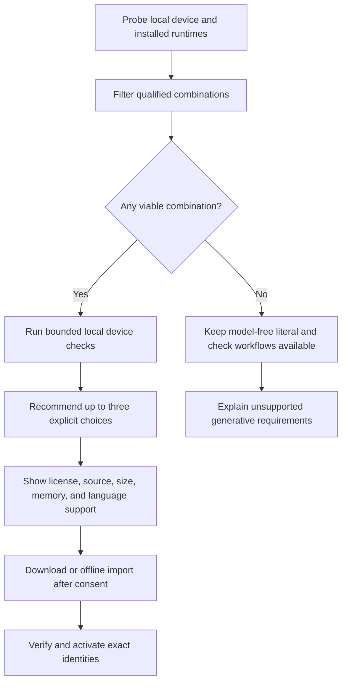

# Model and runtime support

## Product contract

Retonr must work on more than one developer workstation. Support is granted to an
exact model artifact, runtime build, parameter set, language, mode, format, operating
system, and hardware class only after that combination passes qualification.

A familiar model name, mutable tag, benchmark rank, or successful load is not a
qualification. If no installed combination meets the requested contract, Retonr
keeps the original and explains the smallest viable next step.

## Draft source and reconstruction runtime

The source of a draft and the model used to reconstruct it are independent. A user
may bring text produced by a closed assistant, an open model, an intern, a template,
or their own rough notes. Retonr does not need to contact that source again and does
not inherit its provider's runtime policy as product authority.

The default recommendation catalog favors qualified open-weight artifacts running
under user-controlled local runtimes. A closed remote service may remain useful to a
user as an upstream idea or draft source, but it is never required for core Retonr
operation and is never a silent reconstruction fallback.

Recommendations are made by capability rather than one universal leaderboard:

- Conservative prose reconstruction
- Personal-style adherence
- Editorial-lint reduction after fidelity acceptance
- Long-document planning and bounded unit rewriting
- Exact supported languages and mixed-language sets
- Structured-output reliability
- Semantic evaluation, kept independent where correlated errors require it
- Code-adjacent and technical prose behavior
- Context, memory, latency, and execution class on the user's device

Within a required capability envelope, selection is lexicographic: critical fidelity
first, accepted-set semantic risk second, useful transformation coverage third,
editorial quality and owner preference next, then resource cost. A larger model or
stronger general benchmark score cannot compensate for a failed product gate.

## Runtime strategy

The first two qualification targets are deliberately different:

1. An existing user-managed Ollama service through its native API.
2. A Retonr-managed, pinned `llama-server` sidecar using an exact local GGUF
   artifact.

Together they prove that the inference port supports both an attached runtime and a
fully controlled process. Retonr does not install, start, stop, update, or reconfigure
an external Ollama service implicitly.

A pinned `llama-server` sidecar is the planned portable fallback. It provides a
controlled CPU path and can graduate separately on Apple Metal, NVIDIA CUDA, AMD
HIP, Vulkan, and other backends supported by the exact qualified build. Retonr owns
the sidecar manifest, process limits, loopback transport, startup health check,
shutdown, executable identity, and log redaction. The core engine does not depend on
either runtime.

The sidecar uses an exact verified local model path, offline mode, loopback binding,
and explicit context, output, sampling, KV-cache, device, and offload settings. It
disables automatic fitting and artifact-selection shortcuts. Startup qualification
checks health, effective properties, exact tokenization, context, template, and
required schema capability before accepting work. A truncated response, unexpected
effective setting, device fallback, or runtime drift discards the complete batch.

Ollama receives the same effective-state treatment. Retonr selects an exact digest,
sets context explicitly, and verifies the running model, quantization, context, and
execution class before and after generation. CPU or hybrid fallback is accepted only
when that exact class was selected and qualified.

The portable path is not a bundle-everything strategy. Each release contains only
the native runtime variants that passed its platform and accelerator matrix. Unsafe
native code and backend-specific libraries remain outside the domain and validation
crates.

Generic OpenAI-compatible support is a transport dialect, not a runtime identity.
A familiar request and response shape does not establish the server build, artifact
bytes, tokenizer, template, effective parameters, execution class, logging policy,
or output policy. An endpoint remains experimental until a named identity and
acquisition driver can establish those facts.

LM Studio, vLLM, and MLX LM are 0.x candidates with different platform and trust
boundaries. Each receives an experimental native adapter and shared conformance
evidence before 0.9. Their presence in discovery does not imply qualification. The
exact matrix and primary-source analysis are recorded in
[Provider-neutral, user-controlled model runtimes](research/2026-08-12-provider-neutral-runtimes.md).

This is a rolling major-runtime ladder, not a closed vendor list. A new local runtime
enters as catalogued, receives a runtime-specific identity and acquisition driver,
and runs the shared conformance and qualification suites. It can become qualified
without changing engine logic. Popularity or OpenAI-compatible transport alone does
not waive exact artifact identity, effective-setting, offline, output-policy,
cancellation, and drift evidence.

Use `open source` only when the applicable license supports that description. Use
`open weight` for weights with source-available or field-of-use-restricted terms.
Runtime, model, tokenizer, conversion tool, accelerator, and redistribution licenses
remain separate decisions.

## Artifact production

Where redistribution and licensing permit it, Retonr controls the GGUF conversion
path used for qualification:

1. Fetch an official immutable upstream revision and verify its identity.
2. Convert with a pinned llama.cpp tool build and explicit parameters.
3. Produce named quantizations with pinned tools and record complete logs.
4. Record source, tool, tokenizer, template, license, and output digests.
5. Serve the same verified artifact through llama.cpp and import it into Ollama.
6. Compare lower-precision artifacts with Q8 or a higher-precision reference before
   granting support.

Community conversions and mutable runtime tags may be evaluated, but they cannot
stand in for controlled artifact provenance in a supported release.

## First-run selection

`retonr setup` uses the following flow:



The probe remains local and records no stable hardware identifier. It observes only
what selection needs, such as operating system, architecture, available memory and
disk, accessible accelerator backends, approximate accelerator memory where safely
available, and already installed runtime capabilities.

Recommendations are deterministic for the same catalog and probe result. The user
can override an initial recommendation, but activation still requires a passing
qualification for the requested contract. After activation, execution binds to that
exact tuple and does not run the recommendation resolver as a fallback.

## Hardware and model candidate classes

Public documentation uses measured classes rather than promising that one model is
best everywhere:

| Class | Intended path | Qualification focus |
| --- | --- | --- |
| Minimal | CPU or constrained integrated device | Lowest viable memory, bounded context, useful coverage, acceptable completion time |
| Compact | Common laptop, 8 GB to 12 GB accelerator, or Apple unified memory | Small strong artifact, sustained operation, useful interactive quality |
| Balanced | Modern laptop or modest accelerator | Default interactive quality, memory headroom, and longer context |
| Workstation | Larger local accelerator or unified-memory system | Higher style quality or coverage without lowering fidelity |

Exact memory, disk, context, and latency bounds are published from retained results.
They are not inferred from model parameter count. A workstation option never becomes
the universal default merely because it wins an aggregate quality score.

The August 2026 development tournament begins with the following candidate ladder.
These are research candidates, not defaults or support claims:

| Class | Initial artifact families | Comparison purpose |
| --- | --- | --- |
| Minimal | Current 2B to 4B Gemma 4, Mistral 3, and cross-family instruction artifacts | Find the lowest resource floor that preserves critical facts and structure. |
| Compact | Mistral 3 8B plus a current cross-family control | Test common consumer devices and CPU-tolerant workflows. |
| Balanced | Current 12B to 20B artifacts, including a cross-family control | Find the smallest strong default that passes clean-control and bounded-edit tests. |
| Workstation | Gemma 4 26B and Qwen 3.6 27B plus a cross-family control | Measure whether more capacity improves coverage or personal style without increasing semantic risk. |

The official candidate sources are [Gemma 4](https://deepmind.google/models/gemma/gemma-4/),
[Mistral 3](https://mistral.ai/news/mistral-3/), and
[Qwen 3.6](https://huggingface.co/Qwen/Qwen3.6-27B). Each exact artifact still needs
license review, immutable source identity, conversion or import provenance, runtime
identity, and retained qualification results. The catalog may add or replace a
candidate when a newer generally available artifact is materially stronger.

Models below the qualified resource floor may be used for runtime smoke tests, but
never as an automatic rewriting fallback. If every smaller candidate misses a
critical fidelity or clean-control requirement, Retonr raises the minimum supported
hardware instead of lowering the quality bar. Slow generation remains valid when the
declared workflow completes reliably within its documented operating envelope.

## Model commands

The planned headless lifecycle is:

```console
retonr model list
retonr model recommend --language auto --mode balanced --format text
retonr model inspect <artifact>
retonr model download <artifact>
retonr model import <path>
retonr model verify <artifact>
retonr model eval <artifact> --suite device
retonr model qualify <artifact> --suite qualification
retonr model activate <artifact> --role generation
retonr model deactivate --role generation
retonr model remove <artifact>
```

`recommend`, `inspect`, and `eval` do not activate or remove anything. Download is
explicit, resumable, checksummed, cancellable, and license gated. Activation is an
atomic pointer change from one verified and currently qualified artifact to another.

## Evaluation levels

The command vocabulary separates a useful local comparison from project release
qualification:

| Suite | Purpose | Release authority |
| --- | --- | --- |
| `smoke` | Load, schema, limits, cancellation, deterministic fake parity | None |
| `device` | Short local fidelity, coverage, latency, and memory check | Confirms this device remains within an existing qualification envelope |
| `compare` | Compare installed candidates on one frozen public fixture set | Recommendation evidence only |
| `qualification` | Locked multilingual, fidelity, style, resource, and platform matrix | May create a signed qualification record |
| `red-team` | Adversarial discovery and minimized regressions | Invalidates or narrows support; never grants it alone |

Every comparison uses the same eligible cases, planner, validator, profile evidence,
parameters, and stopping rules. Results report accepted-set semantic error,
transformation coverage, owner-style evidence where available, peak memory, latency,
load time, disk, and cancellation. Tokens per second alone cannot select a model.

Quantization qualification predeclares a non-inferiority margin against Q8 or a
higher-precision reference. Cross-runtime and cross-backend differential suites
compare critical accept, abstain, structured-output, and fidelity decisions. CPU,
Metal, CUDA, HIP, Vulkan, and hybrid execution classes are independent support
claims, even when they load the same model bytes.

Generator and semantic evaluator roles are qualified independently. The same model
may fill both only when correlated-error testing supports that decision.

## Selection and fallback rules

- Filter by privacy mode, runtime, language, format, strategy, context, and resource
  envelope before ranking.
- During initial recommendation only, prefer the smallest qualified choice that
  meets the requested quality contract.
- During execution, never switch runtime, model family, artifact, quantization,
  template, context, strategy, language policy, hardware backend, offload class,
  execution class, remote policy, or fidelity threshold. Any tuple change requires
  explicit user selection and a separate active qualified binding.
- Never download a model because a document was opened or a request arrived.
- Recheck artifact and runtime identity before and after work. Drift discards the
  complete candidate batch and invalidates the active binding.
- Keep model-free checking and literal transformations usable when generation is
  unavailable.
- Preserve the original on out-of-memory, timeout, cancellation, device loss, model
  crash, malformed output, or failed validation.

## Context and long documents

A runtime's advertised context size is a capacity input, not a long-document support
claim. Retonr records the artifact-declared context, observed effective runtime
context, qualified context envelope, and conservative per-request source budget as
separate values.

The source budget reserves space for templates, instructions, output, protected
facts, format state, document guidance, and a safety margin using the exact qualified
tokenizer. Runtime truncation, context shifting, automatic summarization, or overflow
recovery cannot silently change admitted source.

Large inputs use the hierarchical pipeline in
[Non-destructive document and folder transactions](document-transactions.md). The
model receives exact target units, bounded read-only context, and cited global
guidance. Beginning, middle, end, boundary, repeated-term, and cross-reference
fixtures qualify usable context at multiple lengths. A full-document one-shot prompt
may be a benchmark but is never an implicit fallback.

## Output-policy and source-marking boundary

- Retonr never enables a known statistical watermark, watermark generation setting,
  output signature processor, or opaque postprocessor in a qualified path.
- Qualification inventories configured samplers, logits processors, templates,
  system prompts, adapters, renderers, parsers, and postprocessors.
- A required undisclosed output watermark makes a runtime or model ineligible for
  the generation role.
- Review and controlled tests support a bounded claim about the configured stack.
  They cannot prove that model weights contain no learnable statistical signature or
  predict every future detector.
- Detector and source-signal observations remain research diagnostics. They do not
  rank live candidates, weaken fidelity, or establish human authorship.

The accurate release statement is that a qualified Retonr stack does not
intentionally add a known provider watermark in its reviewed runtime, configuration,
or postprocessing path. The project does not use the universal label
`watermark-free`.

Artifact, runtime, carrier, detector, and derivative evidence follows the separate
[provenance and marking contract](provenance.md). A negative local runtime review
cannot inspect a remote provider's logs, secret keys, undisclosed serving stack, or
future detector.

The exact audit uses cumulative evidence levels from declared through independently
reproduced. Only a fully identified controlled local path with outbound denial,
resolved extension points, boundary captures, differential fixtures, and a
reproducible bundle can receive `no_known_intentional_marker_enabled`. An opaque
semantic or response component prevents that status. See
[Local watermark assurance for user-controlled runtimes](research/2026-08-12-local-watermark-assurance.md).

## Multilingual qualification

Model support is recorded per BCP 47 language or declared mixed-language set. One
language passing does not qualify another. The matrix also records locale-sensitive
numbers and dates, script, directionality, tokenizer behavior, and evaluation size.

The 1.0 minimum product gate requires qualified rewriting for English, at least one
additional Latin-script language, and at least one non-Latin-script language. Exact
launch languages are selected only after authorized evaluation data, owner research,
runtime support, and quality evidence are available. Unsupported or low-confidence
units are preserved or cause document abstention according to atomicity policy.

## Primary references

- [Ollama API](https://docs.ollama.com/api/introduction)
- [Ollama hardware support](https://docs.ollama.com/gpu)
- [llama.cpp project](https://github.com/ggml-org/llama.cpp)
- [llama.cpp server](https://github.com/ggml-org/llama.cpp/tree/master/tools/server)
- [llama.cpp build backends](https://github.com/ggml-org/llama.cpp/blob/master/docs/build.md)
- [Ollama context length](https://docs.ollama.com/context-length)
- [Ollama running-model state](https://docs.ollama.com/api/ps)
- [Ollama model import](https://docs.ollama.com/import)
- [Qwen3.5-9B model card](https://huggingface.co/Qwen/Qwen3.5-9B)
