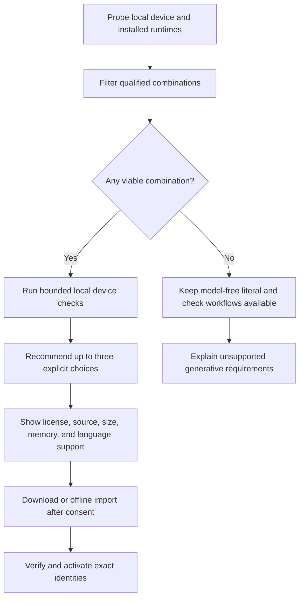

# Model and runtime support

## Product contract

Retonr must work on more than one developer workstation. Support is granted to an
exact model artifact, runtime build, parameter set, language, mode, format, operating
system, and hardware class only after that combination passes qualification.

A familiar model name, mutable tag, benchmark rank, or successful load is not a
qualification. If no installed combination meets the requested contract, Retonr
keeps the original and explains the smallest viable next step.

## Runtime strategy

The first adapter uses an existing local Ollama service because it provides a clear
development and power-user path. Retonr does not install, start, stop, or reconfigure
Ollama implicitly.

A pinned `llama-server` sidecar is the planned portable fallback. It provides a
controlled CPU path and can graduate separately on Apple Metal, NVIDIA CUDA, AMD
HIP, Vulkan, and other backends supported by the exact qualified build. Retonr owns
the sidecar manifest, process limits, loopback transport, startup health check,
shutdown, executable identity, and log redaction. The core engine does not depend on
either runtime.

The sidecar uses an exact verified local model path, offline mode, loopback binding,
and explicit context, output, sampling, KV-cache, device, and offload settings. It
disables automatic fitting and artifact-selection shortcuts. Startup qualification
checks health, effective properties, exact tokenization, context, template, and
required schema capability before accepting work. A truncated response, unexpected
effective setting, device fallback, or runtime drift discards the complete batch.

Ollama receives the same effective-state treatment. Retonr selects an exact digest,
sets context explicitly, and verifies the running model, quantization, context, and
execution class before and after generation. CPU or hybrid fallback is accepted only
when that exact class was selected and qualified.

The portable path is not a bundle-everything strategy. Each release contains only
the native runtime variants that passed its platform and accelerator matrix. Unsafe
native code and backend-specific libraries remain outside the domain and validation
crates.

## Artifact production

Where redistribution and licensing permit it, Retonr controls the GGUF conversion
path used for qualification:

1. Fetch an official immutable upstream revision and verify its identity.
2. Convert with a pinned llama.cpp tool build and explicit parameters.
3. Produce named quantizations with pinned tools and record complete logs.
4. Record source, tool, tokenizer, template, license, and output digests.
5. Serve the same verified artifact through llama.cpp and import it into Ollama.
6. Compare lower-precision artifacts with Q8 or a higher-precision reference before
   granting support.

Community conversions and mutable runtime tags may be evaluated, but they cannot
stand in for controlled artifact provenance in a supported release.

## First-run selection

`retonr setup` uses the following flow:



The probe remains local and records no stable hardware identifier. It observes only
what selection needs, such as operating system, architecture, available memory and
disk, accessible accelerator backends, approximate accelerator memory where safely
available, and already installed runtime capabilities.

Recommendations are deterministic for the same catalog and probe result. The user
can override an initial recommendation, but activation still requires a passing
qualification for the requested contract. After activation, execution binds to that
exact tuple and does not run the recommendation resolver as a fallback.

## Hardware classes

Public documentation uses measured classes rather than promising that one model is
best everywhere:

| Class | Intended path | Qualification focus |
| --- | --- | --- |
| Compact | CPU or low-memory integrated device | Small artifact, bounded context, useful coverage, acceptable wait time |
| Balanced | Modern laptop or modest accelerator | Default interactive quality, memory headroom, sustained thermals |
| Workstation | Larger local accelerator | Higher style quality or coverage without lowering fidelity |

Exact memory, disk, context, and latency bounds are published from retained results.
They are not inferred from model parameter count. A workstation option never becomes
the universal default merely because it wins an aggregate quality score.

The initial candidate tournament includes a 4B-class resource floor, a 9B-class
balanced option, a cross-family control in the same resource class, and a larger
quality tier. Qwen3.5 artifacts are candidates rather than defaults. Models smaller
than the qualified resource floor may be used for runtime smoke tests, but never as
an automatic rewriting fallback. A compact candidate that misses a critical
fidelity gate raises the minimum supported hardware instead of lowering the bar.

## Model commands

The planned headless lifecycle is:

```console
retonr model list
retonr model recommend --language auto --mode balanced --format text
retonr model inspect <artifact>
retonr model download <artifact>
retonr model import <path>
retonr model verify <artifact>
retonr model eval <artifact> --suite device
retonr model qualify <artifact> --suite qualification
retonr model activate <artifact> --role generation
retonr model deactivate --role generation
retonr model remove <artifact>
```

`recommend`, `inspect`, and `eval` do not activate or remove anything. Download is
explicit, resumable, checksummed, cancellable, and license gated. Activation is an
atomic pointer change from one verified and currently qualified artifact to another.

## Evaluation levels

The command vocabulary separates a useful local comparison from project release
qualification:

| Suite | Purpose | Release authority |
| --- | --- | --- |
| `smoke` | Load, schema, limits, cancellation, deterministic fake parity | None |
| `device` | Short local fidelity, coverage, latency, and memory check | Confirms this device remains within an existing qualification envelope |
| `compare` | Compare installed candidates on one frozen public fixture set | Recommendation evidence only |
| `qualification` | Locked multilingual, fidelity, style, resource, and platform matrix | May create a signed qualification record |
| `red-team` | Adversarial discovery and minimized regressions | Invalidates or narrows support; never grants it alone |

Every comparison uses the same eligible cases, planner, validator, profile evidence,
parameters, and stopping rules. Results report accepted-set semantic error,
transformation coverage, owner-style evidence where available, peak memory, latency,
load time, disk, and cancellation. Tokens per second alone cannot select a model.

Quantization qualification predeclares a non-inferiority margin against Q8 or a
higher-precision reference. Cross-runtime and cross-backend differential suites
compare critical accept, abstain, structured-output, and fidelity decisions. CPU,
Metal, CUDA, HIP, Vulkan, and hybrid execution classes are independent support
claims, even when they load the same model bytes.

Generator and semantic evaluator roles are qualified independently. The same model
may fill both only when correlated-error testing supports that decision.

## Selection and fallback rules

- Filter by privacy mode, runtime, language, format, strategy, context, and resource
  envelope before ranking.
- During initial recommendation only, prefer the smallest qualified choice that
  meets the requested quality contract.
- During execution, never switch runtime, model family, artifact, quantization,
  template, context, strategy, language policy, hardware backend, offload class,
  execution class, remote policy, or fidelity threshold. Any tuple change requires
  explicit user selection and a separate active qualified binding.
- Never download a model because a document was opened or a request arrived.
- Recheck artifact and runtime identity before and after work. Drift discards the
  complete candidate batch and invalidates the active binding.
- Keep model-free checking and literal transformations usable when generation is
  unavailable.
- Preserve the original on out-of-memory, timeout, cancellation, device loss, model
  crash, malformed output, or failed validation.

## Multilingual qualification

Model support is recorded per BCP 47 language or declared mixed-language set. One
language passing does not qualify another. The matrix also records locale-sensitive
numbers and dates, script, directionality, tokenizer behavior, and evaluation size.

The 1.0 minimum product gate requires qualified rewriting for English, at least one
additional Latin-script language, and at least one non-Latin-script language. Exact
launch languages are selected only after authorized evaluation data, owner research,
runtime support, and quality evidence are available. Unsupported or low-confidence
units are preserved or cause document abstention according to atomicity policy.

## Primary references

- [Ollama API](https://docs.ollama.com/api/introduction)
- [Ollama hardware support](https://docs.ollama.com/gpu)
- [llama.cpp project](https://github.com/ggml-org/llama.cpp)
- [llama.cpp server](https://github.com/ggml-org/llama.cpp/tree/master/tools/server)
- [llama.cpp build backends](https://github.com/ggml-org/llama.cpp/blob/master/docs/build.md)
- [Ollama context length](https://docs.ollama.com/context-length)
- [Ollama running-model state](https://docs.ollama.com/api/ps)
- [Ollama model import](https://docs.ollama.com/import)
- [Qwen3.5-9B model card](https://huggingface.co/Qwen/Qwen3.5-9B)
