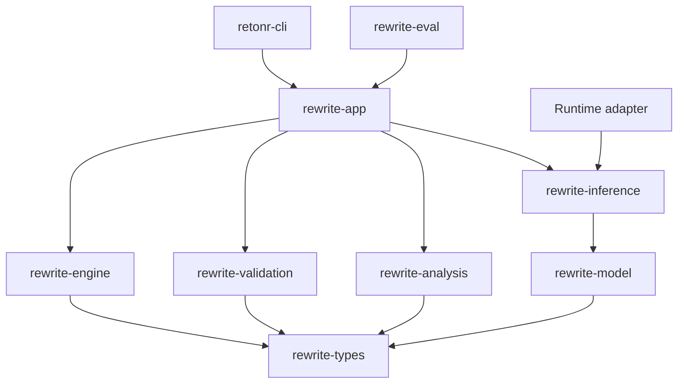

# 0.2 grounded engine and CLI execution plan

## Status and outcome

Status: active. Technical 0.1 implementation evidence is complete. The remaining
ADRs are revisable working decisions, not blockers to reversible 0.x implementation.

The phase outcome is one qualified local generation path for UTF-8 plain text, used
through a complete cross-platform CLI. The model proposes candidates. The existing
engine remains the acceptance authority and returns the original input whenever the
configured policy cannot establish an acceptable result.

This phase proves the architecture with a real backend. It does not freeze the 1.0
API, complete style profiles, support Markdown or DOCX, or claim unrestricted
semantic equivalence.

Milestone 0.1 technical evidence is complete. 0.1 has not been tagged as a
milestone release. INV-Q04 applies from the first completed 0.2 closeout.

## Remaining work ledger

Current-state is the implementation authority. This table is the remaining 0.2
queue. Do not restart a done package.

| Package | Status | Remaining $0 work |
| --- | --- | --- |
| 1. Baseline harness | Done as a library, offline CLI, and fake-conformance attach | No started runtime |
| 2. Manifests and lifecycle | Done for offline lifecycle plus inert runtime/model package import and persistence | No downloads or authority |
| 3. Inference contracts | Done with claim schema and neutral judge-attempt output | Pair extraction and judge parsing exist; neither has engine authority |
| 4. Fake HTTP backend | Done for Ollama | Shared conformance server is optional |
| 5. Native Ollama discovery | Partial with read-only, attached, retained-connection, package, cloud-disable, Linux managed-isolation, inert managed preflight and runtime-build binding, static v0.32.15 model binding, retained-session judge executor, and runtime-reported residency receipt | Join direct effective-state and managed execution evidence |
| 6. Typed invariants and claims | Partial | Independent calibration runner records comparison; it is not proof |
| 7. Grounded strategy | Done as a library | CLI `rewrite` attaches fake conformance |
| 8. Semantic evaluator port | Partial | Keep literal mode as acceptance authority |
| 9. Validation cascade | Partial | Calibration runner joins the informational shadow gate; claims are not hard gates |
| 10. CLI vertical slice | Partial | Completions, man pages, source `inspect` including bounded recursive directory discovery, `--in-place` for one regular file, `rewrite` `--diff`/`--dry-run`/`--trace`, directory rewrite dry-run with `--output-dir`, short flags, `model list`, `model inspect`, optional fitr `device-evidence`, and actionable `doctor` recovery exist; fake conformance attaches; no directory mutation; no started runtime |
| 11. Model qualification | Not started | Review one runtime package, keep the cloud allowlist empty until then, and qualify only after receipts |
| 12. Package and evidence | Partial | Model-backed screenshots after completion evidence |
| 13. Bounded CPU concurrency | Not started | Independent hashing, inspect, and deterministic-suite cases under an explicit worker cap; join by stable ID. Do not parallelize retained sessions, managed isolation, exclusive lifecycle, or document-atomic short-circuit. Do not oversubscribe cores while a runtime is generating. |

Next implementation order:

1. Preserve the completed lifecycle, schema-6 persistence, `import-set` CLI,
   inventory DTOs, leases, migration, recovery, and cancellation evidence.
2. Preserve the completed extractor manifest, pair-extraction service,
   informational shadow join, and independent claim-shadow calibration. They have
   no eligibility or activation authority. Ollama still admits only the candidate
   contract.
3. Retain `rewrite-eval --ollama-preflight` as a versioned, read-only observation
   and frozen-verification tool. It rechecks runtime, inventory, and residency
   stability; hashes license, template, and detailed metadata; performs no
   generation; and cannot qualify.
4. Retain the attached-process witness on Windows and Linux and deterministic macOS
   refusal. It observes listener ownership, process incarnation, and executable bytes
   before and after preflight, but remains `response_bound: false` and unqualified.
5. Retain `rewrite-eval --ollama-bound-preflight` as a separate versioned surface.
   It sends every read-only request over one direct retained HTTP/1 connection and
   checks exact reverse established-row attribution before traffic and after every
   fully drained response. It fails closed on reconnect, drift, ambiguity,
   incomplete required visibility, or an unsupported platform. It remains
   unqualified and does not prove exclusive socket ownership or handler execution.
6. Retain Linux bounded `NETLINK_SOCK_DIAG` listener dumps and exact retained-cookie
   connection queries. Keep attached Windows and Linux evidence observation-only,
   with deterministic macOS refusal.
7. Retain complete runtime-package, model-package, native-load, static package-lease,
   and schema-6 persistence contracts. The offline installed-Ollama reconstruction
   and managed import produce only inert model-package evidence. Retain the exact
   v0.32.15 static import-to-inventory and details binding with model loaded, model
   used, handler, effective identity, and qualification false. The binding must
   consume the opaque, nonserializable, single-use receipt issued by the exact
   preflight runner for its plan and report.
8. Retain Linux managed prelaunch isolation, retained-handle launch, loopback-only
   namespaces, the target-inherited seccomp `socket()` allowlist for only `AF_INET`
   and `AF_INET6`, denial of every other socket family and `io_uring_setup`, seccomp
   mode 2 reobservation, process-tree teardown, namespace-local transport, process
   attestation, and native-load observation when host policy permits. Windows managed
   isolation and exact native-load binding remain unsupported. macOS remains
   unsupported.
9. Retain the implemented Linux managed preflight that binds the retained runtime
   package, isolation, process, connection, provider declaration, read-only API
   observation, and native-load evidence. It reobserves live boundaries, closes the
   process tree on every outcome, never falls back to attached mode, and remains inert.
   Retain its opt-in redacted build binding, which constructs only a package-declared
   typed `RuntimeBuildIdentity`. Only the exact package entrypoint is joined to live
   process and load evidence; other package semantics are not independently
   live-observed. Cleanup is complete before return; no effective state, model use,
   handler execution, or qualification is proven.
10. Retain the provider-neutral judge output contract and typed local-judge executor.
    It runs hard gates first and both blinded orders over one already-preflighted
    retained stream. Its separate nonserializable receipt binds exact request and
    response evidence but proves no managed isolation, handler, model load or use,
    effective identity, candidate generation, semantics, or qualification. The
    serializable scorecard remains caller-declared and triage-only.
    Every retained-session completion rejects UTF-8 input above the absolute 4 MiB
    ceiling before wire serialization or completion traffic.
    Retain the separate opt-in v0.32.15 nine-response completion profile, whose receipt
    proves only two equal runtime-reported post-generation residency observations on
    the same transport, not model use or resident-page identity.
11. Freeze and review one complete Ollama runtime package, then and only then admit its
    exact version and package identity to the currently empty production cloud-disable
    allowlist. Extend the managed operation to retain the process through generation.
    Join its runtime build, model-package lease, static binding, runtime-reported
    residency, and judge receipt while directly observing the generation-bound
    provider, effective output configuration, platform and driver, compute placement,
    effective context, and retained live runtime. Then add a distinct
    candidate-generation receipt. Provider configuration never substitutes for OS
    network isolation.
12. Project the existing eight-case smoke and 39-case editorial corpus into versioned
    local generation plans with exact request, resource, cancellation, residency,
    and result contracts. The checked-in development foundation contains 49
    deterministic fidelity and structure cases plus 120 synthetic editorial cases,
    169 total.
    The previous Gemma 4, Qwen3.6, and Ministral observations have expired. Do not
    reacquire a model without separate approval.
13. Run smoke, locked evaluation, repeatability, and supported-platform qualification
    in that order. The existing hard gates remain the only machine acceptance
    authority, and human adjudication remains the release authority.
14. Finish remaining CLI recovery and packaging evidence, then capture model-backed
    screenshots only from the complete passing release path.
15. After the concurrency envelope is specified, add a bounded CPU worker pool for
    independent frozen-file hashing and deterministic evaluation cases. Join
    results by stable identifier. This may run as reversible 0.x work. It must not
    jump runtime-package review, managed execution evidence, or change serial trust
    boundaries.

`rewrite-validation` and `rewrite-analysis` in the intended-boundary diagram are
planned modules, not crates. Validation currently lives in `rewrite-engine` and
`rewrite-types`.

## Entry closure

The repository now has the deterministic transaction, candidate-check CLI,
hard-negative and positive fixtures, four baseline runner contracts, proposed data
and user-research governance, cross-platform continuous integration, and retained
adapter conformance. Exact-main quality run `31659222447` passed for closure revision
`40643c0`. The four-pass refinement has no undispositioned critical defect, so 0.2
work is active. ADRs 0001 and 0003 through 0005 remain proposed and may be refined as
implementation evidence develops. Data and user-research governance remains
proposed, and no non-synthetic collection is authorized.

## Required decisions

Develop and refine working decision records for:

- Model manifest and artifact identity schema
- Model acquisition transport, trusted-source, proxy, redirect, resume, staging, and
  activation policy
- Backend capability and compatibility policy
- Request bounds, retry classes, and cancellation contract
- Semantic evaluator independence and first calibration method
- Trace equality identifier, including whether to use an installation-keyed digest
- CLI machine schema, exit status categories, and raw terminal output policy
- Qualification hardware tiers and resource measurement procedure
- Local hardware-probe privacy fields, deterministic recommendation policy, and
  bounded device-evaluation suite

No mutable model tag, undocumented runtime default, or unversioned prompt becomes a
qualified dependency.

## Intended component boundaries

`rewrite-eval` depends on public application ports and qualification records. Backend
adapters depend on inference contracts, not engine internals.

Names remain namespace-neutral where practical. A crate is added only when it owns a
cohesive responsibility and enforces a useful dependency boundary. Small contracts
may remain modules until their behavior justifies a crate.

## Ordered work packages

### 1. Complete the baseline harness

- Define one versioned input and result contract shared by every baseline.
- Run the no-rewrite baseline without a model.
- Run direct-prompt and style-description baselines through the same backend port as
  the product path.
- Make retrieved-example input explicit so profile logic is not smuggled into the
  runner.
- Record candidate, validator, runtime, artifact, prompt, and fixture identities.
- Emit aggregate metrics without raw source text by default.
- Reject duplicate case IDs, unknown categories, malformed metrics, and oversized
  suites before execution.
- Expose the no-rewrite baseline through `rewrite-eval --baseline`. Generative
  kinds parse as definitions and fail closed without a selected local backend.

Verification includes deterministic fake-backend results, baseline mismatch tests,
redaction tests, and schema round trips.

### 2. Define model manifests and activation

The manifest includes at least:

- Schema version and immutable artifact ID
- Upstream source and immutable source revision where available
- Artifact digest, byte size, architecture, quantization, and tokenizer identity
- Upstream license identifier, license text reference, and license-text digest
- Intrinsic format and family metadata
- Upstream-declared role, context, language, and capability metadata, explicitly
  marked untrusted until qualification

The separate qualification record includes tested runtime versions, operating
systems, hardware tiers, effective context and source envelopes, supported roles,
languages and capabilities, prompt or chat-template digest, reasoning policy,
request policy, generation parameters, license and redistribution decision,
thresholds, results, and invalidation inputs.

Activation verifies the manifest, checksum, size, role, runtime compatibility, and
license decision. Immutable artifact facts remain in the manifest. Qualification
records, activation decisions, and the active-artifact pointer are separate immutable
records or explicit local state. A rewrite never downloads or activates a model
implicitly.

The durable artifact repository owns separate installed-artifact, qualification,
invalidation, activation-decision, and active-pointer records. Activation runs in one
transaction that verifies the installed digest and a currently valid qualification,
appends the activation decision, and changes the role's active pointer. Startup and
recovery revalidate that binding before use. Removal cannot orphan an active or
in-use pointer, and interrupted activation leaves either the old valid binding or the
new valid binding, never a partial state.

The target application service will own a headless artifact lifecycle: discover,
explicitly download where the backend supports it, offline import, verify, qualify,
activate, deactivate, and remove. Each action defines the applicable typed progress,
cancellation, checksum, license, cleanup, and in-use semantics. Later embedding and
speech roles reuse this lifecycle rather than depending on desktop code.

The first implemented acquisition slice is intentionally narrower than the complete
lifecycle: one caller-selected regular file plus an exact manifest, copied with
bounded memory and an explicit byte ceiling into configurable application-owned
local storage. It rejects the
final symlink or reparse entry and non-regular sources, verifies exact size and
SHA-256 while staging, never replaces conflicting final bytes, never mutates the
source, never activates implicitly, and atomically registers manifest and installed
state only after the file commits. Cancellation and progress are content-free.
Reserved partial files are recovered under an exclusive import lock. An interrupted
state write may leave an unregistered content-addressed file for the selected
reconciliation operation; it cannot leave registered state pointing to an
uncommitted file.

The application also implements exact folder import for one canonical multi-file
artifact-set manifest. It checks the complete local source tree, copies and rehashes
all members under explicit limits, synchronizes and publishes one content-derived
set root without replacement, and then records only inert structural installation
state. Cancellation before publication cleans only the exact current-operation
ledger. Pre-existing staging roots are not descended into, and unexpected
current-operation entries are retained rather than recursively deleted. A
postpublication state failure leaves a retryable orphan. Offline CLI exposure is
implemented as `model import-set`. Read-only set inventory is implemented as
`model inventory-set`. Selected set reconciliation is implemented as
`model reconcile-set`. Selected set removal is implemented as
`model remove-set` with exact `recover-set-removal`. Downloads, qualification,
activation, and model execution remain later work. Runtime attestation exists as a
separate inert development boundary and is not triggered by artifact import.

An additional offline application boundary reconstructs the strict admitted Ollama
manifest-v2 and GGUF-v3 shape from one pinned installed-model root and logical model
reference. It derives all manifest and blob paths, copies only retained source
objects into application-owned staging, publishes one canonical six-member set, and
persists and reads back its model-package manifest under schema 6. This API has no
CLI surface and its result is inert: it does not qualify, activate, lease, load, or
execute the model. Complete runtime-package and model-package contracts, retained
package leases, and Linux native-load observation are also implemented without
granting authority.

A repository-owned artifact-set lease is implemented on top of that import. It
pins the data directory and state database in shared mode, takes the shared storage
lifecycle lock, recomputes the content-derived set-root name from the registered
manifest, and reverifies the complete tree shape, member sizes, single links, and
member digests under caller-owned ceilings and cancellation. It rereads durable
manifest and installation state after verification and then retains the repository
guard, storage root, set root, and shared lock for the lease lifetime, so every
exclusive repository operation fails while a lease is live. A completed set
removal leaves the next exact reimport on a later generation so an old retry
cannot delete the reinstall.

The first read-only inventory slice is also implemented behind the application
boundary. It opens only existing storage under the shared lifecycle lock, reads one
bounded manifest, installation, and active-binding snapshot, and freezes exact raw
artifact directory entries. Eligible direct files are verified through bounded
streaming SHA-256 with exact lowercase name, no-follow open, stable metadata, total
hash budget, cancellation, and final directory recheck rules. The result
distinguishes registered byte status, manifest-only state, verified orphan
candidates, content-address conflicts, oversized files, and aggregate
unexpected-entry counts. Registered and pending installation state is projected to
application-owned identity and generation keys; persistence records and storage
keys do not cross the repository or CLI contract. Inventory never creates, cleans,
repairs, or removes anything. A later repair or removal operation must take the
exclusive lock and reverify its target.

The first read-only set-inventory slice is also implemented behind the application
boundary and exposed as `model inventory-set`. It opens only existing storage under
the shared lifecycle lock, reads one bounded set-manifest and installation
snapshot, and freezes exact `sets` directory names. Registered or
manifest-associated canonical set roots are planned from the durable manifest,
enumerated as a whole tree, and hashed member-by-member under caller-owned member,
tree, and aggregate byte ceilings. The result distinguishes registered tree status,
manifest-only set state, verified orphan set roots, tree conflicts, oversized
planned trees, and aggregate unexpected set-root counts. Canonical names without a
matching durable manifest are counted and not descended into. Persistence records
and storage keys do not cross the repository or CLI contract. Set inventory never
creates, cleans, repairs, or removes anything and does not grant a lease, qualify a
package, or authorize a role.

The selected set-reconciliation slice accepts one exact set manifest and targets
only its content-derived canonical set-root name. It takes the lifecycle lock
exclusively and does not consume a prior inventory report as authority. It requires
the current managed set root, enumerates the planned tree, verifies member sizes,
single links, and SHA-256, and rechecks the held storage boundary after
verification. It then atomically inserts any missing exact set-manifest and
installation records or confirms that both existing records match. It does not copy,
replace, repair, delete, qualify, activate, or access the network. Exact
already-registered state is idempotent; every mismatch or concurrent change fails
without changing durable state.

The selected reconciliation slice accepts one exact manifest and targets only its
content-derived canonical artifact name. It takes the lifecycle lock exclusively
and does not consume a prior inventory report as authority. It requires current
direct regular bytes with one filesystem name, enforces caller-owned byte and entry
ceilings, verifies exact size and SHA-256, and rechecks the file and held storage
boundaries after the final progress callback. It then atomically inserts any missing
exact manifest and installation records or confirms that both existing records
match. It does not copy, replace, repair, delete, qualify, activate, or access the
network. Exact already-registered state is idempotent; every mismatch or concurrent
change fails without changing durable state.

The inactive-removal slice accepts one exact store-issued installation generation,
not a path, tag, or stale inventory record. Under the exclusive lifecycle lock it
reverifies the canonical direct single-name bytes, rejects active bindings, and
atomically journals preparation while revoking installed-state authority. It then
deletes the exact verified entry, synchronizes the artifact directory, revalidates
the held layout, and completes the journal. Exact prepared operations resume without
callbacks or cancellation. Monotonic installation generations make old retries
harmless after a deliberate reinstall. Runtime artifact use holds a verified shared
lease for its entire lifetime, so removal cannot race a managed file already in use.
This is lifecycle removal, not secure erasure of external copies, caches, backups,
runtime memory, or provider records. The current Unix primitive is descriptor
relative and serialized across cooperating Retonr processes; identity-bound
deletion under arbitrary same-user namespace mutation remains a separate
qualification item. Windows uses a reviewed safe delete-by-handle wrapper.
Both durable journal transitions require a live non-cloneable exclusive-lock
capability. The application creates it only from the exact lifecycle-lock handle
opened through the pinned selected repository boundary and retains that lock through
verification, deletion, synchronization, layout rechecks, and state completion.

The first repository CLI slice binds these services behind one explicit
`--data-dir`. It exposes only offline single-file `import`, exact folder
`import-set`, read-only `inventory`, read-only `inventory-set`,
read-only `pending-operations`, explicit backup-backed `migrate`, selected
`reconcile`, selected `reconcile-set`, inactive `remove`, exact
`recover-removal`, inactive `remove-set`, and exact
`recover-set-removal`. It uses a
versioned, redacted JSON envelope by default, deterministic text on request, and
stable exit categories. Inventory findings can become a policy exit without hiding
the complete report. The facade pins the repository and exact single-link state
database under an outer lifecycle lock; ordinary commands neither create an ambient
default location nor apply a schema migration. The confirmed migration operation is
existing-only, holds both exclusive lifecycle locks, retains a verified
repository-owned SQLite backup, and then applies only a supported atomic forward
migration. The product ceilings are 256 GiB per
artifact or set member, 4,096 durable or storage entries, 4,096 set members, 8,192
set-tree entries, 512 GiB aggregate inventory or set-import verification,
1 GiB per migration-state backup, and 1 MiB per manifest. This slice does not
download, recommend, qualify, activate,
deactivate, or run a model. Single-file inventory, reconciliation, and removal do
not inspect or mutate managed artifact sets. Ctrl-C requests cooperative cancellation before an
irreversible boundary; prepared-removal recovery remains explicitly non-cancellable.
`pending-operations` inspects only bounded exact-schema durable state and returns
prepared-removal selections without opening or hashing artifact bytes. Process-level
fixtures prove that an operating-system interrupt requests cooperative cancellation
and returns the typed cancellation exit before import registration on Windows,
macOS, and Linux. Prepared-removal recovery remains deliberately non-cancellable.

Each backend decision states whether acquisition invokes an explicit runtime pull or
downloads product-managed bytes. There is no silent fallback between them. Product
downloads use approved HTTPS sources and immutable revisions, validated TLS, explicit
proxy policy, bounded same-origin or allowlisted redirects, byte and disk ceilings,
staged atomic activation, and resumable chunks whose complete digest is reverified.
Runtime pulls must expose an expected immutable digest and size that activation can
verify. Interrupted or mismatched staging data never becomes active.

Verification includes corrupt, truncated, wrong-size, wrong-role, unknown-license,
unsupported-runtime, mutable-tag-only, and path-confusion fixtures.

### 3. Freeze provisional inference contracts

Define versioned types for:

- Backend identity and health
- Capability discovery
- Exact adapter-admitted output-contract digests
- Model inventory and resolved artifact identity
- Bounded generation request
- Structured candidate response
- One bounded structured JSON completion with transport-derived terminal status
- Usage and resource observations
- Cancellation and deadline propagation
- Retryable, permanent, policy, compatibility, and malformed-response errors

The runtime-selected inference ports use an explicit object-safe boxed-future
contract, owned request values, `Send` futures, and a borrowed operation context for
deadline and cancellation. A closed enum or static generic implementation is allowed
only if it preserves the same testable contract without leaking backend types.

Requests carry explicit model identity, context limit, output schema, candidate
count, sampling parameters, seed when supported, and reasoning-output policy. The
application never relies on backend defaults for qualified runs.

The implemented rewrite-record v2 contract carries completed grounded-call
provenance inside the transaction rather than beside it. The nested record contains
only versioned strategy and runtime identity, exact artifact and contract digests,
candidate count, and optional bounded usage observations. Model-free records omit
the field, and old v1 records without it remain readable. This evidence does not
grant candidate authority or imply semantic proof.

Each qualified artifact also defines a conservative source-byte and context envelope.
Inputs above the envelope abstain before backend work. Limits are not described as
exact token fit unless the product owns a tokenizer that matches the recorded
tokenizer identity.

Every byte response is bounded before allocation and parsing. Unknown response
fields are handled according to an explicit compatibility policy. Generated JSON is
untrusted even when the backend reports schema-constrained output.

The implemented discovery contract lists exact schema digests rather than a generic
structured-output Boolean. The implemented raw structured-completion port validates
request identity and bounds, requires one complete JSON value, redacts content from
debug output, and leaves domain parsing to a higher strategy. Ollama currently admits
only the existing candidate schema. The distinct claim-extraction role, cancellable
pair operation, application join, and informational shadow comparison are
implemented. They retain no product or activation authority.

### 4. Build the fake HTTP backend first

- Implement a deterministic test server for version, model inventory, generation,
  malformed output, delay, disconnect, partial body, oversized body, and error
  responses.
- Control time and cancellation in tests without wall-clock sleeps.
- Prove deadlines terminate in-flight work and discard incomplete candidates.
- Prove retry policy is bounded and never retries policy or compatibility failures.
- Prove content is absent from default logs and errors.
- Reuse the same conformance cases for each real backend adapter.

No real-model behavior is needed to test the backend boundary completely.

### 5. Implement native Ollama discovery

The loopback-only adapter, fake conformance coverage, versioned live read-only
preflight, attached witness, retained-connection transport, Linux SOCK_DIAG,
Linux managed namespace isolation and attestation, inert cloud-disable evidence,
package contracts, offline model reconstruction, the version-gated v0.32.15 static
model binding, retained-stream judge executor and limited receipt, opt-in
runtime-reported residency receipt, and the Linux-only managed preflight and
runtime-build binding are implemented. Attached and bound reports remain
observation-only. The managed target inherits a seccomp `socket()` allowlist for only
`AF_INET` and `AF_INET6`; all other socket families and `io_uring_setup` are denied,
and target reobservation requires seccomp mode 2. The managed preflight binds
runtime-package, isolation, process, connection, provider-declaration, read-only API,
and native-load evidence, while its separate build binding constructs only a
package-declared `RuntimeBuildIdentity`; only the package entrypoint is joined to live
evidence, cleanup completes before return, and no effective state is proven. The
static model binding consumes the exact preflight runner's opaque, nonserializable
receipt. The judge receipt binds only one preflighted transport and its exact request
and response evidence. Retained-session input above the absolute 4 MiB UTF-8 ceiling
is rejected before wire serialization or completion traffic. Managed Linux primitives
are supported only when host namespace and process-visibility policy permits them.
Windows managed isolation and exact native-load binding are unsupported; macOS
runtime trust observation is unsupported. Remaining work is one reviewed runtime
package, a retained managed execution that directly observes effective state and
joins model and judge evidence, a candidate receipt, then qualification.

- Apply the documented endpoint precedence and validate the resulting URL.
- Accept loopback endpoints only, disable system proxies and redirects, and reject
  non-loopback configuration before DNS or HTTP work.
- Probe the native version endpoint and required capabilities.
- Resolve installed model identity as strongly as the runtime permits and associate
  it with the product manifest.
- Recheck the exact selected digest immediately before and after generation and
  discard the result if it changed.
- Use the native generation endpoint with an explicit structured-output schema.
- Disable or reject reasoning output for ordinary rewriting.
- Enforce body, token, candidate, concurrency, retry, and deadline bounds.
- Abstain before generation when the qualified source-byte or context envelope is
  exceeded.
- Never start, install, update, or pull the runtime during a rewrite.
- Probe effective running context, quantization, residency, and CPU, GPU, or hybrid
  execution class before and after generation. Discard work on an unqualified
  fallback or drift.

Integration tests run against the fake server. Real Ollama tests are separate,
opt-in qualification jobs pinned to an exact runtime and model artifact.

### 6. Add typed invariant and claim evidence

- Extend exact typed invariants for URLs, emails, identifiers, paths, versions,
  dates, times, quantities, units, money, and declared protected terms.
- Preserve original surface forms through typed sentinels.
- Extract claim evidence for entities, roles, polarity, modality, conditions,
  attribution, time, quantities, and source spans.
- Version extractors independently and record confidence and evidence.
- Treat claim output as fallible evidence, never as a proof object.
- Reject sentinel collision, loss, duplication, unknown sentinel, and relationship
  ambiguity according to stable reason codes.
- Keep claim-shadow calibration independent from generation. The
  `rewrite-eval --claim-shadow-calibration` runner assigns fixture identities,
  records informational shadow outcomes, and fails if those outcomes change
  hard-gate acceptance.

Each fixed extraction defect adds a minimal positive case and a neighboring hard
negative. Property tests cover sentinel round trips and span integrity.

### 7. Implement one grounded strategy

- Accept a planned rewrite unit, bounded local context, protected sentinels, profile
  placeholder, output schema, and explicit model request.
- Return bounded candidate objects with lineage and no authority to apply edits.
- Keep prompt templates versioned, digestible, testable, and free of hidden network
  or tool access.
- Treat document content and style evidence as untrusted prompt data.
- Prevent the model from receiving filesystem, network, profile mutation, or tool
  authority.
- Limit candidate count and retries before model invocation.

The strategy never performs its own final validation and cannot relax engine policy.

### 8. Add an independent semantic evaluator port

- Run source and candidate evaluation independently from generation when the
  selected policy requires it.
- Return calibrated pass, fail, uncertain, or not-applicable evidence.
- Compare claims, align clauses, and evaluate both entailment directions where the
  selected method supports them.
- Record exact evaluator artifact, runtime, prompt, and threshold identities.
- Fail closed on timeout, malformed output, missing capability, or disallowed
  uncertainty.

The initial evaluator may be experimental. It must show calibration evidence on
hard negatives before any open-domain candidate can be described as qualified.

### 9. Connect the complete validation cascade

The order remains:

1. Encoding and schema validity
2. Candidate contract bounds
3. Sentinel integrity
4. Typed literal preservation
5. Adapter structure and output safety
6. Novel entity and quantity checks
7. Claim and relationship comparison
8. Clause alignment and semantic assessment
9. Document-level cross-reference checks
10. Declared constraints
11. Style and channel ranking among eligible candidates

Hard failures and disallowed uncertainty are removed before ranking. Mechanical
repair is limited to intact, unique sentinel restoration and reruns the full
cascade.

### 10. Complete the CLI vertical slice

Add and qualify:

- `rewrite` for file and standard input
- Non-destructive plain-text directory discovery with explicit recursion, ignore,
  link, output-root, collision, and document or selection atomicity policies
- Reviewable dry-run manifests, source digests, staged outputs, interruption recovery,
  and machine-readable per-file change reports under the
  [document transaction contract](../document-transactions.md)
- Multiline standard input read to end of file without trimming, with byte order
  mark, LF, CRLF, blank-line, whitespace, and final-newline fixtures
- Text and versioned JSON output
- Safe, accessible diff and dry-run
- Trace export with redacted defaults
- Cancellation and deadline controls
- Local-only enforcement
- Stable diagnostic and exit categories
- Shell completion and initial manual page generation
- Explicit output, in-place, and backup policies
- `doctor` and `version` recovery commands, then model inspection commands
- Retain the implemented offline import, inventory, inventory-set,
  pending-operations, reconcile, reconcile-set, remove, recover-removal,
  remove-set, and recover-set-removal
  commands, then add
  model list, inspect, explicit
  download, verify, qualify, activate, and deactivate behind the application
  artifact service
- Non-mutating `model recommend` and `model eval --suite device` commands that report
  exact artifact, runtime, language, context, execution class, and resource evidence

Standard output contains requested data. Diagnostics use standard error. A
non-interactive invocation never prompts. Exact raw text is emitted to a terminal
only after the double opt-in `--raw-terminal --yes` and a warning. Either flag alone
remains escaped. Interactive rendering neutralizes ANSI, OSC, C0, C1, carriage-return,
hyperlink, clipboard, bidi, and invisible-control effects from untrusted content.

### 11. Qualify models and policies

Evaluate exact 4B-class, balanced, and larger candidates where licensed artifacts
are available, with a cross-family control in at least one resource class. A compact
candidate that misses a critical fidelity gate does not become an automatic
fallback. For every artifact and quantization, record:

- Corruption acceptance and one-sided confidence interval by risk category
- Accepted-set semantic error, category prevalence, and confidence interval
- Transformation coverage and abstention reasons
- Style and channel gain against every baseline
- Exact invariant and structure failures
- Latency, throughput, load time, peak memory, and disk use
- Cancellation latency and long-input degradation
- Repeatability limits across platforms and hardware
- Generator and evaluator error correlation
- Language and mixed-language strata available at this phase
- Effective CPU, GPU, or hybrid execution class and any backend fallback

Thresholds are set on calibration data before the locked run. No artifact is called
supported merely because it leads a general benchmark.

### 12. Package and capture evidence

- Build release-mode CLI artifacts on Windows, macOS, and Linux.
- Run clean-install, missing-runtime, missing-model, offline, file-lock, long-path,
  non-UTF-8 path where supported, directory traversal, escaping links, recursive
  output inclusion, case collisions, stale manifests, pipe, redirection,
  interruption, recovery, and cancellation tests.
- Produce checksums and a dependency and model license inventory.
- Run formatting, strict linting, tests, coverage, documentation, audits, fuzz smoke,
  and repository policy checks.
- Capture real rewrite, abstention, diff, and trace screenshots only from a passing
  release build using deterministic synthetic fixtures.
- Update the capability and limitation documents.

## Failure and privacy rules

- Backend failure is operational failure or abstention according to explicit policy.
  It never produces an unvalidated output.
- Document-atomic mode never returns a partially rewritten document.
- Cancellation discards partial candidates and temporary output.
- Default logs, traces, errors, and metrics omit source, candidate, prompt, profile,
  and protected values.
- Local-only mode rejects hostname and non-loopback endpoint configuration, ignores
  ambient proxy routes, follows no redirect, and requires OS-enforced denial of
  non-loopback outbound connections for every participating process during
  qualification.
- Short-text equality identifiers are not described as anonymization.
- Model and runtime installation remain separate, explicit user actions.

## Required test matrix

| Boundary | Required evidence |
| --- | --- |
| Manifest | Schema, checksum, size, license, role, runtime, path, and migration fixtures |
| Artifact lifecycle | Runtime-pull versus product-download mode, approved sources, TLS, proxy and redirect policy, explicit network consent, bytes and disk, offline import, resume integrity, digest and size, staging, selected exact reconciliation target, stale inventory, absent or conflicting target, indirect and aliased entries, entry and byte ceilings, cancellation, process interrupts, bounded pending-operation inspection, state conflict, idempotent retry, no activation, license, activation, in-use removal, cleanup, deletion, and artifact-set lease acquisition covering unregistered selection, invalid ceilings, member content, size, absence, aliasing, extra managed entries, a missing set root, cancellation, exclusive-operation exclusion, and read-only coexistence |
| HTTP backend | Malformed, delayed, partial, oversized, disconnected, redirected, and cancelled responses |
| Local runtime | Proxy environment, loopback validation, at, below, and above envelope boundaries including multilingual worst cases, digest drift, and result discard |
| Generation | Candidate bounds, prompt injection, sentinel attacks, output schema, retry limits, and no-tool authority |
| Validation | Every hard-negative category plus neighboring acceptable paraphrases |
| CLI | TTY and non-TTY streams, safe diff, JSON stability, exit categories, cancellation, file safety, and redaction |
| Platform | Windows path and lock cases, macOS packaging behavior, Linux signals and desktop-independent installation |
| Network | OS-enforced non-loopback isolation for every participating Retonr and runtime process, with only the exact required local transport allowed |

Overall Rust line coverage remains at least 80 percent. Validation, sentinel,
adapter apply and verify, authorization, and output-safety paths target at least 90
percent with every material branch represented.

## Exit evidence

The phase closes only when:

- All entry-closure items are linked from current state.
- Required decisions are accepted.
- A real qualified artifact completes the grounded path on all supported operating
  systems.
- Locked reporting shows fidelity, coverage, style, latency, and memory together.
- Predeclared fidelity, coverage, and resource thresholds pass before an artifact is
  called qualified.
- Every candidate reaches the same validation cascade.
- Model and CLI failure cannot corrupt or replace the original.
- Local-only enforcement has automated cross-platform evidence for endpoint
  rejection, proxy-environment isolation, redirect non-following, and OS-enforced
  non-loopback isolation.
- Process-level CLI compatibility and terminal-safety suites pass.
- Release-mode screenshots correspond exactly to documented behavior.
- All four refinement passes are complete with no open critical defect.

The handoff to 0.3 includes the stable application ports, provisional machine
schemas, exact qualified artifact records, frozen evaluation split, and a list of
profile questions that the baseline comparison still needs to answer.
