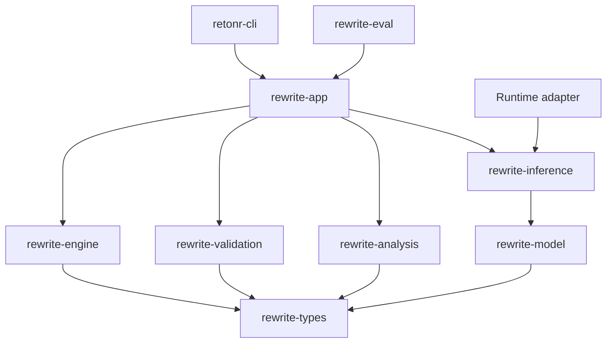

# 0.2 grounded engine and CLI execution plan

## Status and outcome

Status: active. Technical 0.1 implementation evidence is complete. The remaining
ADRs are revisable working decisions, not blockers to reversible 0.x implementation.

The phase outcome is one qualified local generation path for UTF-8 plain text, used
through a complete cross-platform CLI. The model proposes candidates. The existing
engine remains the acceptance authority and returns the original input whenever the
configured policy cannot establish an acceptable result.

This phase proves the architecture with a real backend. It does not freeze the 1.0
API, complete style profiles, support Markdown or DOCX, or claim unrestricted
semantic equivalence.

## Entry closure

The repository now has the deterministic transaction, candidate-check CLI,
hard-negative and positive fixtures, four baseline runner contracts, proposed data
and user-research governance, cross-platform continuous integration, and retained
adapter conformance. Exact-main quality run `31659222447` passed for closure revision
`40643c0`. The four-pass refinement has no undispositioned critical defect, so 0.2
work is active. ADRs 0001 and 0003 through 0005 remain proposed and may be refined as
implementation evidence develops. Data and user-research governance remains
proposed, and no non-synthetic collection is authorized.

## Required decisions

Develop and refine working decision records for:

- Model manifest and artifact identity schema
- Model acquisition transport, trusted-source, proxy, redirect, resume, staging, and
  activation policy
- Backend capability and compatibility policy
- Request bounds, retry classes, and cancellation contract
- Semantic evaluator independence and first calibration method
- Trace equality identifier, including whether to use an installation-keyed digest
- CLI machine schema, exit status categories, and raw terminal output policy
- Qualification hardware tiers and resource measurement procedure
- Local hardware-probe privacy fields, deterministic recommendation policy, and
  bounded device-evaluation suite

No mutable model tag, undocumented runtime default, or unversioned prompt becomes a
qualified dependency.

## Intended component boundaries

`rewrite-eval` depends on public application ports and qualification records. Backend
adapters depend on inference contracts, not engine internals.

Names remain namespace-neutral where practical. A crate is added only when it owns a
cohesive responsibility and enforces a useful dependency boundary. Small contracts
may remain modules until their behavior justifies a crate.

## Ordered work packages

### 1. Complete the baseline harness

- Define one versioned input and result contract shared by every baseline.
- Run the no-rewrite baseline without a model.
- Run direct-prompt and style-description baselines through the same backend port as
  the product path.
- Make retrieved-example input explicit so profile logic is not smuggled into the
  runner.
- Record candidate, validator, runtime, artifact, prompt, and fixture identities.
- Emit aggregate metrics without raw source text by default.
- Reject duplicate case IDs, unknown categories, malformed metrics, and oversized
  suites before execution.

Verification includes deterministic fake-backend results, baseline mismatch tests,
redaction tests, and schema round trips.

### 2. Define model manifests and activation

The manifest includes at least:

- Schema version and immutable artifact ID
- Upstream source and immutable source revision where available
- Artifact digest, byte size, architecture, quantization, and tokenizer identity
- Upstream license identifier, license text reference, and license-text digest
- Intrinsic format and family metadata
- Upstream-declared role, context, language, and capability metadata, explicitly
  marked untrusted until qualification

The separate qualification record includes tested runtime versions, operating
systems, hardware tiers, effective context and source envelopes, supported roles,
languages and capabilities, prompt or chat-template digest, reasoning policy,
request policy, generation parameters, license and redistribution decision,
thresholds, results, and invalidation inputs.

Activation verifies the manifest, checksum, size, role, runtime compatibility, and
license decision. Immutable artifact facts remain in the manifest. Qualification
records, activation decisions, and the active-artifact pointer are separate immutable
records or explicit local state. A rewrite never downloads or activates a model
implicitly.

The durable artifact repository owns separate installed-artifact, qualification,
invalidation, activation-decision, and active-pointer records. Activation runs in one
transaction that verifies the installed digest and a currently valid qualification,
appends the activation decision, and changes the role's active pointer. Startup and
recovery revalidate that binding before use. Removal cannot orphan an active or
in-use pointer, and interrupted activation leaves either the old valid binding or the
new valid binding, never a partial state.

The application service owns a headless artifact lifecycle: discover, explicitly
download where the backend supports it, offline import, verify, qualify, activate,
deactivate, and remove. Each action has typed progress, cancellation, checksum,
license, partial-download cleanup, and in-use behavior. Later embedding and speech
roles reuse this lifecycle rather than depending on desktop code.

The first implemented acquisition slice is intentionally narrower than the complete
lifecycle: one caller-selected regular file plus an exact manifest, copied with
bounded memory and an explicit byte ceiling into configurable application-owned
local storage. It rejects the
final symlink or reparse entry and non-regular sources, verifies exact size and
SHA-256 while staging, never replaces conflicting final bytes, never mutates the
source, never activates implicitly, and atomically registers manifest and installed
state only after the file commits. Cancellation and progress are content-free.
Reserved partial files are recovered under an exclusive import lock. An interrupted
state write may leave an unregistered content-addressed file for explicit later
reconciliation; it cannot leave registered state pointing to an uncommitted file.
Folder and multi-file artifact-set import follow after their canonical manifest and
atomic-set contracts are implemented.

Each backend decision states whether acquisition invokes an explicit runtime pull or
downloads product-managed bytes. There is no silent fallback between them. Product
downloads use approved HTTPS sources and immutable revisions, validated TLS, explicit
proxy policy, bounded same-origin or allowlisted redirects, byte and disk ceilings,
staged atomic activation, and resumable chunks whose complete digest is reverified.
Runtime pulls must expose an expected immutable digest and size that activation can
verify. Interrupted or mismatched staging data never becomes active.

Verification includes corrupt, truncated, wrong-size, wrong-role, unknown-license,
unsupported-runtime, mutable-tag-only, and path-confusion fixtures.

### 3. Freeze provisional inference contracts

Define versioned types for:

- Backend identity and health
- Capability discovery
- Model inventory and resolved artifact identity
- Bounded generation request
- Structured candidate response
- Usage and resource observations
- Cancellation and deadline propagation
- Retryable, permanent, policy, compatibility, and malformed-response errors

The runtime-selected inference ports use an explicit object-safe boxed-future
contract, owned request values, `Send` futures, and a borrowed operation context for
deadline and cancellation. A closed enum or static generic implementation is allowed
only if it preserves the same testable contract without leaking backend types.

Requests carry explicit model identity, context limit, output schema, candidate
count, sampling parameters, seed when supported, and reasoning-output policy. The
application never relies on backend defaults for qualified runs.

Each qualified artifact also defines a conservative source-byte and context envelope.
Inputs above the envelope abstain before backend work. Limits are not described as
exact token fit unless the product owns a tokenizer that matches the recorded
tokenizer identity.

Every byte response is bounded before allocation and parsing. Unknown response
fields are handled according to an explicit compatibility policy. Generated JSON is
untrusted even when the backend reports schema-constrained output.

### 4. Build the fake HTTP backend first

- Implement a deterministic test server for version, model inventory, generation,
  malformed output, delay, disconnect, partial body, oversized body, and error
  responses.
- Control time and cancellation in tests without wall-clock sleeps.
- Prove deadlines terminate in-flight work and discard incomplete candidates.
- Prove retry policy is bounded and never retries policy or compatibility failures.
- Prove content is absent from default logs and errors.
- Reuse the same conformance cases for each real backend adapter.

No real-model behavior is needed to test the backend boundary completely.

### 5. Implement native Ollama discovery

- Apply the documented endpoint precedence and validate the resulting URL.
- Accept loopback endpoints only, disable system proxies and redirects, and reject
  non-loopback configuration before DNS or HTTP work.
- Probe the native version endpoint and required capabilities.
- Resolve installed model identity as strongly as the runtime permits and associate
  it with the product manifest.
- Recheck the exact selected digest immediately before and after generation and
  discard the result if it changed.
- Use the native generation endpoint with an explicit structured-output schema.
- Disable or reject reasoning output for ordinary rewriting.
- Enforce body, token, candidate, concurrency, retry, and deadline bounds.
- Abstain before generation when the qualified source-byte or context envelope is
  exceeded.
- Never start, install, update, or pull the runtime during a rewrite.
- Probe effective running context, quantization, residency, and CPU, GPU, or hybrid
  execution class before and after generation. Discard work on an unqualified
  fallback or drift.

Integration tests run against the fake server. Real Ollama tests are separate,
opt-in qualification jobs pinned to an exact runtime and model artifact.

### 6. Add typed invariant and claim evidence

- Extend exact typed invariants for URLs, emails, identifiers, paths, versions,
  dates, times, quantities, units, money, and declared protected terms.
- Preserve original surface forms through typed sentinels.
- Extract claim evidence for entities, roles, polarity, modality, conditions,
  attribution, time, quantities, and source spans.
- Version extractors independently and record confidence and evidence.
- Treat claim output as fallible evidence, never as a proof object.
- Reject sentinel collision, loss, duplication, unknown sentinel, and relationship
  ambiguity according to stable reason codes.

Each fixed extraction defect adds a minimal positive case and a neighboring hard
negative. Property tests cover sentinel round trips and span integrity.

### 7. Implement one grounded strategy

- Accept a planned rewrite unit, bounded local context, protected sentinels, profile
  placeholder, output schema, and explicit model request.
- Return bounded candidate objects with lineage and no authority to apply edits.
- Keep prompt templates versioned, digestible, testable, and free of hidden network
  or tool access.
- Treat document content and style evidence as untrusted prompt data.
- Prevent the model from receiving filesystem, network, profile mutation, or tool
  authority.
- Limit candidate count and retries before model invocation.

The strategy never performs its own final validation and cannot relax engine policy.

### 8. Add an independent semantic evaluator port

- Run source and candidate evaluation independently from generation when the
  selected policy requires it.
- Return calibrated pass, fail, uncertain, or not-applicable evidence.
- Compare claims, align clauses, and evaluate both entailment directions where the
  selected method supports them.
- Record exact evaluator artifact, runtime, prompt, and threshold identities.
- Fail closed on timeout, malformed output, missing capability, or disallowed
  uncertainty.

The initial evaluator may be experimental. It must show calibration evidence on
hard negatives before any open-domain candidate can be described as qualified.

### 9. Connect the complete validation cascade

The order remains:

1. Encoding and schema validity
2. Candidate contract bounds
3. Sentinel integrity
4. Typed literal preservation
5. Adapter structure and output safety
6. Novel entity and quantity checks
7. Claim and relationship comparison
8. Clause alignment and semantic assessment
9. Document-level cross-reference checks
10. Declared constraints
11. Style and channel ranking among eligible candidates

Hard failures and disallowed uncertainty are removed before ranking. Mechanical
repair is limited to intact, unique sentinel restoration and reruns the full
cascade.

### 10. Complete the CLI vertical slice

Add and qualify:

- `rewrite` for file and standard input
- Non-destructive plain-text directory discovery with explicit recursion, ignore,
  link, output-root, collision, and document or selection atomicity policies
- Reviewable dry-run manifests, source digests, staged outputs, interruption recovery,
  and machine-readable per-file change reports under the
  [document transaction contract](../document-transactions.md)
- Multiline standard input read to end of file without trimming, with byte order
  mark, LF, CRLF, blank-line, whitespace, and final-newline fixtures
- Text and versioned JSON output
- Safe, accessible diff and dry-run
- Trace export with redacted defaults
- Cancellation and deadline controls
- Local-only enforcement
- Stable diagnostic and exit categories
- Shell completion and initial manual page generation
- Explicit output, in-place, and backup policies
- `doctor`, version, and model inspection commands needed for recovery
- Model list, inspect, explicit download, offline import, verify, qualify, activate,
  deactivate, and remove commands backed by the application artifact service
- Non-mutating `model recommend` and `model eval --suite device` commands that report
  exact artifact, runtime, language, context, execution class, and resource evidence

Standard output contains requested data. Diagnostics use standard error. A
non-interactive invocation never prompts. Exact raw text is emitted to a terminal
only after the double opt-in `--raw-terminal --yes` and a warning. Either flag alone
remains safe. Interactive rendering neutralizes ANSI, OSC, C0, C1, carriage-return,
hyperlink, clipboard, bidi, and invisible-control effects from untrusted content.

### 11. Qualify models and policies

Evaluate exact 4B-class, balanced, and larger candidates where licensed artifacts
are available, with a cross-family control in at least one resource class. A compact
candidate that misses a critical fidelity gate does not become an automatic
fallback. For every artifact and quantization, record:

- Corruption acceptance and one-sided confidence interval by risk category
- Accepted-set semantic error, category prevalence, and confidence interval
- Transformation coverage and abstention reasons
- Style and channel gain against every baseline
- Exact invariant and structure failures
- Latency, throughput, load time, peak memory, and disk use
- Cancellation latency and long-input degradation
- Repeatability limits across platforms and hardware
- Generator and evaluator error correlation
- Language and mixed-language strata available at this phase
- Effective CPU, GPU, or hybrid execution class and any backend fallback

Thresholds are set on calibration data before the locked run. No artifact is called
supported merely because it leads a general benchmark.

### 12. Package and capture evidence

- Build release-mode CLI artifacts on Windows, macOS, and Linux.
- Run clean-install, missing-runtime, missing-model, offline, file-lock, long-path,
  non-UTF-8 path where supported, directory traversal, escaping links, recursive
  output inclusion, case collisions, stale manifests, pipe, redirection,
  interruption, recovery, and cancellation tests.
- Produce checksums and a dependency and model license inventory.
- Run formatting, strict linting, tests, coverage, documentation, audits, fuzz smoke,
  and repository policy checks.
- Capture real rewrite, abstention, diff, and trace screenshots only from a passing
  release build using deterministic synthetic fixtures.
- Update the capability and limitation documents.

## Failure and privacy rules

- Backend failure is operational failure or abstention according to explicit policy.
  It never produces an unvalidated output.
- Document-atomic mode never returns a partially rewritten document.
- Cancellation discards partial candidates and temporary output.
- Default logs, traces, errors, and metrics omit source, candidate, prompt, profile,
  and protected values.
- Local-only mode rejects hostname and non-loopback endpoint configuration, ignores
  ambient proxy routes, follows no redirect, and requires OS-enforced denial of
  non-loopback outbound connections for every participating process during
  qualification.
- Short-text equality identifiers are not described as anonymization.
- Model and runtime installation remain separate, explicit user actions.

## Required test matrix

| Boundary | Required evidence |
| --- | --- |
| Manifest | Schema, checksum, size, license, role, runtime, path, and migration fixtures |
| Artifact lifecycle | Runtime-pull versus product-download mode, approved sources, TLS, proxy and redirect policy, explicit network consent, bytes and disk, offline import, resume integrity, digest and size, staging, license, activation, in-use removal, cancellation, cleanup, and deletion |
| HTTP backend | Malformed, delayed, partial, oversized, disconnected, redirected, and cancelled responses |
| Local runtime | Proxy environment, loopback validation, at, below, and above envelope boundaries including multilingual worst cases, digest drift, and result discard |
| Generation | Candidate bounds, prompt injection, sentinel attacks, output schema, retry limits, and no-tool authority |
| Validation | Every hard-negative category plus neighboring acceptable paraphrases |
| CLI | TTY and non-TTY streams, safe diff, JSON stability, exit categories, cancellation, file safety, and redaction |
| Platform | Windows path and lock cases, macOS packaging behavior, Linux signals and desktop-independent installation |
| Network | OS-enforced non-loopback isolation for every participating Retonr and runtime process, with only the exact required local transport allowed |

Overall Rust line coverage remains at least 80 percent. Validation, sentinel,
adapter apply and verify, authorization, and output-safety paths target at least 90
percent with every material branch represented.

## Exit evidence

The phase closes only when:

- All entry-closure items are linked from current state.
- Required decisions are accepted.
- A real qualified artifact completes the grounded path on all supported operating
  systems.
- Locked reporting shows fidelity, coverage, style, latency, and memory together.
- Predeclared fidelity, coverage, and resource thresholds pass before an artifact is
  called qualified.
- Every candidate reaches the same validation cascade.
- Model and CLI failure cannot corrupt or replace the original.
- Local-only enforcement has automated cross-platform evidence for endpoint
  rejection, proxy-environment isolation, redirect non-following, and OS-enforced
  non-loopback isolation.
- Process-level CLI compatibility and terminal-safety suites pass.
- Release-mode screenshots correspond exactly to documented behavior.
- All four refinement passes are complete with no open critical defect.

The handoff to 0.3 includes the stable application ports, provisional machine
schemas, exact qualified artifact records, frozen evaluation split, and a list of
profile questions that the baseline comparison still needs to answer.
