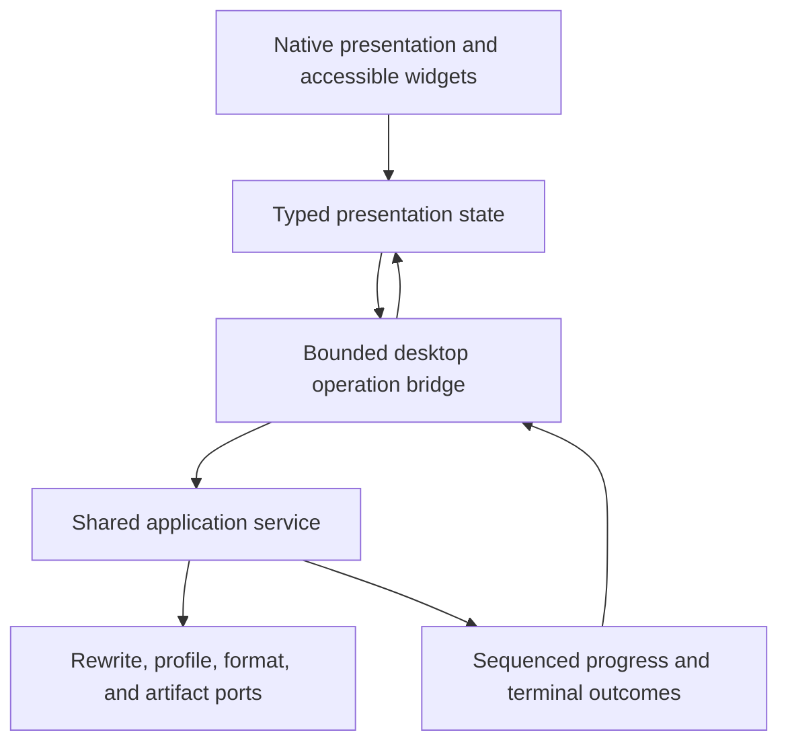

# 0.8 native desktop execution plan

## Status and outcome

Status: planned. It depends on stable-enough application and format contracts, while
native toolkit spikes may proceed earlier behind experimental boundaries.

The phase outcome is a polished, accessible, installed native desktop application
on Windows, macOS, and Linux. It consumes the same application service proven by the
CLI and agent interfaces. It contains no second rewrite, profile, model, validation,
or format implementation.

The application does not embed a browser engine, ship an HTML or JavaScript
frontend, render a hosted web application, or require a local HTTP server for
ordinary operation. A webview-oriented framework is outside this phase boundary.

## Development dependencies

- CLI rewrite, profile, model, Markdown, DOCX, batch, recovery, and report workflows
  have stable-enough application contracts and retained cross-platform evidence.
- CLI JSON, application service, operation, profile, artifact, capability, and agent
  contracts are stable enough to support another presentation layer.
- The candidate operating-system, architecture, graphics, input, package, and
  minimum-hardware matrix is documented and versioned.
- Comparable native Rust UI spikes have been run on every target platform.
- Accessibility requirements and named manual test procedures are documented before
  a toolkit candidate can graduate.
- Native and unsafe dependency quarantine follows the Rust engineering research
  gates.

## Required decisions

Develop and refine working architecture decisions for:

- Native Rust UI toolkit, renderer, window layer, and accessibility bridge
- Presentation state model and application-service boundary
- Background operation, cancellation, progress, and event sequencing
- File dialogs, drag and drop, clipboard, notifications, links, and protocol launch
- Native menus, shortcuts, themes, scale, international text, and input methods
- Visual design tokens, component ownership, and snapshot strategy
- Secure persistence of desktop-only preferences and window state
- Native dependency, graphics backend, sandbox, signing, packaging, and update policy
- Platform and renderer diagnostics that disclose no document or profile content

The toolkit decision cannot be based on a demo or one operating system. It requires
retained evidence for the actual Retonr workflows.

## Architecture contract

The presentation sends typed commands and receives typed state. It never receives
raw model streams, prompts, profile evidence, hidden traces, or arbitrary HTML. It
never holds filesystem, model, network, or profile authority merely because a view
is visible.

Each operation carries an opaque ID, owner, requested authority, deadline, resource
budget, source identity, and monotonic sequence. Closing a view requests
cancellation but does not redefine application state. Late events with a stale
operation ID or sequence are ignored and tested.

Ordinary calls remain in process. The first-party loopback API exists for external
consumers, not as internal desktop IPC.

## Ordered work packages

### 1. Select the native UI stack through comparable spikes

Evaluate maintained native Rust candidates against one fixed Retonr spike containing:

- Multiline international text editing and selection
- Large before and after text views with a linear diff
- A long virtualized document or file list
- Keyboard-only navigation and visible focus
- Screen-reader names, roles, values, states, relationships, and announcements
- High contrast, dark mode, reduced motion, zoom, scale, and font changes
- Input method editor composition, bidirectional text, combining characters, and
  clipboard controls
- Native file dialogs, menus, shortcuts, drag and drop, and window restoration
- Background cancellation and stale-event rejection
- Deterministic component tests and visual captures
- Release build, package, clean install, launch, and removal on each target

Candidates may include Slint, Iced, egui, or another actively maintained native Rust
stack. The decision records exact versions and evidence. Marketing claims, web
demos, and compile success are not accessibility or packaging evidence.

Reject a candidate that requires an embedded browser for the supported desktop path,
cannot expose complete assistive semantics, cannot support international text, or
cannot be packaged and tested predictably across the declared matrix.

### 2. Create the minimal native shell

- Open one native application window with no network listener.
- Install crash-safe single-instance behavior or document why multiple instances are
  supported.
- Establish typed commands for capabilities, operation start, cancellation, and
  terminal outcome retrieval.
- Keep all expensive work off the UI thread.
- Use bounded channels and deterministic backpressure.
- Record application, toolkit, renderer, graphics backend, operating system,
  architecture, locale, scale, and package identity in redacted diagnostics.
- Prove that a renderer or window failure cannot corrupt a source, profile, artifact
  binding, or staged output.

The shell ships no rewrite workflow until its event and authority boundary passes
unit, integration, process, and native black-box tests.

### 3. Build the design and accessibility foundation

- Define semantic color, typography, spacing, focus, elevation, state, motion, and
  density tokens.
- Build a small owned component set for text fields, buttons, menus, tables, lists,
  tabs, dialogs, status, progress, banners, disclosure, and diff presentation.
- Define keyboard behavior before pointer behavior for each component.
- Expose accessible names, descriptions, roles, values, states, relationships,
  ordering, and live announcements.
- Preserve logical focus across asynchronous state changes.
- Support 200 percent text scaling, high contrast, reduced motion, and platform theme
  changes without hiding controls or truncating critical status.
- Test left-to-right, right-to-left, combining, emoji-free interface labels,
  input-method, and long localized strings.

Every custom component requires semantic, keyboard, visual, and error-state fixtures
before use in a core workflow.

### 4. Implement onboarding and capability inspection

- Explain local-first behavior, source preservation, profile authorization, model
  identity, optional network actions, and abstention.
- Show exact installed runtime and artifact state without probing the network.
- Keep model-free check and literal workflows available when no model is installed.
- Allow explicit local runtime selection, offline artifact import, and opt-in
  user-controlled API configuration through the application service.
- Show unsupported platform, language, format, execution, and resource combinations
  before a rewrite begins.
- Make diagnostics export previewable and content-redacted by default.

No onboarding step starts a download, service, telemetry path, or API connection
without a distinct user action and confirmation.

### 5. Implement the rewrite workbench

- Open supported files and reviewed folder manifests through native dialogs or drag
  and drop.
- Keep source display immutable until a verified result exists.
- Present detected format, eligible and protected units, active profile, strategy,
  runtime, artifact, network state, bounds, and atomicity.
- Support check, plan, rewrite, cancel, retry, diff, report, save-as, and staged batch
  recovery through the same application commands as the CLI.
- Present rewritten, unchanged, abstained, unsupported, cancelled, and failed as
  distinct states with stable reasons.
- Provide side-by-side and linear diffs without color-only meaning.
- Show exact change metrics and named page-render evidence without claiming universal
  pagination or human authorship.
- Keep the original and verified output available for explicit comparison and save.

The workbench renders imported and generated content as untrusted text. Control
characters, bidirectional text, file names, links, and error values cannot alter the
interface or invoke an external application without confirmation.

### 6. Implement profile workflows

- Create, select, inspect, compare, and delete profiles.
- Ingest authorized evidence through a preview and explicit consent step.
- Run the typed interview and scenario workflow.
- Inspect observations, rules, evidence, confidence, channels, conflicts, retrieval
  eligibility, versions, and lineage.
- Edit rules, correct conflicts, exclude influence, revoke consent, restore eligible
  retained evidence, activate versions, and verify deletion.
- Export and import only through validated schemas and sensitivity warnings.

Generated candidates never become evidence through acceptance, navigation, window
close, or another presentation event.

### 7. Implement runtime and artifact management

- List exact installed runtime, artifact, qualification, language, format, execution,
  license, digest, size, memory, and source state.
- Recommend only from the same deterministic catalog and device probe as the CLI.
- Separate inspect, compare, download, import, verify, qualify, activate, deactivate,
  and remove.
- Show all network activity before it occurs and allow offline import as a complete
  path.
- Never silently switch runtime, model, quantization, context, execution backend,
  language, or privacy mode.
- Present known provider logging, marking, moderation, and transformation behavior
  for configured API endpoints.

Artifact operations are cancellable, recoverable, checksum-verified, and independent
from opening or rewriting a document.

### 8. Implement privacy and history controls

- Keep history off by default or make the onboarding choice explicit before content
  is retained.
- Separate document history, profile evidence, rewrite records, model artifacts, and
  desktop preferences.
- Preview every diagnostics export and omit document text, profile evidence, prompts,
  model output, paths, and credentials by default.
- Support deletion and verification through the same storage contract as the CLI.
- Clear sensitive presentation buffers when a workflow ends where the toolkit and
  operating system provide an effective mechanism.
- Document clipboard, swap, crash dump, backup, thumbnail, recent-file, and operating
  system limitations accurately.

No content telemetry or remote draft inspection is introduced by the desktop.

### 9. Add native platform integration

Windows:

- Signed per-user package, non-admin install, Windows accessibility APIs, native
  dialogs, high contrast, scale, long paths, file associations, update recovery, and
  uninstall residue

macOS:

- Signed and notarized application, hardened runtime as applicable, VoiceOver,
  native menus and dialogs, sandbox and entitlement review, Apple silicon and Intel
  claims supported by exact artifacts, update recovery, and application removal

Linux:

- Declared distribution, libc, display, graphics, accessibility bus, theme, portal,
  package, install, update, and removal combinations rather than a generic Linux
  claim

Platform code remains behind small typed adapters. A platform-specific feature does
not become part of the portable product contract until every target has a complete
alternative or the support matrix labels it accurately.

### 10. Qualify performance and long-input behavior

Measure startup, idle memory, first interaction, text input, list virtualization,
diff construction, progress handling, cancellation, save, and shutdown on declared
hardware classes.

Large-document UI tests use retained synthetic fixtures and the same document
transaction reports as the CLI. The UI does not keep every source, candidate, diff,
render, and trace copy resident. Memory and event queues remain bounded, and a large
document cannot starve cancellation or accessibility events.

Performance targets are frozen only after representative measurement. Failed
hardware is removed from the support matrix rather than hidden by a broader claim.

### 11. Build the desktop test pyramid

Run:

- Pure reducer and presentation-state unit tests
- Component semantic, keyboard, and snapshot tests
- Application-service bridge tests with deterministic fakes
- Fault injection for stale events, cancellation, queue saturation, renderer loss,
  file races, storage failure, and shutdown
- Native integration tests for dialogs, clipboard, menus, shortcuts, drag and drop,
  focus, input methods, themes, scale, and links
- Black-box tests of the unmodified packaged binary
- Named manual keyboard, screen-reader, high-contrast, zoom, reduced-motion, and
  international-text reviews on every supported platform

Test-only hooks are compile-time excluded from shipping artifacts. The exact shipping
feature set is tested separately from all-features validation.

### 12. Package evidence-producing beta builds

- Build on the target operating system using the exact shipping feature manifest.
- Bind package, native libraries, toolkit, renderer, graphics dependencies, SBOM,
  licenses, checksums, signatures, and provenance to the source revision.
- Run clean install, no-network launch, migration, update, interruption, recovery,
  removal, and residue checks.
- Capture real screenshots only from a passing packaged build using synthetic data.
- Record operating system, architecture, locale, theme, scale, accessibility tool,
  renderer, graphics backend, fixture, and package digest for evidence captures.

## Security and privacy acceptance

- No embedded browser, hosted UI, local web server, or hidden network dependency is
  required for ordinary desktop operation.
- The presentation layer owns no rewrite, validation, profile, format, model, or
  storage authority.
- Generated and imported content is never executable UI markup.
- Filesystem, clipboard, links, network, profile mutation, artifact mutation, and
  administration require explicit typed authority.
- Operation queues, events, content, files, archives, rendering, images, and logs are
  bounded.
- Cancellation or UI failure cannot commit a partial source mutation.
- Desktop code adds no content telemetry, mandatory attribution, or silent provider
  fallback.

## Required test matrix

| Layer | Required evidence |
| --- | --- |
| State | Reducers, transitions, stale events, cancellation, terminal outcomes, and recovery |
| Components | Semantics, keyboard, focus, scaling, contrast, motion, localization, input methods, and snapshots |
| Bridge | Authority, IDs, sequence, bounds, backpressure, faults, shutdown, and redaction |
| Workflows | Onboarding, rewrite, batch, report, profile, model, privacy, save, and deletion |
| Platform | Dialogs, menus, shortcuts, drag and drop, clipboard, themes, accessibility APIs, graphics, and packages |
| Release | Exact features, native install, launch, offline use, migration, update, recovery, removal, SBOM, and signatures |

Implemented Rust line coverage remains at least 80 percent overall. Desktop operation
state, authority, cancellation, save, update, and profile-mutation paths target at
least 90 percent line coverage with every material decision represented. Presentation
reducers target at least 90 percent branch coverage.

## Exit evidence

The phase closes only when:

- Rewrite, profile, model, file, folder, recovery, and report workflows pass through
  the shared application service on all supported platforms.
- Core workflows pass automated and named manual accessibility review.
- The exact packaged application passes functional, visual, offline, installation,
  update, migration, recovery, and removal tests.
- The desktop has no embedded browser path or independent product logic.
- Native dependencies and any unsafe code meet their quarantine and supply-chain
  gates.
- Real screenshots come from passing packages and have useful text alternatives.
- All refinement passes complete with no open critical security, accessibility,
  fidelity, data-loss, packaging, privacy, or usability defect.

The handoff to 0.9 includes a frozen native presentation boundary, exact package
matrix, retained accessibility evidence, and a complete desktop that remains
downstream of the CLI and agent contracts.

## Primary research starting points

- [Slint](https://slint.dev/)
- [Iced](https://iced.rs/)
- [egui](https://docs.rs/egui/latest/egui/)
- [AccessKit](https://accesskit.dev/)
- [WCAG 2.2](https://www.w3.org/TR/WCAG22/)
- [Microsoft UI Automation](https://learn.microsoft.com/en-us/dotnet/framework/ui-automation/ui-automation-overview)
- [Apple accessibility](https://developer.apple.com/accessibility/)
- [Linux accessibility](https://accessibility.linuxfoundation.org/a11yspecs/atspi/adoc/atspi.html)
