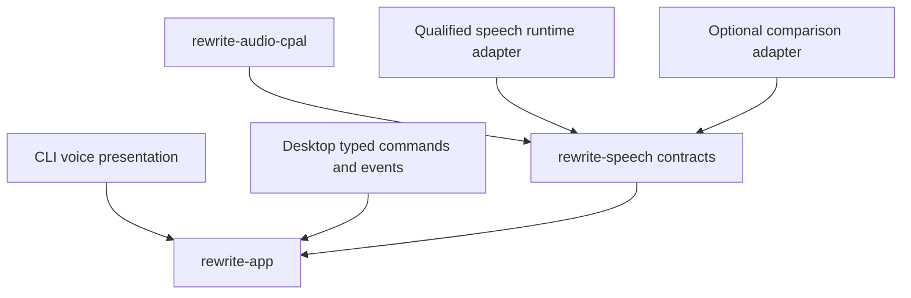

# 0.9 local voice and release candidate execution plan

## Status and outcome

Status: planned after the 0.8 exit gate.

The phase outcome is a fully local, push-to-talk style interview in both CLI and
desktop applications, followed by contract freeze and signed release-candidate
qualification. Voice answers become profile evidence only after the user reviews and
confirms the transcript.

For this product, fully local means that after an explicitly initiated model
installation or offline model import, rewriting and voice interviews complete with
all network access blocked. Update checks, model downloads, and telemetry are off by
default and separate from core operation.

Version 1.0 voice does not include always-listening capture, a wake word, voice
cloning, identity recognition, simultaneous microphone and speech output, general
dictation, or a voice-only workflow.

## Entry criteria

- Typed interview, profile admission, application outcomes, desktop IPC, and package
  pipelines pass prior gates.
- Microphone, speech runtime, model, voice, and redistribution licenses are reviewed
  independently.
- Supported languages, platforms, architectures, sample formats, and hardware tiers
  are approved.
- Raw audio, transcript, retention, deletion, diagnostics, and consent policies are
  approved.
- CLI and desktop remain complete when no microphone or speech model exists.

## Required decisions

Accept decision records for:

- Audio capture, playback, device, resampling, and bounded-buffer architecture
- Speech recognition, voice activity detection, and speech output runtimes
- Native library isolation, signing, update, and compatibility
- Speech and voice model manifest extensions
- Transcript confirmation and profile evidence admission
- Raw audio retention, temporary storage, crash recovery, and deletion verification
- Voice interview controller and model authority
- CLI audio interaction and non-interactive behavior
- Supported accessibility path for captions, keyboard, and speech-disabled use
- `/v1`, CLI JSON, MCP, profile, and rewrite-record freeze

## Component boundaries

Native FFI and audio callbacks are isolated from domain, profile, and application
logic. The frontend never receives PCM frames. It receives bounded level, stage,
transcript, error, and operation events only.

The deterministic interview controller chooses goals and evidence gaps. A local model
may rephrase a question for natural conversation but cannot select profile mutations,
confirm a transcript, admit evidence, or bypass the typed workflow.

## Ordered work packages

### 1. Extend artifact manifests and qualification records

Keep immutable artifact facts separate from qualification evidence. For every runtime,
recognizer, VAD, TTS model, and voice, the artifact manifest records:

- Manifest schema, immutable artifact digest, and upstream source revision
- Runtime, model, voice, phonemizer, and native library licenses separately
- Intrinsic byte size, architecture, quantization, sample formats, and channels
- Upstream-declared role, language, locale, and hardware support, marked untrusted

The separately signed qualification record binds those facts to:

- Tested runtime and native library versions and digests
- Tested operating systems, architectures, accelerators, languages, and locales
- Accuracy, latency, real-time factor, memory, energy, and package-impact results
- The hardware classes, request parameters, fixtures, and thresholds used
- Temporary-file, cache, and application-controlled deletion behavior
- Installation, offline import, verification, activation, and removal decisions

A runtime's license does not establish the model or voice license. A model card does
not establish every bundled phonemizer or training-derived permission.

### 2. Run a speech-runtime bakeoff

Evaluate a safe CPAL audio layer with at least:

- A unified local ASR, VAD, and TTS candidate such as sherpa-onnx
- A whisper.cpp ASR comparison
- A separately reviewed VAD comparison where it improves end-of-speech behavior
- More than one legally distributable local TTS and voice option where available

Measure:

- Word or character error rate
- Exact names, numbers, punctuation, and domain terms
- Correction effort and time
- Hallucinated phrases and silence behavior
- False starts, false cutoffs, and end-of-speech latency
- Load time, first result, real-time factor, memory, CPU, GPU, energy, and disk
- Device switching, permission denial, and cancellation
- Native packaging, signing, and update burden on every platform

Select the smallest set that meets accuracy, privacy, accessibility, licensing, and
cross-platform release gates. Keep alternative adapters experimental unless they are
independently qualified.

### 3. Implement safe audio capture

- Discover input and output devices through a typed Rust port.
- Use push-to-talk by default.
- Request microphone permission just in time.
- Show a persistent visible and assistive recording state before accepting audio.
- Use a preallocated bounded buffer between the real-time callback and worker.
- Perform no allocation, blocking, logging, file I/O, IPC, model inference, or lock
  contention in the callback.
- Bound capture duration, bytes, queue depth, and temporary storage.
- Stop promptly on release, cancel, permission revocation, device loss, shutdown, or
  error.

Run long capture and playback soaks with underrun, overrun, callback timing, memory,
and cleanup instrumentation.

### 4. Implement local preprocessing and transcription

- Move resampling, channel conversion, VAD, and inference to cancellable workers.
- Set exact sample, chunk, context, decoder, language, and output limits.
- Accept only complete transcript segments.
- Discard partial output on cancellation or model identity drift.
- Protect names, numbers, and punctuation as explicit review targets.
- Return stable unavailable, unsupported, permission, device, model, resource,
  cancelled, and failed categories.
- Keep raw backend details out of default logs and UI.

Speech recognition output is untrusted. Hallucinated text is a known risk and never
enters profile evidence without visible user confirmation.

### 5. Require editable transcript confirmation

The workflow is:

1. User starts push-to-talk.
2. Capture and recording state begin.
3. Worker transcribes locally.
4. Editable transcript appears with uncertain or high-risk tokens highlighted when
   supported by evidence.
5. User corrects, re-records, skips, or confirms.
6. Confirmed text enters the same typed interview response contract.
7. Profile changes remain in preview until separately activated.
8. Raw audio is removed from application-controlled buffers and storage immediately
   unless explicit retention was chosen.

Confirmation cannot be inferred from playback, window close, navigation, timeout, or
starting the next question. Transcript edits retain provenance without storing raw
audio by default.

### 6. Implement the guided local conversation

- Use the typed interview state machine as the source of truth.
- Select questions from missing channels, weak observations, unresolved rules, or
  explicit user goals.
- Explain what each answer affects.
- Let the user ask for repetition, clarification, a typed answer, or skip.
- Keep each answer independently reviewable and removable.
- Limit questions, response length, session contribution, and model work.
- Keep captions visible for every spoken prompt and response.
- Persist only confirmed workflow state needed for safe resume.

The conversation focuses on style preferences and scenarios. It is not an open-ended
assistant with tool, filesystem, network, or profile-mutation authority.

### 7. Implement local speech output

- Generate prompts from the approved interview text, never from unreviewed document
  content by default.
- Keep visible captions and full keyboard controls.
- Provide play, pause, repeat, stop, volume, voice, and speed controls.
- Stop playback before opening the microphone.
- Bound text, synthesis time, output buffer, and cached audio.
- Delete temporary speech output according to the retention policy.
- Provide a no-speech-output option with identical workflow capability.

Voice selection shows source, license, language, size, and local installation state.

### 8. Add CLI voice interviews

- Implement `profile interview --voice` only for an interactive terminal.
- Detect standard input, output, and error terminals independently.
- Never start capture in non-interactive use or when confirmation cannot be obtained.
- Present recording, processing, transcript editing, confirmation, cancellation, and
  device recovery accessibly without animation or color dependence.
- Keep standard output clean for requested machine data and diagnostics on standard
  error.
- Support explicit device and language selection plus a complete typed fallback.
- Neutralize transcript and device-name terminal controls.

Process and audio-harness tests cover PowerShell, Windows Terminal behavior, macOS
terminals, and Linux terminals without depending on a particular shell.

### 9. Add desktop voice interviews

- Reuse desktop operation IDs, sequence numbers, cancellation, and stable outcomes.
- Show persistent recording, processing, transcript-review, confirmed, cancelled,
  permission-denied, device-lost, model-missing, and failed states.
- Announce meaningful state changes without streaming token, level, or timer noise.
- Keep recording and stop controls reachable with keyboard and assistive technology.
- Never send PCM through WebView IPC.
- Require an opaque, expiring microphone and speech authority grant bound to the
  exact window session, interview operation, and allowed actions. Route state is
  never an authorization input.
- Revoke and clean up authority when the workflow ends.

Voice errors never block typed onboarding, profile editing, or rewriting.

### 10. Prove privacy and deletion

- Test default removal of raw audio from application-controlled buffers and storage
  after success, correction, re-record, skip, cancellation, failure, crash recovery,
  and application shutdown.
- Make retention explicit, scoped, visible, and reversible.
- Store retained audio separately from confirmed transcript evidence.
- Include audio in export only through a separate explicit choice and sensitivity
  warning.
- Delete raw audio, derived features, cached speech, retained transcript drafts, and
  model artifacts independently.
- Preview diagnostic exports and exclude audio and transcript content by default.
- Verify network-denied operation with socket-level tests.

Document audio that may exist outside application control in operating-system or
device buffers, crash dumps, swap, backups, and storage-device recovery. Avoid
persistent temporary audio by default. When a runtime requires it, use a bounded
application-owned path and cryptographic erasure where the selected encryption
design permits it.

No 1.0 feature performs speaker recognition, voice identity extraction, or voice
cloning.

### 11. Test platform permissions and devices

Windows:

- Test packaged microphone declarations, initial denial, revocation, device removal,
  default-device change, exclusive access conflicts, non-admin use, and signed
  installers.

macOS:

- Include purpose strings and required audio entitlements.
- Sign embedded native libraries.
- Test first permission request, denial, System Settings recovery, revocation,
  Gatekeeper, notarization, Apple silicon, and Intel from the universal application.

Linux:

- Test declared distributions, PipeWire or PulseAudio paths as selected, Flatpak or
  package permissions, Wayland, X11, portals, device loss, and headless or missing
  audio service behavior.

The support matrix names actual package and audio-stack combinations. Generic Linux
support is not claimed without that evidence.

### 12. Qualify audio performance

Initial project targets, to be frozen only after representative testing, are:

- Recording indicator visible within 100 ms of the capture request
- Capture stopped within 250 ms of user cancellation
- Inference cancellation within 1 second
- Zero callback allocation, blocking, or underruns during a 30-minute soak
- ASR real-time factor no greater than 1.0 on minimum hardware and target 0.5 on
  baseline hardware
- VAD finalization target within 700 ms of speech end
- TTS first audio target within 750 ms with sustained real-time factor below 1.0

Qualification includes accents, speech differences, disfluencies, long pauses,
quiet speech, noise, names, numbers, punctuation, device changes, and correction
effort. Targets are revised only through recorded evidence, never by hiding failed
hardware.

### 13. Freeze 1.0 contracts

- Promote reviewed `/v0` API resources to `/v1`.
- Freeze profile, evidence, rewrite-record, CLI JSON, API, MCP, skill, model manifest,
  speech manifest, and compatibility-adapter schemas.
- Publish supported version and migration ranges.
- Run automated compatibility diffs against every retained prior preview fixture.
- Rehearse upgrade, downgrade rejection, rollback or recovery, import, export,
  migration, and uninstall.
- Pin exact supported MCP revisions and named client versions.
- Remove stale experimental flags from release builds or label them outside the
  stable contract.

The experimental Skills over MCP proposal remains outside the 1.0 compatibility
gate unless it has become stable and separately qualified.

### 14. Produce signed release candidates

- Build CLI and desktop artifacts on their target operating systems.
- Sign Windows artifacts and sign, notarize, and staple macOS artifacts.
- Sign Linux artifacts or repository metadata according to each declared package and
  verify them from a clean installation path.
- Sign or checksum native sidecars and model manifests as required by the supply
  chain policy.
- Run clean install, offline import, offline operation, update, migration, recovery,
  removal, and residue checks.
- Run the locked fidelity and profile evaluation with exact release artifacts.
- Run MCP, API, CLI, skill, document, desktop, accessibility, and voice conformance.
- Retain software bill of materials, licenses, checksums, attestations, and known
  limitations.

No release candidate is promoted with an open critical security, fidelity,
data-loss, accessibility, license, packaging, or update defect.

### 15. Capture final evidence

Voice evidence includes microphone denied, recording, processing, transcript
correction, confirmation, cancellation, device loss, model missing, offline, and
typed fallback states.

Each evidence bundle records exact commit, signed artifact digest, native library and
speech model digests, operating system, architecture, locale, audio device class,
WebView, fixture or script, permissions, accessibility tools, and performance trace.

Screenshots and recordings use synthetic content and a passing release candidate.
Captions and equivalent text descriptions accompany every useful recording.

## Security and privacy acceptance

- The microphone opens only after explicit user action and visible state.
- Raw audio is removed from application-controlled buffers and storage by default.
  Inference cannot retain it independently.
- Only confirmed transcript text can become evidence.
- Audio callbacks cannot log, allocate, block, write files, call IPC, or invoke a
  model.
- Native runtimes and models have exact identity, license, signature or checksum,
  and removal behavior.
- Voice workflows complete with network access blocked.
- No voice identity, cloning, wake-word, or always-listening path exists in 1.0.
- Speech failure cannot mutate a profile or prevent typed use.

## Required test matrix

| Area | Required evidence |
| --- | --- |
| Audio | Devices, formats, buffers, resampling, underrun, overrun, soak, cancellation, and cleanup |
| ASR | Accuracy, hallucination, silence, names, numbers, accents, noise, context, limits, and drift |
| VAD | False starts, false cutoffs, long pauses, noise, end latency, and manual push-to-talk override |
| TTS | Captions, controls, first audio, sustained rate, cancellation, licensing, and temporary deletion |
| Evidence | Transcript editing, explicit confirmation, provenance, admission, session caps, and deletion |
| CLI | Terminal detection, safe rendering, device recovery, typed fallback, streams, and exits |
| Desktop | IPC authority, states, stale events, keyboard, assistive technology, permissions, and device loss |
| Release | Signed install, offline import, no-network operation, migration, update, recovery, removal, and contracts |

Overall Rust line coverage and frontend line and branch coverage remain at least 80
percent. Rust audio lifecycle, transcript confirmation, evidence admission,
authorization, and cancellation target at least 90 percent line coverage plus
decision-table fixtures and mutation testing. Frontend state reducers and critical
voice presentation target at least 90 percent branch coverage. These paths also
receive property, fuzz, or fault-injection evidence as appropriate.

## 1.0 promotion gate

Version 1.0 is promoted only when:

- CLI and desktop independently complete the core rewrite and profile workflows.
- Local voice works on every declared platform and produces the same confirmed
  evidence schema as typed input.
- The product is fully usable without speech models or a microphone.
- No audio is persisted in application-controlled storage without explicit consent,
  and the documented operating-system limitations are visible.
- Frozen contracts pass compatibility suites.
- Locked fidelity, coverage, style, leakage, latency, and memory thresholds pass.
- Every supported model, format, protocol, package, and platform has an exact
  qualification record.
- WCAG 2.2 AA target passes automated and manual review.
- Overall coverage, critical-path coverage, formatting, strict linting,
  documentation, audits, fuzzing, mutation, packaging, and repository policy gates
  pass.
- Threat model, privacy, legal, provenance, security disclosure, model manifests,
  release attestations, and name clearance are complete.
- All four refinement passes are complete on the signed release candidate.

Anything that does not meet this gate remains preview, experimental, narrower in
scope, or deferred. The fidelity floor, accessibility path, and local privacy
contract are not relaxed to preserve the release label.
