# Phase execution plans

## Purpose

The versioned roadmap defines scope and completion evidence. These execution plans
define how each phase earns those claims without freezing an interface before
evidence is available.

All plans are prospective. A listed capability is not implemented until
[the current-state document](../current-state.md) says it is implemented and records
the verification evidence.

## Approaching 1.0

Version 1.0 is the first frozen contract, not the first useful build. The path is
the versioned roadmap: finish 0.2, then 0.3 through 0.9, then 1.0. Work may run
ahead when it is reversible, $0, and does not create unmigratable state or a
public claim.

`$0` here means no paid APIs, no paid downloads, no cloud services, and no new
model acquisition. Valid evidence is local: fixtures, fake backends, process
tests, repository policy, and already-installed artifacts.

The current 0.2 build queue, in dependency order, is:

1. Keep the completed artifact lifecycle, `import-set` CLI, `check --diff` /
   `--dry-run` / `--trace`, inventory DTOs, and cancellation evidence intact.
2. Preserve the managed-process attestor. It remains inert and grants no role.
3. Preserve the extractor manifest, claim-output schema, pair-extraction
   service, the informational engine shadow claim-comparison gate, the
   application shadow join, and the independent claim-shadow calibration
   runner. Keep Ollama on the candidate contract only. Do not give pair
   extraction or shadow comparison acceptance authority.
4. Preserve read-only set inventory, selected set reconciliation, and
   crash-recoverable set removal without implying set authority.
5. Escaped terminal rendering, `doctor`, `version`, `completions`, `man`,
   source `inspect`, `model list`, `model inspect`, and `rewrite` exist.
   `inspect` inventories one file or a non-recursive directory without
   credential validation or link following. `doctor` names
   recovery follow-up without mutation. Recovered fake-qualified
   bindings attach in-process conformance for `rewrite` and generative
   `rewrite-eval --baseline` kinds. Do not start a runtime.
6. Qualify one exact local runtime and artifact combination before profiles or
   another format.

Later phases stay blocked on their entry evidence. Do not implement Markdown,
DOCX, profiles, MCP, desktop, or signed installers as if they were the next 0.2
slice.

## Reading order

| Plan | Primary outcome |
| --- | --- |
| [0.2 grounded engine and CLI](0.2-grounded-cli.md) | Qualify one local generation path through the common validation cascade and complete the plain-text CLI |
| [0.3 profile and CLI alpha](0.3-profile-cli.md) | Build an inspectable, reversible style profile and prove it beats simpler baselines |
| [0.4 Markdown](0.4-markdown.md) | Add a deliberately bounded source-splice Markdown adapter |
| [0.5 calibration and runtime breadth](0.5-calibration.md) | Calibrate semantic risk, add strategies safely, qualify a second runtime path, and keep language and partial atomicity evidence-gated |
| [0.6 agent tool, MCP, and Agent Plugins](0.6-integrations.md) | Package the stable CLI and application service for portable local agent use |
| [0.7 DOCX](0.7-docx.md) | Support a narrow WordprocessingML subset without broad preservation claims |
| [0.8 native desktop](0.8-desktop.md) | Deliver an accessible installed Rust application without an embedded browser |
| [0.9 release qualification](0.9-release-qualification.md) | Freeze contracts and qualify signed cross-platform release artifacts |

Current research baselines are the August 12 and 13 records and
[External change watch](../external-change-watch.md). The
[August 11 next-phase ledger](../research/2026-08-11-next-phases.md) is retained
historical evidence only. It is superseded for MCP, desktop toolkit, runtime
breadth, 1.0 voice, and phase order.

## Dependency order

```mermaid
flowchart LR
    V01["0.1 deterministic core complete"] --> V02["0.2 local model and plain-text CLI"]
    V02 --> V03["0.3 profile evidence and CLI workflows"]
    V03 --> V04["0.4 bounded Markdown"]
    V04 --> V05["0.5 calibration and runtime breadth"]
    V05 --> V06["0.6 agent tool and portable plugins"]
    V06 --> V07["0.7 bounded DOCX"]
    V07 --> V08["0.8 native desktop"]
    V08 --> V09["0.9 contract freeze and release qualification"]
    V09 --> V10["1.0 reference product"]
```

This is a risk order, not a statement that every implementation task must be
strictly serial. Research spikes may run early. Production dependencies, public
claims, stored schemas, and compatibility commitments may not skip their entry
gates.

## Plan contract

Every phase follows the same control loop:

1. Prove the entry criteria from retained artifacts.
2. Close or record every required architecture decision.
3. Implement the smallest end-to-end behavior through existing application ports.
4. Test failure, cancellation, resource, privacy, and platform behavior with the
   happy path.
5. Run qualification on frozen fixtures and exact artifacts.
6. Complete the four refinement passes in the quality standard.
7. Update current state, capability matrices, limitations, and screenshots.
8. Mark the phase complete only when every completion claim has objective evidence.
   Incomplete evidence does not block reversible research or experimental work in a
   later phase.

An implementation may be useful before its phase closes. It remains experimental
and receives no stable compatibility or preservation claim until the gate passes.

## Branch and milestone release discipline

- Keep main releasable and require its complete continuous-integration policy to
  pass before and after merge.
- Use focused, short-lived branches. Split parallel research or implementation only
  where ownership is independent, then integrate promptly behind tested boundaries.
- Avoid long-running release, integration, dependency-update, or platform branches.
- Rebase or update focused work from current main before final review and rerun all
  affected gates after conflict resolution.
- Tag each completed 0.x milestone from main only after its phase evidence, version,
  changelog, migrations, support matrix, checksums, packages, and known limitations
  are complete.
- Start the next phase from that clean released baseline. Do not accumulate several
  nominal milestones into one unreviewable release.
- Keep unfinished capabilities compile-time absent, disabled, or explicitly
  experimental in release artifacts.

The latest stable or generally available tool is the preferred upgrade target, not
an automatic input. Each upgrade is a focused reviewed change that runs the full
affected compatibility, platform, supply-chain, and qualification matrix.

## Work-package definition

Each implementation work package must state:

- Objective and user-visible outcome
- Inputs and preconditions
- Owned component and dependency direction
- Versioned types or schemas affected
- Bounds for bytes, tokens, candidates, concurrency, retries, and time
- Cancellation and failure semantics
- Privacy and logging behavior
- Cross-platform behavior
- Unit, property, integration, process, fuzz, and qualification evidence as relevant
- Documentation and migration effects
- Explicit non-goals

A work package is not done when only the happy path works. Its error mapping,
abstention behavior, cleanup, and observability are part of the feature.

## Evidence ledger

Phase evidence is retained under deterministic names and linked from the current
state document. The required categories are:

| Evidence | Required content |
| --- | --- |
| Decision | Working or accepted architecture decision record with consequences and rollback path |
| Contract | Versioned schema, examples, compatibility range, and malformed-input fixtures |
| Test | Command, exact revision, platform, result, and retained report or fixture |
| Qualification | Exact model or format artifact, runtime, hardware, metrics, and limits |
| Security | Updated trust boundary, abuse cases, controls, and validation result |
| Accessibility | Automated result plus named manual keyboard, screen-reader, contrast, and zoom checks |
| Release | Signed artifact identity, install path, upgrade path, platform-specific rollback or recovery result, and known limitations |

Local results and remote continuous-integration results are reported separately. A
configured job is not described as passing until it has run successfully for the
revision being qualified.

## Decision discipline

An architecture decision record is required before implementation relies on a
choice that affects:

- Stored user data or migrations
- Public or machine-readable schemas
- Security boundaries or authority
- Cryptography, keys, or identity digests
- Model activation, licenses, or supply chain
- Supported document syntax or preservation claims
- Desktop framework, updater, or distribution behavior
- Voice runtime, audio retention, or model distribution

Reversible 0.x implementation may proceed against a proposed record while the choice
is still being tested. Acceptance is required before the choice creates irreversible
external effects or enters the 0.9 compatibility freeze. Experimental code must
remain behind an internal boundary and must not create user data that cannot be
migrated.

## Cross-cutting release tracks

The following tracks run through every phase:

- Fidelity: false acceptance, coverage, abstention, style gain, and hard-negative
  regressions are reported together.
- Security and privacy: untrusted input stays bounded, logs stay redacted, and new
  authority is explicit.
- Quality: formatting, strict linting, at least 80 percent overall line coverage,
  higher critical-path targets, and no oversized catch-all modules.
- Cross-platform behavior: Windows, macOS, and Linux are implementation targets,
  not a final porting task.
- Accessibility: CLI output remains usable without decoration, and native desktop
  workflows keep complete keyboard and assistive-technology paths.
- Supply chain: code, models, installers, and update artifacts have explicit source,
  license, checksum, and supported-version records.
- Documentation: planned, experimental, qualified, and supported behavior remain
  visibly distinct.

## Research revalidation

The technology baseline is reviewed again when any of these triggers occurs:

- A phase begins more than one stable toolchain or relevant protocol revision after
  its last review.
- A selected dependency has a security advisory, license change, maintenance gap,
  or breaking release.
- A model tag, artifact, runtime, tokenizer, quantization, or prompt template changes.
- A platform changes signing, notarization, permission, accessibility, or packaging
  requirements.
- A release claim depends on a standard or law whose guidance has changed.

Revalidation updates the dated research ledger and, when the recommendation changes,
the affected decision record and execution plan.

The permanent watch domains, evidence states, issue workflow, automation boundary,
and release gate are defined in
[External change watch and revalidation](../external-change-watch.md). Every
milestone entry and release freeze records a new cutoff instead of inheriting an
undated assumption.

## Stop conditions

Work pauses for redesign when:

- A simple baseline matches the profile architecture without a material loss in
  fidelity or user preference.
- A validator cannot achieve the predeclared false-acceptance bound at useful
  coverage.
- A format cannot meet its stated non-target preservation contract.
- Typical target hardware cannot run any qualified model tier acceptably.
- An interface requires broader authority or data retention than the product
  contract allows.
- Cross-platform, accessibility, licensing, or update requirements cannot be met by
  the selected stack.

The response is to narrow, replace, or defer the affected behavior. The project does
not weaken the fidelity floor or hide unsupported behavior to preserve a version
number.
