# Phase execution plans

## Purpose

The versioned roadmap defines scope and release gates. These execution plans define
how each phase reaches those gates without freezing an interface before evidence is
available.

All plans are prospective. A listed capability is not implemented until
[the current-state document](../current-state.md) says it is implemented and records
the verification evidence.

## Reading order

| Plan | Primary outcome |
| --- | --- |
| [0.2 grounded engine and CLI](0.2-grounded-cli.md) | Qualify one local generation path through the common validation cascade and complete the plain-text CLI |
| [0.3 profile and CLI alpha](0.3-profile-cli.md) | Build an inspectable, reversible style profile and prove it beats simpler baselines |
| [0.4 Markdown](0.4-markdown.md) | Add a deliberately bounded source-splice Markdown adapter |
| [0.5 calibration and hardening](0.5-calibration.md) | Calibrate semantic risk, add strategies safely, and qualify partial atomicity |
| [0.6 API, MCP, and skills](0.6-integrations.md) | Expose one application service through secure, conformant local interfaces |
| [0.7 DOCX](0.7-docx.md) | Support a narrow WordprocessingML subset without broad preservation claims |
| [0.8 desktop](0.8-desktop.md) | Deliver an accessible, secure cross-platform desktop beta |
| [0.9 voice and release candidate](0.9-voice-release.md) | Add local voice acquisition, freeze contracts, and produce a qualified release candidate |

The [dated research ledger](../research/2026-08-11-next-phases.md) records the
external specifications and ecosystem assumptions behind these plans. It is
evidence, not a substitute for architecture decision records.

## Dependency order

```mermaid
flowchart LR
    V01["Finish missing 0.1 evidence"] --> V02["0.2 local model and plain-text CLI"]
    V02 --> V03["0.3 profile evidence and CLI workflows"]
    V03 --> V04["0.4 bounded Markdown"]
    V04 --> V05["0.5 calibration and strategy hardening"]
    V05 --> V06["0.6 API, MCP, and skills"]
    V06 --> V07["0.7 bounded DOCX"]
    V07 --> V08["0.8 desktop beta"]
    V08 --> V09["0.9 local voice and contract freeze"]
    V09 --> V10["1.0 release qualification"]
```

This is a risk order, not a statement that every implementation task must be
strictly serial. Research spikes may run early. Production dependencies, public
claims, stored schemas, and compatibility commitments may not skip their entry
gates.

## Plan contract

Every phase follows the same control loop:

1. Prove the entry criteria from retained artifacts.
2. Close or record every required architecture decision.
3. Implement the smallest end-to-end behavior through existing application ports.
4. Test failure, cancellation, resource, privacy, and platform behavior with the
   happy path.
5. Run qualification on frozen fixtures and exact artifacts.
6. Complete the four refinement passes in the quality standard.
7. Update current state, capability matrices, limitations, and screenshots.
8. Close the phase only when every exit gate has objective evidence.

An implementation may be useful before its phase closes. It remains experimental
and receives no stable compatibility or preservation claim until the gate passes.

## Work-package definition

Each implementation work package must state:

- Objective and user-visible outcome
- Inputs and preconditions
- Owned component and dependency direction
- Versioned types or schemas affected
- Bounds for bytes, tokens, candidates, concurrency, retries, and time
- Cancellation and failure semantics
- Privacy and logging behavior
- Cross-platform behavior
- Unit, property, integration, process, fuzz, and qualification evidence as relevant
- Documentation and migration effects
- Explicit non-goals

A work package is not done when only the happy path works. Its error mapping,
abstention behavior, cleanup, and observability are part of the feature.

## Evidence ledger

Phase evidence is retained under deterministic names and linked from the current
state document. The required categories are:

| Evidence | Required content |
| --- | --- |
| Decision | Accepted architecture decision record with consequences and rollback path |
| Contract | Versioned schema, examples, compatibility range, and malformed-input fixtures |
| Test | Command, exact revision, platform, result, and retained report or fixture |
| Qualification | Exact model or format artifact, runtime, hardware, metrics, and limits |
| Security | Updated trust boundary, abuse cases, controls, and validation result |
| Accessibility | Automated result plus named manual keyboard, screen-reader, contrast, and zoom checks |
| Release | Signed artifact identity, install path, upgrade path, platform-specific rollback or recovery result, and known limitations |

Local results and remote continuous-integration results are reported separately. A
configured job is not described as passing until it has run successfully for the
revision being qualified.

## Decision discipline

An architecture decision record is required before implementation relies on a
choice that affects:

- Stored user data or migrations
- Public or machine-readable schemas
- Security boundaries or authority
- Cryptography, keys, or identity digests
- Model activation, licenses, or supply chain
- Supported document syntax or preservation claims
- Desktop framework, updater, or distribution behavior
- Voice runtime, audio retention, or model distribution

Experiments may compare options before the record is accepted. Experimental code
must remain behind an internal boundary and must not create user data that cannot be
migrated.

## Cross-cutting release tracks

The following tracks run through every phase:

- Fidelity: false acceptance, coverage, abstention, style gain, and hard-negative
  regressions are reported together.
- Security and privacy: untrusted input stays bounded, logs stay redacted, and new
  authority is explicit.
- Quality: formatting, strict linting, at least 80 percent overall line coverage,
  higher critical-path targets, and no oversized catch-all modules.
- Cross-platform behavior: Windows, macOS, and Linux are implementation targets,
  not a final porting task.
- Accessibility: CLI output remains usable without decoration, and desktop and
  voice workflows keep complete keyboard and non-voice paths.
- Supply chain: code, models, installers, and update artifacts have explicit source,
  license, checksum, and supported-version records.
- Documentation: planned, experimental, qualified, and supported behavior remain
  visibly distinct.

## Research revalidation

The technology baseline is reviewed again when any of these triggers occurs:

- A phase begins more than one stable toolchain or relevant protocol revision after
  its last review.
- A selected dependency has a security advisory, license change, maintenance gap,
  or breaking release.
- A model tag, artifact, runtime, tokenizer, quantization, or prompt template changes.
- A platform changes signing, notarization, permission, accessibility, or packaging
  requirements.
- A release claim depends on a standard or law whose guidance has changed.

Revalidation updates the dated research ledger and, when the recommendation changes,
the affected decision record and execution plan.

## Stop conditions

Work pauses for redesign when:

- A simple baseline matches the profile architecture without a material loss in
  fidelity or user preference.
- A validator cannot achieve the predeclared false-acceptance bound at useful
  coverage.
- A format cannot meet its stated non-target preservation contract.
- Typical target hardware cannot run any qualified model tier acceptably.
- An interface requires broader authority or data retention than the product
  contract allows.
- Cross-platform, accessibility, licensing, or update requirements cannot be met by
  the selected stack.

The response is to narrow, replace, or defer the affected behavior. The project does
not weaken the fidelity floor or hide unsupported behavior to preserve a version
number.
