# Versioned roadmap

## Roadmap contract

This roadmap is a dependency order, not a calendar. It contains no duration or date
estimates. Research and implementation may run ahead during 0.x. Milestone
completion requires the named evidence, but an incomplete checkpoint does not block
reversible work in a later package. Irreversible publication, external data
collection, license acceptance, and network authority remain separately authorized
actions.

The [product and engineering invariants](invariants.md) apply to every phase. A
milestone may narrow scope or move work later. It may not weaken an invariant to
preserve a version number. ADRs and preview contracts remain revisable through 0.8;
0.9 is the compatibility-freeze and release-qualification phase. The
[phase execution plans](planning/README.md) define detailed work packages and
evidence.

The [current-state document](current-state.md) is the only authority for implemented
behavior. Roadmap content is planned until that document records exact verification
evidence.

## Order of operations

```mermaid
flowchart LR
    V01["0.1 deterministic core"] --> V02["0.2 excellent plain-text CLI"]
    V02 --> V03["0.3 inspectable personal profiles"]
    V03 --> V04["0.4 bounded Markdown"]
    V04 --> V05["0.5 calibrated quality and runtime breadth"]
    V05 --> V06["0.6 agent tool and portable plugins"]
    V06 --> V07["0.7 bounded DOCX"]
    V07 --> V08["0.8 native desktop"]
    V08 --> V09["0.9 contract freeze and release qualification"]
    V09 --> V10["1.0 reference product"]
```

This order encodes five deliberate choices:

1. The CLI proves every core workflow before another presentation layer exists.
2. Agent use builds on the CLI and application service before desktop work begins.
3. Standard input MCP and portable Agent Plugin packages precede local HTTP.
4. Document formats graduate by explicit preservation capability, never by file
   extension alone.
5. The native desktop application consumes proven contracts and contains no second
   implementation of the product.

## Current build queue

Milestone 0.1 technical evidence is complete, and 0.2 implementation is active. 0.1
has not been tagged as a milestone release. INV-Q04 applies from the first completed
0.2 closeout. The 1.0 include list lives in the
[product 1.0 capability table](product.md#10-product-boundary). Work
proceeds in this exact order:

1. With offline import, read-only inventory, selected reconciliation, inactive
   removal, exact removal recovery, non-mutating pending-operation inspection,
   backup-backed explicit repository migration, and cross-platform signal
   cancellation exposed or proven through the narrow model CLI, retain the complete
   0.2 lifecycle evidence.
2. Keep runtime use behind verified shared leases before wiring a real model
   consumer. Do not add network acquisition to the current administrative slice.
3. Retain the completed opaque exclusive-lock capability on both low-level removal
   transitions and the completed application-owned inventory DTO boundary. The
   application binds the lock capability to the exact pinned repository entry, and
   persistence records do not become a CLI or public inventory contract.
4. Retain the completed rewrite-record v2, typed invariant summaries, typed claim
   evidence, deterministic comparison, exact output-contract discovery, bounded
   structured-completion boundary, distinct inert claim-extraction role, canonical
   artifact-set manifest, runtime-build and effective-state identities, and
   relationship-checked effective-package evidence. Preserve the separate inert
   qualification v2 that binds all four identities and exact qualification policy
   without rewriting v1 evidence. Preserve current schema-6 persistence, recursive
   relationship checks, distinct inert artifact-set installation generations,
   bounded exact folder import, the offline `import-set` CLI, backup-backed explicit
   migration from schemas 1 through 5, repository-owned artifact-set leases, and read-only set
   inventory without implying set authority. Preserve the completed managed-process
   attestor, extractor manifest, strict ephemeral wire contract, cancellable pair
   operation, two-phase informational engine evidence join, and independent shadow
   calibration. Never treat probabilistic extraction as proof.
5. Retain the versioned read-only Ollama preflight. It observes or verifies bounded
   runtime, inventory, model-description, and residency evidence, rechecks stable
   state, performs no generation, and always reports `qualified: false`.
6. Retain the attached-process witness. Windows and Linux bracket preflight with
   listener-owner, process-incarnation, and executable evidence; macOS fails closed.
   The report remains `response_bound: false` and `qualified: false`.
7. Retain the separate bound preflight. It sends the complete read-only sequence over
   one direct retained HTTP/1 connection and checks exact reverse established-row
   attribution before traffic and after every fully drained response. It rejects
   reconnect, drift, ambiguity, incomplete required visibility, and unsupported
   platforms. It remains unqualified and does not prove exclusive socket ownership
   or application-handler execution.
8. Retain Linux bounded `NETLINK_SOCK_DIAG` row selection and exact retained-cookie
   connection queries. Retain the proc-root-relative holder scanner: acquire a pidfd
   before the process directory, parse exactly one four-field `Uid:` row from each bounded status record for
   effective UID, inspect descriptors relative to the held process directory, confirm
   the same effective UID through a second anchored status read, and
   continue through the admitted view after a match. After pidfd acquisition, skip a
   missing process only when the pidfd confirms exit. Fail closed on access denial,
   resource exhaustion, malformed state, or incomplete visibility. Retain the
   complete runtime-package, model-package,
   native-load, static package-lease, and schema-6 persistence contracts. The
   installed-Ollama import may reconstruct and persist only inert model-package
   evidence. Retain the v0.32.15 static import-to-inventory binding, neutral judge
   output contract, retained-stream executor, separate limited transport receipt,
   and opt-in runtime-reported residency profile. The static binding consumes the
   opaque, nonserializable, single-use receipt from the exact preflight runner.
   Retained-session completion input has an absolute 4 MiB UTF-8 ceiling enforced
   before wire serialization or completion traffic. None grants execution or
   qualification authority. The judge receipt alone proves no managed isolation,
   handler execution, model load or use, candidate generation, effective identity,
   semantics, or qualification.
9. Retain Linux managed prelaunch namespace isolation and namespace-local process,
   connection, and native-load attestation when host policy permits. Retain the
   target-inherited seccomp policy that admits only `AF_INET` and `AF_INET6` through
   `socket()`, denies every other socket family and `io_uring_setup`, and requires
   seccomp mode 2 on target reobservation. Attached Windows and Linux evidence remains
   observation-only. Windows managed isolation and exact native-load binding are
   unsupported, and macOS is unsupported.
   Keep uncontrolled-host compatibility limited to the exact typed access-denied
   result. Require a separate networkless, dropped-capability, no-new-privileges
   native attestor success gate and include that execution in the LLVM profile before
   enforcing the workspace line-coverage floor.
10. Retain the Linux-only managed preflight that joins runtime-package, isolation,
    process, connection, provider-declaration, read-only API, and native-load evidence
    without an attached-process fallback. Its report remains inert and unqualified.
    Retain the separate opt-in binding that constructs only a package-declared
    `RuntimeBuildIdentity`; only its entrypoint is joined to live evidence, other
    package semantics are not independently live-observed, cleanup completes before
    return, and effective runtime state remains unproven.
    Freeze and review one exact Ollama runtime package before adding it to the empty
    production cloud-disable allowlist.
11. Extend the managed operation so its process remains live through generation and
    direct effective-state observation. Join its runtime build, exact model-package
    lease, static v0.32.15 binding, runtime-reported residency, and local-judge receipt
    while collecting generation-bound provider, effective configuration, platform and
    driver, compute placement, effective context, and retained-live-runtime evidence.
    Then add a separate candidate-generation receipt. The scorecard remains
    caller-declared and triage-only; receipts do not prove handler execution, model
    use, semantics, or qualification by themselves.
12. Project the eight-case smoke and 39-case editorial protocol into versioned local
    generation plans. Run only exact stacks that passed identity and isolation
    preflight. The old Gemma 4, Qwen3.6, and Ministral observations have expired; do
    not reacquire a candidate without separate approval. Keep runtime strata separate
    and publish no support claim from a development run. The checked-in development
    foundation is larger: 49 deterministic fidelity and structure cases plus 120
    synthetic editorial cases, 169 total. Freeze the smaller qualification projection
    before any candidate output is opened.
13. Finish the plain-text CLI contract, terminal safety, and recovery paths. Then
    qualify one exact local runtime and artifact combination on each claimed platform
    before adding profiles or another format.
14. Establish the versioned editorial-quality corpus and the bounded editorial
   pattern graph during evaluation work. Keep model-family and population
   source-signal relationships in a separate research graph with no live rewrite
   authority. Do not give lint findings product authority until the 0.3 rule and
   profile contracts pass qualification.
15. Deliver visible anti-slop lint and inspectable personal-style behavior in 0.3.
16. Let editorial lint guide or rank generated candidates in 0.5 only after the
   common fidelity cascade has accepted them.
17. Add agent packaging, rich document formats, and native presentation layers only
   after the underlying CLI and application contracts are proven.

This sequencing makes three independent outcomes visible in every release report:

- Fidelity: facts, literals, structure, formatting, and protected content remain
  within the qualified contract.
- Editorial quality: accepted output contains fewer named, explainable slop patterns
  without introducing neighboring defects.
- Personal fit: accepted output better follows authorized user evidence and explicit
  preferences than the strongest simpler baseline.

No blended score can trade fidelity for editorial quality or personal fit.
Deterministic fidelity and structure gates run first. A version-locked local model
judge may triage blind, randomized, order-swapped disagreements, but it cannot
override a hard failure or replace human release adjudication.
The [hybrid rewrite evaluation plan](research/2026-08-21-hybrid-rewrite-evaluation.md)
defines the corpus partitions, score ordering, judge protocol, and report shape.

## Version policy

- `0.x` releases may change preview contracts with documented migrations.
- Stable machine fields are removed only through an explicit compatibility policy.
- `1.0` freezes the supported CLI JSON, profile, rewrite-record, MCP, Agent Plugin,
  local API, and document capability contracts under semantic versioning.
- Experimental models, runtimes, formats, languages, strategies, and protocol
  revisions remain visibly labeled and outside stable claims.
- Every release identifies exact supported platforms, artifacts, runtimes,
  execution classes, formats, languages, schemas, and protocol revisions.
- Every completed milestone is released from a clean passing main revision. Main is
  kept releasable, and unfinished work remains disabled or experimental.
- Shipping inputs use the newest reviewed stable or generally available versions
  that pass qualification. Preview inputs require explicit isolation and never float.
- Dependencies are added only for a necessary owned capability and removed when that
  capability no longer justifies their supply-chain and maintenance cost.

## 0.0: Product and engineering foundation

### Outcome

A reviewable Rust workspace and documented product contract exist before model or UI
complexity is introduced.

### Required evidence

- Product definition, exclusions, architecture, threat model, evaluation policy,
  quality standard, and decision-record process
- Pinned Rust toolchain and explicit workspace dependency direction
- Windows, macOS, and Linux continuous-integration skeleton
- Repository policy checks for prohibited attribution, emojis, dash characters,
  warnings, oversized modules, and broken local documentation links
- Deferred public-release gates for name, licenses, packages, and model artifacts

### Completion evidence

- The thesis is fidelity-gated and does not promise universal semantic equivalence,
  detector evasion, human authorship, or provider-record deletion.
- Local-first behavior and provider-neutral boundaries are explicit.
- Documentation and repository policy checks pass.

## 0.1: Evaluation and deterministic contracts

### Outcome

The complete rewrite transaction can be tested without a model, network, profile,
or user interface.

### Required evidence

- Versioned types for documents, units, plans, candidates, gates, outcomes, errors,
  and redacted rewrite records
- Plain-text parsing and byte-preserving reassembly
- Protected values, sentinels, exact literal checks, structure gates, semantic
  assessment port, and lexicographic candidate selection
- Document-atomic abstention that returns the exact original
- Positive paraphrases, semantic hard negatives, properties, golden fixtures, fuzz
  targets, and coverage reporting
- Deterministic fake generation and evaluation backends with cancellation

### Completion evidence

- Every failure and abstention has a stable category and reason.
- Deterministic regression suites contain no known critical failure.
- Byte identity and process behavior pass on Windows, macOS, and Linux.
- Overall implemented Rust line coverage is at least 80 percent and critical paths
  meet their higher target.

## 0.2: Grounded engine and excellent plain-text CLI

### Outcome

A user can install or select one qualified local generation path and complete every
plain-text rewrite, inspection, model-management, and recovery workflow from a
polished CLI.

### Required work

- Neutral inference, embedding, installed-artifact, qualification, and activation
  ports with conformance fakes
- Exact runtime, artifact, tokenizer, prompt-template, parameter, and execution-class
  identity before and after generation
- One qualified local adapter, starting with one exact Retonr-managed Ollama package
  on Linux where host namespace policy permits, or a later pinned llama.cpp sidecar
  with equivalent retained evidence
- Existing offline import, inventory, pending-operations, reconcile, remove, and
  recover-removal commands, followed by explicit model list, inspect, recommend,
  download, verify, evaluate,
  qualify, activate, deactivate, and remove commands
- Hardware-aware recommendations that never silently activate or downgrade
- Capability-specific open-weight recommendations for conservative editing,
  personal style, editorial quality, long-document planning, supported languages,
  structured output, and independent evaluation
- One grounded generative strategy through the shared validation cascade
- File and multiline standard input, files as output, human output, versioned JSON,
  diff, dry-run, check, trace summary, cancellation, and fail-on-abstain behavior
- Pre-model plain-text inventory for supported Content Credential wrappers,
  byte-order marks, invisible controls, metadata sidecars, and external references,
  with explicit derivative decisions and no blanket character stripping
- Non-destructive file and directory discovery with a reviewable manifest, separate
  destination root, source digests, collision rules, and document or selection
  atomicity for the formats supported at this phase
- Safe terminal rendering and exact raw output only to a non-terminal sink or an
  explicit double opt-in
- Shell completions, manual pages, stable diagnostics, and actionable recovery
- OS-enforced proof that all participating Retonr and runtime processes complete the
  qualified workflow after explicit artifact setup with non-loopback outbound
  connections denied and only the exact configured local transport allowed

### Completion evidence

- Clean installations complete the documented workflows on Windows, macOS, and
  Linux.
- Structured output, exit categories, pipes, hostile controls, line endings, broken
  pipes, cancellation, and recovery pass process-level compatibility fixtures.
- The exact qualified model combination meets predeclared fidelity, coverage,
  latency, memory, and artifact-drift gates on at least one documented laptop class.
- A model failure cannot bypass validation, corrupt input, or activate an unqualified
  fallback.
- The CLI is complete enough to serve as the reference surface for later adapters.

## 0.3: Inspectable personal profiles and CLI workflows

### Outcome

Authorized writing evidence and explicit preferences produce a reversible profile
that improves owner preference over the strongest simple baseline.

### Required work

- SQLite migrations, immutable profile versions, provenance, consent, and deletion
- Interpretable style observations with confidence and sample counts
- User-declared rules, enforcement levels, conflict detection, and channel overlays
- Versioned editorial-lint rules with exact findings, context exclusions, profile
  overrides, explanations, and source versus output reports
- A bounded editorial pattern graph with stable relationship IDs, canonical ordering,
  explicit exclusions, and no detector, watermark, model-family, or authorship fields
- A versioned editorial-quality corpus with positive findings, clean contextual
  counterexamples, protected contexts, and no authorship labels
- Bounded retrieval with exact embedding identity, eligibility filters, diversity
  caps, topic controls, canaries, and cross-profile leakage checks
- Typed interview and scenario acquisition using the same evidence schema as any
  later input mode
- Append-only time-aware preference events, immutable projections, valid-time and
  conflict edges, and deterministic reconstruction without requiring a graph store
- Explicit feedback that cannot contaminate the authorized evidence corpus
- Complete profile create, inspect, edit, compare, ingest, export, import, restore,
  reindex, revoke, and delete workflows through the CLI
- Canonical versioned JSON export remains authoritative; define a content-minimized
  projection boundary for later portable knowledge formats
- Document analysis and a bounded typed editorial brief that asks only high-value,
  answerable questions and never silently promotes document choices to the profile

### Completion evidence

- Blind held-out evaluation shows a meaningful owner preference gain without a
  material fidelity regression.
- Topic-held-out, rare-phrase, canary, and cross-profile extraction thresholds pass
  with sufficient evidence.
- Generated candidates never become evidence implicitly.
- Migration, rollback, export, import, revocation, deletion, and reindex pass on all
  supported operating systems.

## 0.4: Bounded Markdown

### Outcome

Retonr rewrites a deliberately small Markdown subset through source splicing while
preserving structure and every non-target byte it claims to preserve.

### Required work

- Pinned CommonMark revision, parser, extensions, and versioned capability matrix
- Explicit UTF-8 source ranges for eligible prose in paragraphs and headings
- Protection of code, HTML, links, destinations, autolinks, reference definitions,
  and unsupported constructs
- Preflight and protection for supported structured-text provenance blocks,
  signatures, external manifests, and unknown preservation-critical comments
- Context-aware escaping, reverse-order edit application, output reparse, structural
  fingerprint comparison, and untouched-byte verification
- Official, malformed, Unicode, control, line-ending, final-newline, property,
  differential, and fuzz fixtures
- Feature graduation process that adds one syntax capability at a time

### Completion evidence

- Every advertised fixture preserves structure and non-target bytes exactly.
- No supported case introduces executable syntax or changes a protected target.
- Unsupported syntax receives no false preservation claim.
- Every fixed structure defect has a minimized regression fixture.

## 0.5: Calibrated quality and provider-neutral runtime breadth

### Outcome

The engine has a measured fidelity envelope, more than one user-controlled execution
path, and no dependency on a provider-specific output policy.

### Required work

- Calibrated semantic evaluator ensemble with false-acceptance, coverage, selective
  risk, and confidence reporting
- Literal and constrained strategies plus any higher-risk strategy behind an
  explicit experimental capability
- Router that can increase strictness but cannot bypass the shared cascade
- Unit and region atomicity with consistency, cross-reference, reassembly, and
  partial-result fixtures
- Exact controlled artifacts qualified across a pinned llama.cpp sidecar and at
  least one independently managed local service where licenses permit
- A narrow completed-response adapter for explicitly configured user-controlled
  loopback endpoints, qualified independently from local process adapters
- Cross-runtime, cross-backend, quantization, accelerator, language, and
  mixed-language differential suites
- Qualified editorial-lint rules, pattern relationships, and document-level
  repetition checks that can guide eligible candidates only after every fidelity
  gate passes and only after beating the simpler flat-rule baseline
- Runtime capability records that disclose known source marking, provenance,
  moderation, remote logging, or silent transformation behavior
- Experimental native adapters and shared conformance results for the current major
  user-controlled runtimes: Ollama, pinned llama.cpp, LM Studio native v1, vLLM,
  and MLX LM where the operating system and runtime capabilities apply
- A runtime status matrix that labels every named path as qualified, experimental,
  or unsupported with an exact reason. Generic OpenAI-compatible transport never
  substitutes for runtime-specific identity.
- An optional post-acceptance provider-mark diagnostic boundary. A provider adapter
  is eligible only after its supported interface and technical scope are published.
  It is off by default, requires explicit network authority, compares only the
  frozen source and final accepted text, and cannot affect generation, retries,
  ranking, acceptance, profiles, or style learning.
- Cumulative runtime assurance evidence that inventories every known insertion
  point, proves offline local execution where claimed, captures output boundaries,
  runs differential fixtures, and invalidates on artifact or configuration drift
- No first-party watermark, provider attribution, hidden source marker, or detector
  score objective in generated output
- Scheduled fuzz, mutation, cancellation, resource, latency, and memory testing
- Hierarchical long-document planning, bounded unit context, region consistency,
  document verification, and measured context-window qualification as defined by
  the [document transaction contract](document-transactions.md)
- Evaluation of document-derived clarification against no-question, fixed-question,
  and full-brief baselines under the
  [guided editorial brief contract](editorial-brief.md)

### Completion evidence

- Predeclared fidelity and transformation-coverage thresholds pass on the locked set.
- At least two independently controlled runtime paths pass their exact qualification
  matrices without silent fallback.
- Every current major-runtime candidate has an explicit 0.9 disposition with retained
  native identity and conformance evidence or a documented unsupported reason.
- A loopback API-backed runtime path is opt-in, names its process and retention
  boundary, and cannot become the default through discovery or failure recovery.
- Adding a strategy or runtime improves a measured outcome without weakening the
  fidelity floor.
- Detector and source-signal diagnostics remain research-only and cannot rank live
  candidates.
- Any shipped provider-mark adapter reports only scheme-specific results under an
  exact detector identity. It cannot report authorship, human origin, universal
  watermark removal, or a detector-clean success state.
- Editorial-lint improvements are reported by named rule and never presented as an
  AI-authorship verdict.
- Public watermark fixtures, synthetic keys, complete-procedure calibration, attack
  studies, and local runtime audits are reproducible from frozen research bundles
  with no callable edge into the live product.

## 0.6: Agent tool, MCP, and portable Agent Plugins

### Outcome

Agents can use Retonr as a secure local tool through a stable machine contract,
standard MCP, and a portable Agent Plugin package without duplicated product logic.

### Ordered work

1. Freeze and publish the CLI machine contract used by local agent subprocesses.
2. Add MCP over standard input using an exact supported protocol revision.
3. Publish narrow routine-rewrite and privileged profile-management Agent Skills.
4. Package the skills and MCP server as a version-pinned Agent Plugins working-draft
   package with canonical schemas and path-containment tests.
5. Run official protocol validation and named-client compatibility fixtures.
6. Spike exact Open Knowledge Format 0.2 export for research claims, support
   matrices, and redacted profile-policy views without making OKF a storage or
   authority dependency.
7. Add the authenticated first-party loopback API only for consumers that cannot use
   a subprocess.
8. Add MCP Streamable HTTP only after standard input behavior is conformant and its
   separate authorization and browser-origin risks are tested.

### Required controls

- One application service and shared versioned data transfer objects across CLI,
  MCP, skills, plugins, and HTTP
- Separate routine rewrite, profile read, profile mutation, learning, and
  administration authority
- Protocol-clean standard output, redacted standard error, bounded frames, queues,
  schemas, results, deadlines, and cancellation
- Current MCP request metadata, discovery, versioning, statelessness, and transport
  behavior pinned to a reviewed specification revision
- Agent Plugins `plugin.json`, `skills/`, and `mcp.json` fixed-location packaging
  pinned to a reviewed schema version
- Optional OKF bundles pinned to a reviewed specification revision, with inert
  import, preservation of unknown fields, privacy review, and no authority inferred
  from `generated`, `verified`, trust, executor, or attester fields
- Package-root containment for symlinks, junctions, reparse points, commands,
  working directories, references, assets, and scripts
- No embedded credentials, automatic schema fetching, shell command strings, remote
  dependency fetch, or authority inferred from package metadata
- Shared success, unchanged, abstained, unsupported, cancelled, and failed fixtures
- Thin packages that call the application service and contain no validation, profile,
  model, or format implementation

### Completion evidence

- Equivalent owned requests produce equivalent outcomes, reasons, digests, and
  rewrite records through every advertised interface.
- Official applicable conformance and named-client compatibility tests pass for the
  exact pinned revisions.
- Invalid plugin components fail at the narrowest specified boundary without
  disabling independent valid components.
- Routine agent installation grants no profile mutation or administration authority.
- All examples work locally with outbound network access blocked.

## 0.7: Bounded DOCX

### Outcome

A declared subset of unencrypted DOCX content can be rewritten without corrupting
the package or making a broad formatting-preservation claim.

### Required work

- Bounded OPC and XML reader, transform, and package verification
- Initial eligibility for main-story paragraphs, table cells, and homogeneous run
  formatting only
- Protection or rejection for macros, encryption, signatures, fields, tracked
  changes, content controls, drawings, equations, embedded objects, and external
  relationships
- Explicit inventory and derivative handling for supported OOXML signatures,
  properties, package metadata, C2PA carriers, and unknown package parts
- Untouched-part hashes, relationship and content-type checks, secure XML and ZIP
  limits, and application reopen fixtures
- Capability reporting and incremental WordprocessingML feature graduation
- Agent and CLI byte-transfer contracts that never accept arbitrary local paths
- Cross-format folder transactions with staged outputs, recovery manifests, exact
  per-document outcomes, and machine-readable change reports

### Completion evidence

- Every advertised feature passes package, structure, formatting, reopen, and
  fidelity fixtures.
- Unsupported documents fail safely with no partial output or source overwrite.
- Every fixed package or formatting defect has a minimized regression fixture.
- Cross-platform CLI and agent conformance remains equivalent.

## 0.8: Native desktop application

### Outcome

A polished installed desktop application exposes the already-qualified rewrite,
profile, format, and model workflows on Windows, macOS, and Linux without an embedded
browser or hosted web application.

### Required work

- Architecture decision selecting a maintained native Rust UI stack after comparable
  accessibility, text, visual, packaging, licensing, and platform spikes
- Native application shell with no webview, HTML renderer, JavaScript frontend,
  local web server, or ordinary-operation HTTP dependency
- Rewrite workbench with accessible side-by-side and linear diffs
- Profile, model, artifact, capability, privacy, history, and diagnostics workflows
- Explicit operation IDs, monotonic state transitions, cancellation, and stale-event
  rejection across the native presentation boundary
- Native menus, dialogs, shortcuts, drag and drop, file associations, clipboard,
  theme, scale, input-method, international text, and platform packaging
- Complete keyboard operation, screen-reader semantics, contrast, reduced-motion,
  zoom, focus, and error-recovery testing
- Signed test builds, update and recovery spike, visual regression fixtures, and real
  screenshots from passing builds

### Completion evidence

- The native application contains no independent product or validation logic.
- Core workflows pass automated and named manual accessibility review on every
  supported platform.
- Functional, visual, installation, update, recovery, migration, offline, and removal
  tests pass for the exact platform matrix.
- Generated or imported content is rendered as untrusted text, never executable UI
  markup.

## 0.9: Contract freeze and release qualification

### Outcome

The smallest complete product contract is frozen, packaged, independently
reproducible, and supported by retained cross-platform evidence.

### Required work

- Promote proven preview schemas to stable versions and publish compatibility and
  migration ranges
- Freeze profile, evidence, rewrite-record, CLI JSON, MCP, Agent Plugin, local API,
  model manifest, qualification, and document capability schemas
- Clean-install, exact-version, offline import, offline operation, update,
  interruption, migration, platform-specific recovery, rollback where supported,
  uninstall, and residue rehearsals
- Signed Windows artifacts, signed and notarized macOS artifacts, and verifiable
  signed Linux artifacts for the declared architectures
- Software bill of materials, licenses, checksums, attestations, support matrix,
  security policy, disclosure path, and known limitations
- Locked fidelity, style, leakage, latency, memory, accessibility, agent, document,
  runtime, and platform qualification with exact release artifacts
- Public documentation and screenshots that describe only implemented behavior

### Release-candidate evidence

- No open critical security, fidelity, data-loss, privacy, accessibility, license,
  packaging, migration, or compatibility defect remains.
- All stable contracts pass backward-compatibility suites.
- Every advertised combination has an exact qualification record.
- Formatting, strict linting, repository policy, tests, coverage, documentation,
  dependencies, advisories, licenses, fuzzing, mutation, packages, and platform jobs
  pass for the release candidate.

## 1.0: Reference-grade local re-expression product

Version 1.0 is the first stable contract, not the point where the first useful build
appears.

### Required capabilities

- Exceptional documented and scriptable CLI on Windows, macOS, and Linux
- Accessible native desktop application built without a browser-based frontend
- Inspectable, reversible, provenance-backed personal profiles
- Qualified plain text, declared Markdown, and bounded DOCX rewriting
- Non-destructive file and folder transactions with bounded long-document passes,
  staged output, explicit atomicity, recovery, and exact change reports
- Deterministic gates, calibrated semantic assessment, lexicographic selection, and
  honest abstention
- Explainable editorial lint with user-controlled rules, context exclusions, stable
  findings, and no AI-authorship verdict
- At least two independently controlled and qualified runtime paths, including a
  pinned portable local path
- Explicit user-controlled loopback runtime endpoint support behind a named adapter
  and identity boundary
- Hardware-aware recommendations with no silent artifact, runtime, quantization,
  context, language, privacy, or execution-class downgrade
- Stable rewrite records and privacy-preserving diagnostics
- MCP over standard input, portable Agent Skills, and a validated Agent Plugin
  package for exact documented revisions
- Authenticated loopback API and qualified MCP Streamable HTTP where retained client
  evidence justifies them
- Signed cross-platform distributions and verified no-admin installation paths
- Offline operation after explicit artifact setup or offline import
- No first-party output watermark, provider attribution, generated-by marker, or
  hidden detector optimization

### Release gates

- Locked evaluation meets published fidelity, coverage, style, leakage, latency,
  memory, and resource thresholds.
- CLI, desktop, MCP, Agent Skills, Agent Plugin, API, and document adapters agree on
  shared conformance fixtures.
- Every supported platform passes installation, operation, update, migration,
  recovery, cancellation, and removal testing.
- Accessibility passes automated checks and named manual keyboard and screen-reader
  review on each supported platform.
- Overall implemented Rust line coverage is at least 80 percent and critical paths
  meet higher targets.
- Threat model, legal review, privacy documentation, artifact manifests, security
  policy, supply-chain evidence, and public limitations are complete.
- Every invariant in [the invariant register](invariants.md) has retained release
  evidence or an explicit not-applicable rationale.

## Beyond 1.0

Post-1.0 work remains dependency ordered and must preserve the stable core:

1. Broaden Markdown and WordprocessingML one qualified capability at a time.
2. Add schema-bound JSON prose values and source-spliced HTML text nodes through
   explicit adapters. No structured input is flattened to plain text.
3. Add a completed-unit event-stream adapter only after completed-response JSON,
   framing, backpressure, cancellation, ordering, and atomic output are qualified.
4. Add bounded SpreadsheetML prose-cell rewriting with formulas and workbook
   structure protected exactly under the
   [document transaction contract](document-transactions.md).
5. Add languages and mixed-language sets only after independent data and fidelity
   qualification.
6. Deepen LM Studio, vLLM, MLX LM, and other major local-runtime support beyond the
   explicit 0.9 status matrix. New qualifications use the same rolling native
   identity, offline-control, and conformance process; API dialect compatibility
   alone never grants support.
7. Deepen native desktop workflows without making the desktop the only path.
8. Evaluate local voice-assisted profile and document-brief acquisition as optional
   input modes after typed workflows, native accessibility, artifact licensing, and
   deletion behavior are already proven.
9. Evaluate PDF extraction and new-document export without claiming perfect source
   round trip.
10. Consider editor integrations, mobile applications, and team synchronization only
   after a separate authority, privacy, and conflict-resolution design.
11. Expand Open Knowledge Format import, export, and attested evaluation recipes only
   if exact compatibility adds value over canonical JSON without weakening privacy,
   consent, authorization, or reproducibility.

The following do not become acceptable merely because 1.0 has shipped: weakening
fidelity gates, hidden network use, silent provider fallback, detector-score
optimization, unqualified format mutation, generated-output training by default, or
a hosted web application replacing local operation.

## Continuous external change watch

Every phase and release maintains a dated watch over provider marking and retention,
watermark research, provenance standards, transparency law, local runtimes, model
artifacts, agent protocols, Rust, dependencies, security advisories, and operating
system requirements.

An external change opens a review and can invalidate or narrow support. It cannot
silently change generation, profiles, network behavior, document policy, or public
claims. Release freeze requires resolution or explicit acceptance of every material
contradiction and invalidation, exact requalification where identities changed, and
publication of remaining unknowns. The complete process is defined in
[External change watch and revalidation](external-change-watch.md).
