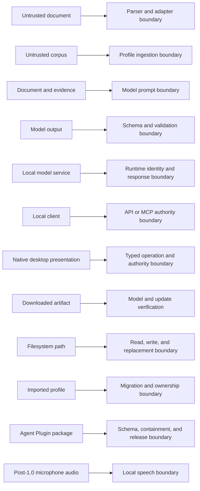

# Security and privacy

## Security objective

Protect the user's writing corpus, profile, documents, credentials, local services,
and profile-mutation authority while processing untrusted documents and untrusted
model output.

Local-first reduces disclosure to third-party services. It does not protect against
malware, insecure backups, shared-device access, compromised dependencies, or other
authorized local processes.

The security model does not include content surveillance for a provider, regulator,
employer, or platform. Core operation adds no content telemetry, mandatory provider
attribution, hidden source marker, remote content-policy check, or provider-controlled
kill switch. Users remain responsible for obligations that apply to their work, and
the project remains responsible for duties that apply to its own distribution. See
[Editorial sovereignty](governance/editorial-sovereignty.md).

## Primary assets

- Corpus text and metadata
- Inferred style features and immutable profile versions
- Declared rules and protected terms
- Input and output documents
- Rewrite records and retrieved evidence IDs
- Model artifacts and model licenses
- API, MCP, and profile-mutation credentials
- Encryption and content-identifier keys
- Update and release signing keys

A style profile can identify a person and can reveal sensitive topics, relationships,
organizations, habits, and vocabulary. It is sensitive even when raw samples are not
present.

## Trust boundaries

Document text and profile samples are data, not instructions. The generation model
has no tools, network, filesystem, credential, or profile-mutation authority.

## Threats and required controls

### Prompt injection in documents or samples

Risks:

- A document instructs the model to ignore constraints.
- Retrieved evidence asks the model to reveal other samples.
- A candidate injects Markdown, URLs, or structured content.

Controls:

- Delimit content and instructions through structured requests.
- Use the smallest relevant evidence set.
- Redact or mask sensitive strings where possible.
- Give the model no external authority.
- Treat output as untrusted and pass it through every parser and gate.
- Reject novel entities, quantities, links, and executable constructs.
- Never learn automatically from model output.

### Malicious Markdown

Risks include raw HTML, executable links, parser differentials, bidi controls, and
syntax introduced by rewritten punctuation.

Controls:

- Keep raw HTML, link destinations, code, autolinks, and unsupported constructs
  byte-identical.
- Escape for the exact inline context.
- Reparse after edits.
- Compare structure and non-target bytes.
- Render imported and generated content as text in the desktop application.
- Detect Unicode control and bidi characters and report them without silently
  normalizing legitimate source content.

### Terminal escape injection

Risks include ANSI CSI styling, OSC hyperlinks, terminal-title changes, clipboard
sequences, C0 and C1 controls, misleading carriage returns, and bidirectional text in
interactive diffs or diagnostics.

Controls:

- Reject candidate-introduced control characters that are not required source data.
- Preserve and flag protected source controls without executing them.
- Escape untrusted content in interactive diffs, previews, errors, and traces.
- Emit exact raw content only to a non-terminal stream, a file, or an explicit raw
  terminal mode with a double opt-in and warning.
- Keep diagnostics structurally separate from rewritten data.
- Test CSI, OSC 8 hyperlinks, OSC 52 clipboard operations, title changes, carriage
  return overwrites, C1 controls, and bidi isolates.

### Clipboard authority and rich content

Clipboard access is user initiated and limited to plain text. The desktop grants
separate read-text and write-text authority only to the rewrite workbench window.
The CLI requests clipboard access only through an explicit mutually exclusive flag.

Required controls:

- Never poll the clipboard, read it at startup, monitor history, or treat clipboard
  content as profile evidence.
- Never render or convert clipboard HTML or RTF under a preservation claim.
- Prefer an available plain representation and visibly state that rich formatting
  was not imported. Reject rich-only, image, and file-list content without mutation.
- Write only a complete validated plain-text result.
- Bound size and neutralize terminal, bidirectional, NUL, and control content through
  the same input and presentation policies.
- Denial, unavailable clipboard, and headless use return typed outcomes and leave the
  editor and operating-system clipboard unchanged.

### Malicious DOCX and ZIP input

Risks include ZIP bombs, path traversal, XML entity expansion, external
relationships, macros, embedded objects, fields, and signature invalidation.

Controls:

- Parse package entries in memory or through bounded streams without extracting
  paths.
- Bound file size, entry count, per-entry size, total expansion, compression ratio,
  XML depth, processing time, and memory.
- Disable DTD and external entities.
- Never resolve external relationships.
- Reject `.docm`, encrypted files, signed documents, and unsupported active features.
- Preserve unknown parts opaquely.
- Verify relationships, content types, XML, and untouched-part hashes.

### Profile poisoning and feedback collapse

Risks:

- Generated text becomes evidence and progressively replaces the user's style.
- A single imported document dominates the profile.
- Malicious imported profiles alter protected terms or service configuration.

Controls:

- Require ownership or authorization confirmation.
- Keep immutable evidence provenance.
- Never ingest raw candidates.
- Treat acceptance as a preference signal only.
- Require explicit confirmation for derivative user-edited output.
- Cap contribution per document, session, and topic.
- Keep configuration, credentials, and executable settings outside portable profiles.
- Validate and migrate imported profiles in a restricted schema.
- Preview changes before activating a new profile version.
- Treat embedding output as untrusted, disable truncation, and validate dimensions,
  finite values, normalization, model identity, and profile isolation.
- Recheck embedding identity before and after every batch, discard drifted batches,
  and require requalification and reindexing.
- Distinguish retrieval-ineligible evidence from profile-influence exclusion,
  consent revocation, and deletion. The first invalidates retrieval snapshots only;
  the latter three invalidate their complete permitted derivation closure across
  observations, vectors, retrieval, and compiled views.
- Isolate retrieval by profile, consent, channel, and authorization before scoring.
- Test rare phrase, unique n-gram, entity, quantity, canary, and cross-profile
  extraction behavior.

### Local API and MCP exposure

Risks:

- Another local site or process invokes rewriting or reads a profile.
- A service is accidentally bound to a network interface.
- A learning handle is guessed or replayed.

Controls:

- Bind to loopback only for 1.0 and reject non-loopback configuration before socket
  creation.
- Require high-entropy local authentication, Host and Origin validation, and narrow
  CORS policy for HTTP.
- Require authentication for health and capability routes and disclose no model,
  profile, path, build, scope, or configuration data before authentication.
- Separate rewrite, profile-read, profile-write, and administrative authority.
- Use opaque, scoped, expiring, revocable, principal-bound, tamper-resistant learning
  handles. A handle is not authentication.
- Bound body size, concurrency, tokens, candidates, time, and retries.
- Bound frames, queues, writers, server-sent-event consumers, and response bytes.
- Set every authenticated HTTP success and error response to
  `Cache-Control: no-store`.
- Keep tokens out of URLs and process arguments, store them with operating-system
  protection and restrictive permissions, redact logs and crash reports, and support
  rotation, revocation, and deletion.
- Do not log prompts, content, profiles, or credentials by default.
- Inference capability discovery carries only exact output-schema digests. Raw
  structured-completion requests and responses redact prompt and generated content
  from debug formatting, bind the complete request, enforce byte ceilings and exact
  artifact identity, and require a transport-derived complete terminal result. The
  returned JSON remains
  untrusted and has no rewrite or semantic authority until a domain strategy parses
  and validates it.

MCP Streamable HTTP uses a documented custom loopback bearer profile for 1.0 rather
than standard MCP OAuth authorization. Standard authorization conformance is
explicitly excluded. Every named HTTP client must inject the token. Missing or
invalid credentials return 401 with a bearer challenge; insufficient scope returns
403. Standard input remains the preferred integration when token injection is not
available.

The 1.0 response-compatibility adapter is offline and makes no upstream requests. A
future outbound proxy or remote backend requires a separate threat-model update,
host allowlist, credential-redaction policy, and explicit network consent.

An optional hosted provider-mark diagnostic is a separate post-acceptance network
operation. It is disabled by default, never receives content through ordinary
rewrite authority, shows the exact service and selected source or final artifact,
and records applicable retention terms before consent. Its response cannot trigger
generation, retries, ranking, acceptance, profile mutation, or output replacement.

### Filesystem writes

Risks include symlink attacks, overwrite ambiguity, locked files, partial writes, and
cross-device rename behavior.

Controls:

- Output to standard output or a new path by default.
- Resolve and inspect exact targets before in-place work.
- Create the temporary file in the destination directory.
- Flush and use a platform-tested replacement operation.
- Preserve permissions intentionally.
- Reject ambiguous symlink and case-collision situations.
- Provide a recoverable backup policy.
- Test Windows file locks and replacement behavior explicitly.
- Freeze a directory manifest before work and reject traversal, escaping links,
  recursive output inclusion, duplicate canonical paths, case collisions, and stale
  source digests.
- Use a separate output root by default and never delete a source tree as part of a
  rewrite.
- Make document and selection atomicity explicit and retain staged recovery state.
- Offline artifact-file import opens the final source entry without following a
  symlink or Windows reparse point, accepts only a regular file, and streams into a
  create-new reserved staging name containing 128 random bits. It verifies manifest
  size and digest and commits without replacing an existing content-addressed file.
- Import applies caller-owned managed-entry and byte ceilings. Exact-name scans honor
  cancellation, and capacity is rechecked after the final caller callback before a
  canonical entry is linked.
- One exclusive storage lock serializes staging recovery and import. Recovery
  removes only bounded, direct regular reserved staging names and fails closed on a
  link, reparse point, or non-regular reserved entry. The storage root, lock,
  staging directory, and artifact directory remain pinned across caller callbacks;
  Unix managed child operations use those held boundaries. Windows child opens and
  metadata checks are handle-relative; hard-link commit and cleanup are path-backed
  within the pinned root and qualified on the continuous-integration NTFS
  configuration. The configured artifact root must be local, application-owned
  storage; network filesystem semantics are not qualified.
- Durable artifact state is registered only after the final file and containing
  directories are synchronized and the final canonical bytes and held boundary
  identities are silently reverified on Windows, macOS, and Linux. Successful
  return is the completion signal, and no caller callback runs after that final
  verification begins. Staging and canonical managed bytes must have exactly one
  filesystem name, so an external hard-link alias fails closed. A state failure can
  leave an unregistered content-addressed file, never a record pointing to bytes
  that did not commit.
- Read-only artifact inventory takes the lifecycle lock in shared mode, reads a
  bounded and integrity-validated state snapshot, freezes exact raw directory
  entries, and hashes only canonical direct regular files within per-file and total
  ceilings. It follows no symlink or reparse point, never resolves a persisted
  storage key as a path, rejects external hard-link aliases as managed authority,
  and emits only aggregate counts for malformed raw names. Its application result
  replaces store-owned installation records with exact persistence-neutral artifact
  identity and generation keys before reaching the repository facade or CLI.
- The inventory repeats the complete entry snapshot, checks stable metadata around
  each hash, and requires a matching second bounded state snapshot. Concurrent
  changes fail the operation without a partial report. On Windows, child opens and
  metadata checks are handle-relative, but enumeration is path-backed. Held handles
  deny ancestor replacement for the continuous-integration NTFS configuration;
  other Windows filesystem drivers are not yet qualified.
  A verified orphan is only a point-in-time candidate. Any later repair or removal
  must reacquire the exclusive lock and reverify the exact entry. Network filesystem
  replacement and locking semantics remain unqualified.
- Selected orphan reconciliation accepts only a complete exact manifest, derives the
  canonical digest name internally, and takes the lifecycle lock exclusively. It
  ignores prior inventory evidence as authority, requires one direct regular
  single-name file, and applies caller-owned entry and byte ceilings.
- After the last byte-progress callback, reconciliation silently checks the hashed
  file's stable identity and single-name status, synchronizes the file, reopens and
  rechecks the exact entry, synchronizes the artifact directory, and revalidates the
  held storage layout. It atomically inserts any missing exact
  manifest and installation records or confirms that both existing records match
  while retaining the verified file handle. It never changes or deletes managed
  bytes, qualifies or activates the artifact, or accesses the network. Cancellation
  or state failure before commit leaves the orphan unchanged.
- Inactive removal accepts one exact store-issued installation generation and holds
  the lifecycle lock exclusively. It reverifies canonical size, SHA-256, stable
  identity, exact lowercase name, and single-name status, and refuses any active
  binding before durable preparation.
- The state store writes a prepared removal journal and revokes installed-state
  authority in one immediate transaction before byte deletion. Both the preparation
  and completion transitions require a live non-cloneable exclusive lifecycle-lock
  capability. Only after exact
  absence, artifact-directory synchronization, and held-layout revalidation does it
  mark the operation completed. A prepared operation is resumed rather than
  cancelled, and generation ordering prevents an old retry from deleting a later
  reinstall.
- Unix removal uses the pinned artifact-directory descriptor and the cooperating
  Retonr lifecycle lock. It does not yet claim identity-bound protection against a
  non-cooperating same-user process that swaps the final name. Windows removal uses
  delete authority on the already-verified file and the reviewed safe `fs_at`
  delete-by-handle wrapper. This target-only Apache-2.0 dependency is retained for
  that narrow capability; its internal Windows disposition implementation,
  read-only handling, and transitive `windows-sys` 0.52 tree remain explicit
  supply-chain review items. Every runtime
  use of managed bytes must retain a verified shared lifecycle lease; removal takes
  the exclusive lock. The operation is not secure erasure and cannot remove external
  copies, backups, caches, loaded runtime memory, or provider data.
- The application opens the exact lifecycle-lock entry through its pinned storage
  root, clones that same handle into the opaque exclusive capability, and retains
  the original handle for layout fingerprint checks. The store cannot prepare or
  complete removal without a live capability reference. The capability proves that
  its handle is exclusively locked; the surrounding pinned application boundary
  proves that handle is the selected repository lock.
- The administrative artifact CLI requires one explicit data directory. Its
  repository facade derives all child paths, takes an outer shared or exclusive lock,
  pins the direct single-link SQLite state file before opening it, and rechecks exact
  identity after the service call. On Unix, the adapter resolves a canonicalizable
  existing parent before SQLite opens it, preserves the original final filename, and
  retains SQLite's no-follow flag. If resolution fails, it retains the original path
  and no-follow behavior so SQLite fails closed. This permits macOS system directory
  aliases while still refusing an indirect final state file.
  Existing commands require the current exact schema and do not migrate it. Only
  first import may reserve and synchronize a new empty state file before initializing
  the current schema.
- First initialization creates only one missing private repository leaf below an
  existing pinned parent, or accepts an empty existing directory without changing its
  permissions. A nonempty uninitialized `--data-dir` is refused without mutation.
- The implemented model commands are offline and content-redacted. They expose no
  implicit home-directory repository, remote URL, download, runtime pull,
  qualification, activation, or model execution. The current CLI installs a Ctrl-C
  handler, and process-level fixtures on Windows, macOS, and Linux prove that an
  interrupt requests cooperative cancellation and returns the typed cancellation
  exit before import registration. Prepared-removal recovery remains non-cancellable
  and process termination still relies on crash-safe state plus explicit recovery.

### Agent Plugin packages

Risks include manifest confusion, escaping package paths, shell command injection,
ambient credentials, executable skew, untrusted updates, and authority implied by
skill instructions.

Controls:

- Pin and locally validate Agent Plugins `plugin.json` and `mcp.json` schemas by
  exact digest without fetching them during load.
- Resolve manifests, skills, references, assets, commands, and working directories
  inside the package root across symlinks, junctions, and reparse points.
- Use one executable token plus separate arguments and no shell command string.
- Keep credentials, profiles, models, user content, absolute user paths, remote
  endpoints, and executable helper scripts out of the routine package.
- Prove validation, discovery, inspection, and installation execute nothing and
  access no network.
- Treat format validity separately from source, signatures, updates, anti-rollback,
  permissions, sandboxing, executable compatibility, and named-client behavior.
- Enforce routine rewrite authority inside the server. Prompt text, skill metadata,
  client consent presentation, and package installation grant no privileged scope.

### Model and update supply chain

Controls:

- Never pull a model implicitly during rewrite.
- Require explicit installation or offline import.
- Record source URL, upstream revision, artifact digest, size, quantization,
  tokenizer, prompt, output schema, license, runtime, and supported languages.
- Treat artifact-set, runtime-build, effective-state, and effective-package records as
  content-addressed evidence vocabulary, not authority. Effective-package decoding
  must reload and cross-check all three referenced records, exact member-purpose
  coverage, and managed or attached-attested mode. A digest does not prove a retained
  receipt is truthful or complete.
- Treat qualification v2 as inert evidence. Its bounded decoder must reload and
  cross-check the artifact set, effective-package evidence, runtime build, and effective
  state. Its distinct identifier and lack of an authorization operation keep it outside
  v1 activation. Future persistence must repeat the relationship checks, and future use
  must hold application-owned live attestation and lease authority through post-call
  drift checks.
- Verify checksums before activation.
- Treat runtime model listings, templates, license text, and capabilities as untrusted
  discovery data rather than qualification evidence.
- Accept loopback model endpoints only in the first adapter, disable system proxies
  and redirects, and recheck selected artifact identity before and after generation.
- Invalidate qualification on artifact, runtime, template, tokenizer, parameter,
  evaluator, calibration, or locked-suite change.
- Pin code dependencies and continuous-integration tools.
- Run vulnerability and license policy checks.
- Sign release artifacts and publish checksums and attestations.
- Separate local and cloud model choices in configuration and traces.

### Desktop authority and updates

Controls:

- Use an installed native Rust UI with no embedded browser, HTML or JavaScript
  frontend, hosted application, or ordinary-operation local HTTP dependency.
- Explicitly list presentation commands and enforce application-level scope checks.
- Test every privileged operation with allowed and denied identities, resources, and
  operation owners.
- Expose no broad shell, process, HTTP, opener, or filesystem authority to views.
- Bundle local presentation assets and render imported or generated content only as
  untrusted text.
- Route external links through a narrow typed allowlist and user confirmation.
- Use operation IDs and monotonic event sequences to reject stale UI events.
- Keep update checks explicit, separate from core operation, and application-owned.
- Back up update signing keys offline and document rotation, loss, revocation, and
  recovery.
- Verify every update signature and reject downgrade by default.

### Post-1.0 voice privacy

Controls:

- Request microphone permission just in time.
- Show an unambiguous recording indicator.
- Use push-to-talk by default.
- Process locally.
- Remove audio from application-controlled buffers and storage immediately after
  transcription by default.
- Require explicit opt-in and retention controls for saved audio.
- Require the user to edit or confirm the transcript before it can become evidence.
- Keep audio callbacks on preallocated bounded buffers with no allocation, blocking,
  logging, file I/O, IPC, or inference.
- Keep PCM inside the narrow native audio boundary and out of presentation event
  channels.
- Review runtime, model, voice, and phonemizer licenses independently.
- Keep a complete typed path.
- Do not use voice identity, speaker recognition, or voice cloning.
- Do not implement always-listening capture, wake words, or simultaneous microphone
  and speech output in the first voice capability.

## Impersonation and misuse

The project is intended for a user's own authorized style. Risks include targeted
impersonation, phishing, spam, academic misconduct, harassment, and unauthorized
profile sharing.

Product controls:

- No bundled public-figure or third-party profiles
- Ownership and authorization confirmation during ingestion
- Clear profile export warnings
- Separate authority for profile mutation
- Local API concurrency and rate limits
- Auditable evidence provenance and rewrite records
- User-visible change review for consequential content
- Documentation that does not position the product as a detector-evasion service

An open-source license cannot prevent every misuse. The design should avoid making
abusive presets, silent bulk impersonation, or exposed network services the default.

## Data lifecycle

The user can:

- Inspect all evidence and derived features
- Exclude evidence from retrieval or all profile influence
- Create and compare immutable versions
- Export a portable profile with a clear sensitivity warning
- Delete evidence, embeddings, profile versions, traces, audio, and cached artifacts
- Verify removal from application-controlled active storage through a local report

Backups and exported profiles are outside automatic deletion. The interface explains
that limitation. SQLite freelists, write-ahead logs, temporary files, application
backups, crash dumps, swap, operating-system caches, and storage-device recovery are
part of the storage decision and test plan. Cryptographic erasure is used where
selected encryption permits it. No interface claims guaranteed physical erasure
outside application-controlled storage.

Default rewrite records avoid raw text. Plain hashes of short content can be guessed,
so equality identifiers should use a local keyed construction or remain disabled.
Completed grounded calls attach a redacted generation record containing identifiers,
digests, counts, and optional resource observations. It excludes raw prompts and
content, but its unkeyed digests can still permit dictionary attacks on predictable
inputs and must not be described as anonymized.

## Encryption

Encryption at rest is a required design decision, not an unchecked claim. The spike
must address:

- Windows credential storage
- macOS Keychain
- Linux secret services and headless systems
- Passphrase fallback and recovery
- Key rotation
- Backup and export encryption
- Database migrations
- Crash safety
- What metadata remains visible

No release should claim encrypted profiles until the full matrix is implemented and
tested.

## Provenance handling

Rerendering changes content and can invalidate or remove an existing provenance
binding. The system should:

1. Detect supported incoming credentials before normalization.
2. Record their type and validation status without copying sensitive content into
   default traces.
3. Warn when the requested transformation invalidates the binding.
4. Preserve a source reference as an ingredient or local rewrite-record relationship
   where the applicable standard supports it.
5. Optionally create a derived-output credential only through a separately reviewed
   signing design.
6. Never claim that source provenance survived merely because visible text looks
   similar.

The source remains unchanged. A recognized binding that would be invalidated blocks
by default until the user selects a qualified derivative workflow. Invisible
Unicode is classified before sanitation because a sequence can carry a C2PA text
manifest, language shaping, directionality, accessibility state, or a security
risk. The complete scanner, derivative, sanitation, and reporting requirements are
defined in [Provenance, marking, and derivative handling](provenance.md).

Source-form decorrelation research stays outside live ranking and product promises.

## Regulatory review

The EU AI Act Article 50 transparency obligations took effect in August 2026.
Provider obligations, standard-editing exceptions, deployer obligations, and human
editorial responsibility differ. Product modes may transform content to different
degrees.

Before public release, qualified counsel should assess:

- Whether the project or a distributor is a provider for each distribution model
- Which modes fall within an editing exception
- Required machine-readable marking behavior
- Public-interest text disclosure workflows
- Treatment of imported and derived provenance
- Open-source distribution and model-provider responsibilities
- Privacy obligations for style profiles and corpora

The software and documentation do not provide legal advice or promise compliance
before that review.

## Security testing

- Threat model review at every version gate
- Dependency, advisory, and license scans on every pull request
- Fuzzing for every parser and deserializer
- Resource-exhaustion fixtures
- Authorization matrix tests
- Origin and loopback binding tests
- Redaction tests for logs and errors
- Profile import and migration tests
- Atomic-write and symlink tests on all platforms
- Native desktop operation and authority review
- Agent Plugin schema, containment, source, signature, and update tests
- Signed-package and update verification tests

A public security policy and private disclosure path are required before the first
public beta.

## References

- [EU AI Act](https://eur-lex.europa.eu/eli/reg/2024/1689/oj?locale=en)
- [European Commission Article 50 guidance](https://digital-strategy.ec.europa.eu/en/faqs/transparency-obligations-under-article-50-ai-act)
- [NIST synthetic content report](https://www.nist.gov/publications/reducing-risks-posed-synthetic-content-overview-technical-approaches-digital-content)
- [C2PA 2.4](https://spec.c2pa.org/specifications/specifications/2.4/specs/C2PA_Specification.html)
- [Agent Plugins specification](https://agent-plugins.org/specification)
- [MCP security best practices](https://modelcontextprotocol.io/docs/2026-07-28/tutorials/security/security_best_practices)
