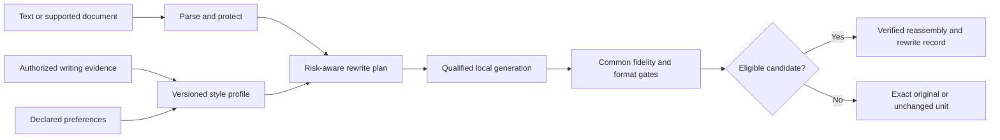

# Retonr

Local-first, fidelity-gated re-expression of generated and rough drafts in your own
writing style.

Less remote exposure. Less editorial slop. More of your style. More control over
the final expression.

Retonr reconstructs eligible prose with a local model instead of carrying upstream
wording forward unchanged. It uses authorized writing evidence and explicit rules to
move a draft toward your voice, then rejects candidates that do not preserve the
facts, protected content, structure, and formatting it can verify.

It treats generated, delegated, and rough text as drafts. The product applies the
same kind of bounded editorial refinement a person might apply to an intern's draft,
authorized notes, or an existing report, but does so consistently across larger
inputs. The user remains the final editor.

Model providers are tools in that process, not permanent governors or presumptive
authors of the finished expression. Retonr is built to help a person turn authorized
source material into work they understand, direct, and are prepared to stand behind.
It does not convert copied material into owned material or decide legal authorship.

It can reduce supported source-wording signals and document artifacts that remain in
a copied or generated draft. It cannot erase provider logs, prove human authorship,
or guarantee the result of a watermark detector or classifier.

## Opinionated by design

Retonr is biased toward privacy, freedom of expression, creative agency, and user
control. It rejects provider paternalism as a product default: mandatory remote
inspection, hidden output shaping, content telemetry, provider branding, or the
premise that using a model grants its operator continuing editorial authority over
downstream expression.

This is a product position, not a claim that source rights, contracts, disclosure
duties, or applicable law disappear. Retonr states what it changes, preserves the
source, keeps uncertain claims bounded, and leaves the final editorial decision with
the user.

## How it works



Generation proposes. The engine validates, selects, or abstains. Style quality never
compensates for a fidelity failure.

## Current status

Retonr is an early implementation, not a finished writing application. The current
model-free slice includes versioned Rust contracts, plain-text parsing and
reassembly, protected values, deterministic candidate gates, semantic assessment,
lexicographic selection, document-atomic abstention, redacted records, a
candidate-check CLI, durable artifact-state transactions, non-destructive offline
artifact-file import, read-only managed-artifact inventory, and positive and
hard-negative evaluation fixtures. The artifact services are not exposed through
the CLI yet.

The evaluation tool also validates two synthetic editorial-quality groups with named
findings and clean controls, including a balanced 24-case current-slop group. No
editorial-lint rule has product authority yet.

[](docs/screenshots/cli-check-linux.md)

Run the current slice from the repository:

```console
cargo run --locked -p retonr-cli -- check fixtures/cli/source.txt fixtures/cli/candidate.txt --format text
cargo run --locked -p rewrite-eval -- crates/eval/fixtures/core.json
cargo run --locked -p rewrite-eval -- --editorial-corpus crates/eval/fixtures/editorial_quality_v1.json
cargo run --locked -p rewrite-eval -- --editorial-corpus crates/eval/fixtures/editorial_slop_v1.json
```

The first command validates a caller-supplied complete candidate without invoking a
model. The second runs the checked-in fidelity suite. The final two validate the
synthetic editorial-quality groups and emit only content-free summaries. The planned
lint engine, rewrite, profile, model-management CLI, agent, and desktop workflows are
not yet implemented.

## Product surfaces

The completed product is planned around one application service:

- A scriptable CLI with files, multiline standard input, explicit plain-text
  clipboard operations, non-destructive folder transactions, structured output,
  diff, dry-run, recovery, change reports, and stable exit categories
- MCP over standard input, thin Agent Skills, and a portable Agent Plugin package
  for local agents
- A versioned, authenticated, loopback-only JSON API and qualified MCP Streamable
  HTTP for consumers that cannot launch a local subprocess
- A cross-platform native Rust desktop application, built after the CLI and agent
  contracts without an embedded browser or hosted web application
- A narrow offline adapter for completed text-only assistant responses

The 1.0 compatibility adapter handles completed responses and never makes an
upstream model request. Completed-unit event streams graduate separately after their
framing, ordering, cancellation, and atomic-output contracts pass.

Windows, macOS, and Linux are first-class release targets. The first qualification
targets are a user-managed Ollama service and a pinned llama.cpp sidecar. LM Studio,
vLLM, MLX LM, and compatible local endpoints remain named candidates until their
runtime-specific identity and policy evidence passes. Models are recommended and
qualified by exact artifact set, runtime, language, mode, format, output policy, and
measured hardware class rather than by a mutable model name or API shape.

## Installation direction

Published builds will provide one PowerShell bootstrap command for Windows and one
POSIX shell bootstrap command for macOS and Linux. The installers will use signed,
checksummed release artifacts, default to a per-user no-admin location, support exact
version and inspect-first paths, and avoid silently installing runtimes or models.

The commands are intentionally not advertised as live until those release assets
and clean-install tests exist. See [Installation and distribution](docs/distribution.md)
for the planned contract.

## Language and format scope

Language, format, and transport support qualify independently. The 1.0 plan requires
English, at least one additional Latin-script language, and at least one
non-Latin-script language. Exact launch languages must earn support through separate
fidelity, style, resource, Unicode, and mixed-language evaluation.

Plain text preserves newline and final-newline state. Markdown uses verified source
splicing so bytes outside approved prose ranges remain unchanged. DOCX support is a
bounded declared subset and abstains on ambiguous formatting or unsupported package
features. Clipboard input is plain text until a separately qualified rich-text
adapter exists.

Long documents use a hierarchical transaction: model-free inventory, bounded
document guidance, small eligible-unit proposals, region consistency checks,
format-owned reassembly, and complete verification. File and folder inputs write to
a separate destination by default and produce a machine-readable change report.
Spreadsheet prose-cell rewriting is planned after 1.0; formulas and workbook
structure remain protected. JSON prose values, HTML text nodes, event streams, and
additional formats graduate through explicit adapters rather than a catch-all text
conversion.

## Documentation

| Area | Document |
| --- | --- |
| Product thesis and limits | [Product definition](docs/product.md) |
| Permanent product boundaries | [Product and engineering invariants](docs/invariants.md) |
| Editorial control and responsibility | [Editorial sovereignty](docs/governance/editorial-sovereignty.md) |
| Implemented behavior | [Current state](docs/current-state.md) |
| Components and data flow | [Architecture](docs/architecture.md) |
| CLI, native desktop, and interaction | [Product and interface design](docs/design.md) |
| Multiline, clipboard, API, MCP, and compatibility | [Input and integration surfaces](docs/interfaces.md) |
| Language and document preservation | [Language and format preservation](docs/language-and-format.md) |
| Large files and folder transactions | [Document transactions](docs/document-transactions.md) |
| Clarifying questions and evolving preferences | [Guided editorial brief](docs/editorial-brief.md) |
| Evaluation corpora | [Editorial-quality and watermark research corpora](docs/evaluation-corpora.md) |
| Runtime discovery and model evaluation | [Model and runtime support](docs/model-support.md) |
| Installers, signatures, updates, and targets | [Installation and distribution](docs/distribution.md) |
| Stack decisions | [Technology](docs/technology.md) |
| Evaluation and qualification | [Evaluation](docs/evaluation.md) |
| Security and privacy | [Security](docs/security.md) |
| Testing and quality gates | [Engineering quality](docs/quality.md) |
| Version order through 1.0 | [Roadmap](docs/roadmap.md) |
| Detailed phase execution | [Phase plans](docs/planning/README.md) |

The complete planning index, decision records, research ledger, governance drafts,
and review evidence are in [docs](docs/README.md).

## Product boundary

Retonr is not a detector-score optimizer, authorship certificate, compliance oracle,
or substitute for human review in high-stakes work. It learns only from writing the
user owns or is authorized to use. Core rewriting remains local and offline after
explicit model installation. It adds no first-party output watermark, mandatory
provider attribution, or content telemetry. Unsupported content, failed validation,
or disallowed uncertainty causes a typed abstention instead of a best-effort rewrite.

## License

Source code is licensed under [Apache-2.0](LICENSE). Model and native runtime
artifacts require separate source, license, identity, and qualification records
before activation or distribution.
