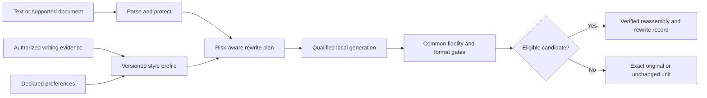
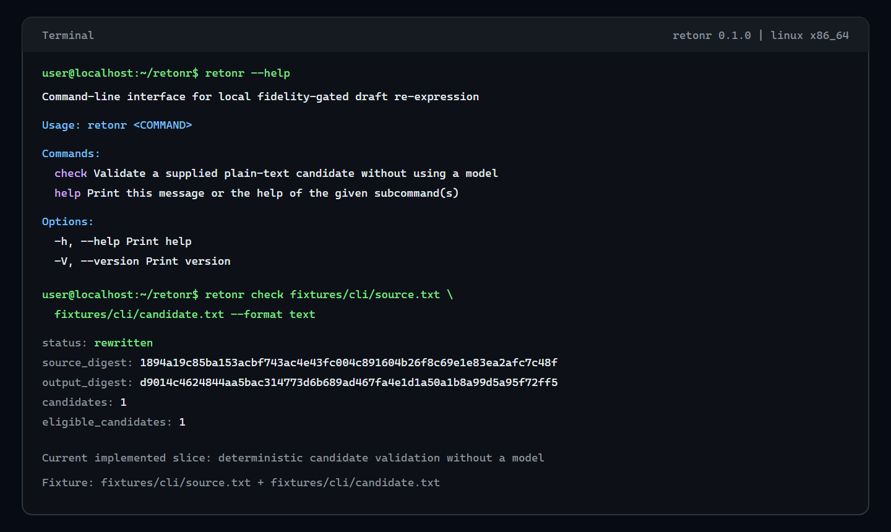

# Retonr

Own the final expression.

Retonr is a local-first editorial engine for reclaiming generated, delegated, and
rough drafts. It makes bounded changes to eligible prose so the result is less
generic and more recognizably yours. In each qualified format, source claims,
quantities, structure, formatting, formulas, links, protected terms, and other
content that must remain intact are constraints, not disposable context.

The pitch is simple:

- Bring a draft, document, or folder you are authorized to edit.
- Use a local or explicitly selected model runtime under your control.
- Make bounded editorial changes to eligible prose instead of blindly regenerating
  the whole artifact.
- Write to a separate destination, preserve the source, and report what changed.
- Reject a candidate or leave a unit unchanged when the required fidelity checks do
  not pass.

Less remote exposure. Less generic model prose. More of your style. The final
editorial decision stays under your control.

Retonr treats generated, delegated, and rough text as drafts, not declarations of
ownership by a model provider. It applies bounded editorial refinement like a careful
human editor, but makes that process inspectable and repeatable across larger inputs.
Generation proposes. Retonr validates, selects, or abstains. The user remains the
final editor.

Model providers are tools in that process, not permanent governors or presumptive
authors of the finished expression. Retonr is built to help a person turn authorized
source material into work they understand, direct, and are prepared to stand behind.
It does not convert copied material into owned material or decide legal authorship.

Upstream wording signals and provider-added artifacts do not gain editorial authority
merely because a tool produced the draft. Retonr handles supported signals explicitly
while preserving source claims and document integrity. It cannot establish that a
source claim is true, erase provider logs, prove human authorship, or guarantee a
detector or classifier result.

## Opinionated by design

Retonr is biased toward privacy, freedom of expression, creative agency, and user
control. It rejects provider paternalism as a product default: mandatory remote
inspection, hidden output shaping, content telemetry, provider branding, or the
premise that using a model grants its operator continuing editorial authority over
downstream expression.

Retonr does not treat a provider's statistical signal as an ownership claim or a
preservation requirement. Detector results do not guide live editing. Fidelity to the
user's meaning, constraints, and document integrity does.

Retonr opposes policy designs that make invisible provider marking a condition of
ordinary local expression or that disadvantage open weights and user-controlled
runtimes. People should be free to revise text they are authorized to edit into their
own voice. A provider's statistical signal is not a fidelity target for eligible
prose, and Retonr neither optimizes against that signal nor promises a detector
result.

This is a product position, not a claim that source rights, contracts, disclosure
duties, or applicable law disappear. Retonr states what it changes, preserves the
source, keeps uncertain claims bounded, and leaves the final editorial decision with
the user.

## Intended 1.0 control loop

The diagram is the intended product loop, not the current slice. Profiles and
qualified local generation are not implemented yet. Today the engine can validate a
caller-supplied candidate and administer exact local artifacts offline.



Generation proposes. The engine validates, selects, or abstains. Style quality never
compensates for a fidelity failure.

## Current status

Retonr is an early implementation, not a finished writing application. The current
slice includes versioned Rust contracts, plain-text parsing and reassembly, protected
values, deterministic candidate gates, a semantic assessment port, content-redacted
typed claim evidence, deterministic claim comparison, lexicographic selection,
document-atomic abstention, redacted records, a
candidate-check CLI, rewrite-record v2 generation provenance, durable artifact-state
transactions, non-destructive offline
artifact-file import, read-only managed-artifact inventory, and positive and
hard-negative evaluation fixtures. Selected orphan reconciliation independently
reverifies exactly one canonical managed file, then atomically inserts any missing
exact manifest and installation records or confirms that both existing records
match. Inactive removal uses an installation generation and durable journal so an
interrupted operation can resume and an old retry cannot delete a deliberate
reinstall. Runtime artifact leases hold the shared lifecycle lock for their full
use lifetime. A repository-owned artifact-set lease reverifies every member of a
registered managed set and holds the shared repository and storage locks for its
lifetime, so exclusive lifecycle operations cannot run beside it. Removal's durable state transitions require a live, non-cloneable
exclusive lifecycle-lock capability bound by the application to the exact pinned
repository lock entry. A narrow offline CLI now
exposes exact single-file import, exact artifact-set folder import, read-only
inventory, read-only set inventory, read-only pending-operation inspection, explicit
backup-backed state
migration, selected reconciliation, selected set reconciliation, inactive removal, and
explicit
interrupted-removal recovery. It does not download, qualify, activate, or run a
model. Single-file inventory, reconciliation, and removal do not inspect or mutate
managed artifact sets. Set inventory does not inspect or mutate single-file
artifacts and does not grant set authority. A cancellable application pair
extraction can collect and compare claim evidence from source and candidate
text. Completed comparison evidence can be joined onto an informational
engine shadow gate. That evidence has no acceptance authority and is not
semantic proof.

Artifact inventory crosses the application boundary through persistence-neutral
installation keys. SQLite records and storage-layout fields are not part of the CLI
contract.

The evaluation tool also validates five synthetic editorial-quality groups with named
findings and clean controls, including a balanced 24-case current-slop group, a
40-case structural, rhetorical, and evidential group, a 16-case assistant-impression
group, and a 20-case later-residue group. A writing-sample library adds licensed pre-2018 human excerpts and synthetic
model-style impressions. Those impressions are editorial fixtures, not vendor
identifications. No editorial-lint rule has product authority yet.

[](docs/screenshots/cli-check-linux.md)

Run the current slice from the repository:

```console
cargo run --locked -p retonr-cli -- check fixtures/cli/source.txt fixtures/cli/candidate.txt --format text
cargo run --locked -p retonr-cli -- check original.txt - --output checked.txt --format text
cargo run --locked -p retonr-cli -- check fixtures/cli/source.txt fixtures/cli/candidate.txt --diff --dry-run --format text
cargo run --locked -p retonr-cli -- rewrite fixtures/cli/source.txt --format text
cargo run --locked -p retonr-cli -- --data-dir <DIRECTORY> rewrite fixtures/cli/source.txt --format text
cargo run --locked -p retonr-cli -- inspect fixtures/cli/source.txt --format text
cargo run --locked -p retonr-cli -- version --format text
cargo run --locked -p retonr-cli -- doctor --format text
cargo run --locked -p retonr-cli -- --format text completions powershell
cargo run --locked -p retonr-cli -- --format text man
cargo run --locked -p retonr-cli -- model --help
cargo run --locked -p rewrite-eval -- crates/eval/fixtures/core.json
cargo run --locked -p rewrite-eval -- --baseline crates/eval/fixtures/no_rewrite_baseline_v1.json crates/eval/fixtures/core.json
cargo run --locked -p rewrite-eval -- --data-dir <DIRECTORY> --baseline <DIRECT_PROMPT_JSON> crates/eval/fixtures/core.json
cargo run --locked -p rewrite-eval -- --editorial-corpus crates/eval/fixtures/editorial_quality_v1.json
cargo run --locked -p rewrite-eval -- --editorial-corpus crates/eval/fixtures/editorial_slop_v1.json
cargo run --locked -p rewrite-eval -- --editorial-corpus crates/eval/fixtures/editorial_prose_v1.json
cargo run --locked -p rewrite-eval -- --editorial-corpus crates/eval/fixtures/editorial_model_impressions_v1.json
cargo run --locked -p rewrite-eval -- --editorial-corpus crates/eval/fixtures/editorial_assistant_residue_v1.json
cargo run --locked -p rewrite-eval -- --writing-samples crates/eval/fixtures/writing_samples/licensed_pre_ai_human_v1.json
cargo run --locked -p rewrite-eval -- --watermark-research crates/eval/fixtures/watermark_research/style_is_not_a_watermark_v1.json
cargo run --locked -p rewrite-eval -- --claim-shadow-calibration crates/eval/fixtures/claim_shadow_calibration_v1.json
```

The first command validates a caller-supplied complete candidate without invoking a
model. The second reads the candidate from standard input and writes the accepted
bytes, or the exact original after an abstention, to a new file. Either document may
come from standard input, but not both. An existing destination is never replaced and
the source is never modified. `--diff` writes an escaped comparison to standard
error. `--output -` writes exact bytes to a pipe. A terminal receives escaped
rendering unless `--raw-terminal --yes` both appear. `--dry-run` reports without
creating `--output`. `--trace` writes the redacted rewrite record to a new file.
`rewrite` validates one source, optionally inspects `--data-dir` for an
active generation binding, and attaches in-process fake-backend
conformance when that recovered qualification names the retained fake
backend. It does not start a runtime or use the network. `inspect` inventories one source file or directory before rewrite without
stripping bytes, following links, or validating a Content Credential.
`--recursive` is a bounded walk that skips hidden names, `target`, and
`node_modules`. `version` and `doctor` are recovery commands. `doctor` names migrate or removal-recovery
follow-up when `--data-dir` is current or requires migration; it does not
mutate. `completions` writes a shell script and `man`
writes a section-1 manual page; JSON wraps those bytes and `--format text`
emits them raw. `model --help`
lists the implemented offline artifact commands. The remaining commands run the
checked-in fidelity and synthetic editorial-quality suites, including an
offline no-rewrite baseline and an independent claim-shadow calibration that
cannot change hard-gate acceptance.
Profile, runtime management, agent, and desktop workflows are not yet implemented.

The implemented model commands are intentionally narrow:

```console
retonr --data-dir <DIRECTORY> model import <ARTIFACT> --manifest <MANIFEST_JSON>
retonr --data-dir <DIRECTORY> model import-set <SOURCE_ROOT> --manifest <MANIFEST_JSON>
retonr --data-dir <DIRECTORY> model list
retonr --data-dir <DIRECTORY> model inspect <ARTIFACT_ID>
retonr --data-dir <DIRECTORY> model inventory [--fail-on-findings]
retonr --data-dir <DIRECTORY> model inventory-set [--fail-on-findings]
retonr --data-dir <DIRECTORY> model pending-operations
retonr --data-dir <DIRECTORY> model migrate --yes
retonr --data-dir <DIRECTORY> model reconcile --manifest <MANIFEST_JSON>
retonr --data-dir <DIRECTORY> model reconcile-set --manifest <MANIFEST_JSON>
retonr --data-dir <DIRECTORY> model remove --artifact-id <SHA256> --installation-generation <N> --yes
retonr --data-dir <DIRECTORY> model recover-removal --artifact-id <SHA256> --installation-generation <N> --yes
retonr --data-dir <DIRECTORY> model remove-set --artifact-set-id <SHA256> --installation-generation <N> --yes
retonr --data-dir <DIRECTORY> model recover-set-removal --artifact-set-id <SHA256> --installation-generation <N> --yes
```

These commands are offline and bounded. `list` reports registered single-file
installations without storage-health findings. `inspect` reports one registered
artifact's declared facts, byte status, and active roles. Neither command
qualifies, activates, downloads, or reads as authority to mutate. `import-set` copies one exact local folder
that matches a canonical multi-file manifest, then records only inert structural
installation state. It does not reconcile, remove, qualify, activate, or
run a set. `inventory-set` is read-only set-root inspection and does not grant a
lease, qualify a package, or authorize a role. `reconcile-set` registers one exact
already-managed set root selected only by manifest. It does not copy, replace,
qualify, or activate. `remove-set` deletes one exact inactive set generation after
reverification and journals crash-recoverable preparation. `recover-set-removal`
forward-completes that journal. Neither command qualifies, activates, or leases
the set. `pending-operations` reads only durable
state and returns exact interrupted-removal recovery selections without reading or
hashing model bytes. `migrate` is the only command allowed to migrate state. It
requires confirmation, opens only an existing repository, holds both exclusive
lifecycle locks, creates, verifies, and retains a SQLite-consistent repository-owned
backup before migration, then reports its opaque key on success or in any post-backup
JSON failure.
Every other command requires the exact current schema. The commands never infer a
data location, pull a model, follow a mutable model tag, activate an artifact, or
treat a prior inventory report as mutation authority. First import creates one
missing repository leaf or accepts one empty directory; it refuses a nonempty
uninitialized directory and never changes permissions on a pre-existing root. JSON
is the default machine format; `--format text` provides concise human output.

## Product surfaces

The completed product is planned around one application service:

- A scriptable CLI with files, multiline standard input, explicit plain-text
  clipboard operations, non-destructive folder transactions, structured output,
  diff, dry-run, recovery, change reports, and stable exit categories
- MCP over standard input, thin Agent Skills, and a portable Agent Plugin package
  for local agents
- A versioned, authenticated, loopback-only JSON API and qualified MCP Streamable
  HTTP for consumers that cannot launch a local subprocess
- A cross-platform native Rust desktop application, built after the CLI and agent
  contracts without an embedded browser or hosted web application
- A narrow offline adapter for completed text-only assistant responses

Agent packaging targets the current Agent Plugins 1.0.0 Working Draft after the CLI
and MCP 2026-07-28 contracts stabilize. Open Knowledge Format 0.2 remains an optional,
experimental Markdown and YAML knowledge projection for redacted, portable views. It
is not Retonr's database, authorization model, inference transport, or execution
protocol.

The 1.0 compatibility adapter handles completed responses and never makes an
upstream model request. Completed-unit event streams graduate separately after their
framing, ordering, cancellation, and atomic-output contracts pass.

Windows, macOS, and Linux are first-class release targets. The first qualification
targets are a user-managed Ollama service and a pinned llama.cpp sidecar. LM Studio,
vLLM, MLX LM, and compatible local endpoints remain named candidates until their
runtime-specific identity and policy evidence passes. Models are recommended and
qualified by exact artifact set, runtime, language, mode, format, output policy, and
measured hardware class rather than by a mutable model name or API shape.

The first cross-tier development bakeoff targets Ministral 3 8B, Gemma 4 26B, and
Qwen3.6 27B. Gemma and Qwen are currently installed; the previously observed Ministral
package must be revalidated locally or separately reacquired before use. This is a local
experiment, not a support claim. Small and medium first-party GGUF cohorts follow only
after explicit acquisition approval. See the [local model tiers](docs/research/2026-08-13-local-model-tiers.md),
[evaluation protocol](docs/research/2026-08-13-local-model-evaluation.md), and
[runtime matrix](docs/research/2026-08-13-local-runtime-matrix.md).

Runtime discovery names the exact output-contract digests each adapter implements at
its transport boundary. This is not model qualification. A generic JSON-mode flag or
OpenAI-compatible transport is never treated as evidence that a Retonr schema is
admitted or qualified. The provider-neutral inference port can
return one bounded, terminal, syntactically valid JSON payload with observed runtime
and rechecked artifact identity; adapters and orchestrators must compare the runtime
with discovery. Domain strategies remain responsible for strict parsing and
semantic authority. Claim extraction is not connected to this port yet.

## Installation direction

Published builds will provide one PowerShell bootstrap command for Windows and one
POSIX shell bootstrap command for macOS and Linux. The installers will use signed,
checksummed release artifacts, default to a per-user no-admin location, support exact
version and inspect-first paths, and avoid silently installing runtimes or models.

The commands are intentionally not advertised as live until those release assets
and clean-install tests exist. See [Installation and distribution](docs/distribution.md)
for the planned contract.

## Language and format scope

Language, format, and transport support qualify independently. The 1.0 plan requires
English, at least one additional Latin-script language, and at least one
non-Latin-script language. Exact launch languages must earn support through separate
fidelity, style, resource, Unicode, and mixed-language evaluation.

Plain text preserves newline and final-newline state. Markdown uses verified source
splicing so bytes outside approved prose ranges remain unchanged. DOCX support is a
bounded declared subset and abstains on ambiguous formatting or unsupported package
features. Clipboard input is plain text until a separately qualified rich-text
adapter exists.

Long documents use a hierarchical transaction: model-free inventory, bounded
document guidance, small eligible-unit proposals, region consistency checks,
format-owned reassembly, and complete verification. File and folder inputs write to
a separate destination by default and produce a machine-readable change report.
Spreadsheet prose-cell rewriting is planned after 1.0; formulas and workbook
structure remain protected. JSON prose values, HTML text nodes, event streams, and
additional formats graduate through explicit adapters rather than a catch-all text
conversion.

## Documentation

| Area | Document |
| --- | --- |
| Product thesis and limits | [Product definition](docs/product.md) |
| Permanent product boundaries | [Product and engineering invariants](docs/invariants.md) |
| Editorial control and responsibility | [Editorial sovereignty](docs/governance/editorial-sovereignty.md) |
| Implemented behavior | [Current state](docs/current-state.md) |
| Components and data flow | [Architecture](docs/architecture.md) |
| CLI, native desktop, and interaction | [Product and interface design](docs/design.md) |
| Multiline, clipboard, API, MCP, and compatibility | [Input and integration surfaces](docs/interfaces.md) |
| Language and document preservation | [Language and format preservation](docs/language-and-format.md) |
| Large files and folder transactions | [Document transactions](docs/document-transactions.md) |
| Clarifying questions and evolving preferences | [Guided editorial brief](docs/editorial-brief.md) |
| Evaluation corpora | [Editorial-quality and watermark research corpora](docs/evaluation-corpora.md) |
| Writing samples and style impressions | [Writing-sample library](docs/evaluation-style-library.md) |
| Runtime discovery and model evaluation | [Model and runtime support](docs/model-support.md) |
| Installers, signatures, updates, and targets | [Installation and distribution](docs/distribution.md) |
| Testing a development snapshot build | [Snapshot testing guide](docs/testing-snapshot.md) |
| Stack decisions | [Technology](docs/technology.md) |
| Evaluation and qualification | [Evaluation](docs/evaluation.md) |
| Security and privacy | [Security](docs/security.md) |
| Testing and quality gates | [Engineering quality](docs/quality.md) |
| Version order through 1.0 | [Roadmap](docs/roadmap.md) |
| Detailed phase execution | [Phase plans](docs/planning/README.md) |

The complete planning index, decision records, research ledger, governance drafts,
and review evidence are in [docs](docs/README.md).

## Product boundary

Retonr is not a detector-score optimizer, authorship certificate, compliance oracle,
or substitute for human review in high-stakes work. It learns only from writing the
user owns or is authorized to use. Core rewriting remains local and offline after
explicit model installation. It adds no first-party output watermark, mandatory
provider attribution, or content telemetry. Unsupported content, failed validation,
or disallowed uncertainty causes a typed abstention instead of a best-effort rewrite.

## License

Source code is licensed under [Apache-2.0](LICENSE). Model and native runtime
artifacts require separate source, license, identity, and qualification records
before activation or distribution.
