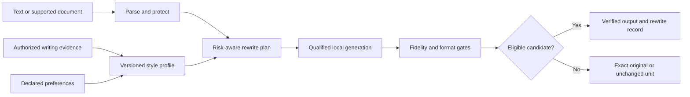

# Retonr

Own the final expression.

Retonr is a local-first editorial engine for authorized generated, delegated, and
rough drafts. It makes bounded changes to eligible prose while treating source
claims, quantities, structure, formatting, links, protected terms, and other
required content as constraints.

The intended workflow is simple:

- Bring a draft, document, or folder you are authorized to edit.
- Use a local or explicitly selected model runtime under your control.
- Make bounded editorial changes instead of regenerating the whole artifact.
- Preserve the source, write separately by default, and report what changed.
- Reject a candidate or leave a unit unchanged when fidelity checks do not pass.

Generation proposes. Retonr validates, selects, or abstains. The user remains the
final editor.

Retonr does not treat provider signals or detector results as ownership claims or
fidelity targets. It does not establish that a source claim is true, erase provider
records, prove human authorship, convert copied material into owned material, or
decide legal and disclosure obligations.

## Current status

Retonr is an early implementation, not a finished writing application. Milestone
0.1 technical evidence is complete and untagged. Milestone 0.2 is active.

Today the CLI can validate a caller-supplied candidate, run a model-free rewrite
transaction, inspect a plain-text source, administer exact local artifacts offline,
and run the checked-in evaluation suites. It does not download, qualify, activate,
or start a model. Qualified local generation, profiles, Markdown, DOCX, agents, and
the desktop application are not implemented.

Offline libraries can reconstruct an admitted Ollama model package and a reviewed
Linux Ollama runtime layout into inert schema-6 evidence. That evidence grants no
execution or qualification authority. The production cloud-disable allowlist is
empty. An exact Ollama v0.32.15 Linux CPU package candidate now has a machine-checked
[review disposition](docs/reviews/runtime-packages/ollama-v0.32.15-linux-x86_64-gnu/README.md).
Its transformation and license controls pass, but source lineage, external native
identity, managed startup, and cloud-disable observation remain blocked or unrun, so
the candidate is not admitted.

The authoritative crate inventory, CLI contract, evidence limits, and platform
matrix are in [Current state](docs/current-state.md). Planned work is described in
the [Roadmap](docs/roadmap.md) and [phase plans](docs/planning/README.md).

[](docs/screenshots/cli-check-linux.md)

## Run from source

The workspace pins Rust 1.97.1. From the repository root:

```console
cargo run --locked -p retonr-cli -- check fixtures/cli/source.txt fixtures/cli/candidate.txt
cargo run --locked -p retonr-cli -- check original.txt - -o checked.txt
cargo run --locked -p retonr-cli -- rewrite fixtures/cli/source.txt
cargo run --locked -p retonr-cli -- inspect fixtures/cli/source.txt
cargo run --locked -p retonr-cli -- doctor
cargo run --locked -p retonr-cli -- model --help
cargo run --locked -p rewrite-eval -- crates/eval/fixtures/core.json
```

`check` validates a complete candidate without invoking a model. An accepted
candidate can be written to a new destination; an abstention returns the exact
original. `rewrite` runs the current model-free transaction and never starts a
runtime. `inspect` performs pre-model inventory. The implemented `model` commands
manage caller-selected local artifacts without network access, qualification, or
activation. Evaluation commands run checked-in development suites and do not create
release qualification evidence.

Detailed flags, structured output, terminal safety, recovery behavior, and the
complete model command list are in [Current state](docs/current-state.md). Hands-on
snapshot guidance is in [Testing a development snapshot](docs/testing-snapshot.md).

## Intended control loop

The following is the intended 1.0 loop, not the current implementation:



Style quality never compensates for a fidelity failure. Probabilistic semantic
evidence cannot provide a formal preservation guarantee or override deterministic
hard gates.

## Next milestone work

The immediate 0.2 dependency order is:

1. Freeze and review one complete Ollama runtime package, including helpers, native
   dependencies, source, transformations, and license disposition.
2. Retain the managed process through generation and direct effective-state
   observation.
3. Join the exact runtime, model package, residency, and local-judge evidence, then
   add a separate candidate-generation receipt.
4. Run preregistered smoke, locked evaluation, repeatability, and supported-platform
   qualification.

Reconstructing a reviewed layout is not the package freeze. No runtime enters the
production allowlist until its complete review passes. The detailed handoff is in
the [0.2 grounded engine and CLI plan](docs/planning/0.2-grounded-cli.md).

## Installation and releases

There is no supported installer or milestone release yet. Development snapshots are
unsigned prereleases for hands-on testing, not production support claims. See
[GitHub releases](https://github.com/blisspixel/retonr/releases) for published
snapshots. Planned installers, signatures, update behavior, and the target matrix
are documented in [Installation and distribution](docs/distribution.md).

## Development quality gates

Before a change is complete, run:

```console
cargo fmt --check
cargo check --locked --workspace --all-targets --all-features
cargo clippy --locked --workspace --all-targets --all-features -- -D warnings
cargo test --locked --workspace --all-features
cargo test --locked --workspace --all-features --doc
./scripts/check-repository.ps1
npm ci --ignore-scripts
npm run lint:markdown
```

CI also builds release artifacts, smoke-tests fuzz targets, runs Linux network and
native-isolation gates, and enforces at least 80 percent implemented Rust line
coverage. See [Engineering quality](docs/quality.md) for the complete policy.

## Documentation

| Area | Document |
| --- | --- |
| Product thesis and limits | [Product definition](docs/product.md) |
| Permanent product boundaries | [Product and engineering invariants](docs/invariants.md) |
| Implemented behavior | [Current state](docs/current-state.md) |
| Components and trust boundaries | [Architecture](docs/architecture.md) |
| CLI and interaction contracts | [Product and interface design](docs/design.md) |
| Language and format preservation | [Language and format preservation](docs/language-and-format.md) |
| Runtime discovery and model evaluation | [Model and runtime support](docs/model-support.md) |
| Evaluation and qualification | [Evaluation](docs/evaluation.md) |
| Security and privacy | [Security](docs/security.md) |
| Version order and execution plans | [Roadmap](docs/roadmap.md) and [phase plans](docs/planning/README.md) |

The complete planning index, decision records, research ledger, governance drafts,
and review evidence are in the [documentation index](docs/README.md).

## License

Source code is licensed under [Apache-2.0](LICENSE). Model and native runtime
artifacts require separate source, license, identity, and qualification records
before activation or distribution.
