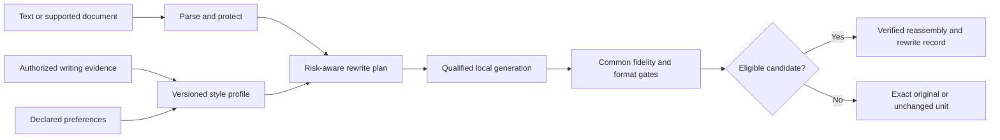

# Retonr

Own the final expression.

Retonr is a local-first editorial engine for reclaiming generated, delegated, and
rough drafts. It makes bounded changes to eligible prose so the result is less
generic and more recognizably yours. In each qualified format, source claims,
quantities, structure, formatting, formulas, links, protected terms, and other
content that must remain intact are constraints, not disposable context.

The pitch is simple:

- Bring a draft, document, or folder you are authorized to edit.
- Use a local or explicitly selected model runtime under your control.
- Make bounded editorial changes to eligible prose instead of blindly regenerating
  the whole artifact.
- Write to a separate destination, preserve the source, and report what changed.
- Reject a candidate or leave a unit unchanged when the required fidelity checks do
  not pass.

Less remote exposure. Less generic model prose. More of your style. The final
editorial decision stays under your control.

Retonr treats generated, delegated, and rough text as drafts, not declarations of
ownership by a model provider. It applies bounded editorial refinement like a careful
human editor, but makes that process inspectable and repeatable across larger inputs.
Generation proposes. Retonr validates, selects, or abstains. The user remains the
final editor.

Model providers are tools in that process, not permanent governors or presumptive
authors of the finished expression. Retonr is built to help a person turn authorized
source material into work they understand, direct, and are prepared to stand behind.
It does not convert copied material into owned material or decide legal authorship.

Upstream wording signals and provider-added artifacts do not gain editorial authority
merely because a tool produced the draft. Retonr handles supported signals explicitly
while preserving source claims and document integrity. It cannot establish that a
source claim is true, erase provider logs, prove human authorship, or guarantee a
detector or classifier result.

## Opinionated by design

Retonr is biased toward privacy, freedom of expression, creative agency, and user
control. It rejects provider paternalism as a product default: mandatory remote
inspection, hidden output shaping, content telemetry, provider branding, or the
premise that using a model grants its operator continuing editorial authority over
downstream expression.

Retonr does not treat a provider's statistical signal as an ownership claim or a
preservation requirement. Detector results do not guide live editing. Fidelity to the
user's meaning, constraints, and document integrity does.

Retonr opposes policy designs that make invisible provider marking a condition of
ordinary local expression or that disadvantage open weights and user-controlled
runtimes. People should be free to revise text they are authorized to edit into their
own voice. A provider's statistical signal is not a fidelity target for eligible
prose, and Retonr neither optimizes against that signal nor promises a detector
result.

This is a product position, not a claim that source rights, contracts, disclosure
duties, or applicable law disappear. Retonr states what it changes, preserves the
source, keeps uncertain claims bounded, and leaves the final editorial decision with
the user.

## Intended 1.0 control loop

The diagram is the intended product loop, not the current slice. Profiles and
qualified local generation are not implemented yet. Today the engine can validate a
caller-supplied candidate and administer exact local artifacts offline.



Generation proposes. The engine validates, selects, or abstains. Style quality never
compensates for a fidelity failure.

## Current status

Retonr is an early implementation, not a finished writing application. The current
slice includes versioned Rust contracts, plain-text parsing and reassembly, protected
values, deterministic candidate gates, a semantic assessment port, content-redacted
typed claim evidence, deterministic claim comparison, lexicographic selection,
document-atomic abstention, redacted records, a
candidate-check CLI, rewrite-record v2 generation provenance, durable artifact-state
transactions, non-destructive offline
artifact-file import, read-only managed-artifact inventory, and positive and
hard-negative evaluation fixtures. Selected orphan reconciliation independently
reverifies exactly one canonical managed file, then atomically inserts any missing
exact manifest and installation records or confirms that both existing records
match. Inactive removal uses an installation generation and durable journal so an
interrupted operation can resume and an old retry cannot delete a deliberate
reinstall. Runtime artifact leases hold the shared lifecycle lock for their full
use lifetime. A repository-owned artifact-set lease reverifies every member of a
registered managed set and holds the shared repository and storage locks for its
lifetime, so exclusive lifecycle operations cannot run beside it. Removal's durable state transitions require a live, non-cloneable
exclusive lifecycle-lock capability bound by the application to the exact pinned
repository lock entry. A narrow offline CLI now
exposes exact single-file import, exact artifact-set folder import, read-only
inventory, read-only set inventory, read-only pending-operation inspection, explicit
backup-backed state
migration, selected reconciliation, selected set reconciliation, inactive removal, and
explicit
interrupted-removal recovery. It does not download, qualify, activate, or run a
model. Single-file inventory, reconciliation, and removal do not inspect or mutate
managed artifact sets. Set inventory does not inspect or mutate single-file
artifacts and does not grant set authority. A cancellable application pair
extraction can collect and compare claim evidence from source and candidate
text. Completed comparison evidence can be joined onto an informational
engine shadow gate. That evidence has no acceptance authority and is not
semantic proof.

The model layer also has strict runtime-package, model-package, package-source,
transformation, and native-load evidence contracts. SQLite schema 6 persists those
immutable records without backfilling or granting authority to older state. A
separate offline application service can reconstruct the supported Ollama
manifest-v2 and GGUF-v3 shape into one canonical six-member model package, publish
it through the existing exact set import, and read back the semantic package
manifest. Imported package evidence remains inert: it does not qualify, activate,
lease, load, or execute the model, and it is not exposed as a snapshot CLI command.
Runtime-package and model-package leases independently revalidate exact managed
bytes. The runtime lease retains executable-code file objects for handle-based
launch and Linux native-load observation.

A separate development-only binding can join that inert model import to one exact
verified idle Ollama v0.32.15 inventory entry and model-details observation. It checks
the production backend identity `ollama_native`, reviewed source revision
`b7871fc0d1d82fe109536efa3e0e8e411c766c75`, version-scoped manifest-size rule,
and exact manifest, GGUF, license, format, and unique template relationships. This is
static import-to-inventory evidence only. The binding must consume the opaque,
nonserializable, single-use receipt issued by the exact preflight runner for its plan
and report; a caller-constructed report alone is insufficient. Its report keeps model
loaded, model used, application handler, effective identity, and qualification false,
and it has no CLI surface.

Artifact inventory crosses the application boundary through persistence-neutral
installation keys. SQLite records and storage-layout fields are not part of the CLI
contract.

The evaluation tool runs 49 deterministic fidelity and structure cases with exact
status, reason, and output expectations, category pass counts, and transformation
coverage. It also validates 120 synthetic editorial-quality cases across five groups
with named findings and clean controls: a 20-case core editorial-quality group, a
balanced 24-case current-slop group, a 40-case structural, rhetorical, and evidential
group, a 16-case assistant-impression group, and a 20-case later-residue group. A
writing-sample library adds licensed
pre-2018 human excerpts and synthetic model-style impressions. Those impressions are
editorial fixtures, not vendor identifications. A versioned hybrid scorecard now
executes two exact deterministic suites, binds their complete plan and fixed gate
policy, and normalizes blinded, order-swapped, caller-declared structured
observations into redacted triage results. A provider-neutral judge-output contract
now admits one bounded choice, sorted rubric clauses, and validated cited byte spans.
A separate typed local-judge executor runs deterministic gates first, then both
blinded presentation orders over one already-preflighted retained Ollama stream. It
returns the same caller-declared, triage-only scorecard plus a deliberately
nonserializable receipt that binds the exact retained preflight, request and response
digests, and response ordinals. The receipt does not prove managed isolation,
application-handler execution, model load or use, candidate generation, effective
runtime identity, semantic correctness, or qualification. Deterministic gates and
human adjudication retain release authority. None of these judge libraries has a CLI
execution surface. A versioned local Ollama preflight
can observe or verify bounded runtime, inventory, model-description, and residency
evidence without generation. A separate attached preflight brackets that observation
with point-in-time native listener-owner, process-incarnation, and executable evidence
on Windows and Linux. macOS fails closed because the required public unprivileged
listener-owner API is unavailable. A third, separate bound preflight sends the same
ordered read-only observation over one directly connected and retained HTTP/1
transport. Before traffic and after every fully drained response, it requires the
platform observer to attribute the exact reverse established connection to the
retained process evidence. The base, attached, and bound reports remain unqualified.
The attached report remains explicitly response-unbound. The bound report states
that neither exclusive socket ownership nor application-handler execution is proven.
Linux attached listener and connection row selection use bounded
`NETLINK_SOCK_DIAG` with exact tuple, UID, inode, interface, and retained socket
cookie checks; visible same-UID descriptor ownership is still subject to host
visibility policy. A separate Linux managed-isolation library can launch an exact
retained executable inside user, network, and PID namespaces, bring up loopback as
the only interface, reduce privileges, retain the process tree, capture bounded
startup output, and return one namespace-local loopback stream plus socket-diagnostics
capability. Before target launch, the namespace init installs a target-inherited
seccomp socket allowlist: `socket()` permits only `AF_INET` and `AF_INET6`, every
other socket family is denied, and `io_uring_setup` is denied. Target reobservation
also requires seccomp mode 2. The managed Linux attestor consumes the namespace-local
capability and exact launch facts. A development-only `rewrite-eval` library API now
joins the retained runtime package, managed launch and isolation, process and
connection evidence, exact cloud-disable declaration and startup marker, read-only
Ollama observation, and native-load evidence in one Linux-only managed preflight. It
reobserves the retained boundaries and closes the managed process tree on every
outcome. The report is inert and unqualified, is not exposed as a CLI command, and
explicitly does not prove the application handler, exclusive socket ownership, model
load or use, or effective runtime identity. These Linux boundaries are supported when
host namespace and process-visibility policy permit them. Windows managed isolation
and exact native-load binding are unsupported. macOS managed isolation, attached
attribution, and native-load binding are unsupported.

An opt-in managed-preflight API now returns that unchanged version 1 report with a
separate redacted, inert build binding. It constructs a typed `RuntimeBuildIdentity`
from package declarations after the managed package, process, and native-load join.
Only the exact package entrypoint is joined to the managed process and native-load
evidence. Runtime target, revision, and other package semantics are not independently
observed from the live process. The process tree is already closed when the outcome
returns. The binding does not construct `EffectiveRuntimeState`; it records missing
generation-bound provider, effective output configuration, platform and driver,
compute placement, effective context, and retained-live-runtime evidence. Model load
or use, application handler, effective state, and qualification remain false.

The retained Ollama session also has a separate opt-in v0.32.15 residency profile at
that exact source revision. After an idle preflight it sends the exact `version`,
`tags`, `show`, `generate`,
`ps`, `version`, `tags`, `show`, `ps` sequence with explicit `keep_alive: 5m` and
requires two equal singleton runtime memory reports for the exact reference, manifest
digest, and requested context. Its nonserializable receipt proves only stable
runtime-reported post-generation residency on that retained transport. Runtime memory
size is not package inventory size. Application handler, model use, resident-page
identity, effective identity, and qualification remain false. The legacy
seven-response completion path is unchanged. Both retained-session completion paths
enforce an absolute 4 MiB UTF-8 input ceiling before wire serialization or any
completion request traffic.

The Ollama adapter has strict, version-gated provider cloud-disable evidence that
joins an exact runtime-package identity, managed `OLLAMA_NO_CLOUD=1` declaration,
and one bounded startup marker. Its production reviewed-runtime allowlist is empty,
and provider evidence explicitly reports that network isolation is not enforced and
the runtime is not qualified. No editorial-lint rule has product authority yet.

[](docs/screenshots/cli-check-linux.md)

Run the current slice from the repository:

```console
cargo run --locked -p retonr-cli -- check fixtures/cli/source.txt fixtures/cli/candidate.txt
cargo run --locked -p retonr-cli -- check original.txt - -o checked.txt
cargo run --locked -p retonr-cli -- check fixtures/cli/source.txt fixtures/cli/candidate.txt --diff --dry-run
cargo run --locked -p retonr-cli -- rewrite fixtures/cli/source.txt
cargo run --locked -p retonr-cli -- -D <DIRECTORY> rewrite fixtures/cli/source.txt
cargo run --locked -p retonr-cli -- inspect fixtures/cli/source.txt
cargo run --locked -p retonr-cli -- version
cargo run --locked -p retonr-cli -- doctor
cargo run --locked -p retonr-cli -- -f text completions powershell
cargo run --locked -p retonr-cli -- -f text man
cargo run --locked -p retonr-cli -- model --help
cargo run --locked -p rewrite-eval -- crates/eval/fixtures/core.json
cargo run --locked -p rewrite-eval -- --baseline crates/eval/fixtures/no_rewrite_baseline_v1.json crates/eval/fixtures/core.json
cargo run --locked -p rewrite-eval -- --data-dir <DIRECTORY> --baseline <DIRECT_PROMPT_JSON> crates/eval/fixtures/core.json
cargo run --locked -p rewrite-eval -- --editorial-corpus crates/eval/fixtures/editorial_quality_v1.json
cargo run --locked -p rewrite-eval -- --editorial-corpus crates/eval/fixtures/editorial_slop_v1.json
cargo run --locked -p rewrite-eval -- --editorial-corpus crates/eval/fixtures/editorial_prose_v1.json
cargo run --locked -p rewrite-eval -- --editorial-corpus crates/eval/fixtures/editorial_model_impressions_v1.json
cargo run --locked -p rewrite-eval -- --editorial-corpus crates/eval/fixtures/editorial_assistant_residue_v1.json
cargo run --locked -p rewrite-eval -- --writing-samples crates/eval/fixtures/writing_samples/licensed_pre_ai_human_v1.json
cargo run --locked -p rewrite-eval -- --watermark-research crates/eval/fixtures/watermark_research/style_is_not_a_watermark_v1.json
cargo run --locked -p rewrite-eval -- --claim-shadow-calibration crates/eval/fixtures/claim_shadow_calibration_v1.json
cargo run --locked -p rewrite-eval -- --hybrid-scorecard <PLAN_JSON_FILE> --candidate-a-suite <SUITE_JSON_FILE> --candidate-b-suite <SUITE_JSON_FILE> --judge-observations <BATCH_JSON_FILE>
cargo run --locked -p rewrite-eval -- --ollama-preflight <PLAN_JSON_FILE>
cargo run --locked -p rewrite-eval -- --ollama-attested-preflight <PLAN_JSON_FILE>
cargo run --locked -p rewrite-eval -- --ollama-bound-preflight <PLAN_JSON_FILE>
```

The first command validates a caller-supplied complete candidate without invoking a
model. The second reads the candidate from standard input and writes the accepted
bytes, or the exact original after an abstention, to a new file. Either document may
come from standard input, but not both. An existing destination is never replaced.
`--in-place` (`-i`) retains a sibling `<name>.retonr-backup` and then replaces a
regular source file. Standard input, `--output`, and symlinks are refused.
`--diff` writes an escaped comparison to standard
error. `-o -` writes exact bytes to a pipe. A terminal receives escaped
rendering unless `--raw-terminal --yes` both appear. `--dry-run` reports without
creating `--output`. `--trace` writes the redacted rewrite record to a new file.
A terminal defaults to text reports; a pipe defaults to JSON. `-f` selects
either. `rewrite` validates one source, supports `--diff`, `--dry-run`, and
`--trace`, and can dry-run a directory onto `--output-dir` without
mutation. It optionally inspects `--data-dir` (`-D`,
or `RETONR_DATA_DIR`) for an
active generation binding, and attaches in-process fake-backend
conformance when that recovered qualification names the retained fake
backend. It does not start a runtime or use the network. `inspect` inventories one source file or directory before rewrite without
stripping bytes, following links, or validating a Content Credential.
`-r` is a bounded walk that skips hidden names, `target`, and
`node_modules`. `version` and `doctor` are recovery commands. `doctor` names migrate or removal-recovery
follow-up when `--data-dir` is current or requires migration; it does not
mutate. `completions` writes a shell script and `man`
writes a section-1 manual page; a terminal emits them raw and `-f json`
wraps them. `model --help`
lists the implemented offline artifact commands. The remaining commands run the
checked-in fidelity and synthetic editorial-quality suites, including an
offline no-rewrite baseline and an independent claim-shadow calibration that
cannot change hard-gate acceptance. The hybrid scorecard command executes both
exact deterministic suites itself, rejects corpus, policy, plan, candidate, or
observation drift, and emits a content-free report. Successful output still requires
human adjudication and is not release qualification. The Ollama preflight accepts only an explicit
IP-literal loopback endpoint and frozen model inventory digests. It reads runtime
state without generation, acquisition, activation, or qualification. The attached
preflight adds an exact expected executable digest in verify mode, but does not bind
HTTP responses to the observed process or construct runtime-build identity. The
bound preflight wraps the same plan with executable and aggregate session ceilings.
It requires an expected executable digest in verify mode and forbids one in observe
mode. It opens one direct TCP connection, performs one HTTP/1 handshake, and has no
DNS, proxy, redirect, pool, retry, or reconnect path. Successful output contains a
redacted process witness, a redacted connection-attribution sequence, and an opaque
binding digest. Windows evidence uses the exact established row's context-binding
PID. Linux evidence uses the exact socket inode and exactly one visible same-user
descriptor holder. These APIs do not prove exclusive ownership, hidden holders, or
which application handler produced a response. macOS refuses the bound command
before HTTP because no admitted public unprivileged tuple-to-process API is
available. The report remains inert and `qualified: false`; it creates no runtime,
package, qualification, activation, or role identity. The
[plan contract and observe-to-verify workflow](docs/research/2026-08-20-main-readiness-and-next-slice.md#plan-contract-and-workflow)
documents the base plan. The
[attached-process witness review](docs/research/2026-08-20-attached-process-witness.md)
documents the native evidence and attached-plan extension. The
[retained connection decision](docs/decisions/0009-retained-connection-attribution.md)
defines the bound contract, limitations, and next trust-boundary work.
Profile, runtime management, agent, and desktop workflows are not yet implemented.

The next trust-boundary sequence is dependency ordered:

1. Freeze and review one complete Ollama runtime package, including its helpers,
   native dependencies, source, transformations, and license disposition. The model
   reconstruction path exists, but imported model evidence remains inert and no
   exact runtime package is admitted by the cloud-disable policy.
2. Extend the managed operation so its process remains retained through execution and
   effective-state observation. Join the proven runtime build, v0.32.15 static model
   binding, exact model-package lease, residency receipt, and local-judge receipt while
   directly observing the six effective-state relationships listed above. This is the
   next priority because the current managed outcome completes cleanup before return,
   and neither static inventory nor runtime-reported residency proves model use.
3. Add a separate candidate-generation receipt over that same retained runtime and
   model boundary. Keep the serializable scorecard caller-declared and triage-only;
   all separate receipts establish bounded equality relationships, not semantic
   correctness or qualification.
4. Run the 169-case development foundation, then freeze and run smoke, the locked
   hybrid scorecard, repeatability, and supported-platform
   qualification in that order. Deterministic fidelity and structure gates run
   first, and human adjudication retains release authority. Windows and macOS require
   separate admitted isolation and native-load designs before the Linux managed claim
   can be broadened.

The implemented model commands are intentionally narrow:

```console
retonr -D <DIRECTORY> model import <ARTIFACT> -m <MANIFEST_JSON>
retonr -D <DIRECTORY> model import-set <SOURCE_ROOT> -m <MANIFEST_JSON>
retonr -D <DIRECTORY> model list
retonr -D <DIRECTORY> model inspect <ARTIFACT_ID>
retonr -D <DIRECTORY> model inventory [--fail-on-findings]
retonr -D <DIRECTORY> model inventory-set [--fail-on-findings]
retonr -D <DIRECTORY> model pending
retonr -D <DIRECTORY> model migrate -y
retonr -D <DIRECTORY> model reconcile -m <MANIFEST_JSON>
retonr -D <DIRECTORY> model reconcile-set -m <MANIFEST_JSON>
retonr -D <DIRECTORY> model remove --artifact <SHA256> --generation <N> -y
retonr -D <DIRECTORY> model recover --artifact <SHA256> --generation <N> -y
retonr -D <DIRECTORY> model remove-set --set-id <SHA256> --generation <N> -y
retonr -D <DIRECTORY> model recover-set --set-id <SHA256> --generation <N> -y
retonr model fitr <EVIDENCE_JSON>
```

These commands are offline and bounded. Optional [fitr](https://github.com/blisspixel/fitr)
device-measurement evidence can be inspected with `retonr model fitr` without a
repository; it is not a qualification, and Retonr works without fitr. `list` reports registered single-file
installations without storage-health findings. `inspect` reports one registered
artifact's declared facts, byte status, and active roles. Neither command
qualifies, activates, downloads, or reads as authority to mutate. `import-set` copies one exact local folder
that matches a canonical multi-file manifest, then records only inert structural
installation state. It does not reconcile, remove, qualify, activate, or
run a set. `inventory-set` is read-only set-root inspection and does not grant a
lease, qualify a package, or authorize a role. `reconcile-set` registers one exact
already-managed set root selected only by manifest. It does not copy, replace,
qualify, or activate. `remove-set` deletes one exact inactive set generation after
reverification and journals crash-recoverable preparation. `recover-set-removal`
forward-completes that journal. Neither command qualifies, activates, or leases
the set. `pending-operations` reads only durable
state and returns exact interrupted-removal recovery selections without reading or
hashing model bytes. `migrate` is the only command allowed to migrate state. It
requires confirmation, opens only an existing repository, holds both exclusive
lifecycle locks, creates, verifies, and retains a SQLite-consistent repository-owned
backup before migration, then reports its opaque key on success or in any post-backup
JSON failure.
Every other command requires the exact current schema. The commands never infer a
data location, pull a model, follow a mutable model tag, activate an artifact, or
treat a prior inventory report as mutation authority. First import creates one
missing repository leaf or accepts one empty directory; it refuses a nonempty
uninitialized directory and never changes permissions on a pre-existing root. JSON
is the default machine format; `--format text` provides concise human output.

## Product surfaces

The completed product is planned around one application service:

- A scriptable CLI with files, multiline standard input, explicit plain-text
  clipboard operations, non-destructive folder transactions, structured output,
  diff, dry-run, recovery, change reports, and stable exit categories
- MCP over standard input, thin Agent Skills, and a portable Agent Plugin package
  for local agents
- A versioned, authenticated, loopback-only JSON API and qualified MCP Streamable
  HTTP for consumers that cannot launch a local subprocess
- A cross-platform native Rust desktop application, built after the CLI and agent
  contracts without an embedded browser or hosted web application
- A narrow offline adapter for completed text-only assistant responses

Agent packaging targets the current Agent Plugins 1.0.0 Working Draft after the CLI
and MCP 2026-07-28 contracts stabilize. Open Knowledge Format 0.2 remains an optional,
experimental Markdown and YAML knowledge projection for redacted, portable views. It
is not Retonr's database, authorization model, inference transport, or execution
protocol.

The 1.0 compatibility adapter handles completed responses and never makes an
upstream model request. Completed-unit event streams graduate separately after their
framing, ordering, cancellation, and atomic-output contracts pass.

Windows, macOS, and Linux are first-class release targets. The first qualification
experiment is one Retonr-managed exact Ollama package on Linux hosts that admit the
required namespace boundary. A user-managed Ollama service remains attached
observation-only. A pinned llama.cpp sidecar and every Windows or macOS managed path
remain future qualification work. LM Studio, vLLM, MLX LM, and compatible local
endpoints remain named candidates until their runtime-specific identity and policy
evidence passes. Models are recommended and qualified by exact artifact set, runtime,
language, mode, format, output policy, and measured hardware class rather than by a
mutable model name or API shape.

The August 13 cross-tier development plan targeted Ministral 3 8B, Gemma 4 26B,
and Qwen3.6 27B. That local inventory has expired: an August 20 read-only inspection
found those tags absent and observed `qwen3.8:27b` without establishing its exact
upstream revision, complete artifact-set identity, or local-only runtime controls.
No current tag is a support claim or generation-eligible package. Small and medium
first-party GGUF cohorts follow only after explicit acquisition approval. See the
[main readiness and next-slice review](docs/research/2026-08-20-main-readiness-and-next-slice.md),
[attached-process witness review](docs/research/2026-08-20-attached-process-witness.md),
[effective runtime trust-chain review](docs/research/2026-08-21-effective-runtime-trust-chain/context.md),
[local model tiers](docs/research/2026-08-13-local-model-tiers.md),
[evaluation protocol](docs/research/2026-08-13-local-model-evaluation.md), and
[runtime matrix](docs/research/2026-08-13-local-runtime-matrix.md).

Runtime discovery names the exact output-contract digests each adapter implements at
its transport boundary. This is not model qualification. A generic JSON-mode flag or
OpenAI-compatible transport is never treated as evidence that a Retonr schema is
admitted or qualified. The provider-neutral inference port can
return one bounded, terminal, syntactically valid JSON payload with observed runtime
and rechecked artifact identity; adapters and orchestrators must compare the runtime
with discovery. Domain strategies remain responsible for strict parsing and
semantic authority. Claim extraction is not connected to this port yet.

## Installation direction

Published builds will provide one PowerShell bootstrap command for Windows and one
POSIX shell bootstrap command for macOS and Linux. The installers will use signed,
checksummed release artifacts, default to a per-user no-admin location, support exact
version and inspect-first paths, and avoid silently installing runtimes or models.

The commands are intentionally not advertised as live until those release assets
and clean-install tests exist. See [Installation and distribution](docs/distribution.md)
for the planned contract.

## Language and format scope

Language, format, and transport support qualify independently. The 1.0 plan requires
English, at least one additional Latin-script language, and at least one
non-Latin-script language. Exact launch languages must earn support through separate
fidelity, style, resource, Unicode, and mixed-language evaluation.

Plain text preserves newline and final-newline state. Markdown uses verified source
splicing so bytes outside approved prose ranges remain unchanged. DOCX support is a
bounded declared subset and abstains on ambiguous formatting or unsupported package
features. Clipboard input is plain text until a separately qualified rich-text
adapter exists.

Long documents use a hierarchical transaction: model-free inventory, bounded
document guidance, small eligible-unit proposals, region consistency checks,
format-owned reassembly, and complete verification. File and folder inputs write to
a separate destination by default and produce a machine-readable change report.
Spreadsheet prose-cell rewriting is planned after 1.0; formulas and workbook
structure remain protected. JSON prose values, HTML text nodes, event streams, and
additional formats graduate through explicit adapters rather than a catch-all text
conversion.

## Documentation

| Area | Document |
| --- | --- |
| Product thesis and limits | [Product definition](docs/product.md) |
| Permanent product boundaries | [Product and engineering invariants](docs/invariants.md) |
| Editorial control and responsibility | [Editorial sovereignty](docs/governance/editorial-sovereignty.md) |
| Implemented behavior | [Current state](docs/current-state.md) |
| Components and data flow | [Architecture](docs/architecture.md) |
| CLI, native desktop, and interaction | [Product and interface design](docs/design.md) |
| Multiline, clipboard, API, MCP, and compatibility | [Input and integration surfaces](docs/interfaces.md) |
| Language and document preservation | [Language and format preservation](docs/language-and-format.md) |
| Large files and folder transactions | [Document transactions](docs/document-transactions.md) |
| Clarifying questions and evolving preferences | [Guided editorial brief](docs/editorial-brief.md) |
| Evaluation corpora | [Editorial-quality and watermark research corpora](docs/evaluation-corpora.md) |
| Writing samples and style impressions | [Writing-sample library](docs/evaluation-style-library.md) |
| Runtime discovery and model evaluation | [Model and runtime support](docs/model-support.md) |
| Installers, signatures, updates, and targets | [Installation and distribution](docs/distribution.md) |
| Testing a development snapshot build | [Snapshot testing guide](docs/testing-snapshot.md) |
| Stack decisions | [Technology](docs/technology.md) |
| Evaluation and qualification | [Evaluation](docs/evaluation.md) and [hybrid scorecard plan](docs/research/2026-08-21-hybrid-rewrite-evaluation.md) |
| Security and privacy | [Security](docs/security.md) |
| Testing and quality gates | [Engineering quality](docs/quality.md) |
| Version order through 1.0 | [Roadmap](docs/roadmap.md) |
| Detailed phase execution | [Phase plans](docs/planning/README.md) |

The complete planning index, decision records, research ledger, governance drafts,
and review evidence are in [docs](docs/README.md).

## Product boundary

Retonr is not a detector-score optimizer, authorship certificate, compliance oracle,
or substitute for human review in high-stakes work. It learns only from writing the
user owns or is authorized to use. Core rewriting remains local and offline after
explicit model installation. It adds no first-party output watermark, mandatory
provider attribution, or content telemetry. Unsupported content, failed validation,
or disallowed uncertainty causes a typed abstention instead of a best-effort rewrite.

## License

Source code is licensed under [Apache-2.0](LICENSE). Model and native runtime
artifacts require separate source, license, identity, and qualification records
before activation or distribution.
