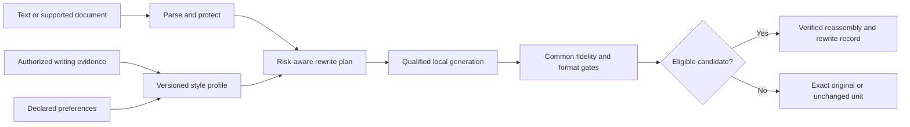
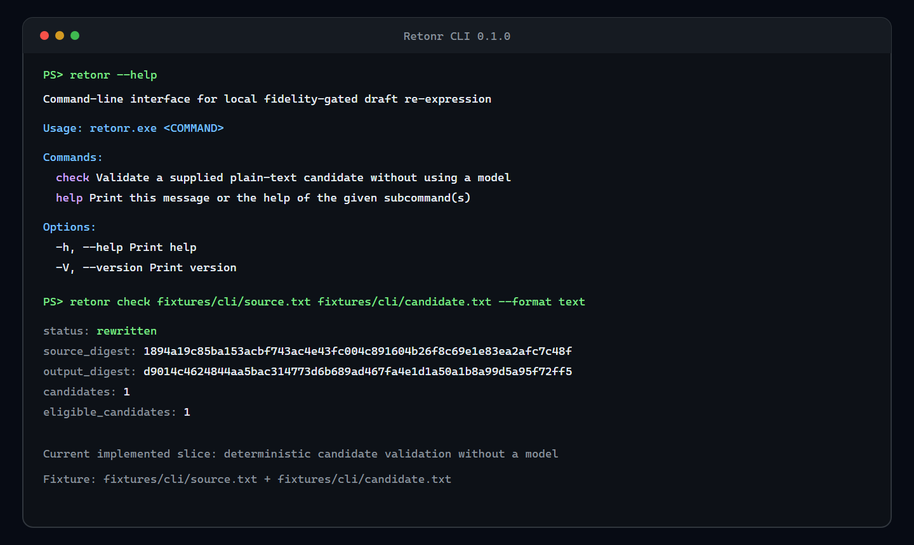

# Retonr

Local-first, fidelity-gated re-expression of generated and rough drafts in your own
writing style.

Retonr reconstructs eligible prose with a local model instead of carrying upstream
wording forward unchanged. It uses authorized writing evidence and explicit rules to
move a draft toward your voice, then rejects candidates that do not preserve the
facts, protected content, structure, and formatting it can verify.

It can reduce supported source-wording signals and document artifacts that remain in
a copied or generated draft. It cannot erase provider logs, prove human authorship,
or guarantee the result of a watermark detector or classifier.

## How it works



Generation proposes. The engine validates, selects, or abstains. Style quality never
compensates for a fidelity failure.

## Current status

Retonr is an early implementation, not a finished writing application. The current
model-free slice includes versioned Rust contracts, plain-text parsing and
reassembly, protected values, deterministic candidate gates, semantic assessment,
lexicographic selection, document-atomic abstention, redacted records, a
candidate-check CLI, and positive and hard-negative evaluation fixtures.



The image is a reproducible rendering of verbatim output from the current
release-optimized Windows build. It shows only implemented behavior. Capture details
and the exact commands are recorded in the
[screenshot metadata](docs/screenshots/cli-check-windows.md).

Run the current slice from the repository:

```console
cargo run --locked -p retonr-cli -- check fixtures/cli/source.txt fixtures/cli/candidate.txt --format text
cargo run --locked -p rewrite-eval -- crates/eval/fixtures/core.json
```

The first command validates a caller-supplied complete candidate without invoking a
model. The second runs the checked-in fidelity suite. The planned rewrite, profile,
model-management, service, and desktop workflows are not yet implemented.

## Product surfaces

The completed product is planned around one application service:

- A scriptable CLI with files, multiline standard input, explicit plain-text
  clipboard operations, structured output, diff, dry-run, and stable exit categories
- A cross-platform Tauri desktop application with accessible rewrite, profile,
  model, and local voice workflows
- A versioned, authenticated, loopback-only JSON API
- MCP over standard input and qualified Streamable HTTP for local agents
- Thin Agent Skills packages over the same API or MCP contract
- A narrow offline adapter for completed text-only assistant responses

The compatibility adapter is not a transparent LLM proxy. It does not rewrite
streams, tool calls, structured outputs, or multimodal events, and it never makes an
upstream model request.

Windows, macOS, and Linux are first-class release targets. Ollama is the first local
runtime adapter; a pinned llama.cpp sidecar is planned as a portable CPU and
accelerator fallback. Models are recommended and qualified by exact artifact,
runtime, language, mode, format, and measured hardware class rather than by a
mutable model name.

## Installation direction

Published builds will provide one PowerShell bootstrap command for Windows and one
POSIX shell bootstrap command for macOS and Linux. The installers will use signed,
checksummed release artifacts, default to a per-user no-admin location, support exact
version and inspect-first paths, and avoid silently installing runtimes or models.

The commands are intentionally not advertised as live until those release assets
and clean-install tests exist. See [Installation and distribution](docs/distribution.md)
for the planned contract.

## Language and format scope

Language support and format support qualify independently. The 1.0 plan requires
English, at least one additional Latin-script language, and at least one
non-Latin-script language. Exact launch languages must earn support through separate
fidelity, style, resource, Unicode, and mixed-language evaluation.

Plain text preserves newline and final-newline state. Markdown uses verified source
splicing so bytes outside approved prose ranges remain unchanged. DOCX support is a
bounded declared subset and abstains on ambiguous formatting or unsupported package
features. Clipboard input is plain text until a separately qualified rich-text
adapter exists.

## Documentation

| Area | Document |
| --- | --- |
| Product thesis and limits | [Product definition](docs/product.md) |
| Implemented behavior | [Current state](docs/current-state.md) |
| Components and data flow | [Architecture](docs/architecture.md) |
| CLI, desktop, voice, and interaction | [Product and interface design](docs/design.md) |
| Multiline, clipboard, API, MCP, and compatibility | [Input and integration surfaces](docs/interfaces.md) |
| Language and document preservation | [Language and format preservation](docs/language-and-format.md) |
| Runtime discovery and model evaluation | [Model and runtime support](docs/model-support.md) |
| Installers, signatures, updates, and targets | [Installation and distribution](docs/distribution.md) |
| Stack decisions | [Technology](docs/technology.md) |
| Evaluation and qualification | [Evaluation](docs/evaluation.md) |
| Security and privacy | [Security](docs/security.md) |
| Testing and quality gates | [Engineering quality](docs/quality.md) |
| Version order through 1.0 | [Roadmap](docs/roadmap.md) |
| Detailed phase execution | [Phase plans](docs/planning/README.md) |

The complete planning index, decision records, research ledger, governance drafts,
and review evidence are in [docs](docs/README.md).

## Product boundary

Retonr is not a generic humanizer, a detector-evasion service, or a substitute for
human review in high-stakes work. It learns only from writing the user owns or is
authorized to use. Core rewriting remains local and offline after explicit model
installation. Unsupported content, failed validation, or disallowed uncertainty
causes a typed abstention instead of a best-effort rewrite.

## License

Source code is licensed under [Apache-2.0](LICENSE). Model and native runtime
artifacts require separate source, license, identity, and qualification records
before activation or distribution.
