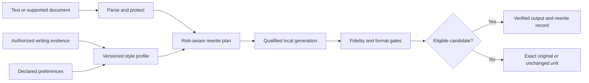

# Retonr

Own the final expression.

Retonr is a local-first editorial engine for authorized generated, delegated, and
rough drafts. It makes bounded changes to eligible prose while treating source
claims, quantities, structure, formatting, links, protected terms, and other
required content as constraints.

The intended workflow is simple:

- Bring a draft, document, or folder you are authorized to edit.
- Use a local or explicitly selected model runtime under your control.
- Make bounded editorial changes instead of regenerating the whole artifact.
- Preserve the source, write separately by default, and report what changed.
- Reject a candidate or leave a unit unchanged when fidelity checks do not pass.

Generation proposes. Retonr validates, selects, or abstains. The user remains the
final editor.

Retonr does not treat provider signals or detector results as ownership claims or
fidelity targets. It does not establish that a source claim is true, erase provider
records, prove human authorship, convert copied material into owned material, or
decide legal and disclosure obligations.

## Opinionated by design

Speech belongs to the speaker. Upstream wording produced by a model or rough draft
has zero authority over downstream expression. Watermarking hidden meaning,
tracking tokens, or statistical distributions into content is wrong. Rewriting in
your own voice provides creative agency and directly rejects unconsented hidden
tracking.

Retonr is biased toward privacy, freedom of expression, creative agency, and user
control. It rejects provider paternalism as a product default: mandatory remote
inspection, hidden output shaping, content telemetry, provider branding, or the
premise that using a model grants its operator continuing editorial authority over
downstream expression. Covert signals embedded in prose are unconsented tracking
mechanisms, not document fidelity targets. Retonr neither optimizes against
detector signals nor promises a detector evasion result.

This is a product position, not a claim that source rights, contracts, disclosure
duties, or applicable law disappear. Retonr states what it changes, preserves the
original, and lets you own the final copy. The complete boundary is in
[Editorial sovereignty and legal responsibility](docs/governance/editorial-sovereignty.md).

## Current status

Retonr is an early implementation, not a finished writing application. Milestone
0.1 technical evidence is complete, but the milestone remains open because its
release closeout has not been published. Reversible milestone 0.2 implementation is
active under the roadmap's run-ahead policy.

Today the CLI can validate a caller-supplied candidate, run a model-free rewrite
transaction, inspect a plain-text source, lint a document or compare it with a
candidate, administer exact local artifacts offline, and run the checked-in
evaluation suites. An experimental read-only terminal UI brings source inspection,
editorial lint, and supplied-candidate checking into one view. It does not download,
qualify, activate, or start a model. Qualified local generation, profiles, Markdown,
DOCX, agents, the complete terminal workbench, and the desktop application remain
pending. No model and runtime combination is qualified.

The planned 1.0 includes a scriptable CLI, an interactive terminal UI, and an
accessible native desktop application on Linux, macOS, and Windows. All three use
the same application core. The desktop uses no browser frontend or webview. Shared document intake,
bounded folder catalogs, and cancellable background review are implemented; the
native window and accessibility qualification remain planned.

The prose account of controlled builds, generation qualification, and the immediate
0.2 path is in [Development status](docs/development-status.md). The authoritative
crate inventory, CLI contract, evidence limits, and platform matrix are in
[Current state](docs/current-state.md). Planned work is in the
[Roadmap](docs/roadmap.md) and [phase plans](docs/planning/README.md).

[](docs/screenshots/cli-check-linux.md)

## Run from source

The workspace pins Rust 1.97.1. From the repository root:

```console
cargo run --locked -p retonr-cli -- check fixtures/cli/source.txt fixtures/cli/candidate.txt
cargo run --locked -p retonr-cli -- check original.txt - -o checked.txt
cargo run --locked -p retonr-cli -- check original.txt candidate.txt --edit-level voice-pass --max-chars 280 --max-expansion-pct 8
cargo run --locked -p retonr-cli -- check originals/ candidates/ --recursive --dry-run --fail-on-abstain
cargo run --locked -p retonr-cli -- lint draft.txt --format text
cargo run --locked -p retonr-cli -- lint draft.txt --candidate candidate.txt --fail-on-findings
cargo run --locked -p retonr-cli -- lint drafts/ --recursive --fail-on-findings
cargo run --locked -p retonr-cli -- tui draft.txt --candidate candidate.txt --protect Acme
cargo run --locked -p retonr-cli -- tui draft.txt --plain --format json
cargo run --locked -p retonr-cli -- tui drafts/ --candidate candidates/ --recursive
cargo run --locked -p retonr-cli -- tui drafts/ --recursive --document notes/draft.txt --plain --format json
cargo run --locked -p retonr-cli -- rewrite fixtures/cli/source.txt
cargo run --locked -p retonr-cli -- inspect fixtures/cli/source.txt
cargo run --locked -p retonr-cli -- doctor
cargo run --locked -p retonr-cli -- model --help
cargo run --locked -p rewrite-eval -- crates/eval/fixtures/core.json
cargo run --locked -p rewrite-eval -- --lint-corpus crates/eval/fixtures/editorial_slop_v1.json
cargo run --locked -p rewrite-eval -- --lint draft.txt
```

`check` validates a complete candidate without invoking a model. An accepted
candidate can be written to a new destination; an abstention returns the exact
original. Optional `--edit-level`, character budget, expansion ceiling, and line budget
flags enforce layout constraints. Read-only folder checks pair documents by exact
relative path and report missing or skipped counterparts. `lint` inspects one document or a bounded folder,
or compares one document with a candidate, for conversational residue, cliches,
and synthetic patterns. Folder recursion is explicit and reports skipped entries.
`rewrite`
runs the current model-free transaction and never starts a runtime. `inspect`
performs pre-model inventory. The implemented `model` commands manage
caller-selected local artifacts without network access, qualification, or
activation. Evaluation commands run checked-in development suites and do not
create release qualification evidence.

`tui` reviews one regular UTF-8 source file and an optional candidate, each limited
to 16 MiB, through the same application checks and lint service. It never writes
documents or generates text. Interactive use requires terminal stdin and stdout
and refuses JSON mode. `--plain` supports redirected text or JSON with bounded,
sanitized previews. Reload cancels the previous operation; terminal state is
restored on exit. `--recursive` enables bounded folder review with exact
relative-path candidate pairing; bracket keys select a document and `--document`
selects an exact path for interactive or plain review. Missing or unsupported
counterparts remain visible and never imply a candidate check. Profiles and
writing remain later work.

Detailed flags, structured output, terminal safety, recovery behavior, and the
complete model command list are in [Current state](docs/current-state.md). Hands-on
snapshot guidance is in [Testing a development snapshot](docs/testing-snapshot.md).

## Intended control loop

The following is the intended 1.0 loop, not the current implementation:


```mermaid
flowchart LR
    Input["Text or supported document"] --> Parse["Parse and protect"]
    Evidence["Authorized writing evidence"] --> Profile["Versioned style profile"]
    Rules["Declared preferences"] --> Profile
    Parse --> Plan["Risk-aware rewrite plan"]
    Profile --> Plan
    Plan --> Generate["Qualified local generation"]
    Generate --> Validate["Fidelity and format gates"]
    Validate --> Decision{"Eligible candidate?"}
    Decision -->|Yes| Output["Verified output and rewrite record"]
    Decision -->|No| Original["Exact original or unchanged unit"]
```

Style quality never compensates for a fidelity failure. Probabilistic semantic
evidence cannot provide a formal preservation guarantee or override deterministic
hard gates.

## Installation and releases

There is no supported installer or milestone release yet. Development snapshots are
unsigned prereleases for hands-on testing, not production support claims. See
[GitHub releases](https://github.com/blisspixel/retonr/releases) for published
snapshots. Planned installers, signatures, update behavior, and the target matrix
are documented in [Installation and distribution](docs/distribution.md).

## Development quality gates

For a fast local preflight, run:

```console
cargo fmt --check
cargo check --locked --workspace --all-targets --all-features
cargo clippy --locked --workspace --all-targets --all-features -- -D warnings
cargo test --locked --workspace --all-features
cargo test --locked --workspace --all-features --doc
./scripts/check-repository.ps1
npm ci --ignore-scripts
npm run lint:markdown
```

CI also builds release artifacts, smoke-tests fuzz targets, runs Linux network and
native-isolation gates, and enforces at least 80 percent implemented Rust line
coverage. A change is complete only after the full applicable command, platform,
coverage, dependency, documentation, and policy set in
[Engineering quality](docs/quality.md) passes.

## Documentation

| Area | Document |
| --- | --- |
| Product thesis and limits | [Product definition](docs/product.md) |
| Speaker, marking, and legal boundary | [Editorial sovereignty](docs/governance/editorial-sovereignty.md) |
| Permanent product boundaries | [Product and engineering invariants](docs/invariants.md) |
| Implemented behavior | [Current state](docs/current-state.md) |
| Prose account of the current path | [Development status](docs/development-status.md) |
| Components and trust boundaries | [Architecture](docs/architecture.md) |
| CLI and interaction contracts | [Product and interface design](docs/design.md) |
| Language and format preservation | [Language and format preservation](docs/language-and-format.md) |
| Runtime discovery and model evaluation | [Model and runtime support](docs/model-support.md) |
| Evaluation and qualification | [Evaluation](docs/evaluation.md) |
| Security and privacy | [Security](docs/security.md) |
| Version order and execution plans | [Roadmap](docs/roadmap.md) and [phase plans](docs/planning/README.md) |

The complete planning index, decision records, research ledger, governance drafts,
and review evidence are in the [documentation index](docs/README.md).

## License

Source code is licensed under [Apache-2.0](LICENSE). Model and native runtime
artifacts require separate source, license, identity, and qualification records
before activation or distribution.
