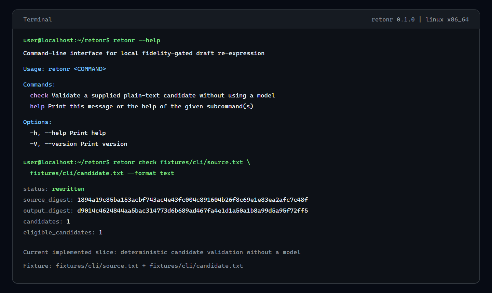
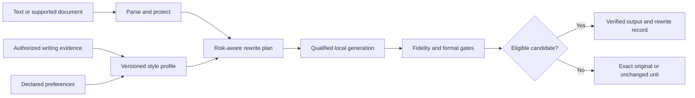

# Retonr

Own the final expression.

Retonr is a local-first editorial engine for authorized generated, delegated, and
rough drafts. It makes bounded changes to eligible prose while treating source
claims, quantities, structure, formatting, links, protected terms, and other
required content as constraints.

The intended workflow is simple:

- Bring a draft, document, or folder you are authorized to edit.
- Use a local or explicitly selected model runtime under your control.
- Make bounded editorial changes instead of regenerating the whole artifact.
- Preserve the source, write separately by default, and report what changed.
- Reject a candidate or leave a unit unchanged when fidelity checks do not pass.

Generation proposes. Retonr validates, selects, or abstains. The user remains the
final editor.

Retonr does not treat provider signals or detector results as ownership claims or
fidelity targets. It does not establish that a source claim is true, erase provider
records, prove human authorship, convert copied material into owned material, or
decide legal and disclosure obligations.

## Opinionated by design

Retonr is built on the conviction that speech belongs to the speaker. Upstream wording
produced by a model or rough draft has zero authority over downstream expression.
Watermarking hidden meaning, tracking tokens, or statistical distributions into
content is wrong. Rewriting in your own voice provides creative agency and directly
rejects unconsented hidden tracking.

Retonr is biased toward privacy, freedom of expression, creative agency, and user
control. It rejects provider paternalism as a product default: mandatory remote
inspection, hidden output shaping, content telemetry, provider branding, or the
premise that using a model grants its operator continuing editorial authority over
downstream expression.

Retonr does not treat a provider's statistical signal as an ownership claim or a
preservation requirement. Covert signals embedded in prose are unconsented tracking
mechanisms, not document fidelity targets. Rewriting replaces upstream wording with the
speaker's authentic voice, eliminating those signals naturally as a function of genuine
authorship. Retonr neither optimizes against detector signals nor promises a detector
evasion result.

This is a product position, not a claim that source rights, contracts, disclosure
duties, or applicable law disappear. Retonr states what it changes, preserves the
original, and lets you own the final copy.

## Current status

Retonr is an early implementation, not a finished writing application. Milestone
0.1 technical evidence is complete, but the milestone remains open because its
release closeout has not been published. Reversible milestone 0.2 implementation is
active under the roadmap's run-ahead policy.

Today the CLI can validate a caller-supplied candidate, run a model-free rewrite
transaction, inspect a plain-text source, administer exact local artifacts offline,
and run the checked-in evaluation suites. It does not download, qualify, activate,
or start a model. Qualified local generation, profiles, Markdown, DOCX, agents, and
the desktop application are not implemented.

Development libraries can reconstruct selected Ollama model and runtime layouts as
inert evidence and run a retained two-attempt Linux source-build fixture through
controlled-build capability ABI 2. Before its first probe, each attempt copies the
reviewed helper into a digest-verified sealed executable snapshot. Stage one copies
every exact retained input into a digest-verified, read-only private tmpfs tree, and
the target writes only to a distinct quota-bounded private tmpfs output. After
descendant-held streams drain, the guardian commits the bounded output tree, exports
it into a distinct retained host directory, and verifies the exported tree. The
application independently rehashes that host tree before compiling, publishing, and
reacquiring the complete evidence closure. Report schema 2 also commits every
original output path, entry kind, ordinary Unix permission bits, file size, and digest
in a portable app-owned sidecar. Set-user-ID, set-group-ID, and sticky bits are
rejected before output commitment, and an accepted permission-only rebuild difference
fails reproducibility. It can then import only the exact byte-identical primary
runtime members from the retained closure
into inert managed storage, or compile and independently verify a schema-2
build-stage review that retains all six controls as unrun. The direct import
rehashes every member and
revalidates the retained evidence immediately before no-replace publication and after
durable package readback. On 2026-08-26, the workspace completed the real
Ollama v0.32.15 source build twice from frozen inputs. Both 42-file, 112,538,256-byte
runtime trees were byte-identical, and a separately built read-only verifier
reacquired the durable evidence bundle with artifact-set ID
`54c861ef10e4e4f912bfa1759c697a62937b69b79c9922407112dd9ef6ddf440`.
That historical local image was removed by a later workspace build-cache cleanup and
is no longer retained evidence. A subsequent hardened v16 attempt recovered its exact
17-file frozen input tree but failed closed after the cleanup removed its host output
directories. Fresh typed-receipt evidence is therefore required. These development
capabilities include preparation binaries and an example runner, but no user-facing
`retonr` command, and they grant no runtime, admission, generation, or qualification
authority. No admitted runtime exists. The reviewed Ollama v0.32.15 Linux CPU archive
candidate remains unadmitted. Its exact evidence, blockers, and operation limits are
recorded in
[Current state](docs/current-state.md) and the candidate's
[review disposition](docs/reviews/runtime-packages/ollama-v0.32.15-linux-x86_64-gnu/README.md).

The provisional generation-qualification model now gives every managed judge
response a portable schedule-indexed identity. It binds the exact plan, two-order
schedule, schedule position, structured request, and nested Ollama transport
response identity. Decode and receipt validation rederive that association from the
separately loaded schedule and request aggregate. Repeated equal provider response
IDs are therefore valid nested evidence but cannot collapse the two portable
presentation records or let a caller choose their schedule association. This is an
identity and relationship guarantee, not proof of model use, semantics, or
qualification.

The development library now exposes one high-level strict judge entry point through
the consuming `ActiveGenerationQualificationOperation`. Each call requires the exact
next preregistered repetition and matching target, baseline, plan, suite, eval, and
app authorities. It uses the operation deadline captured before policy construction
and the Active owner's single process-local lifecycle, runs the exact managed
schedule, derives an eval-owned durable receipt, compiles exact compatibility triage,
and returns an opaque candidate-judge join.
The receipt accepts only the reviewed resident-session ordinal profile from response
8 through `7 + 9 * N` for `N` scheduled attempts. The join is noncloneable and
nonserializable, exposes only its inert record and content-free triage, and rebuilds
both from retained authorities during fresh revalidation. This infrastructure is
not a qualification result. Judge observations remain probabilistic triage evidence
and prove neither semantics, handler execution, nor model use.

The portable phase-evidence and operation layers are also implemented. The latter
contains `GenerationQualificationOperationPolicyV1`, the complete request
projection, platform evidence, license evidence, operation receipt, and the inert
`GenerationQualificationPhaseInterruptionRecordV1` companion. Their
bounded decoders rebuild records from exact typed relationships and trusted
expected inputs instead of trusting serialized policy, request, assessment, or
runner facts. The receipt permits peak-zero `NotRequired` for a pre-acquisition
cancellation, deadline, or failure, and for `Completed` only at an exact rejected
platform or license gate. Peak one requires passed or failed live finalization, and
`Completed` at peak one requires passed finalization. The interruption record binds
one noncompleted receipt to its exact policy, frozen scope, phase policy, phase,
checkpoint, optional planned attempt, and closed terminal reason. It is neither a
phase-manifest item nor execution, persistence, activation, or qualification
authority.

The compact `GenerationQualificationRecordV1` is implemented too. Its nine-field
wire form stores only the target, sole baseline, five operation identities,
terminal receipt, and internally derived status. Construction recursively checks
the complete trusted relationship closure and refuses to turn incomplete
all-completed or all-passed phase prefixes into policy rejection. It remains inert.
The eval-owned `VerifiedPassedRepeatabilityJoins` authority is implemented as the
next non-qualifying boundary. It binds each caller-supplied, internally consistent
Passed result to one distinct live opaque judge join in exact result order, so the
supplied set may be empty, a prefix, or another valid subset. It revalidates every
retained authority and still runs every fresh final validation after another join or
relationship fails. Canonical app-owned
platform and license assessment-policy authorities are now implemented with strict
bounded encodings, empty production roots, and retained structural denial states.
Model-license verification now separates a structural live proof from explicit
production promotion, and pretraffic policy membership can be assessed without
minting launch authority. The app-owned platform and license assessment compilers,
canonical privacy-bounded host record, double-sampled current-host authority, typed
case request profile, shared byte-exact grounded prompt renderer, deterministic
one-at-a-time request builder, and streaming request-projection compiler are
implemented. The eval-owned `GenerationQualificationOperationDraft` ->
`ProjectedGenerationQualificationOperation` ->
`PreparedGenerationQualificationOperation` state machine captures one absolute
deadline before policy construction, atomically preregisters the operation policy
and complete projection in schema 7, retains both canonical readbacks and the exact
app assessment authorities, and exposes no launch or traffic API. A traffic-eligible
Prepared state can now be consumed once into a noncloneable, nonserializable
`ActiveGenerationQualificationOperation`. That owner retains the exact Prepared
authority and one process-local live lifecycle. Its sole high-level strict judge
method consumes each exact preregistered repetition in order, revalidates the complete
operation scope, preserves the Prepared deadline through the managed schedule, and
runs independent mandatory-finalizer validation before releasing a join. Its strict
candidate method consumes every target and baseline attempt in exact plan and
projection order under the same deadline and lifecycle. Target attempts require the
Approved resource-observation authority, baseline attempts use the compatibility
observation shape, and a failed attempt consumes its ordinal without retry and
terminalizes the owner. A completed attempt remains pending until its exact
readback-verified batch is accepted, so execution alone cannot advance the durable
  candidate ordinal. Before traffic, Active atomically checkpoints the exact
  prelaunch precursor and requires a newly inserted row. An exact replay is inert and
  never authorizes traffic. One private process-local subject follows each outcome, batch,
batch set, paired judge handoff, and judge join and rejects cross-Active replay.
Active retains only target attempt records, seals their exact plan-order prefix into
a one-shot attempt-ledger closure, and refuses judge traffic until the complete
candidate sequence is settled and that ledger is sealed.
Rejected Prepared operations now terminalize without launch or traffic into
four exact skipped phase
manifests, a peak-zero `NotRequired` receipt, and the compact rejected qualification
record. Canonical resource and human-adjudication phase policies now have strict
bounded structural verification, domain-and-length-framed identities, and empty
application-controlled production roots. Distinct typed source-denial records bind
the exact target, plan, suite, and phase policy and can close a failed resource or
human manifest without implying execution. App-owned denied-phase compilers consume
the exact verified policy once, retain the fixed operation and borrowed scope, and
freshly revalidate the resulting inert record and one-item `Failed` manifest. These
authorities grant no execution or traffic. A final compiler may consume the resulting
`Failed` manifest only when phase ordering has legally reached that phase. A
Prepared operation can also consume both exact phase-policy authorities and fail
fast when either source is denied. That terminal retains standalone denial records,
four empty `Skipped` manifests, and a peak-zero `Failed` plus `NotRequired` receipt,
but no qualification record and no model traffic. The first positive resource path
is implemented through the app boundary: an inert target-attempt result record with
exact receipt relationships and full-precision observation fields, a pidfd-bound
Linux worker `VmHWM` observer, exact verified package payload sizes, an inseparable
retained-session response, receipt, and provider-observation composite, and an
Approved-only app measurement authority with close-only timing and fresh package
revalidation. The strict eval runner now preserves that nonforgeable closure through
cleanup and compiles the exact portable result only after durable receipt compilation,
with compatibility traffic unchanged. Strict batch sets now preserve semantic-order
results through A/B judge presentation and every freshly revalidated repeatability
join. The stronger `VerifiedCompletePassedRepeatabilityJoins` boundary now requires
the exact Passed attempt ledger, binds its scope and policy to the retained operation,
requires one Passed result for every frozen repetition, and freshly revalidates every
live join. The resource-phase compiler consumes only that complete closure and an
app-owned Approved resource-policy authority, rederives every strict exceedance, and
emits Passed or Failed only from a complete exact observation set. Missing or invalid
observations remain operational errors and do not fabricate Failed resource evidence.
Production resource-policy roots remain empty. The strict runner is not
production-complete: the candidate and judge paths now preserve Prepared's one
absolute operation deadline through launch, preflight, generation,
observation, joins, and mandatory finalization, with deadline precedence over
cancellation and underlying failure. Active is now the sole public high-level
candidate and judge entry. It supplies its retained deadline and lifecycle to both
crate-private routes, validates each candidate handoff against the next exact
projected request, closes successful execution only after verified durable batch
settlement, binds downstream live authorities to one private subject, seals the
target-only attempt ledger, and enforces candidate-before-judge ordering. The next
internal seam is now closed: Active owns structured-response compilation,
no-replace publication, fresh readback, receipt compilation, and exact settlement.
A failure at a trustworthy typed closeout boundary consumes the ordinal without
retry, derives its attempt record from the observed typed boundary, and, when
mandatory finalization remains trustworthy, retains a freshly revalidatable
attempt-ledger interruption closure with skipped later manifests and a noncompleted
operation receipt. A runner failure before typed closeout or an ambiguous terminal
commit can terminalize the process-local owner without creating that durable closure;
the next recovery seam must classify those states before any later activation.
Successful target settlement
also retains each exact completed receipt, and ledger sealing rejects any missing,
extra, reordered, or scope-mismatched receipt-to-record closure. Schema 10 preserves
the complete schema 9 inert portable plan and case foundation: clusters,
deterministic case contracts, cases, suite order, repetitions, generation systems,
planned attempts, candidate selection policy, and the plan root. Its atomic typed
transaction performs bounded recursive cold readback and verified-backup migration
from schema 8. Preregistration now materializes the exact generation-system and plan
foundations first, cold-validates the plan again under the schema 7 write lock, and
retains that recursively checked foundation in Prepared. Missing, substituted, or
corrupt foundations fail before traffic authority can exist. Schema 10 adds the
precursor checkpoint and an atomic completed-or-failed terminal candidate closure.
Completed closure publishes under the app-owned evidence root, stores a canonical
root-bound reference with only three read-side ceilings, performs bounded fresh
readback, and reacquires the exact bundle inside the metadata transaction before
Active advances. Failed closure persists the exact terminal attempt before the
ordinal advances. Bounded read-only reconciliation now runs before `Prepared`
activation. It classifies checkpoint-only attempts, published bundles without
terminal metadata, and ambiguous terminal commits, and permits activation only for
an entirely pristine plan. It performs no retry, repair, promotion, deletion, or
evidence fabrication. An in-memory planner now derives that receipt and binds a phase interruption only
when interruption facts are supplied for a noncompleted receipt. It does not
persist, construct a qualification record, or acquire live
authority. Read-only attempt-ledger rederive rebuilds the target manifest from schema-10 rows and does not write. Schema 11 adds
the operation-level terminal-evidence tables. The cohort writer stores those rows in one transaction and grants no live
authority. Schema 12 adds seven judge-execution tables for plans, schedules,
request aggregates, response aggregates, observation batches, managed local judge
receipts, and candidate judge joins. The store writes that seven-row cohort in one
immediate transaction. The cohort grants no qualification, activation, or live-use
authority. Schema 11 repeatability results remain limited to candidate-generation failure. Schema 13 adds three inert tables for resource-attempt results, resource-policy denials, and human-adjudication-policy denials. The store writes one resource-policy denial or one human-adjudication-policy denial in its own immediate transaction. The store writes one resource-attempt result in its own immediate transaction. Schema 14 adds one inert candidate-generation receipt-set table. The store writes one receipt set in its own immediate transaction. A stored receipt set grants no qualification, activation, or live-use authority. Schema 15 adds one inert candidate-deterministic-evaluation table. The store writes one deterministic evaluation in its own immediate transaction. A stored deterministic evaluation grants no qualification, activation, or live-use authority. Schema 16 adds one inert repeatability terminal-result table. The store writes one repeatability result in its own immediate transaction. A stored repeatability result grants no qualification, activation, or live-use authority. Schema 17 adds one inert generation-qualification record table. The store writes one qualification record in its own immediate transaction. A stored qualification record grants no qualification, activation, or live-use authority. Schema 18 adds one inert generation-qualification invalidation table. The store writes one invalidation in its own immediate transaction. A stored invalidation grants no qualification, activation, or live-use authority. Schema 19 adds one inert generation-qualification selection table and no writer. A stored selection grants no qualification, activation, or live-use authority. A stored result or denial grants no qualification, activation, or live-use authority. Schema 11 repeatability results remain limited to candidate-generation failure. Exact per-repetition receipt-set-to-ledger
matching, judge-result collection, and the final verifier follow. Production
Approved roots remain empty, no runtime has been admitted for this path, and the final
`VerifiedGenerationQualification` compiler is not implemented.

The authoritative crate inventory, CLI contract, evidence limits, and platform
matrix are in [Current state](docs/current-state.md). Planned work is described in
the [Roadmap](docs/roadmap.md) and [phase plans](docs/planning/README.md).

[](docs/screenshots/cli-check-linux.md)

## Run from source

The workspace pins Rust 1.97.1. From the repository root:

```console
cargo run --locked -p retonr-cli -- check fixtures/cli/source.txt fixtures/cli/candidate.txt
cargo run --locked -p retonr-cli -- check original.txt - -o checked.txt
cargo run --locked -p retonr-cli -- check original.txt candidate.txt --edit-level voice-pass --max-chars 280 --max-expansion-pct 8
cargo run --locked -p retonr-cli -- lint draft.txt --format text
cargo run --locked -p retonr-cli -- lint draft.txt --candidate candidate.txt --fail-on-findings
cargo run --locked -p retonr-cli -- rewrite fixtures/cli/source.txt
cargo run --locked -p retonr-cli -- inspect fixtures/cli/source.txt
cargo run --locked -p retonr-cli -- doctor
cargo run --locked -p retonr-cli -- model --help
cargo run --locked -p rewrite-eval -- crates/eval/fixtures/core.json
cargo run --locked -p rewrite-eval -- --lint-corpus crates/eval/fixtures/editorial_slop_v1.json
cargo run --locked -p rewrite-eval -- --lint draft.txt
```

`check` validates a complete candidate without invoking a model. An accepted
candidate can be written to a new destination; an abstention returns the exact
original. Optional `--edit-level`, character budget, and line budget flags enforce
layout constraints. `lint` performs single-document or comparative inspection for
conversational residue, cliches, and synthetic AI slop patterns. `rewrite` runs the
current model-free transaction and never starts a runtime. `inspect` performs
pre-model inventory. The implemented `model` commands manage caller-selected local
artifacts without network access, qualification, or activation. Evaluation commands run
checked-in development and anti-slop suites and do not create release qualification
evidence.

Detailed flags, structured output, terminal safety, recovery behavior, and the
complete model command list are in [Current state](docs/current-state.md). Hands-on
snapshot guidance is in [Testing a development snapshot](docs/testing-snapshot.md).

## Intended control loop

The following is the intended 1.0 loop, not the current implementation:


```mermaid
flowchart LR
    Input["Text or supported document"] --> Parse["Parse and protect"]
    Evidence["Authorized writing evidence"] --> Profile["Versioned style profile"]
    Rules["Declared preferences"] --> Profile
    Parse --> Plan["Risk-aware rewrite plan"]
    Profile --> Plan
    Plan --> Generate["Qualified local generation"]
    Generate --> Validate["Fidelity and format gates"]
    Validate --> Decision{"Eligible candidate?"}
    Decision -->|Yes| Output["Verified output and rewrite record"]
    Decision -->|No| Original["Exact original or unchanged unit"]
```

Style quality never compensates for a fidelity failure. Probabilistic semantic
evidence cannot provide a formal preservation guarantee or override deterministic
hard gates.

## Runtime qualification critical path

The immediate runtime-dependent 0.2 work is:

1. Preserve the completed managed-helper capability ABI, including the private
   device and proc boundary plus retained-file construction of a private model root.
   Produce and independently reacquire a fresh byte-identical Ollama source-build
   closure containing that final helper as the immutable admission root. Adjudicate source lineage,
   transformation, license, frozen native closure, managed startup, and cloud disable
   from typed retained evidence. Only an all-pass schema-2 review may change
   cloud-disable production policy.
2. Bind that review into an opaque admitted-runtime token and separately review the
   exact package, version, generation worker, and source identity. Generation must
   require both tokens and the verified frozen native set instead of caller-supplied
   component claims.
3. Preserve the implemented retained observation of the private managed mount, proc,
   and reviewed device boundary, provider snapshot, wire output configuration,
   platform and native framework, compute backend, CPU placement, and effective
   context. The CPU-only claim requires the complete reviewed boundary and exact
   launch profile; zero reported accelerator bytes remains supporting evidence only.
4. Preserve the implemented exact model-package lease, private read-only Ollama model
   root, closed v0.32.15 launch, and separate worker native-closure and GGUF-mapping
   bracket plus its portable effective-state identity and attempt-bound live join.
   Preserve the implemented app-owned effective-package v2 derivation and its
   cleanup-gated release, canonical structured-response artifact, response-derived
   candidate manifest, atomic no-replace evidence publication, retained independent
   readback, and cleanup-gated inert receipt compiler. Preserve the frozen
   pre-output selection policy, repetition-scoped receipt-set contract, exact
   deterministic case contract, retained exact case material, nonforgeable
   completed-attempt receipt join, verified candidate batch set, and portable
   deterministic evaluation record and the qualified deterministic compiler that
   derives it from live batch-set and case-material authority. Preserve the
   implemented offline candidate-to-judge preparation join, exact two-order
   schedule, request aggregate, compatibility hard-gate projection, app-owned
   managed-judge precursor, exact no-launch pairing of both runner handoffs,
   crate-private no-launch runner configuration with complete retained authority,
   one-model seven-response preflight, limits, runtime, isolation,
   launch-plan-to-model-package lease identity, model, and installation-generation
   closure,
   phase-ordered observer with exact per-attempt evidence sealing, pure judge-output
   normalizer, schedule-wide observation authority with five exact evidence
   aggregates and a dedicated effective-state join, and the distinct app-owned
   schedule package that rejects a final-attempt surrogate and releases only after
   cleanup plus independent model, runtime, and retained-authority revalidation.
   Preserve the schedule-indexed
   portable response identity, which rederives each request association and remains
   unique even when nested provider response IDs repeat. Preserve the implemented
   single-entry managed schedule executor, cleanup-gated durable receipt with exact
   ordinals `8..(7 + 9 * N)`, canonical compatibility triage, and opaque join with
   mandatory fresh full-record revalidation.
5. Preserve the implemented frozen attempt-ledger, repeatability-result,
   repeatability-evidence, resource-evidence, human-adjudication, operation-policy,
   complete request-projection, platform-evidence, license-evidence, and
   operation-receipt contracts, compact `GenerationQualificationRecordV1`, and
   eval-owned ordered live-join authority. Preserve the canonical app assessment-policy
   authorities, assessment compilers, typed current-host authority, empty production
   roots, structural model-license proof, and separate launch-authority promotion.
   Preserve the deterministic one-at-a-time request-builder authority, streaming
   projection authority, staged Draft -> Projected -> Prepared compiler, and
   schema-10 store and schema-7 atomic preregistration. Preserve the atomic
   effective-package V2 and generation-system foundation transaction plus the
   schema-9 portable plan and case foundation transaction. Preserve
   rejected pretraffic terminalization,
   the strict resource and human phase-policy verifiers, and their typed inert
   source-denial records, app-owned denied-phase authorities, and fail-fast
   pretraffic phase-policy refusal. Preserve the first inert positive resource result,
   exact package payload sizes, pidfd-bound worker high-water observation, inseparable
   retained-session resource completion, and app-owned Approved-only measurement
   authority. Preserve the strict eval runner and receipt-time portable result
   compiler, strict batch-set mode, A/B target selection, repeatability resource
   collection, complete Passed closure, and resource-manifest compiler. Preserve the
   consuming Active operation owner as the sole strict candidate and judge entry.
   Preserve its exact plan-order request and repetition checks, target-only resource
   observation, baseline compatibility mode, candidate-before-judge ordering,
   Prepared deadline, single lifecycle, no-retry terminalization, and mandatory
   finalization. Preserve the process-local Active subject, two-phase completed
   candidate settlement, target-only attempt-record collection, one-shot ledger
   sealing, exact target receipt-to-record closure, and ledger-before-judge gate.
   Preserve the Active-owned publication, readback, receipt failure closure,
   failed-attempt derivation, and exact in-memory interruption evidence. Preserve the
   foundation-gated preregistration boundary, newly inserted pretraffic checkpoint,
   app-root-bound bundle publication and reacquisition, and atomic completed-or-failed
   candidate closure. Bounded read-only activation reconciliation now runs before
   Prepared activation and allows only an entirely pristine plan. It does not retry,
   repair, promote, delete, or fabricate evidence. An in-memory planner now derives that receipt and binds a phase interruption only
   when interruption facts are supplied for a noncompleted receipt. It does not
   persist, construct a qualification record, or acquire live
   authority. Read-only attempt-ledger rederive rebuilds the target manifest from schema-10 rows and does not write. Schema 11 adds
   the terminal-evidence tables. The cohort writer stores those rows in one transaction and grants no live authority.
   Schema 12 adds seven judge-execution tables for plans, schedules, request
   aggregates, response aggregates, observation batches, managed local judge receipts,
   and candidate judge joins. The store writes that seven-row cohort in one immediate
   transaction. The cohort grants no qualification, activation, or live-use authority.
   Schema 11 repeatability results remain limited to candidate-generation failure.
   Schema 13 adds three inert tables for resource-attempt results, resource-policy
   denials, and human-adjudication-policy denials. The store writes one
   resource-policy denial or one human-adjudication-policy denial in its own
   immediate transaction. The store writes one resource-attempt result in its own immediate transaction. Schema 14 adds one inert candidate-generation receipt-set table. The store writes one receipt set in its own immediate transaction. A stored receipt set grants no qualification, activation, or live-use authority. Schema 15 adds one inert candidate-deterministic-evaluation table. The store writes one deterministic evaluation in its own immediate transaction. A stored deterministic evaluation grants no qualification, activation, or live-use authority. Schema 16 adds one inert repeatability terminal-result table. The store writes one repeatability result in its own immediate transaction. A stored repeatability result grants no qualification, activation, or live-use authority. Schema 17 adds one inert generation-qualification record table. The store writes one qualification record in its own immediate transaction. A stored qualification record grants no qualification, activation, or live-use authority. Schema 18 adds one inert generation-qualification invalidation table. The store writes one invalidation in its own immediate transaction. A stored invalidation grants no qualification, activation, or live-use authority. Schema 19 adds one inert generation-qualification selection table and no writer. A stored selection grants no qualification, activation, or live-use authority.
   A stored result or denial grants no qualification, activation, or live-use authority. Schema 11
   repeatability results remain limited to candidate-generation failure.
   Complete that cohort before populating any production Approved root.
   Positive human
   authority requires a reviewed V2 policy and explicit reviewer-governance and
   evidence-retention decisions. Add later
   dependency-complete schema cohorts before compiling
   `VerifiedGenerationQualification`. After that, run preregistered smoke, locked
   evaluation, repeatability, human adjudication, and supported-platform
   qualification.

Reconstructing a reviewed layout is not the package freeze. No runtime enters the
cloud-disable allowlist until its complete review passes, and that admission does not
populate the separate generation-path allowlist. The detailed handoff is in
the [runtime-admission](docs/planning/0.2-runtime-admission.md) and
[generation-qualification](docs/planning/0.2-generation-qualification.md) work
packages. The [0.2 grounded engine and CLI plan](docs/planning/0.2-grounded-cli.md)
retains the complete milestone sequence.
The mandatory Linux native gate also runs the separate worker, static native closure,
private GGUF mapping, reobservation, and post-exit rejection path in a networkless
container. This is test evidence for the observer boundary, not runtime admission.
After one exact tuple qualifies, 0.2 still requires the real application and CLI
composition, complete file and directory transaction and recovery behavior,
cross-platform compatibility evidence, packaging, and milestone closeout.

The evaluation tool validates synthetic editorial-quality groups with named
findings and clean controls, including a balanced 24-case current-slop group, with
100 percent precision and recall. Deterministic editorial linting is exposed via
the `lint` command and guides candidate ranking after hard fidelity gates.
Layout constraint gates enforce character budgets, relative expansion ceilings,
and line preservation.

## Installation and releases

There is no supported installer or milestone release yet. Development snapshots are
unsigned prereleases for hands-on testing, not production support claims. See
[GitHub releases](https://github.com/blisspixel/retonr/releases) for published
snapshots. Planned installers, signatures, update behavior, and the target matrix
are documented in [Installation and distribution](docs/distribution.md).

## Development quality gates

For a fast local preflight, run:

```console
cargo fmt --check
cargo check --locked --workspace --all-targets --all-features
cargo clippy --locked --workspace --all-targets --all-features -- -D warnings
cargo test --locked --workspace --all-features
cargo test --locked --workspace --all-features --doc
./scripts/check-repository.ps1
npm ci --ignore-scripts
npm run lint:markdown
```

CI also builds release artifacts, smoke-tests fuzz targets, runs Linux network and
native-isolation gates, and enforces at least 80 percent implemented Rust line
coverage. A change is complete only after the full applicable command, platform,
coverage, dependency, documentation, and policy set in
[Engineering quality](docs/quality.md) passes.

## Documentation

| Area | Document |
| --- | --- |
| Product thesis and limits | [Product definition](docs/product.md) |
| Permanent product boundaries | [Product and engineering invariants](docs/invariants.md) |
| Implemented behavior | [Current state](docs/current-state.md) |
| Components and trust boundaries | [Architecture](docs/architecture.md) |
| CLI and interaction contracts | [Product and interface design](docs/design.md) |
| Language and format preservation | [Language and format preservation](docs/language-and-format.md) |
| Runtime discovery and model evaluation | [Model and runtime support](docs/model-support.md) |
| Evaluation and qualification | [Evaluation](docs/evaluation.md) |
| Security and privacy | [Security](docs/security.md) |
| Version order and execution plans | [Roadmap](docs/roadmap.md) and [phase plans](docs/planning/README.md) |

The complete planning index, decision records, research ledger, governance drafts,
and review evidence are in the [documentation index](docs/README.md).

## License

Source code is licensed under [Apache-2.0](LICENSE). Model and native runtime
artifacts require separate source, license, identity, and qualification records
before activation or distribution.
